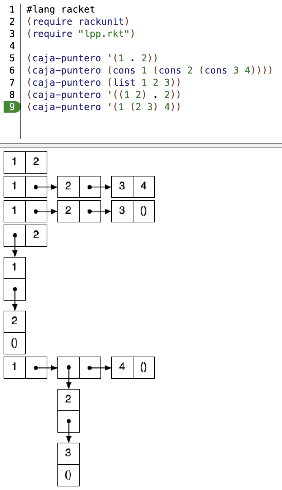
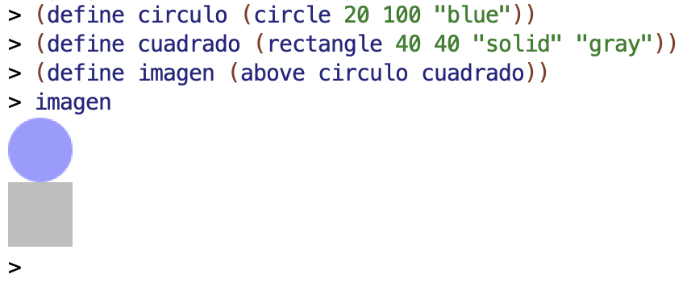
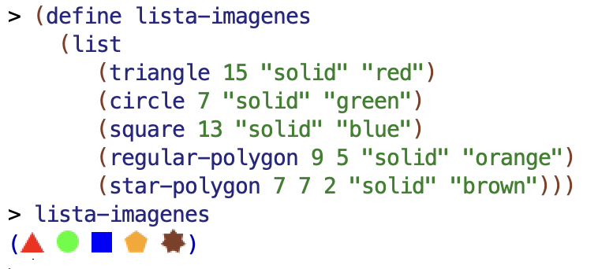
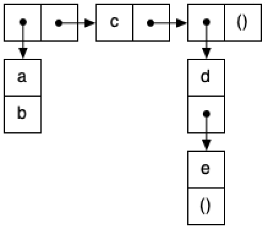
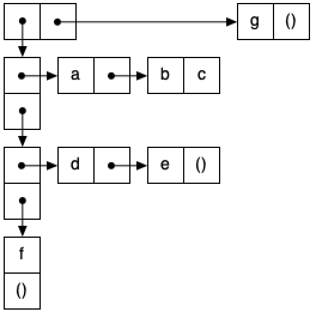

# Lab 3: Recursion, Pairs, and Box-and-Pointer Diagrams

## Before the Lab Session ##

- Before starting this lab, it is important that you review the solution to
  lab 2. You can ask your lab instructor any questions you may have.

- The following exercises are based on the theory concepts covered last week.
Before the lab session, you should review all the concepts and **try in
DrRacket** all the examples from the following sections of topic 2
[_Functional
Programming_](../../theory/topic02-functional-programming/topic02-functional-programming.md#27-recursion):

    - 2.7 _Recursion_
    - 2.8 _Recursion and lists_
    - 3 _Composite data types in Scheme_
    - 4 _Lists in Scheme_


## Exercises

Open DrRacket and create a file called `lab3.rkt`, where you should write all
the examples and exercise solutions you complete.

### Helper Function for Drawing Box-and-Pointer Diagrams ###

Download the [`lpp.rkt` file](https://raw.githubusercontent.com/domingogallardo/apuntes-lpp/master/src/lpp.rkt)
by right-clicking and selecting the _Save as_ option, saving it as `lpp.rkt`.
Save it in the same folder where you have the `lab3.rkt` file. It contains the
definition of a helper function `(caja-puntero dato)` that lets you create
box-and-pointer diagrams of pair structures.

The following program shows an example of how to use this function:

```racket
#lang racket
(require rackunit)
(require "lpp.rkt")

(caja-puntero '(1 . 2))
(caja-puntero (cons 1 (cons 2 (cons 3 4))))
(caja-puntero (list 1 2 3))
(caja-puntero '((1 2) . 2))
(caja-puntero '(1 (2 3) 4))
```

The following image shows the program running in DrRacket.



You can look at the source code of the `lpp.rkt` file if you are curious about
how the `caja-puntero` function is implemented. It uses Racket's
[image
library](https://docs.racket-lang.org/teachpack/2htdpimage.html), `2htdp/image`.

To use the library, include the following line in our program:

```racket
#lang racket
(require 2htdp/image)
```

One very interesting thing about this library is that it defines images as
first-class objects in the language: they can be assigned to variables or passed
as parameters to build other images. We can see this in the following example:



We can even include images in lists:




### Exercise 1 ###

a.1) Implement the recursive function `(minimo lista)`, which receives a list of
numbers as an argument and returns the smallest number in the list. We assume
lists with 1 or more elements.

For the implementation, you must use the `menor` function defined in the
previous lab.

!!! Tip "Hint"

    We can express the general recursive case as follows:

    > The minimum of the elements of a list is the smaller value between the
    > first element of the list and the minimum of the rest of the list.

    And the base case:

    > The minimum of a list with a single number is that number.


Examples:

```racket
(minimo '(2)) ; ⇒ 2
(minimo '(1 8 6 4 3)) ; ⇒ 1
(minimo '(1 -1 3 -6 4)) ; ⇒ -6
```

!!! Note "How to check the base case of `minimo`"
    For the base case of the `minimo` function, we must check whether the list
    we receive has a single element. In that case, the minimum of the list is
    the element itself. It would be an error to call the recursion because the
    smallest element of an empty list cannot be calculated.

    The best way to check in Scheme whether a list has a single element is:

    ```racket
    (null? (rest lista))
    ```

    This form is more efficient than calling the `length` function, which needs
    to traverse the whole list. The cost of the instruction `(null? (rest
    lista))` does not depend on the length of the list; it is O(1). However, the
    instruction `(length lista)` has to traverse the whole list, so it has O(n)
    complexity.

a.2) We are going to investigate how recursion works in the `minimo` function.
Suppose we have the following call:

```racket
(minimo '(1 8 6 4 3)) ; ⇒ 1
```

- What list is passed as the parameter to the first recursive call to the
  function?
- What does that recursive call return?
- With what arguments is the `menor` function called to return the final result?

b) Implement the recursive function `(concatena lista-chars)`, which receives a
list of characters and returns the resulting string after concatenating them.

Examples:

```racket
(concatena '()) ; ⇒ ""
(concatena '(#\H #\o #\l #\a)) ; ⇒ "Hola"
(concatena '(#\S #\c #\h #\e #\m #\e #\space #\m #\o #\l #\a))  
; ⇒ "Scheme mola"
```

c) Implement the recursive function `(cifra-cadena cad desplazamiento)`, which,
using the `cifra-caracter` function from the previous lab, encrypts a complete
string using the Caesar cipher.

Then implement the function `(descifra-cadena cad desplazamiento)`, which
decrypts a complete string.

Examples:

```racket
(cifra-cadena "En un lugar de la Mancha, de cuyo nombre no quiero acordarme" 10) ; ⇒
"Ox ex veqkb no vk Wkxmrk, no meiy xywlbo xy aesoby kmybnkbwo"

(descifra-cadena "Ox ex veqkb no vk Wkxmrk, no meiy xywlbo xy aesoby kmybnkbwo" 10) ; ⇒
"En un lugar de la Mancha, de cuyo nombre no quiero acordarme"
```

d) Implement the recursive predicate `(contiene? lista elemento)`, which checks
whether a list contains a given element. Then use it to implement the function
`(str-contiene? cadena char)`, which checks whether a string contains a
character. Remember that the `string->list` function converts a string into a
list of characters.

Examples:

```racket
(contiene? '(algo 3 #\A) 3) ; ⇒ #t
(contiene? '(algo 3 #\A) "algo") ; ⇒ #f
(contiene? '(algo 3 #\A) 'algo) ; ⇒ #t
(str-contiene? "Hola" #\o) ; ⇒ #t
(str-contiene? "Esto es una frase" #\space) ; ⇒ #t
(str-contiene? "Hola" #\h) ; ⇒ #f
```


### Exercise 2 ###

a) Implement the recursive predicate `(todos-iguales? lista)`, which checks
whether all elements in a list are equal.


```racket
(todos-iguales? '()) ; ⇒ #t
(todos-iguales? '(a)) ; ⇒ #t
(todos-iguales? '(a a a a a a a)) ; ⇒ #t
(todos-iguales? '((a b) (a b) (a b))) ; ⇒ #t
(todos-iguales? '(a a a a a b)) ; ⇒ #f
```

b) Implement the recursive predicate `(todos-distintos? lista)`, which checks
whether all elements in a list are different. For its implementation, you must
use the `contiene?` predicate from exercise 1.


```racket
(todos-distintos? '()) ; ⇒ #t
(todos-distintos? '(a)) ; ⇒ #t
(todos-distintos? '(a b c)) ; ⇒ #t
(todos-distintos? '(a b c a)) ; ⇒ #f
```

c) Implement the recursive predicate `(solo-dos-iguales? lista)`, which checks
that there are only two equal elements in a list (the only repeated elements in
the list are repeated exactly twice). For its implementation, you can use the
previous predicates.

```racket
(solo-dos-iguales? '()) ; ⇒ #f
(solo-dos-iguales? '(a)) ; ⇒ #f
(solo-dos-iguales? '(a b c a)) ; ⇒ #t
(solo-dos-iguales? '(a b c b a a)) ; ⇒ #f
(solo-dos-iguales? '(a b c a a)) ; ⇒ #f
(solo-dos-iguales? '(a b c a b)) ; ⇒ #f
```

!!! note "What does \"only two equal\" mean?"
    The predicate must return `#t` **only if exactly one value is repeated
    twice** and all other elements appear only once.
    It is not enough for some element to be repeated: there cannot be any other
    repetitions.

### Exercise 3 ###

a.1) Given the following _box & pointer_ diagram, write the Scheme expression
that defines `p1` using the minimum number of calls to `list` and `cons`. You
must not use expressions with `quote` to build the lists or pairs. You can use
the graphical function `caja-puntero` to check whether your solution is correct.



a.2) Write the expressions that return `b` and `d` from `p1`. You must use list
functions such as `first`, `second`, etc. if the argument is a list, and `car`
and `cdr` if it is a pair that is not part of a list.

b.1) Given the following box-and-pointer diagram, write the Scheme expression
that defines `p2` using the minimum number of calls to `list` and `cons`.



b.2) Write the expressions that return `c` and `e` from `p2`.

!!! warning "Lists vs pairs"
    - Remember the **recursive definition of a list** that we have seen in
      theory.
    - Use `first`, `second`, etc. **only when accessing a list**.
    - Use `car` and `cdr` when accessing a pair that is not a list.

### Exercise 4 ###

Implement the recursive function `(contar-datos-iguales lista-parejas)`, which
receives a list of pairs and returns the number of pairs whose two data items
are equal.


```racket
(contar-datos-iguales '((2 . 3) ("hola" . "hola") (\#a . \#a) (true . false))) ; ⇒ 2
(contar-datos-iguales '((2 . "hola") ("hola" . 3) (\#a . true) (\#b . false))) ; ⇒ 0
```

### Exercise 5 ###

We are going to keep playing poker. This time we will define functions on
**card hands**, defined as lists of 5 symbols that represent cards.

For example, the following hands:

```racket
(define mano1 '(A♦ 2♦ 3♣ 4♦ 5♥))
(define mano2 '(J♦ J♣ J♠ J♥ K♣))
```

Copy from the previous lab the solution for the function `(valor-carta carta)`,
which returns the numeric value of a card:

```racket
(valor-carta '5♣) ; ⇒ 5
(valor-carta 'K♦) ; ⇒ 12
```

a) Implement the function `(palo-carta carta)` in a similar way to the
`valor-carta` function, so that it returns the symbol with the description of
the card suit.

```racket
(palo-carta 'A♠) ; ⇒ Picas
(palo-carta '2♣) ; ⇒ Tréboles
(palo-carta '3♥) ; ⇒ Corazones
(palo-carta '4♦) ; ⇒ Diamantes
```

You will need to use the `valor-carta` and `palo-carta` functions to implement
the following functions in the exercise.

b) Implement the recursive function `(veces-palo lista palo)`, which returns the
number of times a suit appears in a list of cards.

```racket
(veces-palo '(5♠ 6♣ 7♥ 8♦ 9♠) 'Picas) ; ⇒ 2
(veces-palo '(J♠ Q♣ K♥) 'Diamantes) ; ⇒ 0
(veces-palo '(A♣ 2♥ 3♠) 'Corazones) ; ⇒ 1
(veces-palo '() 'Tréboles) ; ⇒ 0
```

Using the previous function, implement the `color?` predicate, which checks
whether all the cards in a hand have the same suit:

```racket
(color? '(5♣ J♦ J♣ Q♠ Q♥)) ; ⇒ #f
(color? '(2♦ 5♦ 6♦ J♦ K♦)) ; ⇒ #t
```

c) Implement the recursive predicate `escalera?`, which receives a list of cards
and checks whether all of them have consecutive values, ordered from smallest to
largest.


```racket
(escalera? '(5♣ 4♦ 3♣)) ; ⇒ #f
(escalera? '(8♣ 9♦ J♣ Q♦)) ; ⇒ #t
(escalera? '(8♣ 2♣)) ; ⇒ #f
(escalera? '(A♣ 2♦ 3♣)) ; ⇒ #t
```

Using the previous functions, implement the function `(escalera-color? mano)`,
which checks whether a hand of cards is a straight flush. We assume that the
cards in the hand are ordered from smallest to largest.

```racket
(escalera-color? '(5♣ 6♦ 7♣ 8♠ 9♥)) ; ⇒ #f
(escalera-color? '(A♦ 2♦ 3♦ 4♦ 5♦)) ; ⇒ #t
```

### Exercise 6 ###

a) Implement the functions `(suma-izq pareja n)` and `(suma-der pareja n)`,
defined as follows:

- `(suma-izq pareja n)`: returns a new pair with the left part incremented by
  `n`.
- `(suma-der pareja n)`: returns a new pair with the right part incremented by
  `n`.

Examples:

```racket
(suma-izq (cons 10 20) 3)  ; ⇒ (13 . 20)
(suma-der (cons 10 20) 5)  ; ⇒ (10 . 25)
```

b.1) Implement the recursive function `(suma-impares-pares lista-num)`, which
returns a pair whose left part is the sum of the odd numbers in the list and
whose right part is the sum of the even numbers. You must use the helper
functions defined in the previous section. You can also use the predefined
functions `even?` and `odd?`.

Examples:

```racket
(suma-impares-pares '(3 2 1 4 8 7 6 5)) ; ⇒ (16 . 20)
(suma-impares-pares '(3 1 5))           ; ⇒ (9 . 0)
```

!!! note "Pairs as accumulators"
    In this section, pairs are used to return **more than one result** from a
    recursive function.
    This pattern is very common in functional programming.

b.2) Given the following call, indicate what the first recursive call returns:

```racket
(suma-impares-pares '(2 1 2 1 4))
```

c) Implement the recursive function `(cadena-mayor lista)`, which receives a
list of strings and returns a pair with the longest string and its length. If
there is more than one string with the maximum length, the last one that appears
in the list will be returned.

If the list is empty, the pair with the empty string and 0 (the length of the
empty string) will be returned.

**Hint**: you can use the `string-length` function.

```racket
(cadena-mayor '("vamos" "a" "obtener" "la" "cadena" "mayor")) ; ⇒  ("obtener" . 7)
(cadena-mayor '("prueba" "con" "maximo" "igual")) ; ⇒ ("maximo" . 6)
(cadena-mayor '()) ; ⇒ ("" . 0)
```

----

Programming Languages and Paradigms, academic year 2025-26  
© Department of Computer Science and Artificial Intelligence, University of Alicante  
Domingo Gallardo, Cristina Pomares, Antonio Botía, Francisco Martínez
