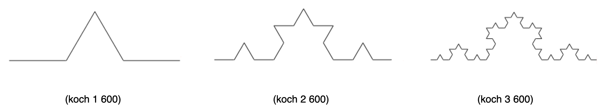
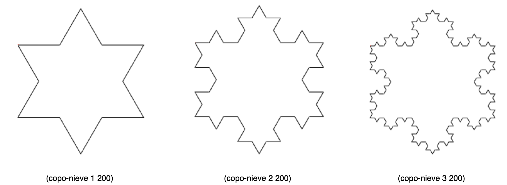
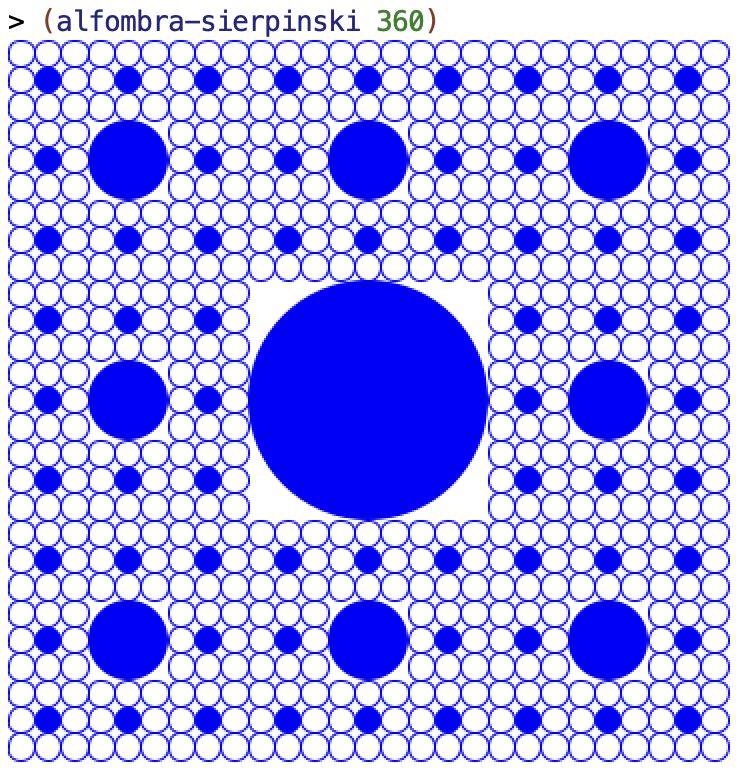

# Lab 6: Recursive and Iterative Procedures

## Before the Lab Session

- The following exercises are based on the theory concepts covered last week.
Before the lab session, you should review all the concepts and **try in
DrRacket** all the examples from the following sections of topic 3 [_Recursive
Procedures_](../../theory/topic03-recursive-procedures/topic03-recursive-procedures.md):

    - 1 The cost of recursion
    - 2 Iterative processes
    - 3 Memoization
    - 4 Recursive figures

## Exercises

Download the
[`lpp.rkt` file](https://raw.githubusercontent.com/domingogallardo/apuntes-lpp/master/src/lpp.rkt)
by right-clicking and selecting the _Save as_ option, saving it as `lpp.rkt`.
Save it in the same folder where you have the `lab6.rkt` file.

The file contains the definitions of the functions `(make-dic)`, `(put key value
dic)`, `(get key dic)`, and `(key-exists? key)`, which are needed to implement a
recursive algorithm with _memoization_ and which you will need in exercise 4.

### Exercise 1  ###

a) Implement an iterative recursive version of the function `(concat lista)`,
which takes a list of strings as an argument and returns the string resulting
from concatenating all the words in the list.

The `concat` function must call the `concat-iter` function, which is the one
that actually implements the iterative version using tail recursion.

Example:

```racket
(concat  '("hola" "y" "adiós")) ; ⇒ "holayadiós"
(concat-iter '("hola" "y" "adiós") "") ; ⇒ "holayadiós"
```


b) Using tail recursion, define the function `(min-max lista)`, which receives a
numeric list and returns a pair with the minimum and maximum of its elements. The
list received as a parameter will have at least one element.

Example:

```racket
(min-max '(2 5 9 12 5 0 4)) ; ⇒ (0 . 12)
(min-max '(3 2 -8 4 10 0))  ; ⇒ (-8 . 10)
(min-max-iter '(5 9 12 -2 5 0 4) (cons 2 2)) ; ⇒ (-2 . 12)
```


### Exercise 2 ###

a) Using tail recursion, implement the `expande-pareja` and `expande-parejas`
functions from lab 4.

Example:

```racket
(expande-pareja (cons 'a 4)) ; ⇒ (a a a a)
(expande-parejas '(#t . 3) '("LPP" . 2) '(b . 4))
; ⇒ (#t #t #t "LPP" "LPP" b b b b)
```


b) Using tail recursion, implement the function `(rotar k lista)`, which moves
`k` elements from the head of the list to the end. **It is not necessary to use
an iterative helper function**; you can make `rotar` itself iterative by using
the `lista` parameter as the parameter where the result is accumulated.

Example:

```racket
(rotar 4 '(a b c d e f g)) ; ⇒ (e f g a b c d)
```


### Exercise 3 ###

a) Using tail recursion, implement the `mi-foldl` function, which does the same
as the higher-order function `foldl`.


```racket
(mi-foldl string-append "****" '("hola" "que" "tal")) ;⇒ "talquehola****"
(mi-foldl cons '() '(1 2 3 4)) ; ⇒ (4 3 2 1)
```


b) There is an efficient algorithm for calculating the decimal value of a binary
number based on iteratively using multiplication by 2. The idea is that if we add
a digit to the right of a binary number, the value of the resulting number is the
value of the original number multiplied by 2 plus the digit we have added.

For example, if we have the number `101`, which is decimal number 5, and we add
a `1` to its right (obtaining `1011`), the resulting decimal number would be
obtained by multiplying the original number by 2 (_5*2 = 10_) and adding the 1
we have added (_11_).

In this way, we can calculate the decimal value of a binary number iteratively by
performing this operation with its digits from left to right. We should
accumulate the value of the processed number in a result and, at each new step,
multiply that value by 2 and add the value of the new digit we are processing.

```
resultado nuevo = resultado anterior * 2 + nuevo bit
```

Suppose we have the previous binary number, `1011`. Let's see a trace of how 11
would be obtained.

```
 número       nuevo        resultado    resultado
 procesado    bit          anterior      nuevo 
=======================================================
                 1            0         0*2 + 1 = 1
    1            0            1         1*2 + 0 = 2
    10           1            2         2*2 + 1 = 5
    101          1            5         5*2 + 1 = 11
    1011                      11
```

Using the previous iterative algorithm, implement the function
`(binario-a-decimal lista-bits)`, which receives a list of bits representing a
binary number (the first element will be the most significant bit) and returns
the equivalent decimal number.

```racket
(binario-a-decimal '(1 1 1 1)) ; ⇒ 15
(binario-a-decimal '(1 1 0)) ; ⇒ 6
(binario-a-decimal '(1 0)) ; ⇒ 2
```


### Exercise 4 ###

Create an implementation that uses the
[_memoization_ technique](../../theory/topic03-recursive-procedures/topic03-recursive-procedures.md#3-solutions-to-the-cost-of-recursion-memoization)
for the algorithm that returns the [Pascal
series](../../theory/topic03-recursive-procedures/topic03-recursive-procedures.md#26-pascals-triangle).

```racket
(define diccionario (make-dic))
(pascal-memo 8 4 diccionario) ; ⇒ 70
(pascal-memo 40 20 diccionario) ; ⇒ 137846528820
```

### Exercise 5 ###

a) Using Racket's `2htdp/image` image library, implement the recursive figure
known as the _Koch curve_. You must define a recursive function `(koch nivel
trazo)` that draws a Koch curve of level `nivel` and length `trazo`.

As a hint, look at the drawing. To build an image of a Koch curve of level n and
length l, you must put together 4 Koch curves of level n-1 and length l/3. The
first and last images are the original curve, and the second and third are
rotated 60 degrees. Also pay attention to the alignment of the images.

You can see examples of level 1, 2, and 3 curves in the following figures:



b) Using the previous function, implement the function `(copo-nieve
nivel trazo)`, which draws the [_Koch
snowflake_](https://en.wikipedia.org/wiki/Koch_snowflake) that you can see in
the following examples. This function is not recursive; it is built by combining
the previous Koch curve three times.




### Exercise 6 ###

Define the function `(alfombra-sierpinski tam)`, which builds the Sierpinski
carpet (a variant of the Sierpinski triangle we have seen in theory) with side
length `tam` pixels.

In the base case, when the size is smaller than a given threshold, an unfilled
circle of width `tam` should be drawn. Notice that the parameter passed to the
`circle` primitive is the radius (you can check it
[here](https://docs.racket-lang.org/teachpack/2htdpimage.html#%28def._%28%28lib._2htdp%2Fimage..rkt%29._circle%29%29)),
so to draw a circle with width (diameter) `tam`, you will need to call the
primitive with the parameter `tam/2`.

For example, the call `(alfombra-sierpinski 360)`, using a threshold of 20
pixels, should draw the following figure:



----

Programming Languages and Paradigms, academic year 2025-26   
© Department of Computer Science and Artificial Intelligence, University of Alicante  
Domingo Gallardo, Cristina Pomares, Antonio Botía, Francisco Martínez
