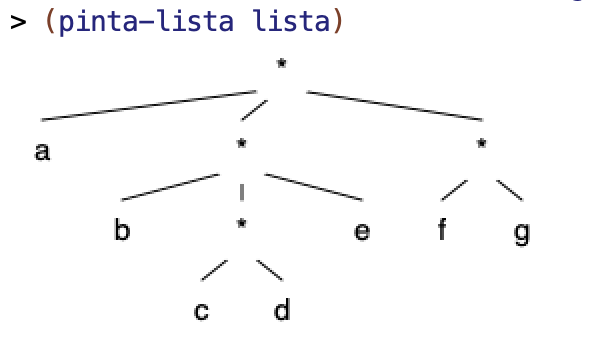
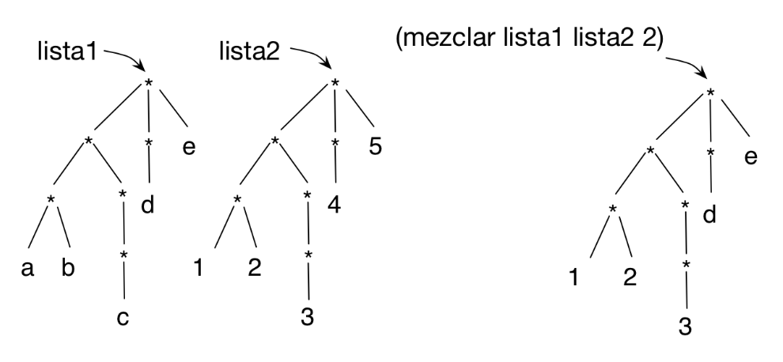

# Lab 7: Structured Lists

## Before the Lab Session

- The following exercises are based on the theory concepts covered last week.
Before the lab session, you should review all the concepts and **try in
DrRacket** all the examples from the following sections of topic 4 [_Recursive
Data Structures_](../../theory/topic04-recursive-structures/topic04-recursive-structures.md)

    - 1 Structured lists

## Exercises

Download the
[`lpp.rkt` file](https://raw.githubusercontent.com/domingogallardo/apuntes-lpp/master/src/lpp.rkt)
by right-clicking and selecting the _Save as_ option, saving it as `lpp.rkt`.
Save it in the same folder where you have the `lab7.rkt` file.

You can also find the `lpp.rkt` file in the [course Moodle
site](https://moodle2021-22.ua.es/moodle/mod/resource/view.php?id=130802).

The file contains the definition of the `(hoja? elem)` function and the
`(pinta-lista lista)` function, which lets us graphically draw a structured
list.

For example, if we define a structured list as

```racket
(define lista '(a (b (c d) e) (f g)))
```

The call to `pinta-lista` will draw the following:




### Exercise 1 ###

a) Write the structured list corresponding to the following level-based graphical
representation. To check whether you have defined it correctly, you can try to
obtain some of the elements of the list, as shown in the `check-equal?` below.

```text
       *
     / |  \
    |  |    \
    *  d      *
   / \    / /  | \
  a  b   c *   *  h
           |  / \
           e f  g
```

```racket
(define lista-a '(________))
(check-equal? (fourth (third lista-a)) 'h)
```

b) Draw the level-based representation of the following structured lists. Then
check with the `(pinta-lista lista)` function that you have drawn them
correctly.

```racket
(define lista-b1 '((2 (3)) (4 2) ((2) 3)))
(define lista-b2 '((b) (c (a)) d (a)))
```

c) Given the definition of `cuadrado-estruct` seen in theory:

```
(define (cuadrado-estruct lista)
  (cond ((null? lista) '())
        ((hoja? lista) (* lista lista ))
        (else (cons
             ①➜(cuadrado-estruct (first lista))
             ②➜(cuadrado-estruct (rest lista))))))
```

1. Indicate what the expression `(cuadrado-estruct lista-b1)` returns. The list
`lista-b1` is the one defined in the previous part.
2. In the evaluation of the previous expression, indicate which arguments are
passed as parameters in the recursive calls to `cuadrado-estruct` marked with
`1` and `2`.
3. In the evaluation of the previous expression, indicate what the recursive
calls marked with `1` and `2` return.


d) To understand how higher-order functions that work on structured lists behave,
it is very important to understand what the `map` expression applied to the list
returns.

The following function uses the `(nivel-hoja-fos dato lista)` function seen in
theory. Indicate what the following expression returns. The list `lista-b2` is
the one defined in the previous part. Use the drawing you made in the previous
exercise to understand how the expression works.

```racket
(map (lambda (elem)
         (nivel-hoja-fos 'a elem)) lista-b2)
```

### Exercise 2  ###

a) Implement the recursive function `(concatena lista)`, which receives a
structured list with symbols and returns the string resulting from concatenating
all the symbols in the structured list. Implement two versions of the function,
one with **pure recursion** and another with **higher-order functions**.


Examples:

```racket
(concatena '(a b (c) d)) ; ⇒ "abcd"
(concatena '(a (((b)) (c (d (e f (g))) h)) i)) ; ⇒ "abcdefghi"
```


b) Implement the recursive function `(todos-positivos? lista)`, which receives a
structured list with numbers and checks whether all its elements are positive.
Implement two versions of the function, one with **pure recursion** and another
with **higher-order functions**.

Examples:

```racket
(todos-positivos? '(1 (2 (3 (-3))) 4)) ; ⇒ #f
(todos-positivos-fos? '(1 (2 (3 (3))) 4)) ; ⇒ #t
```


### Exercise 3 ###

Implement the function `(cumplen-predicado pred lista)`, which returns a list
with all the elements of a structured list that satisfy a predicate. Implement
two versions: one using **pure recursion** and another using **higher-order
functions**.

Example:

```racket
(cumplen-predicado even? '(1 (2 (3 (4))) (5 6))) ; ⇒ (2 4 6)
(cumplen-predicado pair? '(((1 . 2) 3 (4 . 3) 5) 6)) ; ⇒ ((1 . 2) (4 . 3))
```

Using the previous function, implement the following functions:

- Function `(busca-mayores n lista-num)`, which receives a structured list with
  numbers and a number `n`, and returns a flat list with the numbers from the
  original list that are greater than `n`.

  ```racket
  (busca-mayores 10 '(-1 (20 (10 12) (30 (25 (15)))))) ; ⇒ (20 12 30 25 15)
  ```

- Function `(empieza-por char lista-pal)`, which receives a structured list with
  symbols and a character `char`, and returns a flat list with the symbols from
  the original list that start with the character `char`.

  ```racket
  (empieza-por #\m '((hace (mucho tiempo)) (en) (una galaxia ((muy  muy) lejana))))
  ; ⇒ (mucho muy muy)
  ```

### Exercise 4 ###

Two functions on levels:

a) Implement the function `(sustituye-elem elem-old elem-new lista)`, which
receives a structured list and two elements as arguments, and returns another
list with the same structure, but in which the occurrences of `elem-old` have
been replaced by `elem-new`. You can implement it using **pure recursion** or
with **higher-order functions**.

Example:

```racket
(sustituye-elem 'c 'h '(a b (c d (e c)) c (f (c) g)))
; ⇒ (a b (h d (e h)) h (f (h) g))
```

b) Implement the function `(nivel-mas-profundo lista)`, which receives a
structured list and returns a pair `(elem . nivel)`, where the left part is the
element located at the deepest level and the right part is the level where it is
located. You can define a helper function if you need one. You can implement it
using **pure recursion** or with **higher-order functions**.

```racket
(nivel-mas-profundo '(2 (3))) ; ⇒ (3 . 2)
(nivel-mas-profundo '((2) (3 (4)((((((5))) 6)) 7)) 8)) ; ⇒ (5 . 8)
```

### Exercise 5 ###

a) Define the function `(mezclar lista1 lista2 n)`, which receives two structured
lists with the same structure and a number indicating a level. It returns a new
structured list with the same structure as the original lists, with the elements
from `lista1` that have a level less than or equal to `n`, and the elements from
`lista2` that have a level greater than `n`. You can implement it using **pure
recursion** or with **higher-order functions**.



```racket
(define lista1 '(((a b) ((c))) (d) e))
(define lista2 '(((1 2) ((3))) (4) 5))
(mezclar lista1 lista2 2) ; ⇒ (((1 2) ((3))) (d) e)
```

b.1) Implement the recursive function `(intersecta lista-1 lista-2)`, which
receives two structured lists as parameters and returns the resulting structured
list after traversing both lists and placing a pair formed by the leaf from the
first list and the leaf from the second in those positions where the traversal of
both lists ends at a leaf at the same time.

For example, if we define the two lists as follows:

```racket
(define lista-1 '(a (b c) (d))) 
;     * 
;   / | \ 
;  a  *  *
;    / \  \ 
;   b   c  d

(define lista-2 '((e) (f) (g)))
;     * 
;   / | \ 
;  *  *  * 
; /  /    \ 
;e  f      g
```

The intersection of both lists would be:

```racket
(intersecta lista-1 lista-2)
; ⇒ (((b . f)) ((d . g)))
;     *
;     | \
;     *  *
;    /    \
;  (b.f)  (d.g)
```

The function will traverse the first and second lists at the same time. In the
first list, at its first element, it will reach the leaf `a`, while in the second
list it will reach a sublist (the one containing `e`). There will be no
intersection there. It will then traverse the second element of the first and
second lists and reach the leaves `b` and `f` at the same time, so it will build
the pair `(b . f)`. It will discard the sublist of the second list formed by
`c`, because there is no correspondence in the first list. Finally, it will
check that traversing the last element of both lists reaches the leaves `d` and
`g` at the same time, forming the pair `(d . g)`.

You must implement **only the recursive version**.

Other examples:

```racket
(intersecta '(a b) '(c d)) ; ⇒ '((a . c) (b . d))
(intersecta '(a (b) (c)) '(d e (f))) ; ⇒ '((a . d) ((c . f)))
```

b.2) Generalize the previous function so that it receives another function with
the operation to perform on the leaves: `(intersecta-gen f lista-1
lista-2)`. Write three examples of using the generic function with different
functions to apply to the leaves, and explain what each case returns.

----

Programming Languages and Paradigms, academic year 2025-26  
© Department of Computer Science and Artificial Intelligence, University of Alicante  
Domingo Gallardo, Cristina Pomares, Antonio Botía, Francisco Martínez
