# Lab 8: Trees

## Before the Lab Session

- The following exercises are based on the theory concepts covered last week.
Before the lab session, you should review all the concepts and **try in
DrRacket** all the examples from the following sections of topic 4 [_Recursive
Data Structures_](../../theory/topic04-recursive-structures/topic04-recursive-structures.md)

    - 2 Trees
    - 3 Binary trees

## Exercises

Download the
[`lpp.rkt` file](https://raw.githubusercontent.com/domingogallardo/apuntes-lpp/master/src/lpp.rkt)
by right-clicking and selecting the _Save as_ option, saving it as `lpp.rkt`.
Save it in the same folder where you have the `lab8.rkt` file.

The file contains the definitions of the abstraction barrier functions for trees
and binary trees, and the functions `(pinta-arbol arbol)` and `(pinta-arbolb
arbol-binario)`, which let us graphically draw trees and binary trees.

### Exercise 1 ###

a.1) Write the Scheme statement that defines the following generic tree, and
write an expression **using the tree abstraction barrier functions** that returns
the number 10.

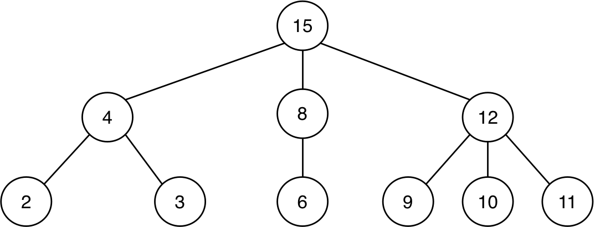

```text
(define arbol '(------------))
(check-equal? ------------------- 10)
```

a.2) The functions that add the data in a tree using mutual recursion, which we
have seen in theory, are the following:

```racket
(define (suma-datos-arbol arbol)
    (+ (dato-arbol arbol)
       (suma-datos-bosque (hijos-arbol arbol))))

(define (suma-datos-bosque bosque)
    (if (null? bosque)
        0
        (+ (suma-datos-arbol (first bosque)) 
           (suma-datos-bosque (rest bosque)))))
```


If we make the following call to the `suma-datos-bosque` function, where `arbol`
is the one defined in the previous part:

```racket
(suma-datos-bosque (hijos-arbol arbol))
```

1. What does the invocation `(suma-datos-arbol (first bosque))` made inside the
  function return?
2. What does the first recursive call to `suma-datos-bosque` return?

Write the answer to these questions as comments in the lab file.

a.3) The higher-order function we have seen in theory that also adds the data in
a tree is:

```racket
(define (suma-datos-arbol-fos arbol)
   (foldr + (dato-arbol arbol) 
       (map suma-datos-arbol-fos (hijos-arbol arbol))))
``` 	

If we make the following call to the function, where `arbol` is the one defined
in the previous part:

```racket
(suma-datos-arbol-fos arbol)
```

1. What does the invocation of `map` inside the function return?
2. What invocations of the `+` function are made during the execution of `foldr`
   over the list returned by the invocation of `map`? List them in order,
   indicating their parameters and the value returned in each one.


b.1) Write the Scheme statement that defines the following binary tree, and write
an expression **using the binary-tree abstraction barrier functions** that returns
the number 29.

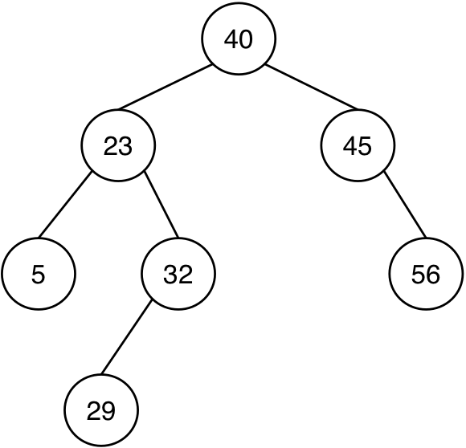

```text
(define arbolb '(------------------))
(check-equal? ---------------------- 29)
```


### Exercise 2 ###

a) Implement two versions of the function `(to-string-arbol arbol)`, which
receives a tree of symbols and returns the string resulting from concatenating
all the symbols in preorder traversal. You must implement one version with
**mutual recursion** and another one (called `to-string-arbol-fos`) with a single
function that uses **higher-order functions**.

Example:

```racket
(define arbol2 '(a (b (c (d)) (e)) (f)))
(to-string-arbol arbol2) ; ⇒ "abcdef"
```

b) Implement two versions of the function `(veces-arbol dato arbol)`, which
receives a tree and a datum and checks how many times the datum appears in the
tree. You must implement one function with **mutual recursion** and another with
**higher-order functions**.

```racket
(veces-arbol 'b '(a (b (c) (d)) (b (b) (f)))) ; ⇒ 3
(veces-arbol 'g '(a (b (c) (d)) (b (b) (f)))) ; ⇒ 0
```

### Exercise 3 ###

a) Implement two versions of the function `(hojas-cumplen pred arbol)`, which
receives a predicate and a tree and returns a list with all the leaves of the
tree that satisfy the predicate. One function with **mutual recursion** and
another with **higher-order functions**.

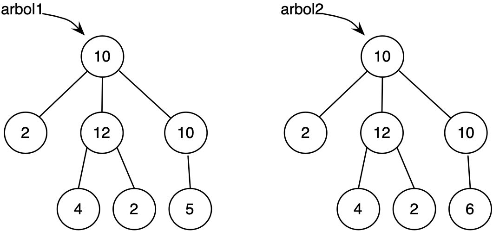

```racket
(define arbol1 '(10 (2) (12 (4) (2)) (10 (5))))
(define arbol2 '(10 (2) (12 (4) (2)) (10 (6))))
(hojas-cumplen even? arbol1) ; ⇒ '(2 4 2)
(hojas-cumplen even? arbol2) ; ⇒ '(2 4 2 6)
```

b) Implement two versions of the predicate `(todas-hojas-cumplen? pred
arbol)`, which checks whether all leaves of a tree satisfy a given predicate.
One function with **mutual recursion** and another with **higher-order
functions**.

You must not use the previous function; you have to traverse the whole tree. For
the higher-order function, you can use the `for-all?` function implemented in
[topic 2](../../theory/topic02-functional-programming/topic02-functional-programming.md#57-higher-order-functions).

```racket
(todas-hojas-cumplen? even? arbol1) ; ⇒ #f
(todas-hojas-cumplen? even? arbol2) ; ⇒ #t
```

### Exercise 4 ###

a) Using **higher-order functions**, implement the function `(suma-raices-hijos
arbol)`, which returns the sum of the roots of the children of a generic tree.

Example:

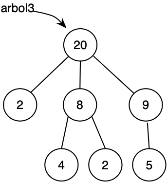

```racket
(define arbol3 '(20 (2) (8 (4) (2)) (9 (5))))
(suma-raices-hijos arbol3) ; ⇒ 19
(suma-raices-hijos (second (hijos-arbol arbol3))) ; ⇒ 6
```

b) Implement two versions, one with **mutual recursion** and another with
**higher-order functions**, of the function `(raices-mayores-arbol? arbol)`,
which receives a tree and checks that its root is greater than the sum of the
roots of its children, and that all its children (meaning all descendants) also
satisfy this property.

Examples:

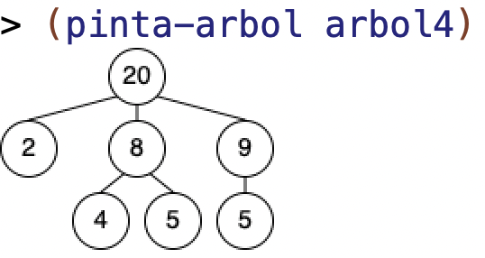

```racket
(define arbol4 '(20 (2) (8 (4) (5)) (9 (5))))
(raices-mayores-arbol? arbol3) ; ⇒ #t
(raices-mayores-arbol? arbol4) ; ⇒ #f
```

c) Define the function `(comprueba-raices-arbol arbol)`, which receives a tree
and returns another tree in which the nodes have been replaced by 1 or 0
depending on whether they are greater than the sum of the roots of their
children or not.

Examples:

```racket
(define raices_arbol3 (comprueba-raices-arbol arbol3)) ; ⇒ (1 (1) (1 (1) (1)) (1 (1)))
(define raices_arbol4 (comprueba-raices-arbol arbol4)) ; ⇒ (1 (1) (0 (1) (1)) (1 (1)))
```

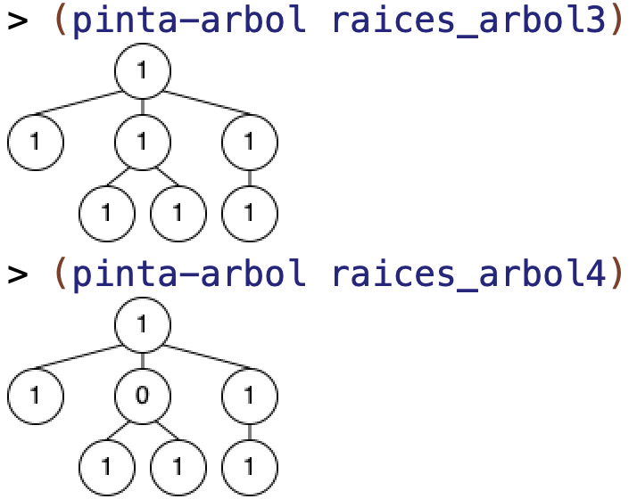


### Exercise 5 ###

a) Define the function `(es-camino? lista arbol)` with **mutual recursion**. It
must check whether the sequence of elements in the list corresponds to a path in
the tree that starts at the root and ends exactly at a leaf. We assume that
`lista` contains at least one element.

For example, the list `(a b a)` is a path in the following tree, but the list
`(a b)` is not.

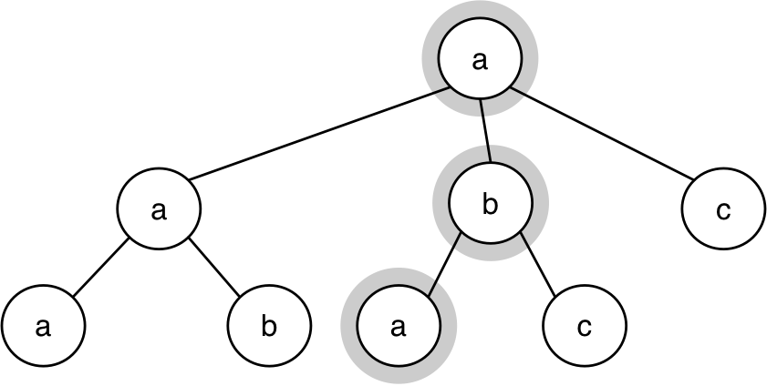

Examples: assuming that `arbol` is the tree defined by the previous figure:


```racket
(es-camino? '(a b a) arbol) ; ⇒ #t
(es-camino? '(a b) arbol) ; ⇒ #f
(es-camino? '(a b a b) arbol) ; ⇒ #f
```


b) Write the function `(nodos-nivel nivel arbol)`, which receives a level and a
generic tree and returns a list with all the nodes found at that level.

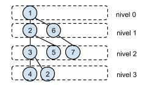

Examples, assuming that `arbol` is the tree defined by the previous figure:

```racket
(nodos-nivel 0 arbol) ; ⇒ '(1)
(nodos-nivel 1 arbol) ; ⇒ '(2 6)
(nodos-nivel 2 arbol) ; ⇒ '(3 5 7)
(nodos-nivel 3 arbol) ; ⇒ '(4 2)
```

### Exercise 6 ###

a) Define the function `(ordenado-entre? arbolb min max)`, which checks whether a
binary tree is ordered and its data are between `min` and `max`.

A binary tree is ordered when its left and right children are ordered, and when
the root is greater than or equal to all the numbers in the left child and less
than or equal to all the numbers in the right child.

For example, in the following figure, the binary tree on the left (`arbolb1`) is
ordered, but the one on the right (`arbolb2`) is not.

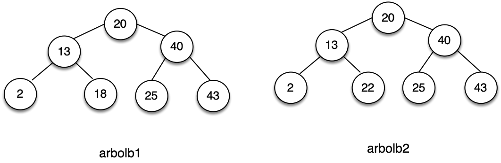

Example:

```racket
(define arbolb1 '(20 (13 (2 () ())
                         (18 () ()))
                     (40 (25 () () )
                         (43 () ()))))
(define arbolb2 '(20 (13 (2 () ())
                         (22 () ()))
                     (40 (25 () () )
                         (43 () ()))))

(ordenado-entre? arbolb1 0 50) ; ⇒ #t
(ordenado-entre? arbolb2 0 50) ; ⇒ #f
(ordenado-entre? arbolb1 0 30) ; ⇒ #f
```

b) Using the previous function, define the functions `(ordenado-menor? arbolb
max)` and `(ordenado-mayor? arbolb min)`, which check whether a binary tree is
ordered and its data are less than or equal to, or greater than or equal to, the
argument.

Examples:

```racket
(ordenado-menor? arbolb1 50) ; ⇒ #t
(ordenado-menor? arbolb1 40) ; ⇒ #f
(ordenado-menor? arbolb2 50) ; ⇒ #f
(ordenado-mayor? arbolb1 0)  ; ⇒ #t
(ordenado-mayor? arbolb1 20) ; ⇒ #f
(ordenado-mayor? arbolb2 0) ; ⇒ #f
```

c) Using the previous functions, define the function `(ordenado? arbolb)`, which
checks whether a binary tree is ordered.

```racket
(ordenado? arbolb1) ; ⇒ #t
(ordenado? arbolb2) ; ⇒ #f
```

### Exercise 7 ###

a) Given a binary tree and a path defined as a list of symbols:
`'(< > = > > =)`, where:

- `<`: indicates that we go through the left branch
- `>`: indicates that we go through the right branch
- `=`: indicates that we keep the data of that node.

Implement the function `(camino-arbolb arbolb camino)`, which returns a list with
the data collected by the path.

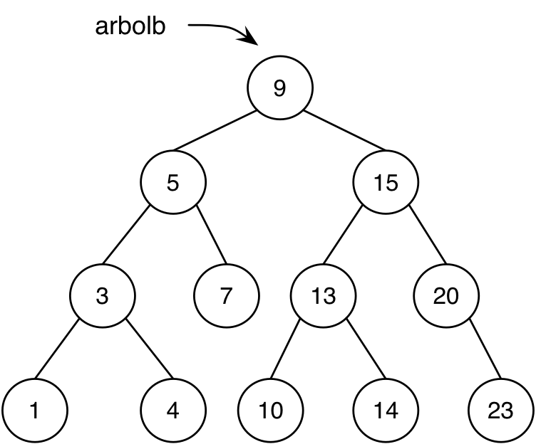

```racket
(camino-arbolb arbolb '(= < < = > =)) ; ⇒ '(9 3 4)
(camino-arbolb arbolb '(> = < < =)) ; ⇒ '(15 10)
```

b) Remember that a binary tree is ordered if the data at the root is greater
than all the data in the left child and less than or equal to the data in the
right child, and both children are also ordered in turn.

Recursively implement the function `(inserta-ordenado n a)`, which receives a
number and an ordered binary tree of numbers, and returns a new ordered binary
tree that includes the number.

Example:

```
(define a1 (inserta-ordenado 5 arbolb-vacio)) 
(define a2 (inserta-ordenado 4 a1))
(define a3 (inserta-ordenado 2 a2))
(define a4 (inserta-ordenado 6 a3))) 
```

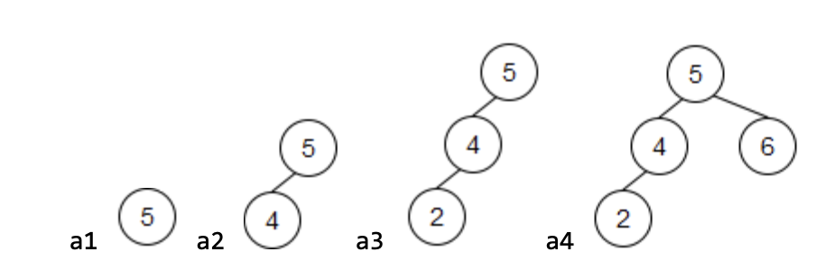


----

Programming Languages and Paradigms, academic year 2025-26  
© Department of Computer Science and Artificial Intelligence, University of Alicante  
Domingo Gallardo, Cristina Pomares, Antonio Botía, Francisco Martínez
