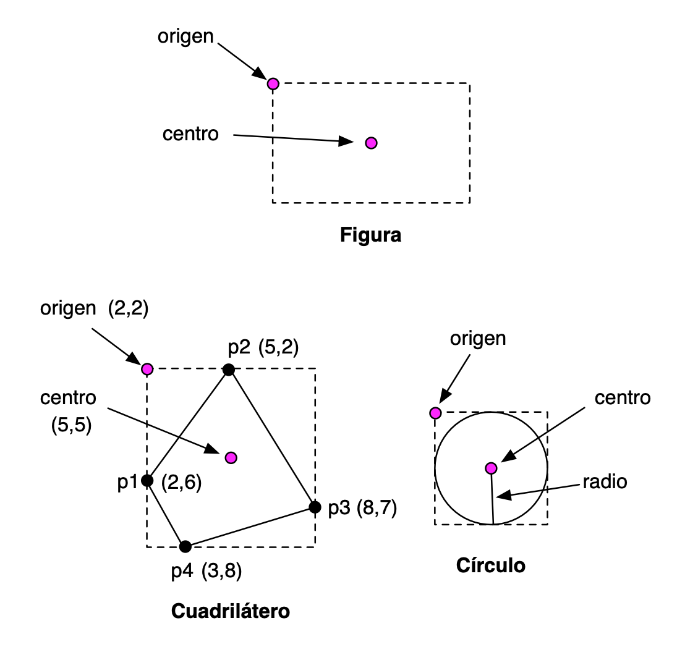

# Lab 11: Object-Oriented Programming in Swift (1)

## Before the Lab Session

The following exercises are based on the theory concepts covered last week.
Before the lab session, you should review all the concepts and **try with the
Swift compiler** all the examples from the following sections of topic 6
[_Object-Oriented Programming with
Swift_](../../theory/topic06-object-oriented-programming-swift/topic06-object-oriented-programming-swift.md)

- Classes and structures
- Properties
- Methods
- Initialization
- Inheritance

### Swift Seminar ###

Also continue reading and trying the Swift seminar tour, specifically the
[*Objects and classes*](../../seminars/seminar02-swift/seminar02-swift.md#objects-and-classes)
and [*Enumerations and structures*](../../seminars/seminar02-swift/seminar02-swift.md#enumerations-and-structures)
sections. This last section will also help you review the concept of enumeration
and enumeration with associated value.

### Exercise 1 ###

Answer the following parts without using the Swift compiler. Once you have
finished them, check whether the solution you indicated was correct.

a) Examine the following code. What error or errors does it have? Fix the errors
with the minimum possible number of changes and indicate what will be printed on
screen.

```swift
struct MiEstructura {
    var x = 0
}

class MiClase {
    var x = 0
}

func foo(_ c: MiClase, _ x: Int) {
    c.x = x
}

let s1 = MiEstructura()
var s2 = s1
let c1 = MiClase()
var c2 = c1

s1.x = 10
c1.x = 10
print ("s2.x: \(s2.x), c2.x: \(c2.x)")

foo(c1, 20)
print("c1.x, después de llamar a la función: \(c1.x)")
```

b) Examine the code below and add to the `Cuadrado` structure two versions of a
`movido` method that receives an x increment and a y increment and returns a new
square resulting from moving its corner. Call the first version of the method
`movido1` and use in it the `movida` method of the `Coord` structure. Call the
second version of the method `movido2` and use in it the `mueve` method of the
`Coord` structure. Also add a mutating method `mueve` that does the same as the
previous ones, but mutates the position of the square.

```swift
struct Coord {
    var x: Double
    var y: Double

    func movida(incX: Double, incY: Double) -> Coord {
        return Coord(x: x+incX, y: y+incY)
    }

    mutating func mueve(incX: Double, incY: Double) {
        x = x + incX
        y = y + incY
    }
}

struct Cuadrado {
    var esquina = Coord(x: 0.0, y: 0.0)
    var lado: Double

    func movido1 ... {
        ...
    }

    func movido2 ... {
        ...
    }
    
    // Añade un método mutador mueve
}
```


c) Indicate what the `print` function displays on screen:

```swift
func foo(palabra: String, longitud: Int) -> Bool {
    if palabra.count >= longitud {
        return true
    }
    else {
        return false
    } 
}

class MisPalabras {
    var guardadas: [String] = []
    func guarda(_ palabra: String) {
        guardadas.append(palabra)
    }
    var x : [Bool] {
        get {
            return guardadas.map {foo(palabra: $0,longitud: 4)}
        }
    } 
}

let palabras = MisPalabras()
palabras.guarda("Ana")
palabras.guarda("Pascual")
palabras.guarda("María")
print(palabras.x)
```


### Exercise 2 ###

a) The following code uses computed properties and property observers. What is
printed at the end of its execution? Reflect on how the code works, check it with
the compiler, and experiment by making changes and checking the result.


```swift
var x = 10  {
   didSet {
      if (x > 100) {
          x = oldValue
      }
   }
}

var y: Int {
    get {
        return x / 3
    }
    set {
        x = 3 * newValue
    }
}

var z : Int {
   get {
      return x + y
   }
   set {
      x = newValue / 2
      y = newValue / 2
   }
}
z = 60
print("y: \(y)")
print("x: \(x)")
z = 600
print("y: \(y)")
print("x: \(x)")
```

b) The following code uses property observers and a type (static) variable.

What is printed at the end of its execution? Reflect on how the code works,
check it with the compiler, and experiment by making changes and checking the
result.

```swift
struct Valor {
    var valor: Int = 0 {
        willSet {
            Valor.z += newValue
        }        
        didSet {
            if valor > 10 {
                valor = 10
            }
        }
    }
    static var z = 0
}

var c1 = Valor()
var c2 = Valor()
c1.valor = 20
c2.valor = 8
print(c1.valor + c2.valor + Valor.z)
```

### Exercise 3

Write an example of code where you define an inheritance relationship between a
base class and a derived class. Check in the code that an object of the derived
class inherits the properties and methods of the base class.

Investigate how inheritance works in Swift. Write examples where you check this
behavior. Some example questions you can investigate (you can add more
questions):

- Can the value of a stored property be overridden? What about a computed
property?
- Can an observer be added to a property of the base class in a derived class?
- Does the derived class inherit static properties and methods from the base
  class?
- How can you call the implementation of a base-class method in an override of
  that same method in the derived class?


### Exercise 4

In this exercise we will work with geometric figures using structures and
classes.

In the exercise, you must use the function for calculating the square root and
the value of the mathematical constant _pi_.

- To use the `sqrt` function, you must import the `Foundation` library:

```swift
import Foundation
```

- You can obtain the value of the mathematical constant _pi_ with the
  `Double.pi` property.

We assume that we are working with screen coordinates, where coordinate (0,0)
represents the coordinate of the top-left corner of the screen. The Y coordinate
grows downward and the X coordinate grows to the right. Coordinates will be
defined with decimal numbers (`Double`).

We are going to define the following structures and classes:

- Structures: `Punto`, `Tamaño`
- Classes: `Figura` (superclass), `Cuadrilátero` and `Circulo` (derived
classes).



We are going to define stored properties and computed properties for all the
geometric figures.

**Structures `Punto` and `Tamaño`**

You must declare them exactly as they appear in the notes.

**Class `Figura`**:

- Initializer:
    - `Figura(origen: Punto, tamaño: Tamaño)`
- Stored instance properties:
    - `origen` (`Punto`), which defines the coordinates of the top-left corner
      of the rectangle that defines the figure
    - `tamaño` (`Tamaño`), which defines the height and width of the rectangle
      that defines the figure.
- Computed instance properties:
    - `area` (`Double`, read-only), which returns the area of the rectangle that
      encloses the figure.
    - `centro` (`Punto`, read-write property). It is the center of the rectangle
      that defines the figure. If we modify the center, the position of the
      figure's origin is modified.

**Derived class `Cuadrilatero`**

A quadrilateral is defined by four points. The figure represents the rectangle
that encloses the four points of the quadrilateral (see image above).

- Initializer:
    - `Cuadrilatero(p1: Punto, p2: Punto, p3: Punto, p4: Punto)`. The points are
      given in clockwise order, although it will not always start with the point
      located farthest to the right. When creating the quadrilateral, we must
      update the `origen` and `tamaño` properties of the figure. To calculate
      these properties, you must obtain the minimum and maximum x and y
      coordinates of all the points.
- Own stored instance properties:
    - The points of the quadrilateral `p1`, `p2`, `p3`, and `p4`.
- Computed instance properties:
    - `centro` (`Punto`, read-write), inherited from the superclass. The `setter`
      modifies the position of the points of the quadrilateral and the origin of
      the figure, moving them by the same increments by which the center of the
      figure has been moved.
    - `area` (`Double`, read-only), which returns the area of the quadrilateral.
      This area can be calculated by adding the areas of the two triangles that
      form the quadrilateral.

      You can use the following helper function to calculate the area of a
      triangle from the points of its vertices:

      ```swift
      func areaTriangulo(_ p1: Punto, _ p2: Punto, _ p3: Punto) -> Double {
          let det = p1.x * (p2.y - p3.y) + p2.x * (p3.y - p1.y) + p3.x * (p1.y - p2.y)
          return abs(det)/2
      }
      ```

**Derived class `Circulo`**

A circle is defined by a center and a radius. The superclass figure represents
the smallest square in which the circle is inscribed (see image above).

- Initializer:
    - `Circulo(centro: Punto, radio: Double)`. When creating the circle, we must
      update the `origen` and `tamaño` properties of the figure.
- Stored instance properties:
    - `radio` (`Double`), which contains the radius length.
- Computed instance properties:
    - `centro` (`Punto`, read-write), inherited from the superclass.
    - `area` (`Double`, read-write), which returns the area of the circle. The
      `setter` modifies the size of the circle (its radius), keeping the center
      in the same position.

**Structure `AlmacenFiguras`**

- Stored properties:
    - `figuras`: array of figures.
- Computed properties:
    - `numFiguras` (`Int`), which returns the total number of added figures.
    - `areaTotal` (`Double`), which returns the total sum of the areas of all
      added figures.
- Methods:
    - `añade(figura:)`, which adds a figure to the array.
    - `desplaza(incX: Double, incY: Double)`: moves all figures by the specified
      dimensions `incX` (increment in the X coordinate) and `incY` (increment in
      the Y coordinate). The centers of all figures must be moved by these
      magnitudes.

Implement the previous structures and write some example code where at least one
quadrilateral and one circle are created, their properties are tested, they are
added to the figure store, and its methods are tested.


----

Programming Languages and Paradigms, academic year 2025-26  
© Department of Computer Science and Artificial Intelligence, University of Alicante  
Domingo Gallardo, Cristina Pomares, Antonio Botía, Francisco Martínez
