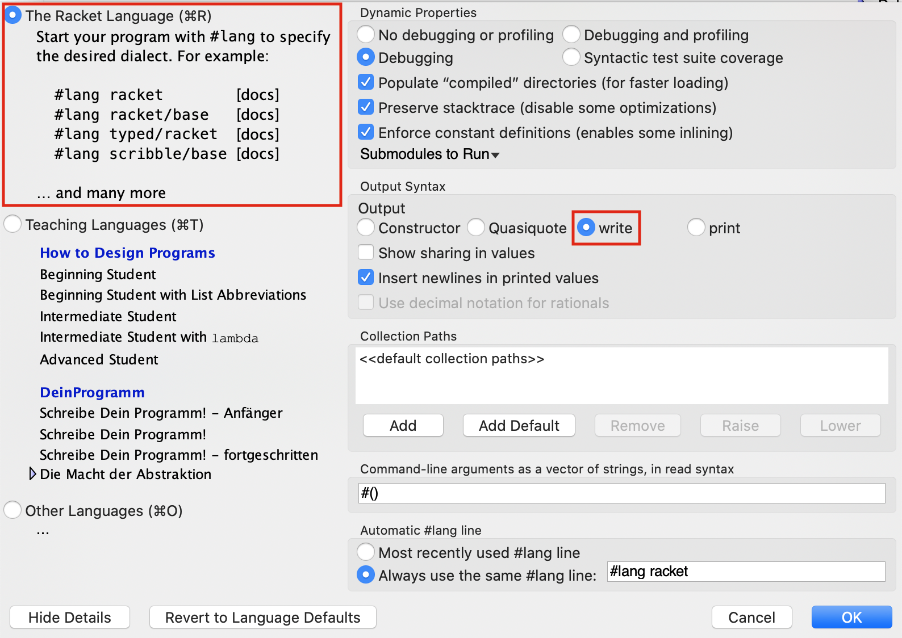
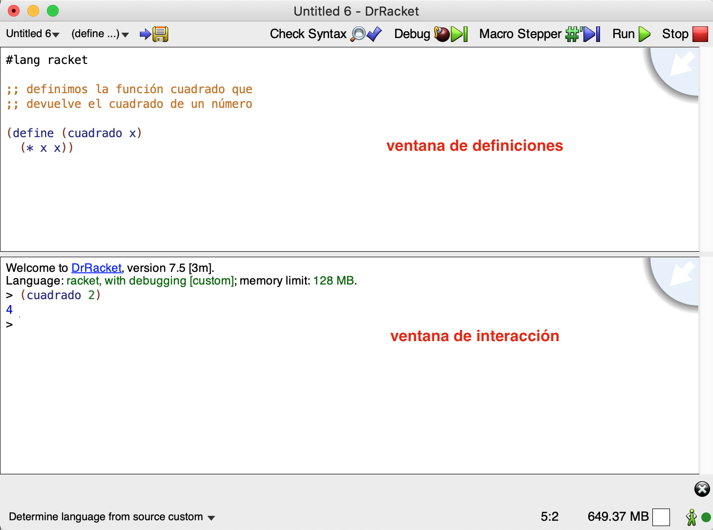
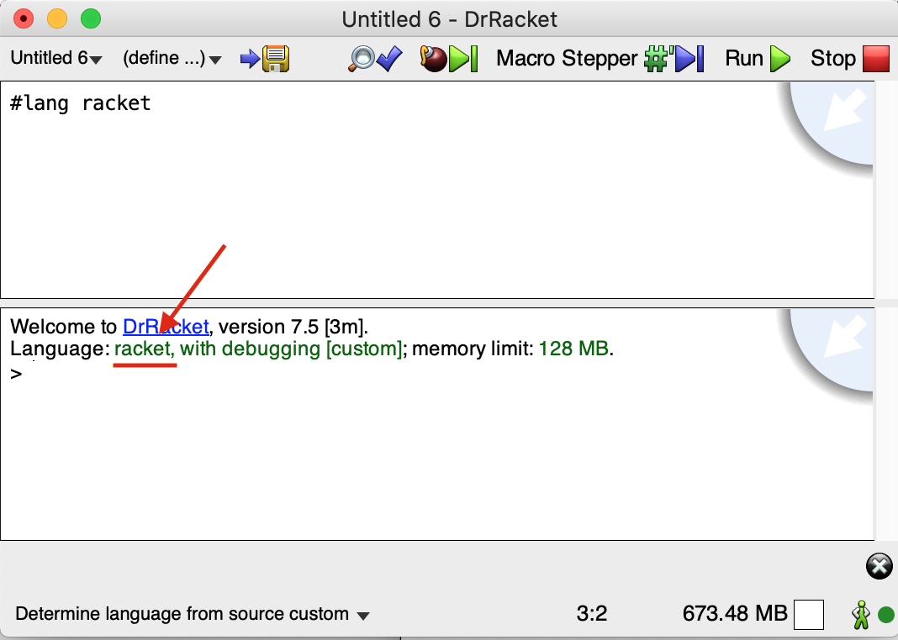
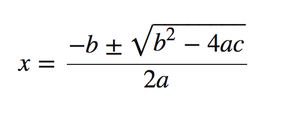
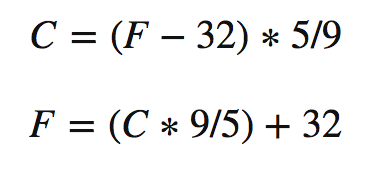

# Seminar 1: Scheme Seminar

## 1. The Scheme Programming Language

Scheme is a programming language that emerged at the MIT laboratories
in 1975, when Guy L. Steele and Gerald J. Sussman were looking for a
language with very clear and simple semantics.

Scheme is a dialect of Lisp. It is an interpreted language, highly
expressive, and it supports several paradigms. It was influenced by
lambda calculus. The development of Scheme has been slow because the
people who standardized Scheme have been very conservative about
adding new features, since quality has always been more important
than business usefulness. For that reason, Scheme is considered one
of the best designed general-purpose languages. Learning Scheme will
make you better programmers when you use other programming languages.

### 1.1. The Racket Programming Language ###

What are we going to learn? Racket or Scheme? The answer is: Scheme
working in Racket.

[Racket](https://en.wikipedia.org/wiki/Racket_(programming_language))
was designed in 1995 based on Scheme, extending it with new
features, such as the ability to extend it with libraries. The
language includes very useful libraries (graphics libraries, HTTP
server connectivity, database connectivity, etc.) that modernize the
original language and turn it into a practical language for building
all kinds of applications, from video games to web servers. However,
we are only going to use Racket to learn the part that corresponds to
the original Scheme core.

### 1.2. The DrRacket Programming Environment

Let us see a short introduction to the programming environment
provided by DrRacket. You can find more information in the
[original documentation](http://docs.racket-lang.org/drracket/index.html).

#### 1.2.1. Downloading DrRacket ####

DrRacket is cross-platform and can run on Linux, macOS, or Windows.
You can download the latest version at the following link:

[Download DrRacket](https://download.racket-lang.org/)

#### 1.2.2. Configuring DrRacket

To work correctly with DrRacket, we must make sure that the active
language is `The Racket Language` and that the output syntax has the
`write` option enabled, as shown in the following image:



We can change that option using the following menus:

_Language > Choose Language (select `The Racket Language`) > Show
details > Output Syntax > write_

This option determines the output syntax of the language interpreter,
which is going to be one of the fundamental elements for learning
Scheme.

!!! Warning "Warning"
    Once these options have been selected, the configuration is saved in
    the user preferences. In the EPS labs, you need to perform this
    configuration at the beginning of every session.

When we start DrRacket, we can see that it has three parts: a row of
buttons at the top, two editing panels in the middle, and a status
bar at the bottom.



The top editing panel is the definitions window. It is used to
implement functions, such as the `cuadrado` function in the example.
The bottom panel, called the _interaction window_, is used to
evaluate expressions interactively using the Racket interpreter. By
clicking the _Run_ button, the program in the _definitions window_ is
evaluated, making those definitions available in the interaction
window. Thus, given the definition of `cuadrado`, after clicking
_Run_, we can type the expression `(cuadrado 2)` into the
interpreter, it will be evaluated, and the result will be displayed,
in this case `4`.

DrRacket supports many languages and Scheme dialects. We are going to
use the default language, the _Racket_ language. To do that, no extra
action is needed, we just have to make sure of the following:

1. At the bottom of the window it shows
   "_Determine language from source_"

2. The file being edited in the editing panel begins with the line:

    ```racket
    #lang racket
    ```

3. Finally, if we click the _Run_ button, we will check that this
   language is loaded into the interpreter.



#### 1.2.3. How to Write in the Interpreter ####

The Racket interpreter is located in the lower window. The
interpreter performs a loop in which an expression is read, its
result is evaluated, and then it is printed. This type of loop is
called a REPL (_Read-Evaluate-Print Loop_).

The expressions we type into the interpreter are stored in a history.
We can retrieve previous expressions and move through that history
using the following key combinations:

- `CTRL` + up/down arrow

That key combination may be assigned to other functions in your
operating system configuration. You can change that configuration or
use DrRacket's alternative combination:

- `ESC` + `p` (previous) / `n` (next)

We can also select an expression with the cursor and, when pressing
`RETURN`, it is automatically copied into the _prompt_.

## 2. The Scheme Language

### 2.1. Let Us Start by Trying Some Examples

Scheme is an interpreted language. Let us start DrRacket and type
some expressions in the interaction window. The interpreter will
analyze the expression and display the resulting value.

```racket
2 ; ⇒ 2
(+ 2 3) ; ⇒ 5
(+ (* 2 3) (- 3 1)) ; ⇒ 8
```

Expressions in Scheme use a form called _Cambridge prefix notation_
(the Cambridge name comes from Cambridge, Massachusetts, where MIT is
located and where Lisp was designed), in which the expression is
delimited by parentheses and the operator is followed by the
operands. The syntax is the following:

```racket
(<function> <arg1> ... <argn>)
```

In Scheme we can interpret the opening parenthesis `(` as the trigger
that launches the function that follows it. The way Scheme evaluates
an expression is very simple:

1. It evaluates each argument.
2. It applies the function named after the parenthesis to the values
   obtained from the previous evaluation.

```text
(+ (* 2 3) (- 3 (/ 12 3)))
⇒ (+ 6 (- 3 (/ 12 3)))
⇒ (+ 6 (- 3 4))
⇒ (+ 6 -1)
⇒ 5
```

There are functions that accept a variable number of arguments, such
as addition or subtraction:

```racket
(+) ; ⇒ 0
(+ 2 4 5 6) ; ⇒ 17
(- 10 2 3) ; ⇒ 5
```

In the case of subtraction, the arguments are subtracted from left to
right (the second argument is subtracted from the first, the third is
subtracted from the result, and so on):

```racket
(- 4 5 4 8) ; ⇒ -13
(- 4 (+ 5 4) 8) ; ⇒ -13
(- 4 (+ 5 4 8)) ; ⇒ -13
```

In Scheme, the terms function and procedure mean the same thing and
are used interchangeably. Examples of functions or procedures are
`+`, `-`, `/`, `*`. In Scheme, evaluating a function always returns a
value, unless an error occurs and stops the evaluation:

```racket
(* (+ 3 4) (/ 3 0))
; Error /: division by zero
```

### 2.2. Defining Identifiers and Functions

Scheme is a multi-paradigm language but mainly a functional one, and
one of its main features is that programs are built by defining
functions.

We can use the special form `define` in the interpreter to define
variables (identifiers associated with values) and functions, as seen
this week in theory.

We can define identifiers in the interaction window to make it easier
to write expressions:

```racket
(define a (+ 2 (* 3 4)))
a ; ⇒ 14
(+ a (* 2 3)) ; ⇒ 20
```

There are identifiers (in Scheme we call them _symbols_) that are
already defined in the Racket interpreter, for example `pi`:

```racket
pi ; ⇒ 3.141592653589793
(sin (/ pi 2)) ; ⇒ 1.0
```

To implement a function, `define` is also used, with the following
syntax:

```racket
(define (<function-name> <args>)
	<function-body>
)
```

For example, let us implement a function that takes two numbers as
parameters and returns the sum of their squares:

```racket
(define (suma-cuadrados x y)
	(+ (* x x) (* y y)))
```

If we call the function with `2` and `3` as parameters, the function
returns the number `13`:

```racket
(suma-cuadrados 2 3)  ; ⇒ 13
```

!!! Note "Note"
    Unlike most programming languages, Scheme does not use the word
    `return` to indicate that a function returns a value. Functions are
    defined with a single expression, and the result computed by that
    expression is always what gets returned.

### 2.3. Weakly Typed Language ###

Let us examine a very important feature of Scheme: being a
**weakly typed language**. Among other things, this means that
variables, functions, and arguments do not have a declared type. It
is possible to use values of different data types to assign
successively to the same variable (in an imperative language) or to
pass as a parameter to the same function (in a functional language).
For example, JavaScript or PHP are also weakly typed imperative
languages.

Let us see how this works in Scheme using the previous function as an
example.

```racket
(define (suma-cuadrados x y)
   (+ (* x x) (* y y)))
```

We can see that the arguments `x` and `y` have no type. If the
function is called with some data that is not a number, the
interpreter will not detect any error and will allow those data to be
assigned to the arguments `x` and `y`. The error occurs when the
multiplication is actually evaluated.

We can check this with the following example, which shows the
resulting error message:

```racket
> (suma-cuadrados 10 "hola")
*: contract violation
  expected: number?
  given: "hola"
  argument position: 1st
  other arguments...:
```

Later we will see that there are different types of numbers that we
can operate on using division, addition, and multiplication. The
defined function works correctly for all of them.

We can pass integers, real numbers, or even fractions to the
function:

```racket
(suma-cuadrados 2 5) ; ⇒ 29
(suma-cuadrados 2.4 5.8)  ; ⇒ 39.4
(suma-cuadrados (/ 2 3) (/ 3 5))  ; ⇒ 181/225
```

In the last expression, fractional numbers can also be passed
directly; the Scheme interpreter understands that notation:

```racket
(suma-cuadrados 2/3 3/5) ; ⇒ 181/225
```

### 2.4. Simple Data Types

Scheme primitives consist of a set of data types, special forms, and
functions built into the language. Throughout the course we will
introduce these primitives.

Let us review some simple Scheme data types, as well as some
primitive functions to work with values of those types.

* Booleans
* Numbers
* Characters

#### 2.4.1. Booleans

A boolean is a truth value, which can be true or false. In Scheme, we
have the symbols `#t` and `#f` to express true and false
respectively, but in many operations any value different from `#f` is
considered true. Examples:

```racket
#t ; true
#f ; false
(> 3 1.5) ; ⇒ #t
(= 3 3.0) ; ⇒ #t (mathematical equality)
(equal? 3 3.0) ; ⇒ #f (type equality)
(or (< 3 1.5) #t) ; ⇒ #t
(and #t #t #f) ; ⇒ #f
(not #f) ; ⇒ #t
(not 3) ; ⇒ #f (accepts any argument;
        ;       only returns #t when the argument is #f)
```

#### 2.4.2. Numbers

The number of numeric types supported by Scheme is large, including
integers with different precision, rational numbers, complex numbers,
and inexact numbers. For example:

```racket
(/ 1 3) ; ⇒ returns the fraction 1/3
(+ 1/3 1/3) ; ⇒ 2/3
(+ 2 3 4 2) ; ⇒ 11 (the + function accepts a variable number of arguments)
(+ 1/3 0.0) ; real number with infinite precision ⇒ 0.3333333333333333
(* (+ 1/3 0.0) 3) ; ⇒ 1
(sqrt -1) ; ⇒ 0+1i (imaginary number)
(+ 3+2i 2-i) ; ⇒ 5+1i (operations with imaginary numbers)
```

##### 2.4.2.1. Some Number Primitives

```racket
(<= 2 3 3 4 5) ; ⇒ #t (arguments are in increasing order)
(max 3 5 10 1000) ; ⇒ 1000
(/ 22 4)  ; returns a fraction
(quotient 22 4) ; ⇒ 5 (integer division quotient)
(remainder 22 4) ; ⇒ 2 (integer division remainder)
(equal? 0.5 (/ 1 2)) ; ⇒ #f (different data types)
(= 0.5 (/ 1 2)) ; ⇒ #t (mathematical equality)
(abs (* 3 -2)) ; ⇒ 6 (absolute value)
(sin 2.2) ; related: cos, tan, asin, acos, atan
(expt 4 2) ; ⇒ 16 (exponent: 4 raised to 2)
```

##### 2.4.2.2. Rounding Functions

```racket
; (floor x) returns the largest integer not greater than x
; (ceiling x) returns the smallest integer not less than x
; (truncate x) returns the integer closest to x whose absolute value
;              is not greater than the absolute value of x
; (round x) returns the integer closest to x, rounded
(floor -4.3)    ; ⇒ -5.0
(floor 3.5)     ; ⇒ 3.0
(ceiling -4.3)  ; ⇒ -4.0
(ceiling 3.5)   ; ⇒ 4.0
(truncate -4.3) ; ⇒ -4.0
(truncate 3.5)  ; ⇒ 3.0
(round -4.3)    ; ⇒ -4.0
(round 3.5)     ; ⇒ 4.0
```

##### 2.4.2.3. Predicates on Numbers

Functions that return a boolean are called _predicates_.

```racket
(positive? -4) ; ⇒ #f (-4 is not positive)
(negative? -4) ; ⇒ #t (-4 is negative)
(zero? 0.2) ; ⇒ #f (checks whether the result is zero)
(even? 2) ; ⇒ #t (checks whether it is even)
(odd? 3) ; ⇒ #t (checks whether it is odd)
```

In Scheme we have predicates that allow us to check the type of a
parameter. In the case of numbers, the number type:

```racket
(number? 1) ; ⇒ #t (argument 1 is a number)
(integer? 2.3) ; ⇒ #f (argument 2.3 is not an integer)
(integer? 4.0) ; ⇒ #t (the number 4.0 is mathematically identical
               ;        to the number 4)
(real? 1) ; ⇒ #t
```

#### 2.4.3. Characters

International characters are supported and encoded in UTF-8.

```racket
#\a
#\A
#\space
#\ñ
#\á
```

##### 2.4.3.1. Operations on Characters

```racket
(char<? #\a #\b) ; ⇒ #t (#\a comes before #\b)
(char-numeric? #\1) ; ⇒ #t (#\1 is a number)
(char-alphabetic? #\3) ; ⇒ #f (#\3 is a number)
(char-whitespace? #\tab) ; ⇒ #t (the tab character is whitespace)
(char-upper-case? #\A) ; ⇒ #t (#\A is an uppercase letter)
(char-lower-case? #\a) ; ⇒ #t (#\a is a lowercase letter)
(char-upcase #\ñ) ; ⇒ #\Ñ (turns the letter into uppercase)
(char-downcase #\A) ; ⇒ #\a (turns the letter into lowercase)
(char->integer #\space) ; ⇒ 32 (the space character occupies position 32)
(integer->char 32) ; ⇒ #\space (same as above but the other way around)
(char->integer (integer->char 5000)) ; ⇒ 5000
```

### 2.5. Compound Data Types

Scheme also has a set of compound data types that allow us to group
simple elements of the data types seen above.

* Strings
* Pairs
* Lists

We will study the last two in detail in future theory classes.

#### 2.5.1. Strings

Strings are finite sequences of characters.

```racket
"hola"
"La palabra \"hola\" tiene 4 letras"
```

##### String Constructors

```racket
(make-string 5 #\o) ; ⇒ "ooooo" (constructor function that takes an integer and a character)
(string #\h #\o #\l #\a) ; ⇒ "hola" (constructor function that takes a variable number of characters)
```

##### Operations with Strings

```racket
(substring "Hola que tal" 2 4) ; ⇒ "la" (substring from position 2 to 4, excluding 4)
(string? "hola") ; ⇒ #t (predicate that checks the argument is a string)
(string->list "hola") ; ⇒  (#\h #\o #\l #\a) (returns a list of characters)
(string-length "hola") ; ⇒ 4 (string length)
(string-ref "hola" 0) ; ⇒ #\h (character at position 0)
(string-append "hola" "adios") ; ⇒ "holaadios" (string concatenation)
```

##### String Comparators

```racket
(string=? "Hola" "hola") ; ⇒ #f
(string=? "hola" "hola") ; ⇒ #t
(string<? "aab" "cde") ; ⇒ #t (comparison uses lexicographic order)
(string>=? "www" "qqq") ; ⇒ #t
```

#### 2.5.2. Pairs

Pairs are a fundamental element of Scheme. A pair is a compound type
formed by two elements (not necessarily of the same type).

```racket
(cons 1 2) ; ⇒ (1 . 2) (cons creates a pair)
(cons #t 3) ; ⇒ (#t . 3) (elements of different types)
(car (cons "hola" 2)) ; ⇒ "hola" (left element of the pair)
(cdr (cons "bye" 5)) ; ⇒ 5 (right element of the pair)
```

When we evaluate the previous expressions in the interpreter, Scheme
displays the result of building the pair with the following syntax:

```text
(left-element . right-element)
```

For example:

```racket
(cons 1 2) ; ⇒ (1 . 2)
```

Scheme's characteristic of evaluating expressions from the inside out
applies to all functions, including this `cons` function that builds
pairs:

```racket
(cons (+ 2 3) (string-append "hola" "adios")) ; ⇒ (5 . "holaadios")
(cons (= 2 2.0) (* 2 (+ 1 3))) ; ⇒ (#t . 8)
```

Pairs can also contain other pairs. We will see that this is how data
structures are defined in Scheme:

```racket
(define p1 (cons 1 2)) ; we define a pair made of 1 and 2
(cons p1 3)            ; we define a pair made of the pair (1 . 2) and 3
                       ; ⇒ ((1 . 2) . 3)
(cons (cons 1 2) 3)    ; same as the previous expression
                       ; ⇒ ((1 . 2) . 3)
```

Sometimes printing a pair is not that straightforward for Scheme. If
the pair is in the right part of the main pair, the interpreter prints
this, which does not correspond to what we expect:

```racket
(cons 1 (cons 2 3)) ; ⇒ (1 2 . 3)
```

We will explain why later on.

#### 2.5.3. Lists

One of the fundamental elements of Scheme, and of Lisp, is the list.
It is a compound type formed by a finite set of elements (not
necessarily of the same type). Let us see how to define, create,
traverse, and concatenate lists.

We can create a list with the `list` function:

```racket
(list 1 2 3 4)     ; list creates a list
```

Lists are represented inside parentheses:

```racket
(list 1 2 3 4) ;  ⇒ (1 2 3 4)
```

The simplest way to work with a list is by using the `first`
function to get its first element and `rest` to get the rest of the
list.

```racket
(define l1 (list 1 2 3 4)) ; the list (1 2 3 4) is created and stored in l1
(first l1)  ; ⇒ 1 (first element of l1)
(rest l1)  ; ⇒ (2 3 4) (rest of the list, removing the first element)
```

Operations on lists build new lists and do not modify the list passed
as an argument. In the previous example, the list `l1` still contains
the original list `(1 2 3 4)`.

The `rest` of a list always returns another list. The `rest` of a
single-element list is the _empty list_, which in Scheme is written
as `()`.

```racket
(define l2 (list 1 2 3))
(rest l2) ; ⇒ (2 3)
(rest (rest l2)) ; ⇒ (3)
(rest (rest (rest l2))) ; ⇒ () empty list
null ; ⇒ () empty list
```

In Racket, the identifier `null` is also defined with the empty list
as its value:

```racket
null ; ⇒ () empty list
```

In Scheme, lists are implemented with pairs. A list is either an
empty list `()` or a pair whose first element is the first element of
the list and whose second element is the rest of the list. We will
see this in more detail later on.

Since a list is implemented with a pair, the functions `car` and `cdr`
can also be used with lists. The `car` function returns the first
element of the list and the `cdr` function returns the rest:

```racket
(define l3 (list 10 20 30 40))
(car l3)  ; ⇒ 10
(cdr l3)  ; ⇒ (20 30 40)
```

Another way to define a list is by using `quote`, an apostrophe at
the beginning of the list. We will see a more detailed explanation in
theory of how this `quote` works.

For example, we can define lists using the following expressions:

```racket
'(1 2 3) ; ⇒ builds the list (1 2 3)
(rest '(1 2 3)) ; ⇒ (2 3)
(define l3 '(1 2 3)) ; builds the list (1 2 3) and stores it in l3
```

During the seminar we will use both the `list` function and `quote`
to build lists.

The `list` function with no arguments returns an empty list, and the
function `null?` checks whether a list is empty. The empty list can
also be defined with `quote`: `'()`.

Later we will see that the empty list is the base case of many
recursive functions that traverse lists.

```racket
(list) ; ⇒ ()
(null? (list)) ; ⇒ #t
(null? '())    ; ⇒ #t
(null? (list 1 2 3)) ; ⇒ #f
```

We can also build a new list by adding an element to the head of an
existing list using the `cons` function (the same function used for
pairs), passing an element and a list as arguments:

```racket
(cons elemento lista)
```

For example:

```racket
(cons 1 '(2 3 4 5))  ; ⇒ (1 2 3 4 5) (1 is added to the head of the list (2 3 4 5))
(cons 1 '())  ; ⇒ (1) (1 is added to the empty list)
(cons 1 (cons 2 (list))) ; ⇒ (1 2)
(cons 1 (cons 2 (cons 3 '()))) ; ⇒ (1 2 3)
```

!!! Danger "Important"
    When we want to add data to the head of a list, the list must
    always be the **second argument** of the function call. If we make
    a mistake and pass the list as the first argument and the value to
    add as the second one, Scheme does not report an error; instead, it
    builds **a pair** whose first element is a list and whose second
    element is the data.

    For example:

    ```racket
    (cons '(1 2 3) 4) ; ⇒ ((1 2 3) . 4)
    ```

We can also use the `append` function to concatenate two or more
lists:

```racket
(define l3 (list 1))
(define l4 (list 2 3 4))
(define l5 (list 5 6))
(append l3 l4 l5) ; ⇒ (1 2 3 4 5 6)
(append l3 '()) ; ⇒ (1)
(append (list 1 2 3) (list 4)) ; ⇒ (1 2 3 4)
```

!!! Note "Note"
    If we want to add data **to the end** of a list, we can do it by
    turning it into a list and using `append` to concatenate that list
    at the end of the first one:

    ```racket
    ;;; We define the function cons-al-final
    (define (añade-al-final x lista)
       (append lista (list x)))

    ;;; We test it
    (añade-al-final 10 (list 1 2 3)) ; ⇒ (1 2 3 10)
    ```

As with pairs, lists can contain different types of data:

```racket
(list "hola" "que" "tal") ; ⇒ ("hola" "que" "tal") (list of strings)
(cons "hola" (list #t #\a 3 4))  ; ⇒ ("hola" #t #\a 3 4) list of different data types
```

A list can even contain other lists:

```racket
(list (list 1 2) 3 4 (list 5 6)) ; ⇒ ((1 2) 3 4 (5 6)) (list containing lists)
'((1 2) 3 4 (5 6))               ; ⇒ the same list, defined with quote
(cons (list 1 2) (list 3 4 5))   ; ⇒ ((1 2) 3 4 5)) (a list is added as the first element)
(cons '(1 2) '(3 4 5))           ; ⇒ the same expression as above, with quote
```

Scheme's characteristic of evaluating expressions from the inside out
applies to all functions, including this `list` function that builds
lists:

```racket
(list (+ 1 2) (string-append "hola" "adios") (* 2 3)) ; ⇒ (3 "holaadios" 6)
(list (cons 1 2) (cons 3 4)) ; ⇒ ((1 . 2) (3 . 4)) (list containing pairs)
```

In theory class we will study lists in Scheme in greater depth, how
they are implemented, and how they are used to create more complex
data structures such as trees. For this introductory seminar, these
basic functions that let us create, combine, and obtain elements from
lists are enough.

## 3. Conditional Structures

As in any programming language, conditional or decision structures in
Scheme allow us to select which part of an expression we evaluate
depending on the result of a conditional expression. We will study
them in more detail in theory classes. For now, let us look at some
examples of how they work.

In Scheme we have two kinds of conditional structures: `if` and
`cond`.

### 3.1. if

It performs a conditional evaluation of the expressions that follow
it according to the result of a condition. An `if` expression always
has four elements: the `if` itself, the condition, the expression
that is evaluated if the condition is true, and the expression that
is evaluated if the condition is false:

```racket
(if (> 2 3) "2 es mayor que 3" "2 es menor o igual que 3")
```

When writing code in Scheme, it is common to put the `if` and the
condition on one line and the other two expressions on the following
lines:

```racket
(if (> 2 3)
    "2 es mayor que 3"
    "2 es menor o igual que 3")
```

In the expressions that return the value when the condition is true
or false, any Scheme expression can be written, including another
`if`:

```racket
(if (> 2 3)
    (if (< 10 5)
        "2 es mayor que 3 y 10 es menor que 5"
        "2 es mayor que 3 y 10 es mayor o igual que 5")
    "2 es menor o igual que 3")
```

An example of a function containing an `if`. The following function
with three arguments returns the sum of the last two if the first one
is positive, or the subtraction otherwise:

```racket
(define (suma-si-x-positivo x y z)
    (if (>= x 0)
        (+ y z)
        (- y z)))

(suma-si-x-positivo 2 3 5) ; ⇒ 8
(suma-si-x-positivo -3 3 5) ; ⇒ -2
```

### 3.2. cond

When we have a set of alternatives, or to avoid nested `if`
expressions, we use `cond`. `cond` evaluates a series of conditions
and returns the value of the expression associated with the first
true condition.

```racket
(cond
    ((> 3 4) "3 es mayor que 4")
	((< 2 1) "2 es menor que 1")
	((> 3 2) "3 es mayor que 2")
	(else "ninguna condicion es cierta"))
```

## 4. Comments

To comment out a line of code in the definitions window, write a
semicolon `;` at the beginning of the line. If we want to comment out
more than one line, we can use the DrRacket menu: select the lines to
comment and click the option Racket -> comment with semicolons.

## 5. Complete Examples

### 5.1. Quadratic Equation

Let us solve the quadratic equation in Scheme. We are going to
implement the procedure `(ecuacion a b c)` that returns a pair with
the two roots of the solution. We will use auxiliary functions.

Recall the formula:

<!---->

$$x = {-b \pm \sqrt{b^2-4ac} \over 2a}$$

!!! Note "Note"
    Instead of defining a function with a very long expression made of
    many nested expressions, we are going to implement the solution in
    a modular way by defining **auxiliary functions**.

First we define the function that computes the discriminant:

```racket
(define (discriminante a b c)
	(- (* b b) (* 4 a c)))
```

Then we define the functions that return the positive root and the
negative root, using the previous `discriminante` function:

```racket
(define (raiz-pos a b c)
	(/ (+ (* b -1) (sqrt (discriminante a b c))) (* 2 a)))

(define (raiz-neg a b c)
	(/ (- (* b -1) (sqrt (discriminante a b c))) (* 2 a)))
```

Finally, we define the `ecuacion` function, which calls the previous
functions and returns a pair with the resulting values:

```racket
(define (ecuacion a b c)
	(cons (raiz-pos a b c) (raiz-neg a b c)))
```

We test it:

```racket
(ecuacion 1 -5 6)
; ⇒ (3 . 2)
(ecuacion 2 -7 3)
; ⇒ (3 . 1/2)
(ecuacion -1 7 -10)
; ⇒ (2 . 5)
```

### 5.2. Converting Celsius to Fahrenheit

Let us define a function called `convertir-temperatura` that performs
a conversion from Fahrenheit to Celsius or vice versa.

The function takes two arguments. The first is a number that
represents the degrees, and the second is a character (`F` or `C`)
indicating the unit in which the degrees are expressed.

The conversion formulas are the following:

<!-- -->

$$C = (F - 32) * 5/9$$

$$F = (C * 9/5) + 32$$

First we define some auxiliary functions that compute the previous
expressions:

```racket
(define (a-grados-fahrenheit grados-centigrados)
  (+ (* (/ 9 5) grados-centigrados) 32))

(define (a-grados-centigrados grados-fahrenheit)
  (* (/ 5 9) (- grados-fahrenheit 32)))
```

And now we can define the main function:

```racket
(define (convertir-temperatura grados tipo)
  (cond ((equal? tipo #\F)
         (list (a-grados-centigrados grados) "grados centigrados"))
        ((equal? tipo #\C)
         (list (a-grados-fahrenheit grados) "grados fahrenheit"))
        (else "tipo de cambio incorrecto")))
```

For example:

```racket
(convertir-temperatura 50 #\F) ; ⇒ (10 "grados centigrados")
(convertir-temperatura 50 #\C) ; ⇒ (122 "grados fahrenheit")
```

## 6. Unit Tests in Scheme

To verify that the functions we define behave correctly, that is,
that they _"do what they are supposed to do"_, we can design
different test cases. Each **test case** is characterized by input
data for the function and by the result we expect the function to
return for those input values.

For example, for the `convertir-temperatura` function, we designed
two test cases:

| Input Data | Expected Result |
| :--------: | :-------------: |
| 50 , #\F | (10 "grados centigrados") |
| 50 , #\C | (122 "grados fahrenheit") |

The expected result from a specific set of input values is determined
by understanding **what** the function must do. In other words, it is
obtained from the problem specification, before considering **how** to
solve it.

We recommend always keeping the following idea in mind, even if it
seems obvious:

> To implement a function, it is first **essential** to understand
> **what the function must do**. Then we will be able to design test
> cases and take care of **how to implement it**.

In the course labs, we will use the
[**RackUnit**](https://docs.racket-lang.org/rackunit/) library to run
tests.

To do this, the first thing we need to do is import this new library.
Therefore, we must add the following to our lab files:

```racket
#lang racket
(require rackunit)
```

Once the library is imported, we can already use some of its
functions. In particular, we will use the following:

- **check-true**

```racket
(check-true expr)
;; Checks whether its argument is #t.
;; Otherwise, an error message is printed.
```

- **check-false**

```racket
(check-false expr)
;; Checks whether its argument is #f.
;; Otherwise, an error message is printed.
```

- **check-equal?**

```racket
(check-equal? resultado-real resultado-esperado)
;; Checks whether its two arguments are equal.
;; Otherwise, an error message is printed.
```

With the functions _check-true_ and _check-false_, we will validate
predicates (remember that in Scheme they are functions that return a
boolean value) that we have implemented, checking whether the
expected result is _true_ or _false_, respectively.

With the _check-equal?_ function, we will validate whether the result
of invoking the function with given input values, represented by the
argument _resultado-real_, is equal to the result we expect, given by
the argument _resultado-esperado_.

### 6.1. Example Tests for the `ecuacion` Function Defined Earlier

Suppose we have the complete `ecuacion` function, with tests included:

```racket
#lang racket
(require rackunit)

(define (discriminante a b c)
	(- (* b b) (* 4 a c)))

(define (raiz-pos a b c)
	(/ (+ (* b -1) (sqrt (discriminante a b c))) (* 2 a)))

(define (raiz-neg a b c)
	(/ (- (* b -1) (sqrt (discriminante a b c))) (* 2 a)))

(define (ecuacion a b c)
	(cons (raiz-pos a b c) (raiz-neg a b c)))

(check-equal? (ecuacion 1 -5 6) '(3 . 2))
(check-equal? (ecuacion 2 -7 3) '(3 . 1/2))
(check-equal? (ecuacion -1 7 -10) '(2 . 5))
```

The previous tests will not show any error message, which means that
our `ecuacion` function is 'CORRECT' for these tests, that is, with
the input values used, its result matches the expected result.

Now let us suppose that we made a mistake in the definition of the
`ecuacion` function, for example in the order of the arguments when
calling the auxiliary function `raiz-pos`, in the call used in the
left side of the resulting pair.

```racket
(define (ecuacion a b c)
	(cons (raiz-pos b a c) (raiz-neg a b c)))
```

With this new definition, when we run the program by clicking the
Run button, the following message will appear:

```text
--------------------
FAILURE
actual:     (-1 . 2)
expected:   (3 . 2)
name:       check-equal?
location:   (#<path:/.../filename.rkt>)
expression: (check-equal? (ecuacion 1 -5 6) (cons 3 2))
--------------------
```

This test shows an error message, which means that the new definition
of `ecuacion` 'FAILS', that is, the returned result `(-1 . 2)` does
not match the expected result `(3 . 2)`.

## 7. Bibliography

This **seminar** is based on the following materials. We recommend
that you take a look at them and, if you are interested and have
time, also explore the links we have included in these notes to
expand the information.

- [The Racket Guide](https://docs.racket-lang.org/guide/)
- [The Racket Reference](https://docs.racket-lang.org/reference/)
- [Simply Scheme](http://www.eecs.berkeley.edu/~bh/ss-toc2.html)

----

Programming Languages and Paradigms, academic year 2025-26
© Department of Computer Science and Artificial Intelligence, University of Alicante
Domingo Gallardo, Cristina Pomares, Antonio Botía, Francisco Martínez
