# Seminar 2: Swift Seminar

## The Swift Programming Language

[Swift](https://en.wikipedia.org/wiki/Swift_(programming_language)) is
a compiled, general-purpose, multi-paradigm programming language
developed by Apple. Swift was introduced at Apple's Worldwide
Developers Conference (WWDC) in 2014. During 2014, version 1.2 was
developed, and at WWDC 2015 Swift 2 was presented, a major update to
the language. It was initially a proprietary language, but on
December 3, 2015 it became _open source_ under the Apache 2.0
license for Apple platforms and Linux. Changes to the language are
proposed and discussed by the community through a process called
[Swift evolution](https://github.com/apple/swift-evolution).

The following description is taken from the Swift GitHub repository:

> Swift is a high-performance systems programming language. It has a
> clean and modern syntax, offers seamless access to existing C and
> Objective-C code and frameworks, and is memory safe by default.

> Although inspired by Objective-C and many other languages, Swift is
> not itself a C-derived language. As a complete and independent
> language, Swift packages core features like flow control, data
> structures, and functions, with high-level constructs like objects,
> protocols, closures, and generics. Swift embraces modules,
> eliminating the need for headers and the code duplication they
> entail.

In the first years of the language, very strong changes were
introduced, increasing the major version number in consecutive years
and breaking source compatibility with previous versions. However, in
recent years the language has matured, and we have spent several
years with only minor-version increments within major version 5. At
present, version 5.8 has been released, but you can follow the course
and the labs perfectly well with any 5.x version.

## Running Swift Programs

It is possible to download the Swift compiler on macOS (using the
Xcode development environment) or Linux.

Below we explain different ways to run Swift programs.

### Online Execution ###

There are several online sites where it is possible to run Swift
code. We recommend:

- [Swift My Compiler](https://www.mycompiler.io/es/new/swift).

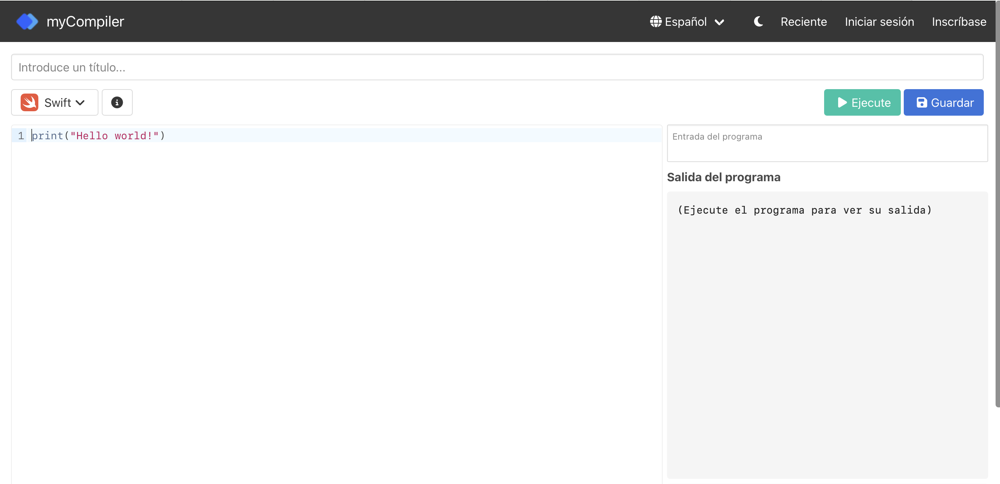

- [Swift Playground Online IDE Pro](https://www.onlineide.pro/playground/swift).

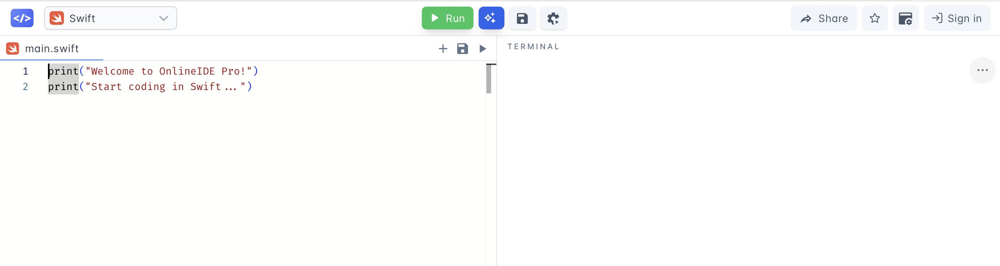

- [Online Swift Playground](https://online.swiftplayground.run/).

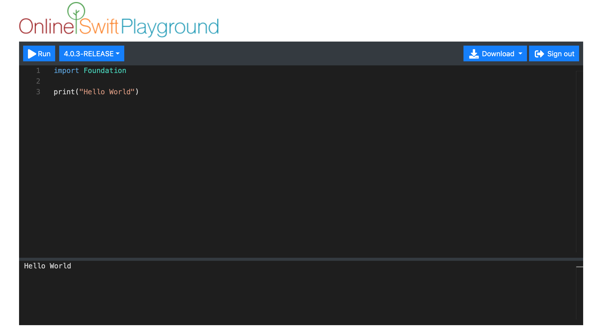

### Installation on Ubuntu Linux

Official Swift distributions are available for Linux 22.04 and 24.04.

Briefly, the installation steps are the following:

1. Confirm that the Linux installation packages are up to date:

    ```
    $ sudo apt-get update
    $ sudo apt-get upgrade
    ```

2. Install the dependencies listed on the [official Apple
website](https://www.swift.org/getting-started/#installing-swift)
using `apt-get install`. You will need superuser permissions to do
this: `sudo apt-get install`.

    !!! Danger "Warning"
        Depending on your Linux version, you will need to download
        different dependencies. Check carefully on Apple's page which
        exact `apt-get install` command you must run for your version.
        See the dependencies for your version on the [official Swift
        page](https://www.swift.org/install/linux/tarball/).

3. Download the desired version and platform
   (`swift-<VERSION>-<PLATFORM>.tar.gz`). For example, the following
   commands download Swift version 6.0.3 for the different Ubuntu
   distributions.

    - Ubuntu 22.04:

        ```
        $ wget https://download.swift.org/swift-6.0.3-release/ubuntu2204/swift-6.0.3-RELEASE/swift-6.0.3-RELEASE-ubuntu22.04.tar.gz
        ```

    - Ubuntu 24.04:

        ```
        $ wget https://download.swift.org/swift-6.0.3-release/ubuntu2404/swift-6.0.3-RELEASE/swift-6.0.3-RELEASE-ubuntu24.04.tar.gz
        ```

4. Extract the file:

    ```
    $ tar xzf swift-<VERSION>-<PLATFORM>.tar.gz
    ```

    This creates the `usr/` directory in the location of the archive.
    You can test whether the `swift` command works by moving to the
    `bin` directory and running:

    ```
    $ ./swift repl
    Welcome to Swift version 5.8
    Type :help for assistance.
    1> print("Hola mundo")
    Hola mundo
    2> :quit
    $
    ```

5. To run `swift` from any directory, you must update the `PATH` or
   move `usr/bin/swift` to the `/usr/bin` directory.

    ```
    $ export PATH=/path/to/usr/bin:"${PATH}"
    ```

### Installation on Windows ###

You can install our WSL distribution by downloading it from
[this link](https://drive.google.com/file/d/1yiQTEGQjRrxIorbrpU8pNCb0PTYQ0CJU/view?usp=sharing).

It is an exported tar copy of a WSL Ubuntu 24.04 distribution
prepared with Swift 6.0.3 already installed so that Swift can be run
directly. Before proceeding, check that WSL is installed and enabled
on your system with the following command in the Windows terminal
(PowerShell or CMD):

```
wsl --list --verbose
```

This command will show the Linux distributions installed and their
status.

!!! Note "If WSL is not installed"
    If you do not have WSL, you can enable it using PowerShell by
    running the following command as administrator:

    ```
    wsl --install
    ```

    This command installs the latest version of WSL. If WSL is already
    enabled, the command updates to WSL 2 if necessary and available.

    Alternatively, you can enable WSL through the Windows Control
    Panel:

    - Open the Control Panel.
    - Go to "Programs".
    - Click "Turn Windows features on or off".
    - Find "Windows Subsystem for Linux", check it, and click OK.

    After enabling WSL, you will be asked to restart your computer.

Steps to import our distribution:

1. Create a folder called `UbuntuLPP` on a drive with at least 8 GB
   of capacity.
2. Download the copy (`UbuntuLPP.tgz`) into that folder.
3. Open a command prompt window (`cmd.exe`) and move to that folder
   (`cd [path]\UbuntuLPP`).
4. Run the following command to import the distribution into WSL 2:

    ```
    wsl --import UbuntuLPP . UbuntuLPP.tgz
    ```

    When importing the distribution with the previous command, the name
    given to the distribution is `UbuntuLPP` (a different name could
    have been used), and the location where the virtual disk
    (`ext4.vhdx`) is unpacked is the directory where the command is
    executed (the `.` could have been replaced with a different path).
    Once the distribution has been imported, the tar file
    (`UbuntuLPP.tgz`) can be deleted.

    !!! Danger "Avoid storing the WSL disk in the cloud"
        Storing WSL virtual disk files in synchronization services such
        as OneDrive, Drive, or Dropbox can cause access conflicts and
        errors. To ensure proper operation, store them directly on your
        computer's hard drive in a local path.

The distribution was created with the user `swiftuser` as the default
user and administrator, with the password `su-LPP-UA` (in case you
need it, for example, to run `sudo`).

Naturally, you can also download WSL Ubuntu from the [Microsoft
Store](https://apps.microsoft.com/detail/9pdxgncfsczv?hl=en-us&gl=US)
(or use a distribution you already have installed) and then install
Swift on Ubuntu as explained in the previous section.

### Visual Studio Code ###

To edit Swift code, you can use any programming-oriented editor such
as Visual Studio Code (VSC) or Atom. We recommend [Visual Studio
Code](https://code.visualstudio.com).

Recent versions of Visual Studio Code include the [official Swift
plugin](https://marketplace.visualstudio.com/items?itemName=sswg.swift-lang),
which provides syntax highlighting and code completion.

To work more comfortably, we can open the integrated terminal:
**View > Integrated Terminal**. We can check that VSC can open a WSL
terminal where we can run the previously installed Swift.

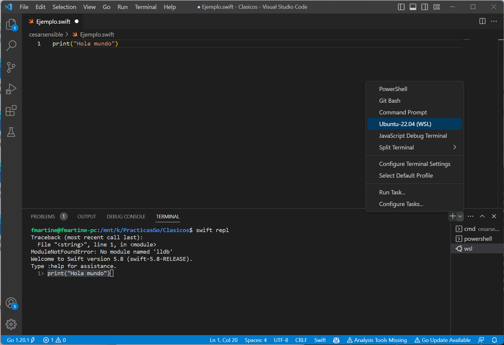

You can consult the basic Visual Studio Code concepts and the full
manual at [this link](https://code.visualstudio.com/docs).

### Execution on macOS ###

We can work in two ways: running Swift programs from the terminal or
from Xcode.

If you have a Mac, you can try both methods and choose whichever is
more convenient.

#### Running from the Terminal ####

We must install the _Xcode Command Line Tools_ with the following
command:

```
$ xcode-select --install
```

Once the tools are installed, we can run Swift programs from the
terminal interactively.

Open the terminal and type:

```text
$ swift repl
```

You will see that the Swift interpreter starts and allows you to
write and run Swift code:

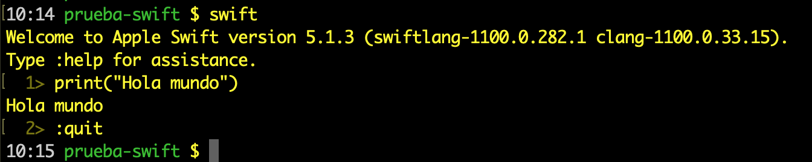

To edit a Swift program, you can use an editor such as _Visual Studio
Code_, as mentioned earlier, and then run it from the terminal.

```text
$ swift prueba.swift
Hola mundo
```

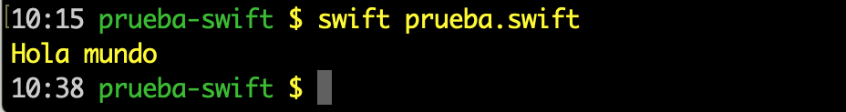

#### Running from Xcode ####

First, you must install Xcode from the Mac App Store.

Once Xcode is installed, you can run a Swift program in two ways:
compiling from the terminal or compiling in Xcode.

##### Compiling from the Terminal #####

In Xcode, you can create a new file using _File > New File..._ and
select the _macOS > Swift File_ template.

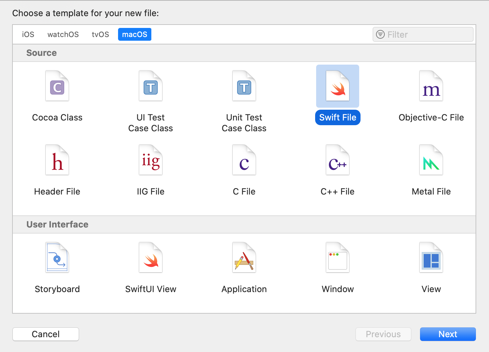

Select the folder and file name, and then you can write Swift code:

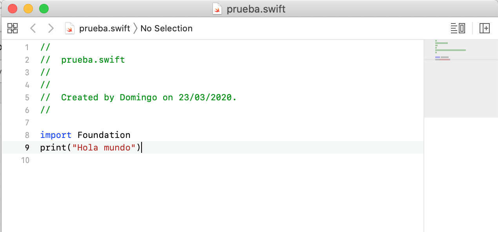

Once the program is saved, you can run it from the terminal:

```text
$ swift prueba.swift
Hola mundo
```


If there is any compilation error, it will be detected when launching
the command from the terminal.

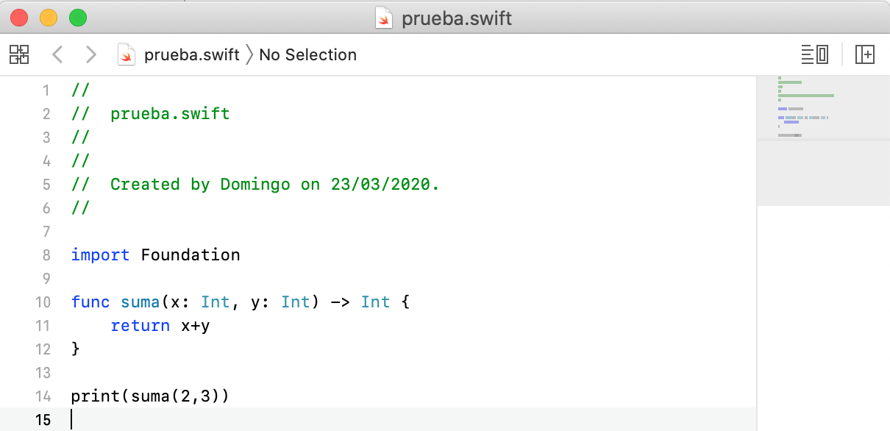

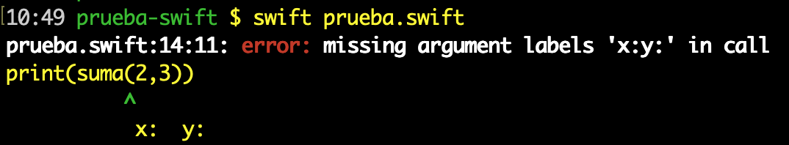

##### Compiling with Xcode #####

The other way to work is to create a Swift project from Xcode. It is
a bit more complex because it requires knowing a few more Xcode
commands, but it has the advantage that Xcode shows errors directly
in the editing window.

In Xcode, click _File > New Project..._ and select the
_macOS > Command Line Tool_ template.

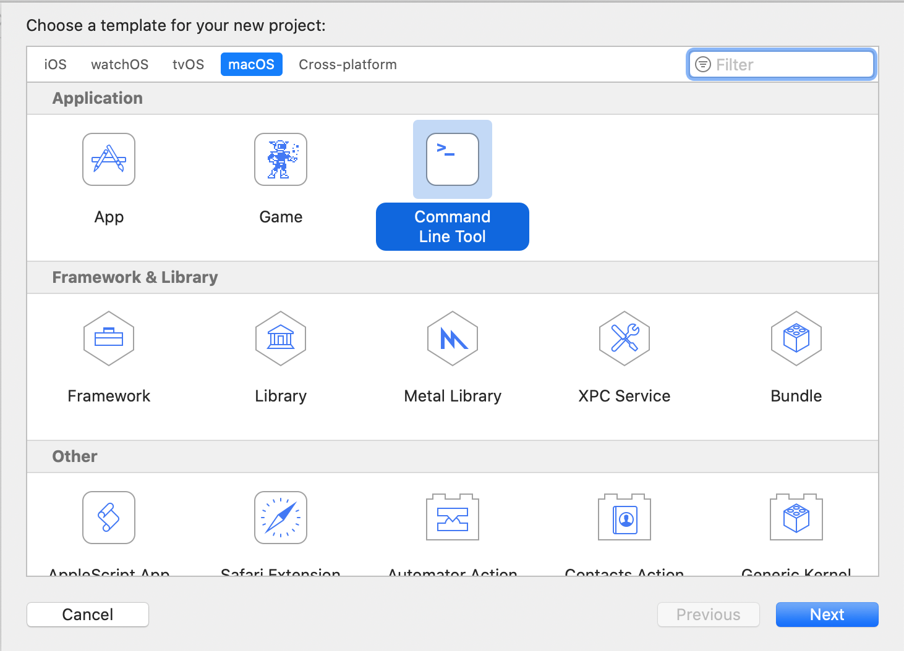

You can choose any name you want, for example `prueba-swift`.

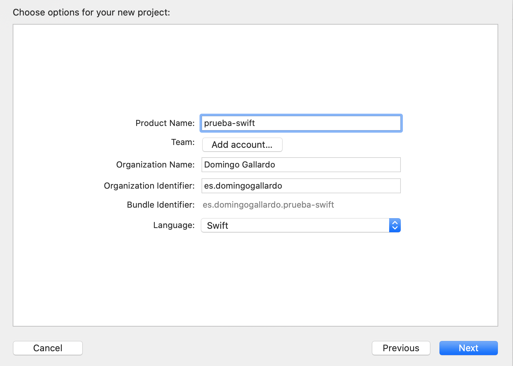

Select the location on disk where the project will be saved and you
can start working with it. The main file is called `main.swift`.
Pressing _Run_ compiles the project and opens a panel showing the
output:

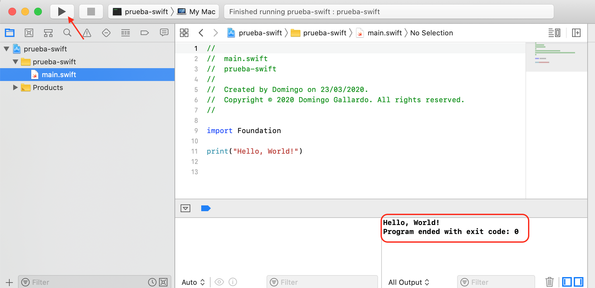

If there is any compilation error, it is detected while writing the
code and shown in the editor itself:

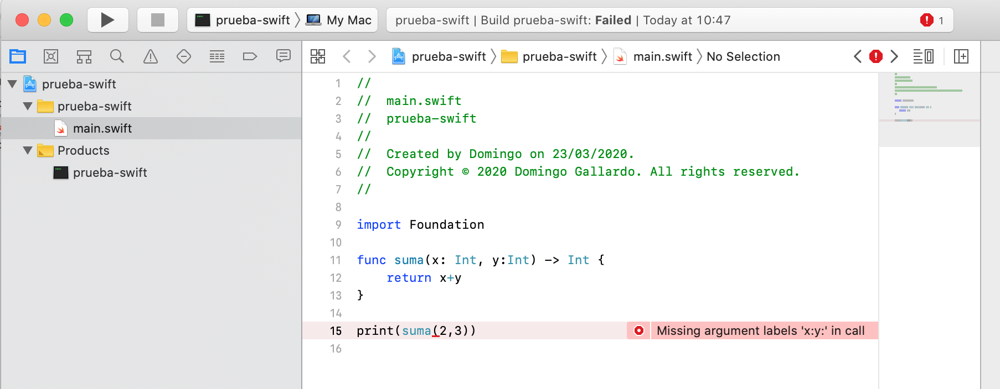

## A Swift Tour

!!! Note "Note"
    The text of this seminar is a translation of Apple's document
    [A Swift Tour](https://docs.swift.org/swift-book/GuidedTour/GuidedTour.html),
    which presents a quick introduction to the fundamental concepts of
    the language. In later course topics we will study aspects such as
    functions, generics, classes, or protocols in more depth.

Tradition suggests that the first program in a new language should
print the words "Hello, world!" on the screen. In Swift, this can be
done with a single line:

```swift
print("Hola, mundo!")
```

If you have written code in C or Objective-C, this syntax will look
familiar. In Swift, this line of code is a complete program. You do
not need to import a separate library for features such as input,
output, or string handling. Code written at global scope is used as
the entry point of the program, so you do not need a `main()`
function. You also do not have to write semicolons at the end of
every statement. You can comment lines of code in the same way as in
C.

```swift
//
// This is a comment
//

/*
   And this is also a comment
*/
```

This tour gives you enough information to start writing code in Swift
by showing how to achieve a variety of programming tasks. Full
information about all Swift language elements can be found in the
[Swift Guide](https://docs.swift.org/swift-book/LanguageGuide/TheBasics.html).

#### Simple Values

Use `let` to create a constant and `var` to create a variable. The
value of a constant does not need to be known at compile time, but
you must assign it a value exactly once. This means that you can use
constants to name a value that you determine once and then use in
many places.

```swift
var miVariable = 42
miVariable = 50
let miConstante = 42
```

A constant or variable must have the same type as the value you want
to assign to it. However, you do not always have to write the type
explicitly. When a value is provided when creating a constant or
variable, the compiler infers its type. In the previous example, the
compiler infers that `myVariable` is an integer because its initial
value is an integer.

If the initial value does not provide enough information, or if there
is no initial value, specify the type by writing it after the
variable, separated by a colon.

```swift
let implicitoInteger = 70
let implicitoDouble = 70.0
let explicitoDouble: Double = 70
```

!!! Note "Note"
    Throughout the seminar, small exercises are proposed that you
    should do yourself to practice the language a bit more. You will
    find them in the blocks headed with "Experiment".

!!! Example "Experiment 1"
    Create a constant with the explicit type `Float` and the value `4`.

Values are never implicitly converted to another type. If you need to
convert a value to a different type, explicitly construct an instance
of the desired type.

```swift
let etiqueta = "El ancho es "
let ancho = 94
let anchoEtiqueta = etiqueta + String(ancho)
```

!!! Example "Experiment 2"
    Try removing the conversion to `String` in the last line. What
    error do you get? Include it translated in the code using a
    comment.

There is an even simpler way to include values in strings: write the
value inside parentheses and put a backslash (`\`) before the
parentheses. For example:

```swift
let manzanas = 3
let naranjas = 5
let resumenManzanas = "Tengo \(manzanas) manzanas."
let resumenFrutas = "Tengo \(manzanas + naranjas) frutas."
```

!!! Example "Experiment 3"
    Use `\()` to print a string containing a floating-point
    calculation and, in another statement, to print a string that
    includes someone's name in a greeting.

Create arrays and dictionaries using square brackets (`[]`), and
access their elements by writing the index or key inside the brackets.
A trailing comma after the last element is allowed.

```swift
var listaCompra = ["huevos", "agua", "tomates", "pan"]
listaCompra[1] = "botella de agua"

var trabajos = [
    "Malcolm": "Capitán",
    "Kaylee": "Mecánico",
]
trabajos["Jayne"] = "Relaciones públicas"
```

To create an empty array or dictionary, use the initialization syntax.

```swift
let arrayVacio = [String]()
let diccionarioVacio = [String: Float]()
```

If the type information can be inferred, you can write an empty array
as `[]` and an empty dictionary as `[:]`; for example, when setting a
new value for a variable or passing an argument to a function.

```swift
listaCompra = []
trabajos = [:]
```

You can find more information about working with arrays in the
corresponding section of the [Swift
Guide](https://docs.swift.org/swift-book/LanguageGuide/CollectionTypes.html).

#### Tuples

A tuple groups several values into a single compound value.

```swift
let http404Error = (404, "Not Found")
```

The type of the tuple is `(Int, String)`.

To get the values from the tuple, we can _decompose_ it. If we want
to ignore one part, we can use an underscore (`_`).

```swift
let (statusCode, statusMensaje) = http404Error
let (soloStatusCode, _) = http404Error
```

We can also access them by position:

```swift
print("El código de estado es \(http404Error.0)")
```

#### Flow Control

Use `if` and `switch` to make conditionals, and use `for-in`, `for`,
`while`, and `repeat-while` to create loops. Parentheses around
conditions or loop variables are optional. Braces are required around
the body.

```swift
let puntuacionesIndividuales = [75, 43, 103, 87, 12]
var puntuacionEquipo = 0
for puntuacion in puntuacionesIndividuales {
    if puntuacion > 50 {
        puntuacionEquipo += 3
    } else {
        puntuacionEquipo += 1
    }
}
print(puntuacionEquipo)
```

In an `if` statement, the condition must be a boolean expression.
This means code such as `if puntuacion { ... }` is an error, not an
implicit comparison against zero as allowed in C.

You can use `if` and `let` together to work with values that may be
missing. These values are represented as optionals. An optional value
either contains a value or contains `nil` to indicate that the value
is missing. Write a question mark (`?`) after the type of a value to
mark it as optional.

```swift
var cadenaOpcional: String? = "Hola"
print(cadenaOpcional == nil)

var nombreOpcional: String? = "John Appleseed"
var saludo = "Hola!"
if let nombre = nombreOpcional {
    saludo = "Hola, \(nombre)"
}
print(saludo)
```

!!! Example "Experiment 4"
    Change `nombreOpcional` to `nil`. What greeting do you get? Add an
    `else` clause that sets a different greeting if `nombreOpcional` is
    `nil`.

If the optional value is `nil`, the condition is `false` and the code
inside the braces is skipped. Otherwise, the optional value is
_unwrapped_ and assigned to the constant after `let`, which makes the
unwrapped value available inside the code block.

Another way to handle optional values is to provide a default value
using the `??` operator. If the optional value is missing, the
default value is used instead.

```swift
let nombrePila: String? = nil
let nombreCompleto: String = "John Appleseed"
let saludoInformal = "¿Qué tal, \(nombrePila ?? nombreCompleto)?"
```

`switch` statements support any kind of data and a wide variety of
comparison operations; they are not limited to integers and equality
tests.

```swift
let verdura = "pimiento rojo"
switch verdura {
    case "zanahoria":
        print("Buena para la vista.")
    case "lechuga", "tomates":
        print("Podrías hacer una buena ensalada.")
    default:
        print("Siempre puedes hacer una buena sopa.")
}
```

!!! Example "Experiment 5"
    Try removing the default case. What error do you get?

After executing the code inside the matching case, the program exits
the `switch` statement. Execution does not continue with the next
case, so there is no need to break out of the `switch` at the end of
each case.

Use `for-in` to iterate over items in a dictionary by providing a
pair of names to use for each key-value pair. Dictionaries are
unordered collections, so their keys and values are iterated in an
arbitrary order.

```swift
let numerosInteresantes = [
    "Primos": [2, 3, 5, 7, 11, 13],
    "Fibonacci": [1, 1, 2, 3, 5, 8],
    "Cuadrados": [1, 4, 9, 16, 25],
]
var mayor = 0
for (clase, numeros) in numerosInteresantes {
    for num in numeros {
        if num > mayor {
            mayor = num
        }
    }
}
print(mayor)
```

!!! Example "Experiment 6"
    Add another variable to track which class of number is the
    largest.

Use `while` to repeat a block of code until a condition changes. A
loop condition can also be at the end, ensuring that the loop runs at
least once.

```swift
var n = 2
while n < 100 {
    n *= 2
}
print(n)

var m = 2
repeat {
    m *=  2
} while m < 100
print(m)
```

You can define an index in a loop using `..<` to build a range of
indexes.

```swift
var total = 0
for i in 0..<4 {
    total += i
}
print(total)
```

Use `..<` to build a range that omits its upper value, and use `...`
to build a range that includes both values.

#### Functions and Closures

Use `func` to declare a function. Use `->` to separate the parameter
names and types from the return type of the function.

```swift
func saluda(nombre: String, dia: String) -> String {
    return "Hola \(nombre), hoy es \(dia)."
}
print(saluda(nombre: "Bob", dia: "Martes"))
```

!!! Example "Experiment 7"
    Remove the day parameter. Add a parameter to include today's meal
    in the greeting.

By default, functions use the parameter names as argument labels. It
is possible to define a label by writing it before the parameter
name, or to use no label by writing `_`:

```swift
func saluda(_ nombre: String, el dia: String) -> String {
    return "Hola \(nombre), hoy es \(dia)."
}
print(saluda("Bob", el: "Martes"))
```

Functions can return any type of data, such as tuples.

```swift
func calculaEstadisticas(puntuaciones: [Int]) ->
                        (min: Int, max: Int, sum: Int) {
    var min = puntuaciones[0]
    var max = puntuaciones[0]
    var sum = 0

    for puntuacion in puntuaciones {
        if puntuacion > max {
            max = puntuacion
        } else if puntuacion < min {
            min = puntuacion
        }
        sum += puntuacion
    }

    return (min, max, sum)
}
let estadisticas = calculaEstadisticas(puntuaciones: [5, 3, 100, 3, 9])
print(estadisticas.sum)
print(estadisticas.2)
```

Functions can also have a variable number of arguments, grouping all
of them into an array.

```swift
func suma(numeros: Int...) -> Int {
    var suma = 0
    for num in numeros {
        suma += num
    }
    return suma
}
print(suma())
print(suma(numeros: 42, 597, 12))
```

!!! Example "Experiment 8"
    Write a function that computes the mean of its arguments.

Functions can be nested. Nested functions can access variables
declared in the outer function. You can use nested functions to
organize code inside a function that is long or complicated.

```swift
func devuelveQuince() -> Int {
    var y = 10
    func suma() {
        y += 5
    }
    suma()
    return y
}
print(devuelveQuince())
```

Functions are a first-class type. This means that a function can
return another function as its result.

```swift
func construyeIncrementador() -> ((Int) -> Int) {
    func sumaUno(numero: Int) -> Int {
        return 1 + numero
    }
    return sumaUno
}
var incrementa = construyeIncrementador()
print(incrementa(7))
```

We can modify the `devuelveQuince` example so that it returns a
modified version of the `suma` function. We call that function
`devuelveSuma`.

```swift
func devuelveSuma() -> (() -> Int) {
    var y = 10
    func suma() -> Int {
        y += 5
        return y
    }
    return suma
}

let f = devuelveSuma()
print(f())
print(f())
```

A function can take another function as one of its arguments.

```swift
func cumpleCondicion(lista: [Int], condicion: (Int) -> Bool) -> Bool {
    for item in lista {
        if condicion(item) {
            return true
        }
    }
    return false
}
func menorQueDiez(numero: Int) -> Bool {
    return numero < 10
}
var numeros = [20, 19, 7, 12]
print(cumpleCondicion(lista: numeros, condicion: menorQueDiez))
```

Functions are actually a special case of closures: blocks of code
that can be called later. Code in a closure has access to things such
as variables and functions that were available in the scope where the
closure was created, even if the closure is in a different scope when
it runs. You already saw an example of this with nested functions.
You can write a closure by surrounding code with braces (`{}`). Use
`in` to separate the arguments from the body.

```swift
numeros.map({
    (numero: Int) -> Int in
    let resultado = 3 * numero
    return resultado
})
```

!!! Example "Experiment 9"
    Rewrite the closure so that it returns zero for all odd numbers.

You have quite a few options for writing closures more concisely.
When the type of a closure is already known, you can omit the type of
its parameters, the return type, or both. Closures written as a
single statement implicitly return the value of that statement.

```swift
let numerosMapeados = numeros.map({ numero in 3 * numero })
print(numerosMapeados)
```

You can refer to parameters by number instead of by name; this
approach is especially useful in very short closures. A closure
passed as the last argument can appear immediately after the
parentheses. When a closure is the only argument to a function, you
can omit the parentheses entirely.

```swift
let numerosOrdenados = numeros.sorted { $0 > $1 }
print(numerosOrdenados)
```

#### Objects and Classes

Use `class` followed by the class name to create a class. A property
declaration in a class is written the same way as a constant or
variable declaration, except that it is in the context of a class. In
the same way, method declarations are written the same way as
functions.

```swift
class Figura {
    var numeroDeLados = 0
    func descripcionSencilla() -> String {
        return "Una figura con \(numeroDeLados) lados."
    }
}
```

!!! Example "Experiment 10"
    Add a constant property with `let`, and add another method that
    takes an argument.

Create an instance of a class by putting parentheses after the class
name. Use dot syntax to access the properties and methods of the
instance.

```swift
var figura = Figura()
figura.numeroDeLados = 7
var descripcionFigura = figura.descripcionSencilla()
```

This version of the `Figura` class is missing something important: an
initializer to set up the class when an instance is created. Use
`init` to create one.

```swift
class FiguraConNombre {
    var numeroDeLados: Int = 0
    var nombre: String

    init(nombre: String) {
        self.nombre = nombre
    }

    func descripcionSencilla() -> String {
        return "Una figura con \(numeroDeLados) lados."
    }
}
```

Notice how `self` is used to distinguish the `nombre` property from
the `nombre` initializer argument. Arguments to the initializer are
passed as in a function call when you create an instance of the
class. Every property needs an assigned value, either in its
declaration (such as `numeroDeLados`) or in the initializer (such as
`nombre`).

Subclasses include their superclass name after the subclass name,
separated by a colon. There is no requirement that classes must be
subclasses of some root class, so you can omit a superclass if
needed.

Methods in a subclass that override the superclass implementation are
marked with `override`; accidentally overriding a method without
`override` is detected by the compiler as an error. The compiler also
detects methods marked with `override` that do not actually override
any method in the superclass.

```swift
class Cuadrado: FiguraConNombre {
    var longitudLado: Double

    init(longitudLado: Double, nombre: String) {
        self.longitudLado = longitudLado
        super.init(nombre: nombre)
        numeroDeLados = 4
    }

    func area() ->  Double {
        return longitudLado * longitudLado
    }

    override func descripcionSencilla() -> String {
        return "Un cuadrado con lados de longitud \(longitudLado)."
    }
}
let test = Cuadrado(longitudLado: 5.2, nombre: "Mi cuadrado de prueba")
print(test.area())
print(test.descripcionSencilla())
```

!!! Example "Experiment 11"
    Build another subclass of `FiguraConNombre` called `Circulo` that
    takes a radius and a name as arguments to its initializer.
    Implement an `area()` method and `descripcionSencilla()` in the
    `Circulo` class.

In addition to simple stored properties, properties can have a
*getter* and a *setter*.

```swift
class TrianguloEquilatero: FiguraConNombre {
    var longitudLado: Double = 0.0

    init(longitudLado: Double, nombre: String) {
        self.longitudLado = longitudLado
        super.init(nombre: nombre)
        numeroDeLados = 3
    }

    var perimetro: Double {
        get {
            return 3.0 * longitudLado
        }
        set {
            longitudLado = newValue / 3.0
        }
    }

    override func descripcionSencilla() -> String {
        return "Un triangulo equilátero con lados de longitud \(longitudLado)."
    }
}
var triangulo = TrianguloEquilatero(longitudLado: 3.1, nombre: "un triángulo")
print(triangulo.perimetro)
triangulo.perimetro = 9.9
print(triangulo.longitudLado)
```

In the `perimetro` setter, the new value has the implicit name
`newValue`. You can provide an explicit name in parentheses after
`set`.

Note that the initializer of the `TrianguloEquilatero` class has
three distinct steps:

1. Set the value of the properties declared by the subclass.
2. Call the superclass initializer.
3. Change the value of the properties defined by the superclass. Any
   additional work that uses methods, getters, or setters can also be
   done at this point.

#### Enumerations and Structures

Use `enum` to create an enumeration. Like classes and other named
types, enumerations can have associated methods.

```swift
enum Valor: Int {
    case uno = 1
    case dos, tres, cuatro, cinco, seis, siete, ocho, nueve, diez
    case sota, caballo, rey
    func descripcionSencilla() -> String {
        switch self {
        case .uno:
            return "as"
        case .sota:
            return "sota"
        case .caballo:
            return "caballo"
        case .rey:
            return "rey"
        default:
            return String(self.rawValue)
        }
    }
}
let carta = Valor.uno
let valorBrutoCarta = carta.rawValue
```

!!! Example "Experiment 12"
    Write a function that compares two `Valor` values by comparing
    their raw values.

By default, Swift assigns raw values starting at zero and increasing
them by one each time, but you can change this behavior by
explicitly specifying the values. In the previous example, `As` is
given a raw value of `1` and the rest are assigned in order. You can
also use strings or floating-point numbers as enumeration raw values.
Use the `rawValue` property to access the raw value of an
enumeration.

Use the initializer to construct an enumeration value from a raw
value. If the raw value does not exist, the initializer will return
`nil`.

```swift
if let valorConvertido = Valor(rawValue: 3) {
    let descripcionTres = valorConvertido.descripcionSencilla()
    print(descripcionTres)
}
```

Enumeration case values are actual values, not just another way of
writing their raw values. In fact, in cases where a raw value does
not make sense, you do not have to provide one.

```swift
enum Palo {
    case oros, bastos, copas, espadas
    func descripcionSencilla() -> String {
        switch self {
        case .oros:
            return "oros"
        case .bastos:
            return "bastos"
        case .copas:
            return "copas"
        case .espadas:
            return "espadas"
        }
    }
}
let copas = Palo.copas
let descripcionCopas = copas.descripcionSencilla()
```

!!! Example "Experiment 13"
    Add a `color()` method to `Palo` that returns "aggressive" for
    *bastos* and *espadas*, and "reflective" for *oros* and *copas*.

Notice the two ways in which we refer to the `copas` case of the
previous enumeration: when assigning a value to the constant `copas`,
we refer to the enumeration case as `Palo.copas` using its full name
because the constant does not have an explicitly specified type.
Inside the `switch`, we refer to the enumeration case using the
shortened form `.copas` because the type of `self` is already known
to be `Palo`. You can use the shortened form whenever the type of the
value is already known.

An instance of an enumeration case can have values associated with
that instance. Instances of the same enumeration case can have
different associated values. You provide the associated values when
creating the instance. Associated values and raw values are
different: the raw value of an enumeration case is the same for all
instances, whereas you provide the associated value when defining the
enumeration.

For example, consider the case of making a request to a server for
the sunrise and sunset times. The server responds with the
information, or with some error information.

```swift
enum RespuestaServidor {
    case resultado(String, String)
    case error(String)
}

let exito = RespuestaServidor.resultado("6:00 am", "8:09 pm")
let fallo = RespuestaServidor.error("Sin queso.")

switch exito {
    case let .resultado(salidaSol, puestaSol):
        print("La salida del sol es a las \(salidaSol) y la puesta es a \(puestaSol).")
    case let .error(error):
        print("Fallo...  \(error)")
}
```

!!! Example "Experiment 14"
    Add a third case to `RespuestaServidor` and to the switch.

Notice how the sunrise and sunset times are extracted from the
`RespuestaServidor` enumeration as part of the matching between the
value and the switch cases.

Use `struct` to create a structure. Structures share many features
with classes, including methods and initializers. One of the most
important differences between structures and classes is that
structures are always copied when you pass them around in your code,
whereas classes are passed by reference.

```swift
struct Carta {
    var valor: Valor
    var palo: Palo
    func descripcionSencilla() -> String {
        return "El \(valor.descripcionSencilla()) de \(palo.descripcionSencilla())"
    }
}
let tresDeEspadas = Carta(valor: .tres, palo: .espadas)
let descripcionTresDeEspadas = tresDeEspadas.descripcionSencilla()
```

!!! Example "Experiment 15"
    Add a method to `Carta` that creates a full deck, with one card
    for each combination of value and suit.

## Bibliography and References

- Documentation about Swift
  - [The Swift Programming Language (html)](https://developer.apple.com/library/prerelease/content/documentation/Swift/Conceptual/Swift_Programming_Language/index.html)
  - [Swift resources on Apple](https://developer.apple.com/swift/resources/)
  - [swift.org](https://swift.org)
- Swift Open Source
  - [The `swift` repository on GitHub](https://github.com/apple/swift): main Swift repository containing the Swift compiler source code, the standard library, and SourceKit.
  - [The `swift-evolution` repository on GitHub](https://github.com/apple/swift-evolution): documents related to the continuous evolution of Swift, including goals for upcoming versions and proposals for Swift changes and extensions.

----

Programming Languages and Paradigms, academic year 2025-26
© Department of Computer Science and Artificial Intelligence, University of Alicante
Domingo Gallardo, Cristina Pomares, Antonio Botía, Francisco Martínez
