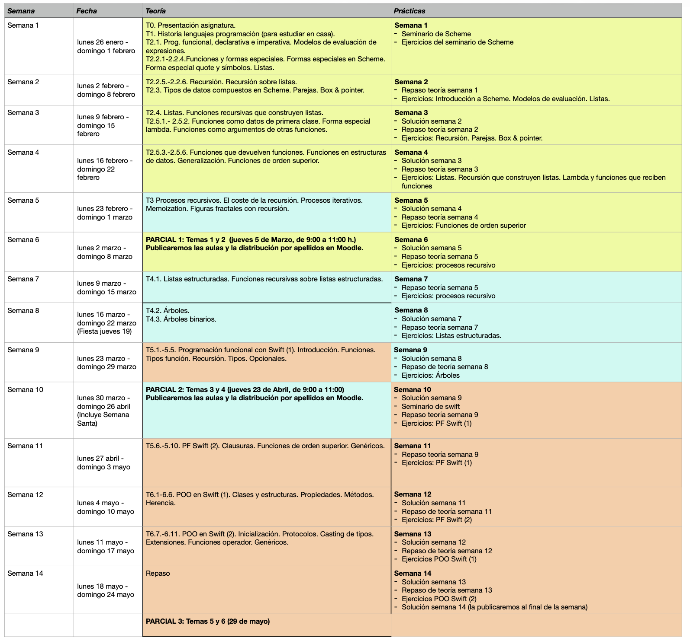
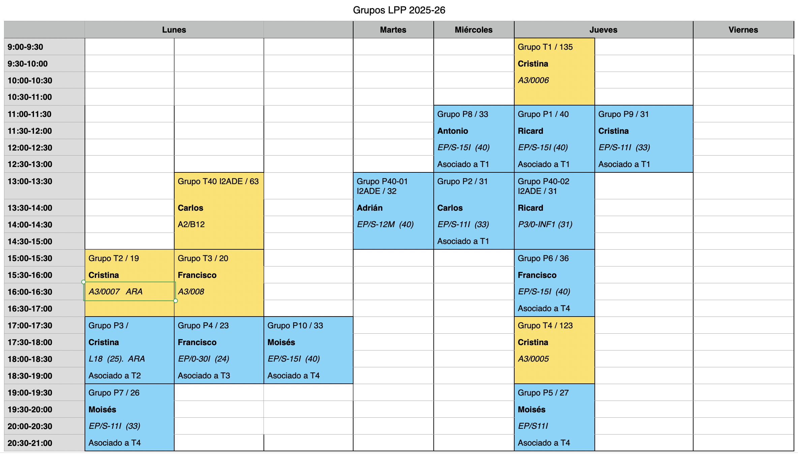

# Programming Languages and Paradigms

## 1. Course Academic Information

**Department of Computer Science and Artificial Intelligence**  
**6 ECTS credits**: 1 theory class of 2 hours and 1 lab class of 2
hours per week  
**Lecturers**:

* Antonio Botía
* Carlos Cano
* Ricard Gasa
* Adrián González
* Francisco Martínez
* Moisés Moreno
* Cristina Pomares (Coordinator)

## 2. Course Resources

* [Course description](https://cvnet.cpd.ua.es/Guia-Docente/GuiaDocente/Index?wlengua=es&wcodasi=34017&scaca=2025-26)
* [Course notes (theory, seminars, and labs)](https://domingogallardo.github.io/apuntes-lpp/)
* [Moodle site](https://moodle2025-26.ua.es/moodle/course/view.php?id=8244)
  open and accessible to the entire educational community; it
  contains the notes, slides, labs, and other teaching materials.
* [Questions and announcements forum](https://moodle2025-26.ua.es/moodle/mod/forum/view.php?id=120943)
  on the Moodle site.

## 3. Objectives and Skills

**Objectives**:

* What elements are common to programming languages?
* What language families or paradigms can we identify?
* What is functional programming?
* What is a multi-paradigm language that combines functional
  programming and object-oriented programming like?

By mastering these contents, it will be much easier to learn new
programming languages, identify their essential aspects, and even be
able to design specific languages oriented toward particular domains.

**Skills**:

* Know and differentiate the characteristics of the different
  programming paradigms (functional, procedural, and object-oriented
  programming) and identify them in specific programming languages.
* Differentiate between runtime and compile time in different
  contexts: error detection or the definition, creation, or lifetime
  of variables.
* Know the basic principles of functional programming: recursion,
  immutability, functions as first-class objects, higher-order
  functions, lambda expressions (closures).
* Know the problems derived from using mutation in imperative
  programming languages and the way to work with immutable structures
  in declarative and functional languages.
* Use abstraction and recursion to correctly design procedures and
  data structures (lists and trees).
* Be able to design, implement, and debug functional programs,
  specifically using the Scheme programming language.
* Be able to design, implement, and debug functional programs,
  specifically using the Swift programming language.
* Know the object-oriented programming and static type checking
  features of the Swift programming language. Know the use of
  generics and protocols provided by the language.
* Be able to implement Swift programs that use its object-oriented
  programming features, generics, and protocols.

## 4. Syllabus

### 4.1. Topic Blocks ###

The course is divided into 3 topic blocks, all of equal duration, in
which the programming language shown in parentheses will be used:

1. Functional programming (Scheme): topics 1 and 2
2. Recursive processes and structures (Scheme): topics 3 and 4
3. Functional programming in Swift and object-oriented programming
   (Swift): topics 5 and 6

The programming languages will be introduced through seminars taught
in the lab classes.

* Seminar 1. **The Scheme programming language**:
  Primitives. Basic data types.
  Symbols. Strings. Lists. Function definition.
* Seminar 2. **The Swift programming language**. Interpreter and
  scripts. Basic data types. Operators. Control
  structures. Variable scope. Compound data types: tuples,
  arrays, and collections. Traversing collections. Mutable and
  immutable values. Initialization. Reference and value types in
  Swift.

### 4.2. Topics ###

* Topic 1. **Programming languages**: History of programming
  languages. Elements of programming languages.
  Abstraction. Programming paradigms. Compilers
  and interpreters.
* Topic 2. **Functional Programming**: Characteristics and history of
  the Functional Programming paradigm. Differences with the
  imperative paradigm. Declarative characteristics
  of the functional paradigm. Function definition. Functions as
  first-order data. The lambda special form. Variable scope
  and closures. Compound data in Scheme: pairs. Construction,
  traversal, and operations on lists. Lists with compound elements.
  Lists of lists.
* Topic 3. **Recursive procedures**: Design of
  recursive functions. Mutual recursion. Recursive and
  iterative processes. Memoization. Recursion and turtle graphics.
* Topic 4. **Recursive structures**: Recursive data structures:
  structured lists and trees.
* Topic 5. **Functional programming in Swift**: Multi-paradigm
  languages. Functional programming in Swift. Optional
  values. Lists. Pure recursion and tail
  recursion. Functions as first-order data. Closures and anonymous
  functions. Higher-order functions: collection mappings and filters.
* Topic 6. **Object-Oriented Programming in Swift**: Characteristics and
  history of the Object-Oriented Programming
  paradigm. Structures and classes in Swift. Inheritance. Advanced
  OOP concepts in Swift: Extensions, Protocols, and
  Generics.

The calendar of topics, labs, and exams can be seen in the following
figure.

## 5. Labs

Labs are fundamental in the course and are intended to understand,
work on, and deepen the concepts and skills studied in the theory
classes.

For the development of the labs, we will use the following
programming languages and development environments:

* [Racket](http://racket-lang.org/) (a version of Scheme, a functional
  programming language)
* [Swift](https://swift.org) (a multi-paradigm language created by
  Apple, with modern concepts of functional programming and
  object-oriented programming)

Each week you will have to complete a **worksheet** including 5 or 6
small programming problems related to the theory covered the previous
week.

The worksheet will be available at the beginning of the week, and you
will have the whole week to complete it. Once the lab has been
submitted, you will be able to access its solution.

!!! Danger "Review the lab solution"
    It is very important that you review the lab solution and compare
    it with the solution you obtained. Ask your lab lecturer if you
    have any questions about whether your solution is correct.

During the lab class, questions about the previous lab solution will
be answered, and work will be done on the worksheet published that
week. During the lab session, the lecturer will be available to
answer questions and provide hints on how to approach the problems.

Questions that may arise during the week can also be discussed in the
course forum (on Moodle) and in office hours with the lecturers. The
forum is preferable, because in that way the answers and
clarifications will be shared with the rest of your classmates.

## 6. Timetables

The distribution of groups for the 2025-26 academic year is as
follows:

In theory sessions, it is exceptionally possible to attend a group
other than the one assigned.

In lab sessions, you must attend the group to which you have been
assigned. Any change of group must be requested from the EPS
administration office.

## 7. Assessment

### 7.1. Ordinary Session C3 (Continuous Assessment)

The course is divided into 3 topic blocks, all of equal duration, in
which the programming language shown in parentheses will be used:

- Functional programming (topics 1 and 2, Scheme)
- Recursion and recursive data structures (topics 3 and 4, Scheme)
- Functional programming in Swift and object-oriented programming
  (topics 5 and 6, Swift)

There will be three written midterm exams on the concepts of each of
the topic blocks (theory and lab). The midterms will have the
following weighting in the final grade:

- Midterm 1: 35%
- Midterm 2: 30%
- Midterm 3: 35%

No minimum grade is required in any of the midterms. Midterms 1 and 2
will take place during the semester. Midterm 3 will take place on the
official exam date of the ordinary session for the course.

!!! Danger "About mobile devices"
    During exams, you are not allowed to have any device with internet
    access on you (smartphones, smart watches, tablets, etc.). Before
    the test begins, they must be left inside backpacks, and the
    backpacks must be placed on the floor. Failure to comply with this
    rule invalidates the test and results in a grade of 0.

### 7.2. Extraordinary Session C4

In the extraordinary session, there will be a final exam on all topic
blocks, and its grade will represent 100% of the course grade.

## 8. Advice for Successfully Learning the Course Contents

The fundamental advice for passing the course is **to work every week
and try to keep up with the pace of the course**. The course concepts
are built progressively, and what is seen in one week often depends
on what was learned in previous weeks.

How should these concepts be studied? With the exception of some
specific topics and sections (such as the history of programming
languages or the characteristics of different paradigms), the course
is mainly practical. When we talk about *studying* code examples, we
mean **understanding them, not memorizing them**. It makes no sense to
memorize the exercises and examples seen in class. You have to *work
through* them. That means, first, understanding them on paper and,
*very importantly*, **trying all the examples in the interpreter**.
And *trying* means writing the examples and playing with them,
proposing small variants, asking yourself *what would happen if...?*
and testing it.

Regarding the labs and the proposed exercises, it is essential to
struggle with them and try to solve them yourself **without looking at
any solution**. It is the only way to learn: by trying, making
mistakes, and finding the solution yourself.

When facing a problem, it is also essential to **use pencil and
paper** to try approaches and find the simplest solution on paper
before trying it in the interpreter. The exercises we propose are not
excessively complicated. All of them are solved with very few lines
of code, and coding them on the computer is not difficult once the
solution has been found. By using pencil and paper, you will also be
practicing a situation similar to the one you will face in the course
exams.

In short: work every week, do all the exercises yourself, and do not
get discouraged or fall behind.

Some comments from former students who passed the course are very
interesting.

!!! quote "How to master the concepts"
    To pass the course, what I did was study a lot. You have to
    practice and, above all, understand the exercises rather than know
    them by heart. Once I had mastered the exercises, I proposed my
    own variants of them. That is how you really master it.

!!! quote "The problem of changing paradigm"
    The main challenge of the course is facing a change in the
    programming paradigm.

!!! quote "Working day by day"
    What I did was try to keep the whole course up to date, in
    addition to working with additional material in order to broaden
    and deepen my knowledge. LPP is a long-distance course where you
    have to maintain the work pace from the beginning to the end of
    the semester.

!!! quote "Do not copy the labs"
    The biggest problem, I think, is that many people relax and copy
    the labs as soon as they become a bit difficult or take more time
    than they would like. If you do not do the exercises yourself and
    struggle with them, this course is practically impossible to pass.

!!! quote "Do not memorize"
    Another thing is that you have to change the way you study.
    Memorizing is not enough, nor is doing many exercises without more.
    You have to understand recursion really well before practicing
    with exercises; otherwise it does not work. [...] In my opinion,
    the problem of LPP for many people is that for the exams they
    memorize the lab exercises from the solutions given in class.

!!! quote "Set yourself problems"
    The problems I encountered when taking LPP were that they were two
    completely new languages, another type of programming I had never
    seen before, and a different way of studying. To pass it, you
    simply have to do exercises and also set yourself new exercises.

## 9. Bibliography

The course notes are published on Moodle, with exercises,
explanations, and examples of all the concepts studied, both in
theory and in practice.

To expand on some concepts, the following references are recommended:

- Harold Abelson and Gerald Jay Sussman, *Structure and Interpretation of Computer Programs*, MIT Press, 1996
    - [Link to the online edition](http://mitpress.mit.edu/sites/default/files/sicp/full-text/book/book.html)
    - Call number at the Polytechnic Library: I.06/ABE/STR
- Apple, [_The Swift Programming Language_](https://developer.apple.com/library/ios/documentation/Swift/Conceptual/Swift_Programming_Language/)
- [_The Racket Guide_](https://docs.racket-lang.org/guide/index.html)

----

Programming Languages and Paradigms, academic year 2025-26  
© Department of Computer Science and Artificial Intelligence, University of Alicante  
Domingo Gallardo, Cristina Pomares, Antonio Botía, Francisco Martínez
