# Topic 1: History and Concepts of Programming Languages

## 1. History of Programming Languages

### 1.1. From Calculating Machines to Programmable Computers ###

<table>
  <tr>
     <td>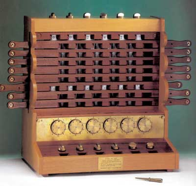</td>
     <td>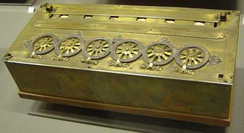<br/>
         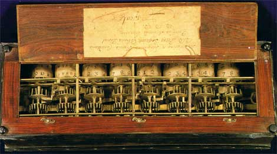</td>
  </tr>
  <tr>
     <td align="center">Schickard's machine (1623)</td>
     <td align="center">Pascal's calculator (1650)</td>
  </tr>
</table>

From the [first mechanical
calculators](https://github.com/domingogallardo/historia-computadores#1)
designed in the 17th century to the 1940s, many mechanical, analog,
and electronic machines and computers were invented in an attempt to
speed up calculations and improve their precision.

The culmination of all mechanical approaches to computation was the
famous **Analytical Engine** designed by **Charles Babbage** in 1840.
The fundamental difference from all previous artifacts was that it was
a **programmable** calculating machine using punched cards. Babbage
was inspired by the Jacquard loom, where fabric patterns could be
configured using punched cards. The machine was designed to work in
base 10, and its calculations could include conditional jumps and
loops.

Babbage worked for more than 30 years trying to build the machine. It
was enormously complex for its time and required a great deal of
funding. He died in 1871 having been able to build only one part of
it.

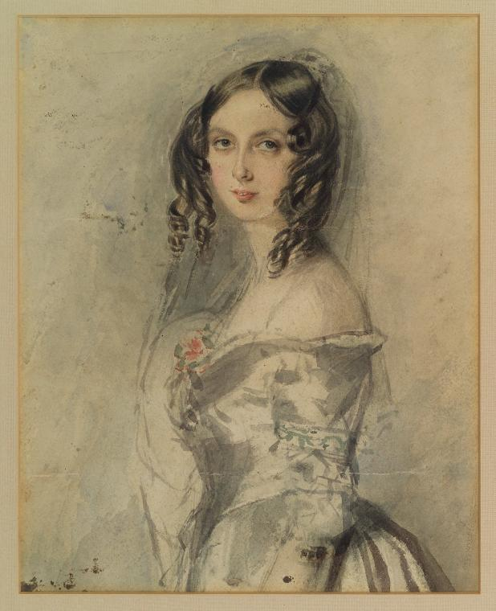

The mathematician [Ada
Lovelace](https://en.wikipedia.org/wiki/Ada_Lovelace) played a
fundamental role in publicizing the machine and its programming
system, and she was the first person to understand its possibilities
beyond the calculation of formulas.

Unusually for that time, Ada was educated in science and mathematics.
In the early 1840s, when she was twenty-five, she became familiar with
Babbage's work and collaborated with him, spending several years
studying the design and operation of the Analytical Engine.

In 1843 she published the paper _"Sketch of the analytical engine
invented by Charles Babbage"_, in which she describes the Analytical
Engine, adds her own reflections on the scope of the invention, and
builds a complete example, with tables and diagrams, of how to make
the machine produce the sequence of Bernoulli numbers. These tables
and diagrams can be considered the **first computer program**.

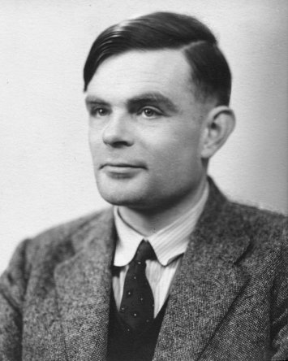

Before any real computer existed, in 1936, the English mathematician
[Alan Turing](https://en.wikipedia.org/wiki/Alan_Turing) formalized
the abstract idea of a computer using a very simple processing model:
an abstract machine with a scanner that reads and writes 0s and 1s on
an infinite tape (memory), moving and writing according to a table
defined in the machine (program). With this abstract machine, the
[Turing machine](https://en.wikipedia.org/wiki/Turing_machine),
Turing explores the idea of what is computable and what is not. Are
there non-computable problems for which it is impossible to invent an
algorithm that solves them? Turing proves that there are, and with
his work he establishes the limits of computation.

In the same paper, Turing defines the concept of a *universal
machine*, which is able to read any program from the tape and simulate
its behavior on another part of the tape. This idea had a profound
impact on the development of computers because it showed that it is
possible to write programs that take other programs as data. This
opens the door to the idea of programs stored in memory, since they
are just another kind of data, and to the creation of compilers and
interpreters.

In the [1940s](https://github.com/domingogallardo/historia-computadores#3)
there was an explosion of electronic and electromechanical computing
machines. It was a remarkable decade in which increasingly faster and
more robust technologies were developed, and enormous advances were
made in the speed and precision of calculations.


In the middle of that decade, in 1945, [John Von
Neumann](https://en.wikipedia.org/wiki/John_von_Neumann), who was
working on the construction of the
[ENIAC](https://en.wikipedia.org/wiki/ENIAC), introduced a fundamental
advance. He proposed his famous architecture, in which the two key
ideas of general-purpose computers were proposed for the first time:
a program stored in memory and a set of processing instructions that
includes indirect addressing.

And in 1948, three years later, the first general-purpose digital
electronic computer using this architecture was built at the
University of Manchester. It was called
[Baby](https://en.wikipedia.org/wiki/Manchester_Small-Scale_Experimental_Machine).
It was designed by Max Newmann using technology provided by the
engineers F.C. Williams and Tom Kilburn. Williams had invented an
electronic memory device, the *Williams tube*, capable of replacing
the slow mercury delay lines used until then.

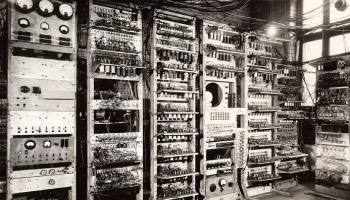

The Manchester machine was the first computer with a complete
instruction set, capable of jumps, conditionals, and indirect
addressing. The first execution of a program took place on June 21,
1948. That year Alan Turing joined the University of Manchester as
director of the Computing Laboratory. Three years later, with an
expanded design also influenced by Turing, a much larger version of
the machine became the first commercially available computer, the
Ferranti Mark I. The first one was installed at the University of
Manchester in February 1951, one month before the UNIVAC I was
delivered to the United States Census Bureau. Ten more machines were
sold to Great Britain, Canada, the Netherlands, and Italy.

The first complex Artificial Intelligence program, a checkers player
written by Christopher Strachey, ran in the summer of 1952 on the
Ferranti Mark I at the Manchester Computing Laboratory. Strachey
wrote the program encouraged by Turing and using the Ferranti
programming manual that Turing had just written. Turing also
participated in the development of other AI programs, such as a chess
player based on heuristics.

### 1.2. The First Programming Languages

The first electronic computers were programmed directly using the
processor's instruction set, in machine code or hexadecimal code.

The first language at a slightly higher level than machine code was
assembly language. The first programs that processed programming
languages began to appear, although they were very simple programs,
since there is an almost direct relationship between assembly
notation and the hexadecimal code produced by the assembler.

At the end of the 1940s, people began trying to solve with the first
computers the first mathematical problems other than numerical
operations: coding and decoding, combinatorial problems such as map
coloring, or sorting problems.

One of von Neumann's first algorithms sorts a set of numbers. Von
Neumann describes it in a letter dated 1945. It uses the EDSAC
instruction set, even though the machine had not yet been built. The
program was studied by Donald Knuth in the article *Von Neumann's
first Computer Program*, where he documents that there was a bug in
the first instructions. It is the first written bug known in history.
If Von Neumann had been able to run the program on the EDSAC, he
would have noticed the error and it would have been the first
debugging of a program.

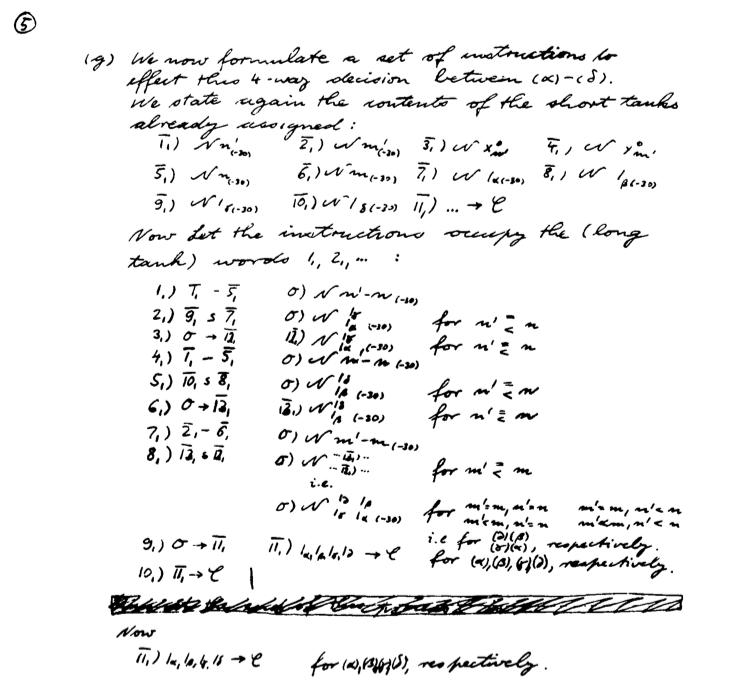

*Von Neumann's first program*

(Donald Knuth, "Von Neumann's first Computer Program", Journal of the
ACM Computing Surveys (CSUR) Surveys, Volume 2 Issue 4, Dec. 1970,
Pages 247-260)

### 1.3. The Birth of Commercial Computers

**UNIVAC**

The [UNIVAC](http://en.wikipedia.org/wiki/UNIVAC_I) was the first
commercial computer (1951). With this computer, the figure of the
programmer appeared for the first time: manuals, training courses,
job offers, and so on.

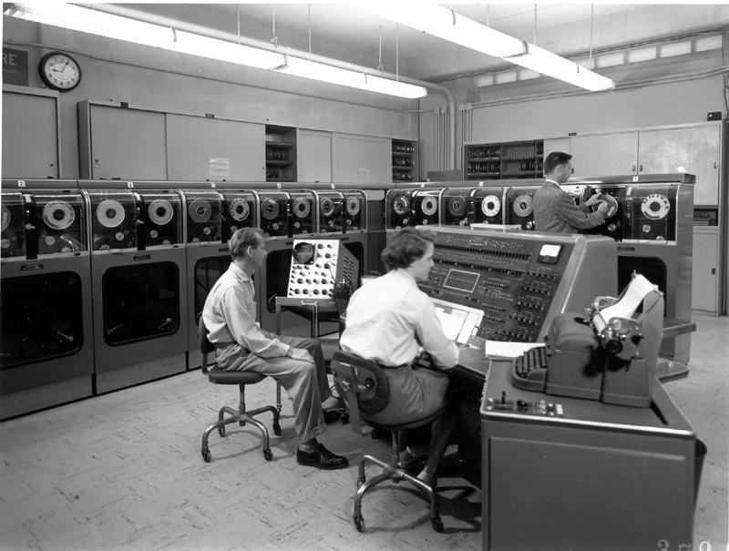

*UNIVAC*

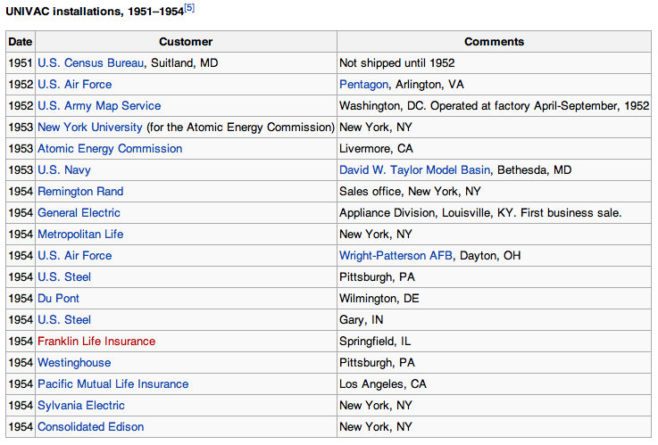

*UNIVAC commercial facilities*

**IBM 704**

The [IBM 704](http://en.wikipedia.org/wiki/IBM_704) was the other
major commercial computer of the 1950s.

It was much more widely used than the UNIVAC: government centers,
universities.

The first high-level programming languages were developed for this
computer.

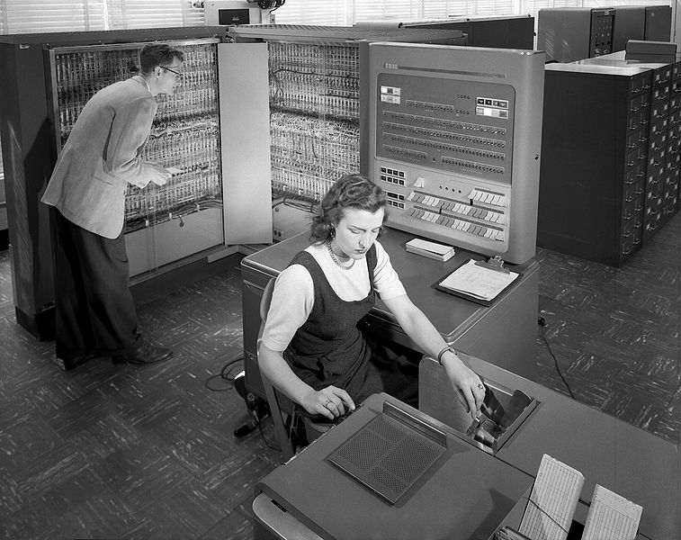

*IBM 704 photo*

#### 1.3.1. Programming the First Computers

> The UNIVAC I was an interesting machine to program, with its
> mercury delay-line storage and its tendency to fail. Programs were
> entered into the computer by typing them onto magnetic tapes, an
> important innovation at that time.

> Working with the IBM 704 at New York University was a radically
> different experience from the UNIVAC I. It was built to run
> scientific applications, and its main innovation was magnetic-core
> memory, replacing the Williams tube memory of the IBM 701. It also
> had a floating-point arithmetic unit. The machine had the equivalent
> of 128 KB of main memory, 32 KB of secondary memory, and magnetic
> tapes that could store 5 MB of data. It operated at 0.04 MIPS and
> cost 3 million dollars in 1957.

> George Sadowsky,
> [My Second Computer was a UNIVAC I](http://www.georgesadowsky.com/papers/Univac-I.pdf)

### 1.4. The First High-Level Languages

The first high-level languages were developed at the end of the
1950s:

- FORTRAN in 1956
- Lisp in 1958

Both languages proposed two very different approaches from the
beginning:

* FORTRAN
    * First commercial language, IBM team led by John W. Backus
    * Imperative language: state, control structures, program
      counter, memory cells
    * Compiled language
* Lisp
    * Language designed in a research department, an MIT team led by
      John McCarthy
    * Functional language: functions, recursion, lists, symbols
    * Interpreted language

#### 1.4.1. FORTRAN

Developed by IBM to program the IBM 704. Some facts:

- Its name comes from *FORmula TRANslating system*.
- The first FORTRAN manual was printed in October 1956 for the IBM
  704.
- The first compiler was marketed in April 1956.

Quote from John Backus ([Wikipedia on
FORTRAN](http://en.wikipedia.org/wiki/Fortran)):

> Much of my work has come from being lazy. I did not like writing
> programs, and when I was working on the IBM 701, writing programs to
> compute missile trajectories, I began work on a programming system
> to make it easier to write programs.

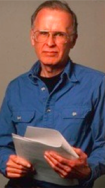

*John Backus*

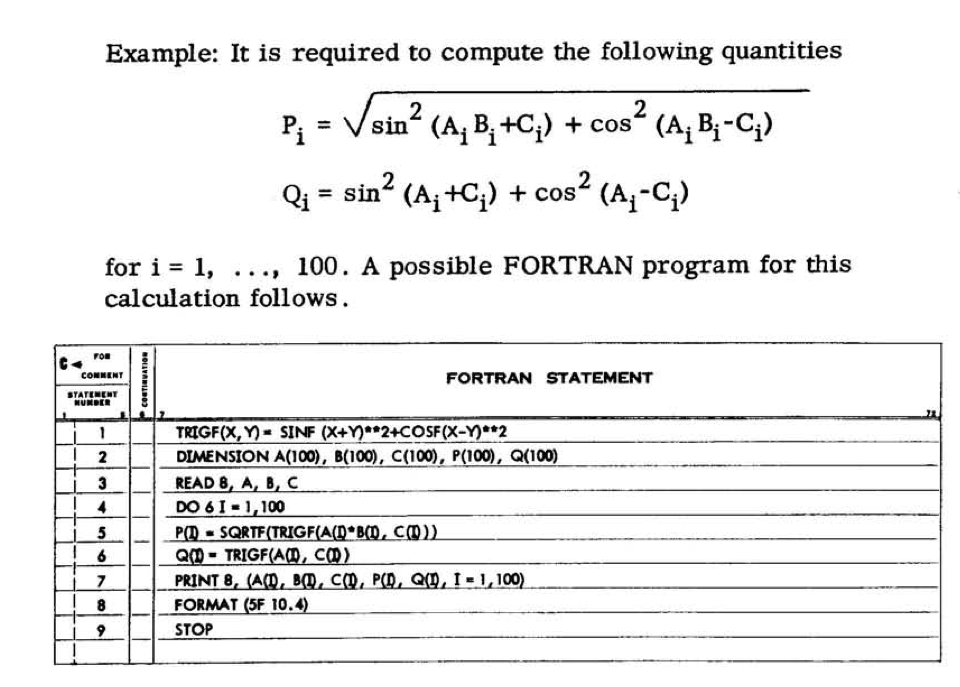

*FORTRAN example*

Taken from the
[IBM 704 FORTRAN manual](http://archive.computerhistory.org/resources/text/Fortran/102665486.05.01.acc.pdf)

#### 1.4.2. Lisp

The other high-level language developed at that time was Lisp. It was
developed in the late 1950s at MIT by John McCarthy.

Although historically the language name was often written in capital
letters (LISP), the use of only the first letter in uppercase (Lisp)
later became popular. This form is more faithful to the origin of the
language name. *Lisp* is not an acronym, but a contraction of the
expression *List Processing*. List processing is one of the main
features of Lisp.

McCarthy explains the early history of Lisp in a 1979 article:

> [...] In the summer of 1956 during the Dartmouth Summer Research
> Project on Artificial Intelligence, the first organized study of
> Artificial Intelligence, I had the idea of developing an algebraic
> language for list processing. I wanted to use it for the development
> of work in artificial intelligence on the IBM 704. [...]
> John McCarthy, [History of LISP]

[History of LISP]: http://www-formal.stanford.edu/jmc/history/lisp/lisp.html

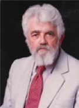

*John McCarthy*

One of the first published Lisp manuals is the
[LISP manual](http://bitsavers.org/pdf/mit/rle_lisp/LISP_I_Programmers_Manual_Mar60.pdf)
from 1960 for the IBM 704, written by Phyllis A. Fox of the MIT
research group led by McCarthy.

An example of Lisp code:

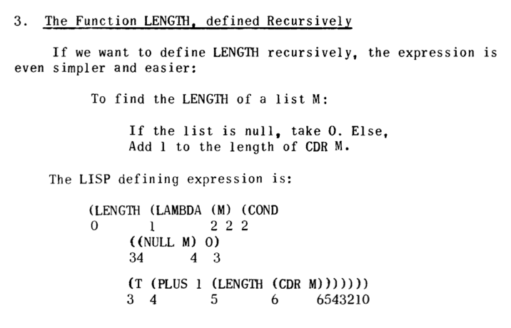

*LISP example*

Taken from
"[The Programming Language LISP](http://www.softwarepreservation.org/projects/LISP/lisp15_family#Berkeley_and_Bobrow_)",
MIT Press, 1964

### 1.5. The Explosion of Programming Languages

From 1954 to the present, more than 2,500 languages have been
documented (see [The Language List]). Between 1952 and 1972, around
200 languages appeared. About ten were truly significant and
influenced the development of later languages.

[The Language List]: http://people.ku.edu/~nkinners/LangList/Extras/langlist.htm

#### 1.5.1. Genealogy of Programming Languages

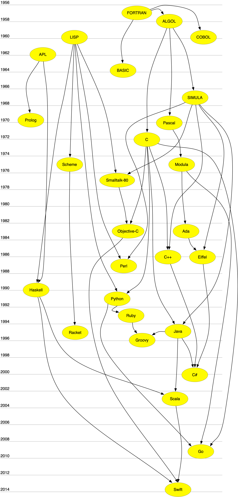

*Genealogy of programming languages*

Some notes on the genealogy:

* APL is a declarative algebraic language for specifying functions
  and logical circuits. Its declarative nature influenced languages
  such as Prolog or Haskell.

* Lisp is not only a functional language; it is also the first
  interpreted language, with many runtime features and little static
  checking. In those aspects, it influenced non-functional dynamic
  languages such as Python or Smalltalk. Languages such as Smalltalk
  or Objective-C also inherit from Lisp some functional features, such
  as the possibility of using a block of code as a primitive object
  created at runtime that can be assigned or passed as a parameter.
  This is what is called a *closure* in the functional programming
  paradigm.

* SIMULA is the first language to define concepts such as class or
  object. It is the origin of statically and strongly typed
  object-oriented programming. Languages such as C++, Eiffel, or Java
  take this idea. In contrast to this tendency, there is another view
  of object-oriented programming in languages such as Smalltalk or
  Objective-C, where dynamic aspects such as message passing or class
  modification at runtime are emphasized more strongly.

#### 1.5.2. Some Important Languages and Their Creation Date

| 1950-1960  | 1970  | 1980 | 1990 | 2000 |
| :---------: | :---: | :---: | :---: | :---: |
| 1957 FORTRAN | 1970 Pascal     | 1980 Smalltalk-80   |  1990 Haskell   | 2000 C#  |
| 1958 ALGOL |  1972 Prolog  | 1983 Objective-C   | 1991 Python   | 2003 Scala  |
| 1960 Lisp | 1972 C | 1983 Ada   |  1993 Ruby  | 2003 Groovy  |
| 1960 COBOL | 1975 Scheme | 1986 C++  | 1995 Java  | 2009 Go  |
| 1962 APL |  1975 Modula   | 1986 Eiffel   | 1995 Racket  |  2014 Swift |
| 1964 BASIC |      | 1987 Perl   |    |   |
| 1967 SIMULA |      |    |    |   |

#### 1.5.3. The Creators of Programming Languages

If we look at the history of programming languages, we can classify
their creators into three broad categories:

* Researchers working in companies
  ([Backus](http://en.wikipedia.org/wiki/John_Backus)/IBM-FORTRAN,
  [Gosling](http://en.wikipedia.org/wiki/James_Gosling)/Sun-Java)
* Researchers at universities and computer science departments
  ([McCarthy](http://en.wikipedia.org/wiki/John_McCarthy_(computer_scientist))/MIT-Lisp,
  [Wirth](http://en.wikipedia.org/wiki/Niklaus_Wirth)/ETH-Pascal,
  [Odersky](http://en.wikipedia.org/wiki/Martin_Odersky)/ETH-Scala)
* Open source developers who distribute their work to the community
  ([Wall](http://en.wikipedia.org/wiki/Larry_Wall)/Perl,
  [Matsumoto](http://en.wikipedia.org/wiki/Yukihiro_Matsumoto)/Ruby)

### 1.6. Programming Languages Today

The [TIOBE](https://www.tiobe.com/tiobe-index/) index is an indicator
of the popularity of programming languages. The index is updated once
a month. The scores are based on undisclosed statistics that include
the number of engineers worldwide, courses, and applications
developed. Results obtained from the most widely used search engines
are also used.

The TIOBE index does not try to measure the number of lines written
in programming languages, but their *popularity* and *importance* in
the community.

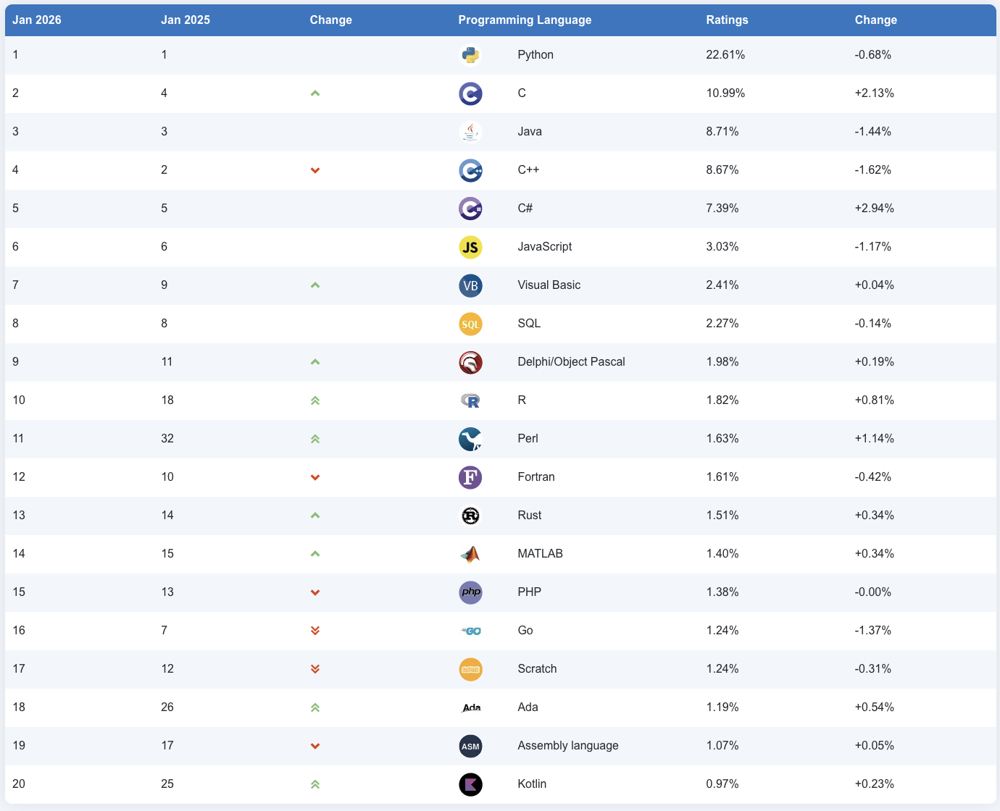

*TIOBE list*

It is also very interesting to check the evolution of the 10 most
popular languages over the last 10 years.

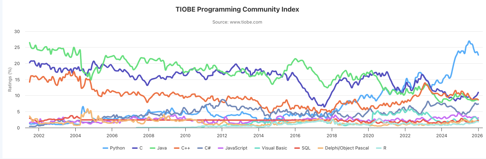

*TIOBE evolution*

#### 1.6.1. Evolution Does Not Stop

It is interesting to see that it is becoming easier and easier to
develop new programming languages. Language processing techniques and
tools have become increasingly popular and accessible to more people.
Languages are no longer created only in departments with a large
number of researchers, but also in open source communities made up of
interested and motivated volunteers.

Examples of new languages and their creators:

**Ruby**

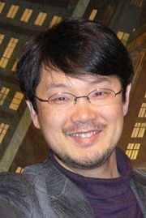

*Yukihiro Matsumoto*

* [Ruby](http://www.ruby-lang.org/)
  ([Wikipedia](https://en.wikipedia.org/wiki/Ruby_(programming_language))),
  a programming language conceived in 1993 by the Japanese developer
  Yukihiro Matsumoto.
* Interpreted, multi-paradigm, and very expressive language currently
  used both for developing web applications and video games.
* Active project, with new versions appearing every year.

**Scala**

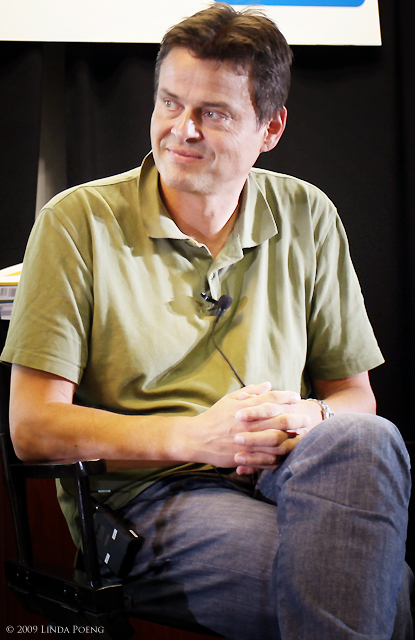

*Martin Odersky*

* [Scala](http://www.scala-lang.org/)
  ([Wikipedia](https://en.wikipedia.org/wiki/Scala_(programming_language))),
  designed in 2003 by the German professor Martin Odersky.
* Response to the problems of traditional imperative languages for
  handling concurrency.
* It is implemented on top of Java and runs on the Java Virtual
  Machine.

**Go**

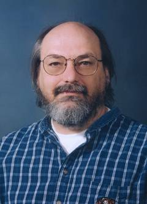

*Ken Thompson*

* [Go](http://golang.org/)
  ([Wikipedia](https://en.wikipedia.org/wiki/Go_(programming_language))),
  Google's new programming language launched in 2009.
* Developed, among others, by Ken Thompson, one of the fathers of
  UNIX.
* A mix of C and Python that tries to achieve a systems programming
  language that is very efficient, expressive, and also
  multi-paradigm.

**Swift**

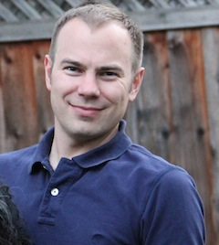

*Chris Lattner*

* [Swift](https://developer.apple.com/swift/)
  ([Wikipedia](https://en.wikipedia.org/wiki/Swift_(programming_language))),
  Apple's new programming language launched in 2014.
* [_Open source_ project](https://swift.org) where its
  [evolution and future roadmap](https://github.com/apple/swift-evolution)
  can be observed.
* Developed, among others, by
  [Chris Lattner](http://www.nondot.org/sabre/), author of the
  _LLVM Compiler Infrastructure_, a set of compiler, debugger,
  optimizer, and related tools for C, C++, and Objective-C code.
* Modern, multi-paradigm language (object-oriented and functional
  programming), strongly typed and compiled.

## 2. Elements of Programming Languages

### 2.1. Definition from the Encyclopedia of Computer Science

A programming language is a set of characters, rules for combining
them, and rules for specifying their effects when executed by a
computer, with the following four characteristics:

1. It requires no knowledge of machine code from the user.
2. It is machine independent.
3. It is translated into machine language.
4. It uses a notation that is closer to the specific problem being
   solved than to machine code.

### 2.2. Definition by Abelson and Sussman

> We are about to study the idea of a **computational process**.
> Computational processes are abstract beings that inhabit computers.
> As they evolve, processes manipulate other abstract things called
> **data**. The evolution of a process is directed by a pattern of
> rules called a program. [...]

And another fundamental idea:

> A powerful programming language is more than just a means for
> instructing a computer to perform tasks. The language also serves as
> a framework within which we organize our ideas about processes.
> Thus, when we describe a language, we should pay particular
> attention to the means that the language provides for combining
> simple ideas to form more complex ideas.

### 2.3. Characteristics of a Programming Language

1. It defines a process that runs on a computer.
2. It is high level, close to the problems to be solved
   (abstraction).
3. It allows new abstractions to be built and adapted to the
   programming domain.

### 2.4. Elements of a Programming Language

For Abelson and Sussman, all programming languages make it possible
to combine simple ideas into more complex ideas through the following
three mechanisms:

* **Primitive expressions**, which represent the simplest entities in
  the language.
* **Means of combination**, with which compound elements are built
  from simpler elements.
* **Means of abstraction**, with which compound elements are named
  and manipulated as units.

### 2.5. Syntax and Semantics

*Syntax*: set of rules that define which text expressions are correct.
For example, in C all statements must end with `;`.

*Semantics*: set of rules that defines what the result of executing a
program on the computer will be.

### 2.6. Languages Are for People

Programming languages must be precise; they must be translatable
without ambiguity into machine language so that they can be executed
by computers. But they must also be used (read, commented, tested,
and so on) by people.

Programming is a collaborative activity and must be based on
communication.

### 2.7. Importance of Learning Programming Language Techniques

It is important to know how a programming language works "inside" and
to understand its characteristics in comparison with others.

* It improves the use of the programming language.
* It increases the vocabulary of programming elements.
* It allows a better choice of programming language.
* It improves the ability to develop effective and efficient programs.
* It makes it easier to learn a new programming language.
* It makes it easier to design new programming languages.

## 3. Abstraction

A fundamental mission of programming languages is to provide tools
for building abstractions. For example, we are building an abstraction
when we give a **name** to a language entity (a variable, a function,
a class, and so on).

Choosing a good name for the elements we build in our programs is
essential to achieve readable and reusable code.

### 3.1. Modeling as a Fundamental Activity

* To write a program that provides services, it is essential to model
  the domain it will work on.
* It is necessary to define different abstractions, both APIs and
  data, that allow us to deal with its elements and communicate
  correctly with the users who will use the program.
* The abstractions we build rely on each other and make a complex
  problem understandable and communicable.
* Example: modeling the operation of a library contains abstractions
  such as "books", "loan", "reservation", or "available books", which
  represent domain concepts that must be implemented in our solution.

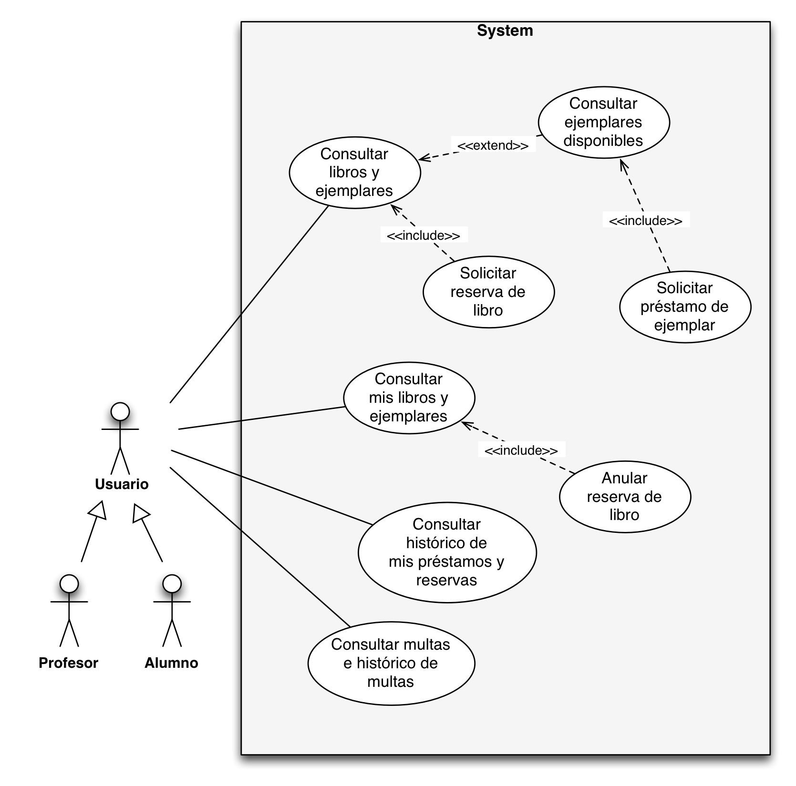

*Library use cases*

### 3.2. Computational Abstractions

There are abstractions specific to computer science that are used in
many domains. For example, data abstractions such as:

* Lists
* Trees
* Graphs
* Hash tables

There are also abstractions that allow us to deal with external
devices and computers:

* File
* Graphic raster
* TCP/IP protocol

### 3.3. Building Abstractions

One of the main jobs of a computer scientist is to build abstractions
that save time and effort when dealing with the complexity of the
real world.

Quote from Joel Spolsky in his blog
[Joel on Software](http://www.joelonsoftware.com/articles/LeakyAbstractions.html):

> TCP is what computer scientists call an abstraction: a simplification
> of something much more complicated that is going on under the covers.
> It turns out that a lot of computer programming consists of building
> abstractions. What is a string library? It is a way to pretend that
> computers can manipulate strings just as easily as they can
> manipulate numbers. What is a file system? It is a way to pretend
> that a hard disk is not actually a set of rotating magnetic platters
> that can store bits at certain positions, but instead a hierarchical
> system of folders-within-folders that contains individual files.

### 3.4. Different Aspects of Programming Languages

Programming is a complex discipline that has to take into account
multiple aspects of programming languages and APIs:

1. Programs as *runtime* processes that execute on a computer. We
   need to understand what happens when an object is created, how long
   it remains in memory, what the scope of a variable is, and so on.

    Tools: debuggers, performance analyzers.

2. Programs as static declarations. A program must be considered from
   the point of view of declaring new types, new methods, generic
   types, inheritance between classes, and so on.

    Tools: programming environments with code completion and syntax
    error detection.

3. Programs as communication and social activity. We must take into
   account that a program will be used by other people, read,
   extended, maintained, and modified. Programs will always be
   modified.

    Tools: version control systems (Git, Mercurial, GitHub,
    Bitbucket), issue management systems (Jira), tests that prevent
    regression errors, ...

## 4. Programming Paradigms

### 4.1. What Is a Programming Paradigm?

A paradigm defines a set of characteristics, patterns, and programming
styles based on some fundamental idea. For example, the functional
paradigm is based on the idea that a computation can be specified as
a set of functions that transform input values into output values.

It is useful to see a paradigm as a programming style that can be
used in different programming languages and expressed with different
syntaxes. For example, code using logic programming can be written in
Prolog, which would be the most natural choice, but also in Java,
using some specific API.

Normally, all languages have characteristics from more than one
paradigm. For practical reasons, the most popular languages are not
strictly or purely limited to a single programming paradigm.

For example, Prolog is mostly a logical and declarative language, but
it has imperative operators such as the *cut*. Even so, it is normal
to assign a language to the paradigm in which it is easiest or most
natural to write code using its constructs.

There are languages that reinforce and promote the expression of code
in more than one programming paradigm. And they do so not by
necessity or accident, but with the explicit intention of merging more
than one paradigm into a single way of programming. These languages
are called *multi-paradigm* languages.

For example, Scala is a multi-paradigm language in which Martin
Odersky, its creator, mixes object-oriented programming features with
functional programming.

Prolog or Lisp, although they have non-logical or non-functional
features, cannot be considered multi-paradigm because they were not
created with the idea of integrating varied paradigms into a coherent
form of expression.

The most important paradigms are:

* Functional paradigm
* Logic paradigm
* Imperative or procedural paradigm
* Object-oriented paradigm

### 4.2. Functional Paradigm

Summary of the main characteristics:

* Computation is performed by evaluating expressions.
* Definition of functions.
* Functions as primitive data.
* Values without side effects; there are no references to memory
  cells in which mutable state is stored.
* Declarative programming, in *pure* functional programming.

Languages: Lisp, Scheme, Haskell, Scala, Clojure.

Code example (Lisp):

```scheme
(define (factorial x)
   (if (= x 0)
      1
      (* x (factorial (- x 1)))))

>(factorial 8)
40320
>(factorial 30)
265252859812191058636308480000000
```

### 4.3. Logic Paradigm

Characteristics:

* Definition of rules.
* Unification as a computation element.
* Declarative programming.

Languages: Prolog, Mercury, Oz.

Code example (Prolog):

```prolog
padrede('juan', 'maria'). % juan es padre de maria
padrede('pablo', 'juan'). % pablo es padre de juan
padrede('pablo', 'marcela').
padrede('carlos', 'debora').

hijode(A,B) :- padrede(B,A).
abuelode(A,B) :-  padrede(A,C), padrede(C,B).
hermanode(A,B) :- padrede(C,A) , padrede(C,B), A \== B.

familiarde(A,B) :- padrede(A,B).
familiarde(A,B) :- hijode(A,B).
familiarde(A,B) :- hermanode(A,B).

?- hermanode('juan', 'marcela').
yes
?- hermanode('carlos', 'juan').
no
?- abuelode('pablo', 'maria').
yes
?- abuelode('maria', 'pablo').
no
```

### 4.4. Imperative Paradigm

Programming languages that follow the imperative paradigm are
characterized by having an implicit state that is modified through
language instructions or commands. As a result, these languages have
a notion of command sequencing to allow precise and deterministic
control of state.

Characteristics:

* Definition of procedures.
* Definition of data types.
* Compile-time type checking.
* Change of variable state.
* Execution steps of a process.

Example (Pascal):

```pascal
type
   tDimension = 1..100;
   eMatriz(f,c: tDimension) = array [1..f,1..c] of real;

   tRango = record
      f,c: tDimension value 1;
   end;

   tpMatriz = ^eMatriz;

procedure EscribirMatriz(var m: tpMatriz);
var filas,col : integer;
begin
   for filas := 1 to m^.f do begin
      for col := 1 to m^.c do
         write(m^[filas,col]:7:2);
      writeln(resultado);
      writeln(resultado)
     end;
end;
```

### 4.5. Object-Oriented Paradigm

Characteristics:

* Definition of classes and inheritance.
* Objects as abstractions of data and procedures.
* Polymorphism and runtime type checking.

Example (Java):

```java
public class Bicicleta {
    public int marcha;
    public int velocidad;

    public Bicicleta(int velocidadInicial, int marchaInicial) {
        marcha = marchaInicial;
        velocidad = velocidadInicial;
    }

    public void setMarcha(int nuevoValor) {
        marcha = nuevoValor;
    }

    public void frenar(int decremento) {
        velocidad -= decremento;
    }

    public void acelerar(int incremento) {
        velocidad += incremento;
    }
}

public class MountainBike extends Bicicleta {
    public int alturaSillin;

    public MountainBike(int alturaInicial,
                        int velocidadInicial,
                        int marchaInicial) {
        super(velocidadInicial, marchaInicial);
        alturaSillin = alturaInicial;
    }

    public void setAltura(int nuevoValor) {
        alturaSillin = nuevoValor;
    }
}

public class Excursion {
    public static void main(String[] args) {
        MountainBike miBicicleta = new MoutainBike(10,10,3);
        miBicicleta.acelerar(10);
        miBicicleta.setMarcha(4);
        miBicicleta.frenar(10);
    }
}
```

## 5. Compilers and Interpreters

At the lowest level of abstraction, the execution of a program on a
computer consists of executing a set of machine-code instructions for
the processor. For example, the following figure shows an example of
an assembly-language program for an old processor, the Z80, an 8-bit
processor from the legendary
[ZX Spectrum](http://es.wikipedia.org/wiki/Sinclair_ZX_Spectrum), one
of the first personal computers in Europe:

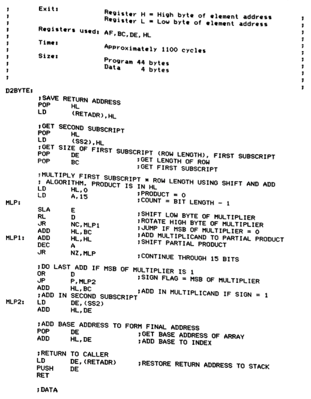

*Z80 assembly language*

Depending on the type of programming language in which the program is
written, the machine code being executed will be:

* the result of compiling the original program, in the case of a
  compiled language.
* the code of a program, the interpreter, that interprets the
  original program, in the case of an interpreted language.

### 5.1. Compilation

The following figure, taken like the others in this section from
*Programming Language Pragmatics*, shows the generation and execution
process of a compiled program.

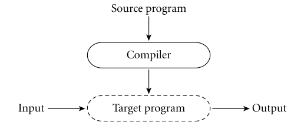

*Compilation*

The compilation process of a program consists of translating the
original source code in the high-level language into the specific
machine code of the processor on which the program will run. The
resulting machine code only runs on the processor for which it has
been generated. For example, a C program compiled for an Intel
processor cannot run on an ARM processor, such as Apple's
[Ax](http://en.wikipedia.org/wiki/Apple_system_on_a_chip).

- Examples: C, C++
- Different moments in the life of a program: compile time and
  runtime.
- Greater efficiency.

### 5.2. Interpretation

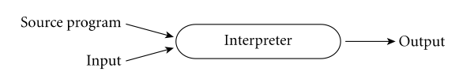

*Interpretation*

- Examples: BASIC, Lisp, Scheme, Python, Ruby.
- There is no difference between compile time and runtime.
- Greater flexibility: code can be built and executed "on the fly"
  (lambda functions or closures).

Interpreted languages usually provide a *shell* or interpreter. This
is an interactive environment in which we can define and evaluate
expressions. In functional programming circles, this environment is
called a *REPL* (*Read*, *Eval*, *Print*, *Loop*) and was already
used in the early years of Lisp implementation. The use of a *REPL*
promotes interactive programming, in which we continuously evaluate
and check the code we develop.

### 5.3. Mixed Approaches

There are also mixed approaches, such as the one used by the Java
programming language, where both processes are performed.

In a first phase, the Java compiler (`javac`) translates the original
source code into a processor-independent binary _intermediate code_
called _bytecode_. This binary code is cross-platform.

The intermediate code is then interpreted by the interpreter (`java`),
which is platform-dependent. In the figure, the interpreter is called
_Virtual machine_ (not to be confused with the concept of a _virtual
machine_ that emulates an operating system, such as VirtualBox).

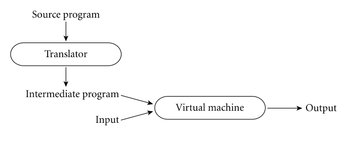

*Mixed approach (Java)*

- Examples: Java, Scala

## 6. Bibliography

* Introduction and chapter 1 of Structure and Interpretation of
  Computer Programs: *Building Abstractions with Procedures*
* Chapter 1.2 of Programming Language Pragmatics: *The Programming
  Language Spectrum*
* Chapter 1.3 of Programming Language Pragmatics: *Why Study
  Programming Languages*
* Chapter 1.4 of Programming Language Pragmatics: *Compilation and
  Interpretation*
* Raul Rojas, "Konrad Zuse's legacy the architecture of the Z1 and
  Z3", IEEE Annals of the History of Computing, Vol. 19, No. 2, 1997
* Charles Petzold, "Code", Microsoft Press, 2000 (Chapter 18: "From
  Abaci to Chips")
* Jack Copeland, "The Modern History of Computing", The Stanford
  Encyclopedia of Philosophy (Fall 2008 Edition), URL =
  <http://plato.stanford.edu/archives/fall2008/entries/computing-history/>
* Georgi Dalakov, "History of Computers", URL =
  <http://history-computer.com>

----

Programming Languages and Paradigms, academic year 2025-26  
© Department of Computer Science and Artificial Intelligence, University of Alicante  
Domingo Gallardo, Cristina Pomares, Antonio Botía, Francisco Martínez
