# Topic 2: Functional Programming

## 1. The Functional Programming Paradigm

### 1.1. Past and Present of the Functional Paradigm

#### 1.1.1. Definition and Characteristics

In a very brief and concise definition, functional programming defines a
**program** in the following way:

!!! Quote "Definition of functional program"
    In functional programming, a program is a set of mathematical
    functions that convert inputs into outputs, without any internal state
    and no side effects.

We will talk later about the non-existence of internal state (variables in
which values are saved and modified) and the absence of side effects. Let's
say that these are also characteristics of **declarative programming**
(compared to traditional imperative programming, which is what is used in
languages like C or Java). In this sense, functional programming is a specific
type of declarative programming.

The main characteristics of the functional paradigm are:

- Definitions of pure mathematical functions, without internal state or side
  effects
- Immutable values
- Profuse use of recursion in the definition of functions
- Using lists as fundamental data structures
- Functions as primitive data types: lambda expressions and higher-order
  functions

We will explain these properties below.

#### 1.1.2. Historical Origins

In the 1930s, along with the Turing machine, different equivalent
computational models were proposed that formalized the concept of *algorithm*.
One of these models was the one called [*Lambda
calculus*](https://en.wikipedia.org/wiki/Lambda_calculus) proposed by Alonzo
Church in the 1930s and based on the evaluation of mathematical expressions.
In this formalism the algorithms are expressed through mathematical functions
in which recursion can be used. A mathematical function takes input parameters
and returns a value. The evaluation of the function is carried out by
evaluating its mathematical expressions by replacing the formal parameters
with the real values that are used in the invocation (the so-called
**substitution model** that we will see later).

Lambda calculus is a mathematical formalism, based on abstract operations. Two
decades later, when the first electronic computers were beginning to be used
in large companies and universities, this formalism gave rise to something
much more tangible and practical: a high-level language, much more expressive
than assembly, with which to express operations and functions **that can be
defined and evaluated on the computer**, the Lisp programming language.

#### 1.1.3. History and Characteristics of Lisp

* [Lisp](http://en.wikipedia.org/wiki/Lisp_(programming_language)) is the
  first high-level programming language based on the functional paradigm.
* Created in 1958 by John McCarthy.
* Lisp was in its time a revolutionary language that introduced new
  programming concepts that did not exist then: functions as primitive
  objects, higher-order functions, polymorphism, lists, recursion, symbols,
  homogeneity of data and programs, REPL loop (*Read-Eval-Print Loop*)
* The legacy of Lisp reaches languages derived from it (Scheme, Common Lisp)
  and new languages of non-strictly functional paradigms, such as C#, Python,
  Ruby, Objective-C or Scala.

Lisp was the first interpreted programming language, with many dynamic
features that are executed at run-time. Among these features we can highlight
memory management (**automatic** creation and destruction of memory reserved
for data), the detection of exceptions and errors at run time or the run-time
creation of anonymous functions (*lambda* expressions). All these features are
executed through a *runtime system* (*runtime system*) present in the
execution of the programs. Since Lisp, many other languages have used these
interpretation or runtime system features. For example, languages such as
BASIC, Python, Ruby or JavaScript are interpreted languages. And languages
like Java or C# have an advanced runtime platform with support for dynamic
memory management (*garbage collection*, [*garbage
collection*](https://en.wikipedia.org/wiki/Garbage_collection_(computer_science)))
or [compilation *just in
time*](https://en.wikipedia.org/wiki/Just-in-time_compilation).

Lisp is not an exclusively functional language. Lisp was designed with the
objective of being a high-level language capable of solving practical
Artificial Intelligence problems, not with the idea of being a formal language
based on a single computing model. For this reason, in Lisp (and in Scheme)
there are primitives that go beyond the pure functional paradigm and allow
programming in an imperative (non-declarative) way, using state mutation and
execution steps.

However, during the first part of the course in which we will study
functional programming, we will not use the imperative instructions of Scheme
but will write exclusively functional code.

#### 1.1.4. Functional Programming Languages

In the 1960s, functional programming defined by Lisp was dominant in
Artificial Intelligence research departments (MIT, for example). In the 70s,
80s and 90s it was increasingly relegated to academic and research niches;
Imperative and object-oriented languages prevailed in industry.

In the first decade of the 2000s, languages have appeared that evolve from
Lisp and that highlight its functional aspects, although updating its syntax.
We highlight among them:

- [Clojure](https://en.wikipedia.org/wiki/Clojure)
- [Erlang](https://en.wikipedia.org/wiki/Erlang_(programming_language))

There is also a trend since the mid-2000s to include functional aspects such
as _lambda expressions_ or higher-order functions in object-oriented
imperative languages, giving rise to *multi-paradigm* languages:

- [Ruby](https://en.wikipedia.org/wiki/Ruby_(programming_language))
- [Python](https://en.wikipedia.org/wiki/Python_(programming_language))
- [Groovy](https://en.wikipedia.org/wiki/Groovy_(programming_language))
- [Scala](https://en.wikipedia.org/wiki/Scala_(programming_language))
- [Swift](https://en.wikipedia.org/wiki/Swift_(programming_language))


Finally, an **exclusively functional** language like
[Haskell](https://en.wikipedia.org/wiki/Haskell_(programming_language)) has
also become popular in the 2010s. This language, unlike Scheme and other
multi-paradigm languages, does not have any imperative element and makes all
its expressions purely functional.

#### 1.1.5. Practical Applications of Functional Programming

Currently, the functional paradigm is a **fashionable paradigm**, as can be
seen by observing the number of articles, talks and blogs in which it is
discussed, as well as the number of languages that are applying its concepts.
For example, just as a sample, below you can find some links to interesting
talks and articles recently published on functional programming:

- Lupo Montero - [Introduction to functional programming in
  JavaScript](https://medium.com/laboratoria-how-to/introducción-a-la-programación-funcional-en-javascript-parte-1-e0b1d0b2142e)
  (Blog)
- Andrés Marzal - [Why you should learn functional programming right
  now](https://www.youtube.com/watch?v=jG4QuREv5fE) (Talk on YouTube)
- Mary Rose Cook - [A practical introduction to functional
  programming](https://maryrosecook.com/blog/post/a-practical-introduction-to-functional-programming)
  (Blog)
- Ben Christensen - [Functional Reactive Programming in the Netflix
  API](https://www.infoq.com/presentations/Netflix-API-rxjava-hystrix) (InfoQ
  Talk)

The recent rise of these languages and the functional paradigm is due to
several factors, among them that it is a paradigm that facilitates:

- the programming of concurrent systems, with multiple threads of execution or
  with multiple computers executing concurrent connected processes.
- the definition and composition of multiple operations on *streams* in a very
  concise and compact way, applicable to the programming of distributed
  systems on the Internet.
- interactive and evolutionary programming.

##### 1.1.5.1. Programming Concurrent Systems

We will see later that one of the main characteristics of functional
programming is that *mutation* is not used (the values assigned to variables
or parameters are not modified). This property makes it an excellent paradigm
for implementing concurrent programs, in which there are multiple threads of
execution. Programming concurrent systems is very complicated with the
traditional imperative paradigm, in which modifying the state of a variable
shared by more than one thread can cause *race conditions* and errors that are
difficult to locate and reproduce.

As [Bartosz Milewski](https://twitter.com/BartoszMilewski), computer science
researcher and theorist, says in his [answer on
Quora](https://www.quora.com/Why-do-software-engineers-like-functional-programming/answer/Bartosz-Milewski)
to the question *why do software engineers like functional programming?*:

!!! Quote "Bartosz Milewski: Why is functional programming popular?"
    Because it is the only practical way to write concurrent programs.
    Trying to write concurrent programs in imperative languages is not
    only difficult, but it leads to *bugs* that are very difficult to
    discover, reproduce and fix. Imperative languages, and particularly
    object-oriented languages, hide mutations and inadvertently share
    data, making them extremely prone to concurrency errors caused by race
    conditions.

##### 1.1.5.2. Defining and Composing Operations on Streams

The functional paradigm has given rise to a style of programming on *streams*
of data, in which operations such as `filter` or `map` are concatenated to
simply define asynchronous processes and transformations applicable to the
elements of the *stream*. This programming style has made possible new
programming ideas, such as *reactive*, event-based programming, or *futures*
or *promises* widely used in very popular languages such as JavaScript to make
asynchronous requests to web services.

For example, the article [Exploring the virtues of microservices with Play and
Akka](http://zeroturnaround.com/rebellabs/exploring-the-virtues-of-microservices-with-play-and-akka/)
explains in detail the advantages of using languages and primitives to work
with asynchronous event-based systems in services like Tumblr or Netflix.

Another example is [using Scala on
Tumblr](http://highscalability.com/blog/2012/2/13/tumblr-architecture-15-billion-page-views-a-month-and-harder.html)
with which it is possible to create code that has no shared state and that is
easily parallelizable between the more than 800 servers necessary to handle
peaks of more than 40,000 requests per second:

!!! Quote "Using Scala on Tumblr"
    Scala promotes that it has not been shared. Mutable state is avoided
    by using statements in Scala. No long-running state machines are used.
    The state is taken out of the database, used, and written back to the
    database. The main advantage is that developers do not have to worry
    about threads or locks.

##### 1.1.5.3. Evolutionary Programming

In the programming methodology called *evolutionary programming* or
*iterative*, complex programs are built by defining and testing increasingly
complicated computational elements. Functional programming languages fit
perfectly into this way of building programs.

As Abelson and Sussman comment in the book _Structure and Implementation of
Computer Programs_ (SICP):


!!! Quote "Abelson and Sussman on incremental programming"
    In general, computational objects can have very complex structures,
    and it would be extremely inconvenient to have to remember and repeat
    their details every time we want to use them. Instead, complex
    programs are built by composing, step by step, computational objects
    of increasing complexity.

    The interpreter makes this step-by-step construction of programs
    particularly convenient because name-object associations can be
    created incrementally in successive interactions. This feature favors
    incremental program development and testing, and is largely
    responsible for the fact that a Lisp program typically consists of a
    large number of relatively simple procedures.

Do not confuse a programming methodology with a programming paradigm. A
programming methodology provides suggestions on how we should design, develop
and maintain an application that will be used by end users. Functional
programming can be used with multiple programming methodologies, because the
resulting programs are very clear, expressive, and easy to test.

### 1.2. Evaluating Expressions and Defining Functions

In the course we will use Scheme as the first language in which we will
explore functional programming.

In the Scheme seminar taught in the lab sessions, the most important concepts of
the language are studied in more depth: data types, operators, control
structures, interpreter, etc.

#### 1.2.1. Evaluating Expressions

We begin this section by seeing how Scheme expressions are defined and
evaluated. And then we'll see how to build new functions.

Scheme is a language that comes from Lisp. One of its main characteristics is
that expressions are constructed using parentheses.

Examples of expressions in Scheme, along with the result of their execution:


```racket
2 ; ⇒ 2
(+ 2 3) ; ⇒ 5
(+) ; ⇒ 0
(+ 2 4 5 6) ; ⇒ 17
(+ (* 2 3) (- 3 1)) ; ⇒ 8
```

In functional programming, instead of saying "execute an expression" we say
"**evaluate an expression**", to reinforce the idea that these are
mathematical expressions that **always return one and only one result**.

Expressions are defined with a prefix notation: the first element after the
opening parenthesis is the **operator** of the expression and the rest of the
elements (up to the closing parenthesis) are its operands.

- For example, in the expression `(+ 2 4 5 6)` the operator is the symbol `+`
  which represents _sum_ function and the operands are the numbers 2, 4, 5 and
  6.

- There may be expressions that do not have operands, such as the example
  `(+)`, whose evaluation returns 0.

A fundamental idea of Lisp and Scheme is that parentheses are evaluated from
inside to outside. For example, the expression

```racket
(+ (* 2 3) (- 3 (/ 12 3)))
```

which returns 5, is evaluated like this:

```racket
(+ (* 2 3) (- 3 (/ 12 3))) ⇒
(+ 6 (- 3 (/ 12 3))) ⇒
(+ 6 (- 3 4)) ⇒
(+ 6 -1) ⇒
5
```

The evaluation of each expression returns a value that is used to continue
calculating the outer expression. In the previous case

- First the expression `(* 2 3)` is evaluated which returns 6,
- `(/ 12 3)` is then evaluated which returns 4,
- `(- 3 4)` is then evaluated which returns -1
- and finally `(+ 6 -1)` is evaluated, which returns 5

When an expression is evaluated in the Scheme interpreter the result appears
on the next line.

#### 1.2.2. Defining Functions

In functional programming, functions are similar to mathematical functions:
they receive parameters and always return a single result from operating with
those parameters.

For example, we can define the function `(cuadrado x)` that returns the square
of a number that we pass as a parameter:

```racket
(define (cuadrado x)
   (* x x))
```

After the name of the function its arguments are declared. The number of
arguments to a function is called the **arity of the function**. For example,
the function `cuadrado` is a function of arity 1, or _unary_.

After declaring the parameters, the function body is defined. It is an
expression that will be evaluated with the value passed as a parameter. In the
previous case the expression is `(* x x)` and it will multiply the parameter
by itself.

It should be noted that in Scheme there is no `return` keyword, but functions
are always defined with a single expression whose evaluation is the result
that is returned.

Once the `cuadrado` function is defined we can use it in the same way as the
primitive Scheme functions:

```racket
(cuadrado 10) ; ⇒ 100
(cuadrado (+ 10 (cuadrado (+ 2 4)))) ; ⇒ 2116
```

The evaluation of the last expression is done as follows:

```racket
(cuadrado (+ 10 (cuadrado (+ 2 4)))) ⇒
(cuadrado (+ 10 (cuadrado 6))) ⇒
(cuadrado (+ 10 36)) ⇒
(cuadrado 46) ⇒
2116
```


#### 1.2.3. Defining Helper Functions

The defined functions can in turn be used to construct other functions.

The usual thing in functional programming is to define very small functions
and build increasingly higher-order functions using the previous ones.

##### 1.2.3.1. Example: Sum of Squares #####

For example, suppose we have to define a function that returns the sum of the
square of two numbers. We could define it by writing the complete expression,
but the definition remains poorly readable.

```racket
; Definición poco legible de la suma de cuadrados

(define (suma-cuadrados x y)
    (+ (* x x)
       (* y y)))
```

We can make a much more readable definition if we use the `cuadrado` function
defined above:

```racket
; Definición de suma de cuadrados más legible.
; Usamos la función auxiliar 'cuadrado'

(define (cuadrado x)
    (* x x))

(define (suma-cuadrados x y)
    (+ (cuadrado x) 
       (cuadrado y)))
```

This second definition is much more expressive. Reading the code it is very
clear what we want to do.

##### 1.2.3.2. Example: Impact Time

Let's look at another example of using auxiliary functions. Suppose we are
programming a war game about ships and submarines, in which we use the
coordinates of the plane to place all the elements of our fleet.

Suppose we need to calculate the time it takes for a torpedo to get from a
position `(x1, y1)` to another `(x2, y2)`. We assume that the speed of the
torpedo is another parameter `v`.

How would we calculate this impact time?

The least correct way to do this is to define the entire calculation in a
single expression. Since in functional programming the functions must be
defined with a single expression, we must perform the entire calculation in
the form of nested expressions, one inside another. This builds a function
that calculates the result well. The problem it has is that it is very
difficult to read and understand for a colleague (or for ourselves, when a few
months pass):

```racket
;
; Definición incorrecta: muy poco legible
;
; La función tiempo-impacto devuelve el tiempo que tarda
; en llegar un torpedo a la velocidad v desde la posición
; (x1, y1) a la posición (x2, y2)
;

(define (tiempo-impacto x1 y1 x2 y2 v)
   (/ (sqrt (+ (* (- x2 x1) (- x2 x1))
               (* (- y2 y1) (- y2 y1))))
    v))
```

The previous function does the calculation well but is very complicated to
modify and understand.

The most correct way to define the function would be using several auxiliary
functions. Note that it is also very important to give the correct names to
each function, to understand what it does. Scheme is a weakly typed language
and we don't have the help of types that give us more context of what each
parameter is and what the function returns.

```racket
; Definición correcta, modular y legible de la función tiempo-impacto

;
; La función 'cuadrado' devuelve el cuadrado de un número
;

(define (cuadrado x)
    (* x x))

;
; La función 'distancia' devuelve la distancia entre dos
; coordenadas (x1, y1) y (x2, y2)
;

(define (distancia x1 y1 x2 y2)
    (sqrt (+ (cuadrado (- x2 x1))
             (cuadrado (- y2 y1)))))

;
; La función 'tiempo' devuelve el tiempo que 
; tarda en recorrer un móvil una distancia d a un velocidad v
;

(define (tiempo distancia velocidad)
    (/ distancia velocidad))

;
; La función 'tiempo-impacto' devuelve el tiempo que tarda
; en llegar un torpedo a la velocidad v desde la posición
; (x1, y1) a la posición (x2, y2)
;

(define (tiempo-impacto x1 y1 x2 y2 velocidad)
    (tiempo (distancia x1 y1 x2 y2) velocidad))
```

In this second version we define more functions, but each one is much more
readable. In addition, we will be able to reuse functions like `cuadrado`,
`distancia` or `tiempo` for other calculations.


#### 1.2.4. Pure Functions

Unlike what we have seen in imperative programming, in functional programming
it is not possible to define functions with local state. The functions defined
are pure mathematical functions, which meet the following conditions:

- They do not modify the parameters passed to them
- They return a single result
- They do not have a local state nor does the result depend on a mutable
  external state.

This last property is very important and means that the function always
returns the same value when the same parameters are passed to it.

Pure functions are very easy to understand because there is no need to take
into account any context when describing their operation. The returned value
solely depends on the input parameters.

For example, mathematical functions such as addition, subtraction, square,
sin, cos, etc. fulfill this property.


#### 1.2.5. Function Composition ####

A fundamental idea of functional programming is the composition of functions
that transform input data into output data. It is a very current idea, because
it is the way in which many data processing algorithms in artificial
intelligence are proposed.

For example, we can represent the algorithm that drives an autonomous vehicle
in the following way:

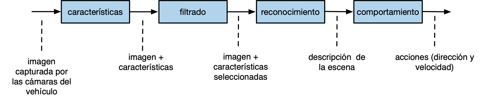

The boxes represent functions that transform the input data (images taken by
the vehicle's cameras) into the output data (actions to be performed on the
vehicle's steering and engine). Intermediate functions represent
transformations that are performed on the input data and obtain the output
data.

In a functional programming language like Scheme, the above diagram would be
written with the following code:

```racket
(define (conduce-vehiculo imagenes)
    (obten-acciones 
        (reconoce 
            (filtra 
                (obten-caracteristicas imagenes)))))
```

We will see later that expressions in Scheme are evaluated from inside to
outside and that they have prefix notation. The result of each function
constitutes the input of the next one.

In the case of the `conduce-vehiculo` function, the characteristics of the
images are first obtained, then they are filtered, then the scene is
recognized and, finally, the actions to drive the vehicle are obtained.

### 1.3. Declarative vs. Imperative Programming

We have said that functional programming is a declarative programming style,
compared to the traditional programming of so-called imperative languages.
Let's explain this a little more.

#### 1.3.1. Declarative Programming

Let's start with what we all know: an **imperative program**. It is a set of
instructions that are executed one after another (execution steps)
sequentially. During the execution of these instructions, the values of the
variables are changed and, depending on these values, the control flow of the
program execution is modified.

To understand how an imperative program works we must imagine the entire
evolution of the program, the steps that are executed and what the control
flow is based on the changes in the values in the variables.

In **declarative programming**, however, we use a totally different paradigm.
We speak of *declarative programming* to refer to programming languages (or
code statements) in which the values, objectives or characteristics of the
program elements are *declared* and in whose execution there is no mutation
(modification of variable values) or sequences of execution steps.

In this way, the execution of a declarative program has more to do with some
formal or mathematical model than with a traditional imperative program.
Defines a set of *mathematical style* rules and definitions.

Declarative programming is not exclusive to functional languages. There are
many non-functional languages with declarative features. For example Prolog,
in which a program is defined as a set of logical rules and its execution
performs a mathematical logical deduction that returns a result. In this
execution, the internal steps carried out by the system are not relevant, but
rather the logical relationships between the data and the final results.

A clear example of declarative programming is a **spreadsheet**. Cells contain
values or mathematical expressions that are automatically updated when we
change the input values. The relationship between values and results is
completely mathematical and for its calculation we do not have to take
execution steps into account. Obviously, underneath the spreadsheet there is a
program that performs the calculation of the spreadsheet, but when we are
using it we are not concerned with that implementation. We can not worry about
it and only use the mathematical model defined on the sheet.

Another very current example of declarative programming is SwiftUI, the new
API created by Apple to define the user interfaces of iOS applications.

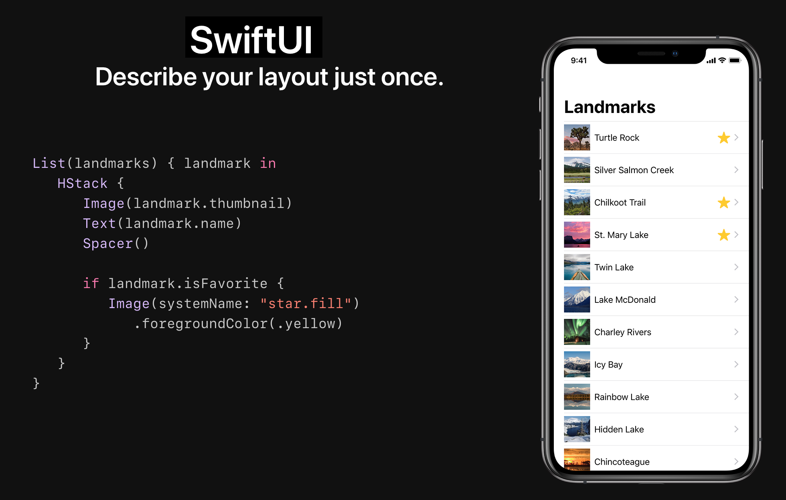

In the image code we see a description of how the application is defined: a
vertically stacked list of places (_landmarks_). For each place you define its
image, its text, and a star if the place is a favorite.

The code is declarative because there are no execution steps to define the
interface. There is no loop that adds elements to the interface. We see a
declaration of how the interface will be defined. The language compiler and
the API are responsible for building that declaration and displaying the
interface as we want.

##### 1.3.1.1. Function Declarations #####

Functional programming uses a declarative programming style. We declare
functions in which input data is transformed into output data. We will see
that this transformation is carried out by evaluating expressions, without
defining intermediate values, auxiliary variables, or execution steps. Only
calls to auxiliary functions that construct the resulting value are composed.

As we have already seen, the following example is a **declaration** in Scheme
of a function that takes a number as input and returns its square:

```racket
(define (cuadrado x)
   (* x x))
```

In the body of the `cuadrado` function we see that no auxiliary variable is
used, but only the `*` (multiplication) function is called passing the value
of `x`. The resulting value is what is returned.

For example, if we call the function passing the parameter `4`, it returns the
result of multiplying 4 by itself, 16.

```racket
(cuadrado 4) ; ⇒ 16
```


#### 1.3.2. Imperative Programming

Let's review some characteristics of imperative programming **that do not
exist in functional programming**. They are characteristics that we are very
accustomed to because they are typical of the most popular languages and with
which we have learned to program (C, C++, Java, python, etc.)

- Execution steps
- Mutation
- Side effects
- Mutable local state in functions

We will see that, although it seems impossible, it is possible to program
without using these features. This is demonstrated by functional programming
languages such as Haskell, Clojure or Scheme itself.

##### 1.3.2.1. Execution Steps

One of the basic characteristics of imperative programming is the use of
execution steps. For example, in C we can perform the following execution
steps:

```c
int a = cuadrado(8);
int b = doble(a);
int c = cuadrado(b);
return c
```

Or, for example, if we want to filter and process a list of orders in Swift we
can do it in two statements:

```swift
filtrados = filtra(pedidos);
procesados = procesa(filtrados);
return procesados;
```

However, in functional programming (e.g. Scheme) there are no execution steps
separated by statements. As we have seen before, the typical way of expressing
the above instructions is to compose all the operations in a single
instruction:

```racket
(cuadrado (doble (cuadrado 8))) ; ⇒ 16384
```

We can compose the second example in the same way:

```racket
(procesa (filtra pedidos))
```

##### 1.3.2.2. Mutation

In imperative languages it is common to modify the value of variables in the
execution steps:

```java
int x = 10;
int x = x + 1;
```

The `x = x + 1` expression is an
[assignment](https://en.wikipedia.org/w/index.php?title=Assignment_(computer_science)&redirect=no)
expression that modifies the previous value of a variable to a new value. The
*state* of the variables (their value) changes with the execution of the
program steps.

This assignment that modifies an already existing value is called _destructive
assignment_ or **mutation**.

In imperative programming you can also modify (mutate) the value of components
of data structures, such as positions of an array, a list or a dictionary.

In functional programming, on the other hand, **definitions are immutable**,
and once a value is assigned to an identifier it cannot be modified. In
functional programming **there is no assignment statement** that can modify an
already defined value. Variables are understood as mathematical variables, not
as references to memory locations that can be modified.

For example, the special form `define` in Scheme creates a new identifier and
gives it the permanently defined value. If we write the following code in a
program in Scheme:

```racket
#lang racket

(define a 12)
(define a 200)
```

we will have the following error:

```text
module: identifier already defined in: a
```

!!! Note "Note"
    In the DrRacket REPL interpreter we can define the same function or
    identifier more than once. It is designed to facilitate the use of the
    interpreter for testing expressions in Scheme.

In imperative programming languages it is common to also introduce declarative
statements. For example, in the following Java code we could consider lines 1
and 3 declarative and lines 2 and 4 imperative:

```text
1. int x = 1;
2. x = x+1;
3. int y = x+1;
4. y = x;
```

##### 1.3.2.3. Mutation and Side Effects

In imperative programming it is also common to work with references and have
more than one identifier refer to the same value. This raises the possibility
that mutating the value through one of the identifiers produces a side effect
in which the value of an identifier changes without executing any expression
that explicitly uses the identifier itself.

For example, in most object-oriented languages, identifiers hold references to
objects. So if we assign an object to more than one identifier, all the
identifiers are accessing the same object. If we mutate any value of the
object through an identifier we cause a side effect on the other identifiers.

For example, the following is an example of a mutation in imperative
programming, in which the attributes of an object are modified in Java:

```java
Point2D p1 = new Point2D(3.0, 2.0); // creamos un punto 2D con coordX=3.0 y coordY=2.0
p1.getCoordX(); // la coord x de p2 es 3.0
p1.setCoordX(10.0);
p1.getCoordX(); // la coord x de p1 es 10.0
```

If the object is assigned to more than one variable we will have the **side
effect** (*[side
effect](https://en.wikipedia.org/wiki/Side_effect_(computer_science))*) in
which the data stored in a variable changes after a statement in which that
variable has not been used:

```java
Point2D p1 = new Point2D(3.0, 2.0); // la coord x de p1 es 3.0
p1.getCoordX(); // la coord x de p1 es 3.0
Point2D p2 = p1;
p2.setCoordX(10.0);
p1.getCoordX(); // la coord x de p1 es 10.0, sin que ninguna sentencia haya modificado directamente p1
```

The same previous example, in C:

```c
typedef struct {
  float x;
  float y;
}TPunto; 

TPunto p1 = {3.0, 2.0};
printf("Coordenada x: %f", p1.x);  // 3.0
TPunto *p2 = &p1;
p2->x = 10.0;
printf("Coordenada x: %f", p1.x);  // 10.0 Efecto lateral
```

Side effects are responsible for many _bugs_ and you have to be very aware of
their use. Bugs due to side effects are especially difficult to debug in
concurrent programs with multiple threads of execution, in which several
threads can access the same references and [cause race
conditions](https://en.wikipedia.org/wiki/Race_condition).

On the other hand, there are also situations in which its use allows us to
gain a lot of efficiency because we can define data structures in which the
values are shared by several references and by modifying a single value those
references are instantly updated.

In languages where mutation does not exist, side effects do not occur, since
it is not possible to modify the value of a variable once it is established.
The programs that we write in these languages will be free of this type of
_bugs_ and will be able to be executed without problems in concurrent
execution threads.

On the other hand, the absence of mutation makes certain operations, such as
the construction of new data structures from existing structures, somewhat
more expensive. We will see, for example, that the only way to add an element
to the end of a list will be to construct a new list with all the elements of
the original list and the new element. This operation has a cost linear with
the number of elements in the list. However, in a list where we could use
mutation we could implement this operation with constant cost.

##### 1.3.2.4. Mutable Local State

Another feature of imperative programming is what is called **mutable local
state** in functions, procedures or methods. This is the possibility that an
invocation of a method or function modifies a certain state, so that the next
invocation returns a different value. It is a basic characteristic of
object-oriented programming, where objects store values that are modified with
invocations to their methods.

For example, in Java, we can define a counter that increments its value:

```java
public class Contador {
   	int c;
    
    public Contador(int valorInicial) {
        c = valorInicial;
    }
    
    public int valor() {
        c++;
        return c;
    }
}
```

Each call to the `valor()` method will return a different value:

```java
Contador cont = new Contador(10);
cont.valor(); // 11
cont.valor(); // 12
cont.valor(); // 13
```

You can also define functions with mutable local state in C:

```c
int function contador () {
    static int c = 0;
	
	c++;
	return c;
}
```

Each call to the `contador()` function will return a different value:

```c
contador(); // 1
contador(); // 2
contador(); // 3
```	

On the contrary, functional languages have the property of **referential
transparency**: it is possible to replace any occurrence of an expression with
its result without changing the final result of the program. In other words,
in functional programming, **a function always returns the same value when
called with the same parameters**. Functions do not modify any state, they do
not access any variable or global object and modify their value.

##### 1.3.2.5. Summary

A summary of the fundamental characteristics of declarative programming versus
imperative programming. In the following sections we will explain these
characteristics more.

**Characteristics of declarative programming**

* Variable = name given to a value (declaration)
* Function composition is used instead of execution steps
* There is no assignment or change of status
* There is no mutation, *referential transparency* is fulfilled: within the
  same scope all occurrences of a variable and function calls return the same
  value

**Characteristics of imperative programming**

* Variable = name of a memory area
* Assignment
* References
* Execution steps


### 1.4. The Substitution Model of Computation

A computational model is a formalism (set of rules) that defines the operation
of a program. In the case of functional languages based on the evaluation of
expressions, the computational model defines what the result of evaluating an
expression will be.

The **substitution model** is a very simple model that allows defining the
semantics of expression evaluation in functional languages such as Scheme. It
is based on a simplified version of the lambda calculus reduction rule.

It is a model based on the rewriting of some terms by others. Although this is
an abstract model, it would be possible to write an interpreter that, based on
this model, evaluates functional expressions.

Let's assume a set of definitions in Scheme:

```racket
(define (doble x) 
    (+ x x))
    
(define (cuadrado y) 
    (* y y))
    
(define (f z) 
    (+ (cuadrado (doble z)) 1))
    
(define a 2)
```

Suppose that, once these definitions have been made, the following expression
is evaluated:

```racket
(f (+ a 1))
```

What will be its result? If we do it intuitively we can think that `37`. If we
check it in the Scheme interpreter we will see that it returns 37. Have we
followed any specific rules? What rules do the interpreter follow? Could we
implement a similar interpreter? Yes, using the rules of the substitution
model.

The substitution model defines four simple rules for evaluating an expression.
Let's call the expression *e*. The rules are the following:

1. If *e* is a primitive value (for example, a number), we return that same
   value.
2. If *e* is an identifier, we return its value associated with a `define` (an
   error will be thrown if that value does not exist).
3. If *e* is an expression of the type *(f arg1 ... argn)*, where *f* is the
   name of a primitive function (`+`, `-`, ...), we evaluate the arguments
   *arg1* ... *argn* one by one (with these same rules) and evaluate the
   primitive function with the results.

Rule 4 has two variants, depending on the order of evaluation we use.

**Applicable order**

4. If *e* is an expression of the type *(f arg1 ... argn)*, where *f* is the
   name of a function defined with a `define`, we have to first evaluate the
   arguments _arg1_ ... _argn_ and then **replace _f_ with its body**,
   replacing each formal parameter of the function with the corresponding
   **evaluated argument**. We will then evaluate the resulting expression
   using these same rules.

**Normal order**

4. If *e* is an expression of the type *(f arg1 ... argn)*, where *f* is the
   name of a function defined with a `define`, we have to **replace _f_ with
   its body**, replacing each formal parameter of the function with the
   corresponding **unevaluated argument**. Then evaluate the resulting
   expression using these same rules.

In the applicative order, evaluations are performed before substitutions are
made, which defines an evaluation from *inside to outside* the parentheses.
When a primitive expression is reached, it is evaluated.

In the normal order all substitutions are made until you have a long
expression made up of primitive expressions; it is then evaluated.

Both forms of evaluation will give the same result in functional programming.
Scheme uses applicative order.

#### 1.4.1. Example 1

Let's start with a simple example to see how the same expression is evaluated
using both substitution models. Let us assume the following definitions:

```racket
(define (doble x) 
    (+ x x))
    
(define (cuadrado y) 
    (* y y))

(define a 2)
```

We want to evaluate the following expression:

```racket
(doble (cuadrado a))
```

The evaluation using the **applicative-order substitution model**, using the
previous rules step by step, is as follows (in each line the rule used is
indicated in parentheses):


```text
(doble (cuadrado a)) ⇒       ; Sustituimos a por su valor (R2)
(doble (cuadrado 2)) ⇒       ; Sustitumos cuadrado por su cuerpo (R4)
(doble (* 2 2)) ⇒            ; Evaluamos (* 2 2) (R3)
(doble 4) ⇒                  ; Sustituimos doble por su cuerpo (R4)
(+ 4 4) ⇒                    ; Evaluamos (+ 4 4) (R3)
8
```

We can verify that in the applicative model the substitutions of a function by
its body (rule 4) and the evaluations of expressions (rule 3) are
interspersed.

In contrast, the evaluation using the **normal-order substitution model** is:

```text
(doble (cuadrado a)) ⇒            ; Sustituimos doble por su cuerpo (R4)
(+ (cuadrado a) (cuadrado a) ⇒    ; Sustituimos cuadrado por su cuerpo (R4)
(+ (* a a) (* a a)  ⇒             ; Sustitumos a por su valor (R2)
(+ (* 2 2) (* 2 2)  ⇒             ; Evaluamos (* 2 2) (R3)
(+ 4 (* 2 2))  ⇒                  ; Evaluamos (* 2 2) (R3)
(+ 4 4)  ⇒                        ; Evaluamos (+ 4 4) (R3)
8
```

When using this evaluation model, all substitutions are made first (rule 4)
and then all evaluations (rule 3).

Substitutions are made from left to right (from outside to inside the
parentheses). First `doble` is replaced by its body and then `cuadrado`.

#### 1.4.2. Example 2

Let's look at the evaluation of the somewhat more complicated example that we
proposed at the beginning:


```racket
(define (doble x) 
    (+ x x))
    
(define (cuadrado y) 
    (* y y))

(define (f z) 
    (+ (cuadrado (doble z)) 1))
    
(define a 2)
```

Expression to evaluate:

```racket
(f (+ a 1))
```


Evaluation result using the **applicative-order substitution model**:

```text
(f (+ a 1)) ⇒                ; Para evaluar f, evaluamos primero su argumento (+ a 1) (R4)
                             ; y sustituimos a por 2 (R2) 
(f (+ 2 1)) ⇒                ; Evaluamos (+ 2 1) (R3)
(f 3) ⇒                      ; (R4)
(+ (cuadrado (doble 3)) 1) ⇒ ; Sustituimos (doble 3) (R4)
(+ (cuadrado (+ 3 3)) 1) ⇒   ; Evaluamos (+ 3 3) (R3)
(+ (cuadrado 6) 1) ⇒         ; Sustitumos (cuadrado 6) (R4)
(+ (* 6 6) 1) ⇒              ; Evaluamos (* 6 6) (R3)
(+ 36 1) ⇒                   ; Evaluamos (+ 36 1) (R3)
37
```

And let's see the result of using the **normal-order substitution model**:

```text
(f (+ a 1)) ⇒                      ; Sustituimos (f (+ a 1)) 
                                   ; por su definición, con z = (+ a 1) (R4)
(+ (cuadrado (doble (+ a 1))) 1) ⇒ ; Sustituimos (cuadrado ...) (R4)
(+ (* (doble (+ a 1))
      (doble (+ a 1))) 1)          ; Sustituimos (doble  ...) (R4)
(+ (* (+ (+ a 1) (+ a 1))
      (+ (+ a 1) (+ a 1))) 1) ⇒    ; Evaluamos a (R2)
(+ (* (+ (+ 2 1) (+ 2 1))
      (+ (+ 2 1) (+ 2 1))) 1) ⇒    ; Evaluamos (+ 2 1) (R3)
(+ (* (+ 3 3)
      (+ 3 3)) 1) ⇒                ; Evaluamos (+ 3 3) (R3)
(+ (* 6 6) 1) ⇒                    ; Evaluamos (* 6 6) (R3)
(+ 36 1) ⇒                         ; Evaluamos (+ 36 1) (R3)
37
```

In functional programming the result of evaluating an expression is the same
regardless of the type of order. But if we are outside the functional paradigm
and the functions have state and change value between different invocations,
it does matter if we choose an order.

For example, suppose a function `(random x)` returns a random integer between
0 and *x*. This function would not comply with the functional paradigm,
because it returns a different value with the same input parameter.

We evaluate the following expressions with applicative and normal order, to
verify that the result is different.

```racket
(define (zero x) (- x x))
(zero (random 10))
```

If we evaluate the last expression in applicative order:

```text
(zero (random 10)) ⇒ ; Evaluamos (random 10) (R3)
(zero 3) ⇒           ; Sustituimos (zero ...) (R4)
(- 3 3) ⇒            ; Evaluamos - (R3)
0
```

If we evaluate it in normal order:

```text
(zero (random 10)) ⇒            ; Sustituimos (zero ...) (R4)
(- (random 10) (random 10)) ⇒   ; Evaluamos (random 10) (R3)
(- 5 3) ⇒                       ; Evaluamos - (R3)
2
```


## 2. Scheme as a Functional Programming Language

We have already seen how to define functions and evaluate expressions in
Scheme. Let's continue with concrete examples of other functional
characteristics of Scheme.

Specifically, we will see:

- Symbols and primitive `quote`
- Using lists
- Defining recursive functions in Scheme

### 2.1. Special functions and forms

In the Scheme seminar we have seen a set of primitives that we can use in
Scheme.

We can classify primitives into **functions** and **special forms**. The
functions are evaluated using the applicative-order substitution model already
seen:

- The arguments are evaluated first, then the function call is replaced with
  its body and the resulting expression is re-evaluated.
- Expressions are always evaluated from inner to outer parentheses.

*Special forms* are primitive Scheme expressions that have their own way of
evaluating, different from functions.

### 2.2. Special forms in Scheme

Let's see how to evaluate the different special forms in Scheme. In these
special forms, the substitution model is not applied, as they are not function
invocations, but rather each one is evaluated in a different way.

#### 2.2.1. Special form `define`

**Syntax**

```racket
(define <identificador> <expresión>)
```

**Evaluation**

1. Evaluate _expression_
2. Associate the resulting value with the _identifier_

**Example**

```racket
(define base 10)   ; Asociamos a 'base' el valor 10
(define altura 12) ; Asociamos a 'altura' el valor 12
(define area (/ (* base altura) 2)) ; Asociamos a 'area' el valor 60
```


#### 2.2.2. `define` special form to define functions

**Syntax**

```text
(define (<nombre-funcion> <argumentos>)
	<cuerpo>)
```

**Evaluation**

Next week we will look at the semantics in more detail, and we will explain
the special form `lambda` which is what actually creates the function. Today
we stop at the following high-level description of semantics:

1. Create the function with the *body*
2. Give the function the name *function-name*

**Example**

```racket
(define (factorial x)
    (if (= x 0)
        1
        (* x (factorial (- x 1)))))
```

#### 2.2.3. Special form `if`

**Syntax**

```racket
(if <condition> <true-expression> <false-expression>)
```

**Evaluation**

1. Evaluate _condition_
2. If the result is `#t` evaluate _expression-true_, otherwise evaluate
   _expression-false_

**Example**

```racket
(if (> 10 5) (substring "Hola qué tal" (+ 1 1) 4) (/ 12 0))

;; Evaluamos (> 10 5). Como el resultado es #t, evaluamos 
;; (substring "Hola qué tal" (+ 1 1) 4), que devuelve "la"

```

!!! Note "Note"
    Since `if` is a special form, it is not evaluated using the
    substitution model, but rather using the rules of the special form.

    For example, let's look at the following expression:

    ```racket
    (if (> 3 0) (+ 2 3) (/ 1 0)) ; ⇒ 5
    ```

    If it were evaluated with the substitution model, a division by zero
    error would be thrown when trying to evaluate `(/ 1 0)`. However, this
    expression is not evaluated, because the condition `(> 3 0)` is true
    and only the sum `(+ 2 3)` is evaluated.

#### 2.2.4. Special form `cond`

**Syntax**

```racket
(cond 
	(<exp-cond-1> <exp-consec-1>)
	(<exp-cond-2> <exp-consec-2>)
	...
	(else <exp-consec-else>))
```

**Evaluation**

1. All _exp-cond-i_ are evaluated in an orderly manner until one of them
   returns `#t`
2. If any _exp-cond-i_ returns `#t`, the value of the _exp-consec-i_ is
   returned.
3. If no _exp-cond-i_ is true, the value resulting from evaluating
   _exp-consec-else_ is returned.


**Example**

```racket
(cond
   ((> 3 4) "3 es mayor que 4")
   ((< 2 1) "2 es menor que 1")
   ((= 3 1) "3 es igual que 1")
   ((> 3 5) "3 es mayor que 2")
   (else "ninguna condición es cierta"))

;; Se evalúan una a una las expresiones (> 3 4),
;; (< 2 1), (= 3 1) y (> 3 5). Como ninguna de ella
;; es cierta se devuelve la cadena "ninguna condición es cierta".
```

#### 2.2.4.1. Special forms `and` and `or` ####

The logical expressions `and` and `or` are not functions, but special forms.
We can verify this with the following example:

```racket
(and #f (/ 3 0)) ; ⇒ #f
(or #t (/ 3 0))  ; ⇒ #t
```

If `and` and `or` were functions, they would follow the rule we have seen of
first evaluating the arguments and then calling the function with the results.
This would produce an error when evaluating the expression `(/ 3 0)`, as it is
a division by 0.

However, we see that the expressions do not give an error and return a boolean
value. Because? Because `and` and `or` are not functions, but special forms
that evaluate differently from functions.

Specifically, `and` and `or` evaluate the arguments until they find a value
that makes it no longer necessary to evaluate the rest.

**Syntax**

```racket
(and exp1 ... expn)
(or exp1 ... expn)
```

**Evaluation `and`**

- Expression 1 is evaluated. If the result is `#f`, `#f` is returned,
  otherwise the next expression is evaluated.
- It is repeated until the last expression, the result of which is returned.

**Examples `and`**


```racket
(and #f (/ 3 0)) ; ⇒ #f
(and #t (> 2 1) (< 5 10)) ; ⇒ #t
(and #t (> 2 1) (< 5 10) (+ 2 3)) ; ⇒ 5
```

The `and` evaluation rule makes it possible to return non-boolean results,
like the last example. However, it is not recommended to use it in this way
and we will never do it in the course.

**Evaluation `or`**

- Expression 1 is evaluated. If the result is different from `#f`, that result
  is returned. If the result is `#f`, the following expression is evaluated.
- It is repeated until the last expression, the result of which is returned.

**Examples `or`**

```racket
(or #t (/ 3 0)) ; ⇒ #t
(or #f (< 2 10) (> 5 10)) ; ⇒ #t
(or (+ 2 3) (> 5 10)) ; ⇒ 5
```

Like `and`, `or`'s evaluation rule makes it possible to return non-boolean
results, like the last example. It is also not recommended to use it this way.

### 23. `quote` special form and symbols

**Syntax**

```racket
(quote <identificador>)
```

**Evaluation**

- The unevaluated identifier (a symbol) is returned.
- It is abbreviated in with the character `'`.

**Examples**

```racket
(quote x) ; el símbolo x
'hola ; el símbolo hola
```

Unlike imperative languages, Scheme treats *identifiers* (names given to
variables) as language data of type **symbol**. In the functional paradigm,
identifiers are called *symbols*.

Symbols are different from strings. A string is a **composite** data type and
each and every one of the characters that make it up are stored in memory.
However, symbols are atomic types, which are represented in memory with a
single value determined by the *hash code* of the identifier.

Examples of Scheme functions with symbols:

```racket
(define x 12)
(symbol? 'x) ; ⇒ #t
(symbol? x) ; ⇒ #f ¿Por qué?
(symbol? 'hola-que<>)
(symbol->string 'hola-que<>)
'mañana
'lápiz ; aunque sea posible, no vamos a usar acentos en los símbolos
; pero sí en los comentarios
(symbol? "hola") ; #f
(symbol?  #f) ; #f
(symbol? (first '(hola cómo estás))) ; #t
(equal? 'hola 'hola)
(equal? 'hola "hola")
```

As we have seen before, a symbol can be associated or bound (*bind*) to a
value (any *first-class* data) with the special form `define`.

```racket
(define e 2.71828)
```

!!! Note "Note"
    It is not correct to write `(define 'e 2.71828)` because the special
    form `define` must receive an identifier _without quote_.

When we write a symbol at the Scheme prompt the interpreter evaluates it and
returns its value:

```text
> e 
2.71828
```

Function names (`equal?`, `sin`, `+`, ...) are also symbols and are also
evaluated by Scheme (in a couple of weeks we will talk about functions as
primitive objects in Scheme):

```text
> sin
#<procedure:sin>
> +
#<procedure:+>
> (define (cuadrado x) (* x x)) 
> cuadrado
#<procedure:cuadrado>
```

Symbols are primitive types of the language: they can be passed as parameters
or bound to variables.

```text
> (define x 'hola)
> x
hola
```

### 2.4. `quote` special form with expressions

**Syntax**

```racket
(quote <expresión>)
```

**Evaluation**

If `quote` receives a correct expression from Scheme (an expression enclosed
in parentheses), the list or pair defined by the expression is returned
(without evaluating its elements).

**Examples**

```racket
'(1 2 3) ; ⇒ (1 2 3) Una lista
'(+ 1 2 3 4) ; La lista formada por el símbolo + y los números 1 2 3 4
(quote (1 2 3 4)) ; La lista formada por los números 1 2 3 4
'(a b c) ; ⇒ La lista con los símbolos a, b, y c
'(* (+ 1 (+ 2 3)) 5) ; Una lista con 3 elementos, el segundo de ellos otra lista
'(1 . 2) ; ⇒ La pareja (1 . 2)
'((1 . 2) (2 . 3)) ; ⇒ Una lista con las parejas (1 . 2) y (2 . 3)
```

### 2.5. Function `eval` ###

!!! info "Language curiosity: `eval`"
    Racket provides the `eval` function, which allows evaluating
    dynamically constructed expressions at run time.

    **Syntax**

    ```racket
    (eval <expression>)
    ```

    **Evaluation**

    The `eval` function invokes the interpreter to evaluate the
    expression passed to it as a parameter and returns the result of that
    evaluation.

    **Examples**

    ```racket
    (define a 10)
    (eval 'a) ; ⇒ 10

    (eval '(+ 1 2 3)) ; ⇒ 6

    (define list (list '+ 1 2 3))
    (eval list) ; ⇒ 6
    ```

<!--
    (define a 10)
    (define x 'a)
    (eval 'x) ; ⇒ a
    (eval x) ; ⇒ 10
    (eval (eval 'x)) ; ⇒ 10

**A note on evaluating eval**

Since `eval` is a function, the expression passed to it as a parameter is
first evaluated before being processed by `eval`. In the case of an
expression with `quote`, the result of the evaluation is the expression itself
(a list), which is processed by `eval`.

For example, in the following expression:

```racket
(eval (+ 2 3)) ; ⇒ 5
```

First the expression `(+ 2 3)` would be evaluated and what would be passed to
`eval` would be a `5`. The result of evaluating a `5` would be `5`.

However, in the following expression:

```racket
(eval '(+ 2 3))
```

The result of evaluating `'(+ 2 3)` would return the list `(+ 2 3)`, which is
what would be passed to `eval`. The result of evaluating that expression would
also be `5`.
-->


### 2.6. Lists

Another of the fundamental characteristics of the functional paradigm is the
use of lists. We have already seen in the Scheme seminar the most important
functions to work with. We are going to review them again in this section,
before seeing an example of how to use recursion with lists.

We have already seen in said seminar that Scheme is a weakly typed language. A
variable or parameter is not declared of a type and can contain any value.
It's the same with lists: a list in Scheme can contain any value, including
other lists.

#### 2.6.1. Difference between function `list` and special form `quote`

In the Scheme seminar we explained that we can create lists dynamically,
calling the `list` function and passing it a variable number of parameters
that are the elements that will be included in the list:

```racket
(list 1 2 3 4 5) ; ⇒ (1 2 3 4)
(list 'a 'b 'c) ; ⇒ (a b c)
(list 1 'a 2 'b 3 'c #t) ; ⇒ (1 a 2 b 3 c #t)
(list 1 (+ 1 1) (* 2 (+ 1 2))) ; ⇒ (1 2 6)
```
The inner expressions are evaluated and the function `list` is called with the
resulting values.

Another example:

```racket
(define a 1)
(define b 2)
(define c 3)
(list a b c) ; ⇒ (1 2 3)
```

As we saw when we talked about `quote`, this special form can also build a
list. But it does so without evaluating its elements.

For example:

```racket
'(1 2 3 4) ; ⇒ (1 2 3 4)
(define a 1)
(define b 2)
(define c 3)
'(a b c) ; ⇒ (a b c)
'(1 (+ 1 1) (* 2 (+ 1 2))) ; ⇒ (1 (+ 1 1) (* 2 (+ 1 2)))
```

The last list has 3 elements:

- The number 1
- The `(+ 1 1)` list
- The `(* 2 (+ 1 2))` list

It is possible to define an empty list (without elements) by calling the
`list` function without arguments or by using the `() symbol:

```racket
(list) ; ⇒ ()
`() ; ⇒ ()
```

The difference between creating lists with the `list` function and with the
special form `quote` can be seen in the examples.

The evaluation of the `list` function works like any function, first the
arguments are evaluated and then the function is called with the evaluated
arguments. For example, in the following invocation a list is obtained with
four elements resulting from the invocations of the functions inside the
parentheses:

```racket
(list 1 (/ 2 3) (+ 2 3)) ; ⇒ (1 2/3 5)
```

However, using `quote` we get a list with sublists with symbols in their first
positions:

```racket
'(1 (/ 2 3) (+ 2 3)) ; ⇒ (1 (/ 2 3) (+ 2 3))
```

#### 2.6.2. Selecting items from a list: `first` and `rest`

In the seminar we also saw how to obtain the elements of a list.

- First item: function `first`
- Rest of elements: function `rest` (returns them in the form of a list)

Examples:

```racket
(define lista1 '(1 2 3 4))
(first lista1) ; ⇒ 1
(rest lista1) ; ⇒ (2 3 4)
(define lista2 '((1 2) 3 4))
(first lista2) ⇒ (1 2)
(rest lista2) ⇒ (3 4)
```

#### 2.6.3. `cons` and `append` functions

Finally, in the seminar we also saw how to build new lists from existing ones
with the `cons` and `append` functions.

The `cons` function creates a new list by adding an element to the beginning
of the list. This function is the usual way to build new lists from an
existing list and a new item.

```racket
(cons 1 '(1 2 3 4)) ; ⇒ (1 1 2 3 4)
(cons 'hola '(como estás)) ; ⇒ (hola como estás)
(cons '(1 2) '(1 2 3 4))  ; ⇒ ((1 2) 1 2 3 4)
```

The `append` function is used to create a new list resulting from
concatenating two or more lists

```racket
(define list1 '(1 2 3 4))
(define list2 '(hola como estás))
(append list1 list2) ; ⇒ (1 2 3 4 hola como estás)
```

!!! Note "Differences between `cons` and `append`"
    It is very important to differentiate `cons` and `append`. In both
    cases the result is a list and both functions have two parameters, the
    second being the list to which the first is added. The difference
    between both functions is the type of the first parameter. In `cons`
    it is an element that is added to the list, while in `append` it is
    another list that is concatenated with the second one.


### 2.7. Recursion

Another fundamental characteristic of functional programming is the
non-existence of loops. A loop involves the use of execution steps in the
program and this is characteristic of imperative programming.

In functional programming, iterations are done with recursion.


#### 2.7.1. `(suma-hasta x)` function

For example, we can define the function `(suma-hasta x)` that returns the sum
of the natural numbers up to the parameter `x` whose value we pass in the
function invocation.

For example, `(suma-hasta 5)` will return `0+1+2+3+4+5 = 15`.

The definition of the function is as follows:

```racket
(define (suma-hasta x)
   (if (= 0 x)
      0
      (+ (suma-hasta (- x 1)) x)))
```

In a recursive definition we always have a **general case** and a **base
case**. The base case defines the value that the function returns in the
elementary case in which no calculations have to be done. The general case
defines an expression that contains a call to the very function we are
defining.

The **base case** is the case in which `x` is 0. In this case we return 0
itself, there is no calculation to do.

The **general case** is where the recursive call is made. This call returns a
value that is used for final calculation by evaluating the general case
expression with concrete values.

In functional programming, since there are no side effects, the only thing
that matters when we perform a recursion is the value returned by the
recursive call. That return value is combined with the rest of the general
case expression to construct the resulting value.

!!! Important "Important"
    To understand recursion, it is not convenient to use the debugger, or
    make traces, or *enter the recursion*, but rather you have to assume
    that **the recursive call is executed and returns the value it should.
    We must take the recursive leap of faith!**.

The general case of the previous example indicates the following:

```text
To calculate the sum up to x:
    We call the recursion so it calculates the sum up to x-1
    (we trust that the implementation works correctly and that this call
    will return the result up to x-1), and we add x itself to that result.
```

It is always advisable to use a concrete example to prove the general case.
For example, the general case of the sum up to 5 will be calculated as
follows:

```racket
(+ (suma-hasta (- 5 1)) 5) ; ⇒
(+ (suma-hasta 4) 5) ;  ⇒ take the recursive leap of faith:
                     ;    (suma-hasta 4) = 4+3+2+1 = 10  ⇒
(+ 10 5) ; ⇒
15
```

Evaluating this function will compute the recursive call `(suma-hasta 4)`.
That is where we must **take the recursive leap of faith** and assume
that this call returns the resulting value of 0+1+2+3+4, that is, 10. Once that
value is obtained, we must finish the calculation by adding the number 5
itself.

Another necessary characteristic of the general case in a recursive
definition, which we also see in this example, is that **the recursive call
must work on a simpler case than the general call**. In this way, recursion
decomposes the problem until it reaches the base case and builds the solution
from there.

In our case, the recursive call to calculate the sum up to 5 is done by
calculating the sum up to 4 (a simpler case).

#### 2.7.2. `(suma-hasta x)` function design

How have we designed this feature? How did we arrive at the solution?

We must start by being clear about what we want to calculate. It is best to
use an example.

For example, `(suma-hasta 5)` will return `0+1+2+3+4+5 = 15`.

Once we have this expression from a concrete example we must design the
general case of recursion. To do this we have to find an expression for the
calculation of `(suma-hasta 5)` that **uses a recursive call** to a smaller
problem.

Or, what is the same, can we obtain the result 15 with what returns a
recursive call that obtains the sum up to a smaller number and doing something
else?

Well yes: to calculate the sum up to 5, that is, to obtain 15, we can call the
recursion to calculate the sum up to 4 (returns 10) and add 5 to this result.

We can express it with the following drawing:

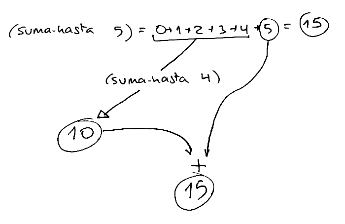

We generalize this example and express it in Scheme as follows:

```racket
(define (suma-hasta x)
   (+ (suma-hasta (- x 1)) x))
```

We are missing the base case of recursion. We must ask ourselves **what is the
simplest case of the problem, that we can calculate without making any
recursive calls?**. In this case it could be the case where `x` is 0, where we
would return 0.

We can now write everything in Scheme:

```racket
(define (suma-hasta x)
   (if (= 0 x)
      0
      (+ (suma-hasta (- x 1)) x)))
```

A clarification on the general case. In the previous implementation the
recursive call to `suma-hasta` is made in the first argument of the sum:

```racket
(+ (suma-hasta (- x 1)) x)
```

The previous expression is totally equivalent to the following one in which
the recursive call appears as the second argument

```racket
(+ x (suma-hasta (- x 1)))
```

Both expressions are equivalent because in functional programming the order in
which the arguments are evaluated does not matter. It makes no difference to
evaluate them from right to left or from left to right. Referential
transparency guarantees that the result is the same.


#### 2.7.3. Function `(alfabeto-hasta char)` ####

Let's go with another example. We want to design a function `(alfabeto-hasta
char)` that returns a string that starts with the letter `a` and ends with the
character we pass as a parameter.

For example:

```racket
(alfabeto-hasta #\h) ; ⇒ "abcdefgh"
(alfabeto-hasta #\z) ; ⇒ "abcdefghijklmnopqrstuvwxyz"
```

We think about the general case: how could we invoke the `alfabeto-hasta`
function itself so that (taking the recursive leap of faith) it does much of the work for us
(builds almost the entire string with the alphabet)?

We could have the recursive call return the alphabet up to the character
previous to the one passed to us as a parameter and then add that character to
the string returned by the recursion.

Let's look at a concrete example:

```text
(alfabeto-hasta #\h) = (alfabeto-hasta #\g) + \#h
```

The recursive call `(alfabeto-hasta #\g)` would return the string `"abcdefg"`
(taking the recursive leap of faith) and only the last letter would need to be added.

To implement this idea in Scheme all we need is to use the `string-append`
function to concatenate strings and a helper function `(anterior char)` that
returns the character before a given one.


```racket
(define (anterior char)
  (integer->char (- (char->integer char) 1)))
```

The general case would be as follows:

```racket
(define (alfabeto-hasta char)
    (string-append (alfabeto-hasta (anterior char)) (string char)))
```

The base case would be missing. What is the simplest possible case that you
can ask us for? The case of the alphabet up to `#\a`. In that case it is
enough to return the string `"a"`.

The complete function would look like this:

```racket
(define (alfabeto-hasta char)
  (if (equal? char #\a)
      "a"
      (string-append (alfabeto-hasta (anterior char)) (string char))))
```


### 2.8. Recursion and lists

Using recursion is very useful for working with sequential structures, such as
lists. We are going to start by looking at some simple examples and later we
will see some more complicated ones.

#### 2.8.1. Recursive function `suma-lista`

Let's look at a first example, the function `(suma-lista lista-nums)` that
receives a list of numbers as a parameter and returns the sum of all of them.

We should always start by writing an example of the function, to understand it
well:

```racket
(suma-lista '(12 3 5 1 8)) ; ⇒ 29
```

To design a recursive implementation of the function we have to think about
how to decompose the example into a recursive call to a smaller problem and
how to treat the value returned by the recursion to obtain the expected value.

For example, in this case we can think that to add the list of numbers `(12 3
5 1 8)` we can obtain a simpler problem (a smaller list) by doing the `rest`
of the list of numbers and calling recursion with the result. The recursive
call will return the sum of those numbers (we take the recursive leap of faith) and to that
value it is enough to add the first number in the list. We can represent it in
the following drawing:

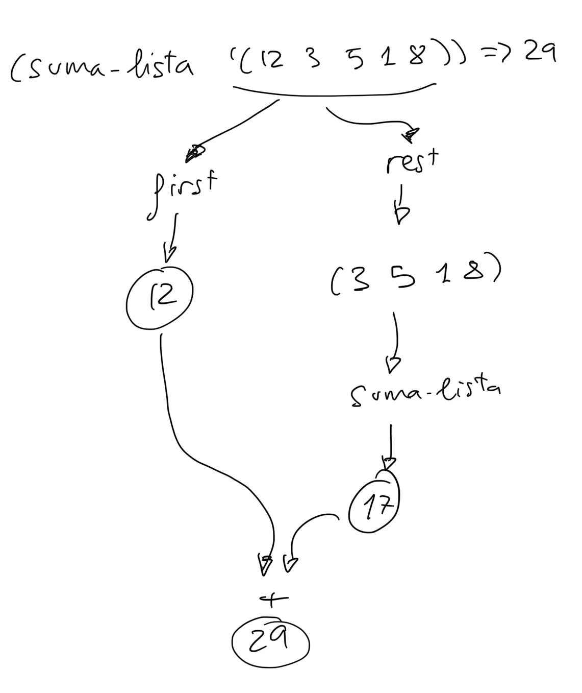

We can generalize this example and express it in Scheme in the following way:

```racket
(define (suma-lista lista)
    (+ (first lista) (suma-lista (rest lista))))
```

The base case is missing. What is the simplest list with which we can
calculate the sum of its elements without calling recursion? The simplest list
is a list with no elements, and we return 0.

With everything together, the recursion would look like this:

```racket
(define (suma-lista lista)
   (if (null? lista)
       0
	   (+ (first lista) (suma-lista (rest lista)))))
```

#### 2.8.2. Recursive function `longitud`

Let's see how to define the recursive function that returns the length of a
list, the number of elements it contains.

Let's start as always with an example:

```racket
(longitud '(a b c d e)) ; ⇒ 5
```

Assuming that the `longitud` function works correctly, how could we formulate
the general case for recursion? how could we call recursion with a smaller
problem and how can we leverage the result of this call to get the final
result?

In this case it is quite simple. If we remove an element from the list, when
we call the recursion it will return the original length minus one. In this
case:

```racket
(longitud (rest '(a b c d e))) ; ⇒
(longitud '(b c d e )) ⇒ (confiamos en la recursión) 4
```

In this way, to get the length of the initial list, we would only have to add
1 to what the recursive call returns.

If we express this general case in Scheme:

```racket
; Sólo se define el caso general, falta el caso base
(define (longitud lista)
    (+ (longitud (rest lista)) 1))
```

To define the base case we must ask ourselves what is the simplest case that
we can pass to the function. If in each recursive call we reduce the length of
the list, the base case will receive the empty list. What is the length of an
empty list? An empty list has no elements, so it is 0.

In this way we complete the definition of the function:

```racket
(define (longitud lista)
    (if (null? lista)
        0
        (+ (longitud (rest lista)) 1)))
```


In Scheme there is the function `length` that does the same thing. Returns the
length of a list:

```racket
(length '(a b c d e)) ; ⇒ 5
```


#### 2.8.3. How to check if a list has a single element ####

In the base case of some recursive functions it is necessary to check that the
list passed as a parameter has a single element. Since the function `length`
is defined in Scheme, the first idea that may occur to us is to check if the
length of the list is 1. However, it is a bad idea.

```racket
; Ejemplo de función recursiva con un caso 
; base en el que se comprueba si la lista tienen
; un único elemento
; ¡¡MALA IDEA, NO HACERLO ASÍ!!
(define (foo lista)
   (if (= (length lista) 1)
       ; devuelve caso base
       ; caso general
       ))
```

The problem with the above implementation is that the cost of the function
`length` is linear. As we have seen in the previous section, to calculate the
length of the list it is necessary to go through all its elements.
Additionally, the recursive function does that check on each recursive call.
The resulting cost of the function `foo`, therefore, is quadratic.

How to improve the cost? Keep in mind that the previous check is doing extra
things. We don't really want to know the length of the list but only if that
length is greater than one. This verification can be done in constant time.
The only thing we need to do is check if the `rest` in the list is the empty
list. If it is, we already know that the original list had a single element.

Therefore, the correct version of the previous code would be the following:

```racket
; Versión correcta para comprobar si una lista tiene
; un único elemento
(define (foo lista)
   (if (null? (rest lista))
       ; devuelve caso base
       ; caso general
       ))
```

The cost of the `(null? (rest lista))` check is constant. It does not depend
on the length of the list.

#### 2.8.4. Recursive function `veces`

As a last example we are going to define the function

```racket
(veces lista id)
```

which counts the number of times an identifier appears in a list.

For example,

```racket
(veces '(a b c a d a) 'a ) ; ⇒ 3
```

How do we state the general case? We'll call the recursion with the rest of
the list. This call will return the number of times the identifier appears in
this rest of the list. And we will add 1 to the returned value if the first
element in the list matches the identifier.

In Scheme you have to define this general case in a single expression:

```racket
(if (equal? (first lista) id)
    (+ 1 (veces (rest lista) id))
    (veces (rest lista) id))
```

As a base case, if the list is empty we return 0.

The full version:

```racket
(define (veces lista id)
  (cond
    ((null? lista) 0)
    ((equal? (first lista) id) (+ 1 (veces (rest lista) id)))
    (else (veces (rest lista) id))))

(veces '(a b a a b b) 'a) ; ⇒ 3 
```


## 3. Composite data types in Scheme

### 3.1. The Pair Data Type

#### 3.1.1. Pair Constructor Function `cons`

We have already seen in the Scheme seminar that the simplest composite data
type is the pair: an entity made up of two elements. The `cons` function is
used to build it:

```racket
(cons 1 2) ; ⇒ (1 . 2)
(define c (cons 1 2))
```

We draw the previous pair and the variable `c` that reference it as follows:

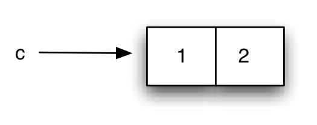

*Composite pair type*

The `cons` expression constructs a composite data item from two other data
items (which we will call left and right). The expression `(1 . 2)` is the way
the interpreter prints pairs.

#### 3.1.2. Pair construction with `quote`

Like lists, it is possible to construct pairs with the special form `quote`,
defining the pair in parentheses and separating its left and right parts with
a period:

```racket
'(1 . 2) ; ⇒ (1 . 2)
```

We will sometimes use `cons` and other times `quote` to define pairs. But we
must keep in mind that, as with lists, `quote` does not evaluate its
parameters, so we should not use it, for example, within a function in which
we want to build a pair with the results of evaluating expressions.

For example:

```racket
(define a 1)
(define b 2)
(cons a b) ; ⇒ (1 . 2)
'(a . b) ; ⇒ (a . b)
```


#### 3.1.3. Access functions `car` and `cdr`

Once a pair has been constructed, we can obtain the element corresponding to
its left part with the function `car` and its right part with the function
`cdr`:

```racket
(define c (cons 1 2))
(car c) ; ⇒ 1
(cdr c) ; ⇒ 2
```

##### 3.1.3.1. Declarative definition

The functions `cons`, `car` and `cdr` are perfectly defined with the following
algebraic equations:

```racket
(car (cons x y)) = x
(cdr (cons x y)) = y
```

!!! Note "Where do the names `car` and `cdr` come from?"
    Initially the names were CAR and CDR (in capital letters). The story
    goes back to 1959, at the origins of Lisp and has to do with the name
    given to certain memory registers of the IBM 709.

    We can read the full explanation in [The origin of CAR and CDR in
    LISP](http://www.iwriteiam.nl/HaCAR_CDR.html).

#### 3.1.4. Function `pair?`

The `pair?` function tells us if an object is atomic or a pair:

```racket
(pair? 3) ; ⇒ #f
(pair? (cons 3 4)) ; ⇒ #t
```

#### 3.1.5. Pairs can contain any type of data

We have already verified that Scheme is a *weakly typed* language. Functions
can return and receive different types of data.

For example, we could define the following function `suma` that adds both
numbers and strings:

```racket
(define (suma x y)
  (cond 
    ((and (number? x) (number? y)) (+ x y))
    ((and (string? x) (string? y)) (string-append x y))
    (else 'error)))
```

In the previous function the parameters `x` and `y` can be numbers or strings
(or even any other type). And the value returned by the function will be a
number, a string, or the symbol `'error`.

The same thing happens with the content of pairs. It is possible to save any
type of data in pairs and combine different types. For example:

```racket
(define c (cons 'hola #f))
(car c) ; ⇒ 'hola
(cdr c) ; ⇒ #f
```


#### 3.1.6. Pairs are Immutable Objects

Let us remember that in declarative and functional programming paradigms there
is no *mutable state*. Once a value is declared, it cannot be modified. This
should also happen with pairs: once a pair is created, its content cannot be
modified.

In standard Lisp and Scheme, pairs can be mutated. But during this entire
first part of the course we will not contemplate it, so as not to leave the
functional paradigm.

In Swift and other programming languages it is possible to define **immutable
data structures** that cannot be modified once created. We will also see it
later.

### 3.2. Pairs are First-Class Objects

In a programming language an element is first-class when it can be:

* Assigned to variables
* Passed as an argument
* Returned by a function
* Saved in a larger data structure

Pairs are first-class objects.

A pair can be assigned to a variable:

```racket
(define p1 (cons 1 2))
(define p2 (cons #f "hola"))
```

A pair can be passed as an argument and returned in a function:

```racket
(define (suma-parejas p1 p2)
    (cons (+ (car p1) (car p2))
          (+ (cdr p1) (cdr p2))))

(suma-parejas '(1 . 5) '(4 . 12)) ; ⇒ (5 . 17)
```

Once this `suma-parejas` function is defined, we could extend the `suma`
function that we saw previously with this new type of data:

```racket
(define (suma x y)
  (cond 
    ((and (number? x) (number? y)) (+ x y))
    ((and (string? x) (string? y)) (string-append x y))
    ((and (pair? x) (pair? y)) (suma-parejas p1 p2))
    (else 'error)))
```


And finally, pairs *can be part of other pairs*.

This is what is called the **closure property of the `cons` function**: the
result of a `cons` can be used as a parameter for new calls to `cons`.

Example:

```racket
(define p1 (cons 1 2))
(define p2 (cons 3 4))
(define p (cons p1 p2))
```

Equivalent expression:

```racket
(define p (cons (cons 1 2)
                (cons 3 4)))
```

We could represent this structure like this:

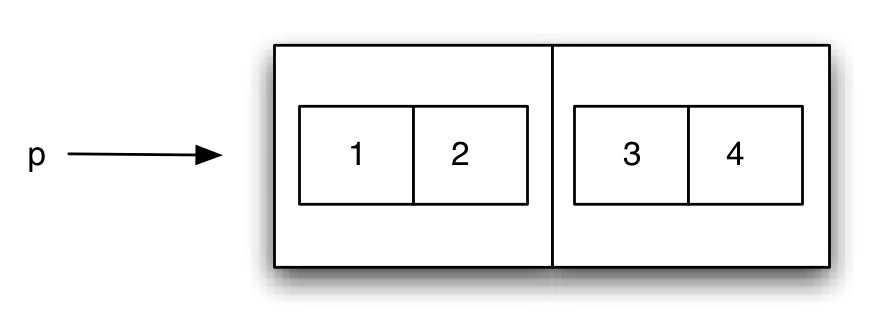

*Closure property: pairs can contain pairs*

But it would become very complicated to represent many levels of nesting. That
is why we use the following representation:

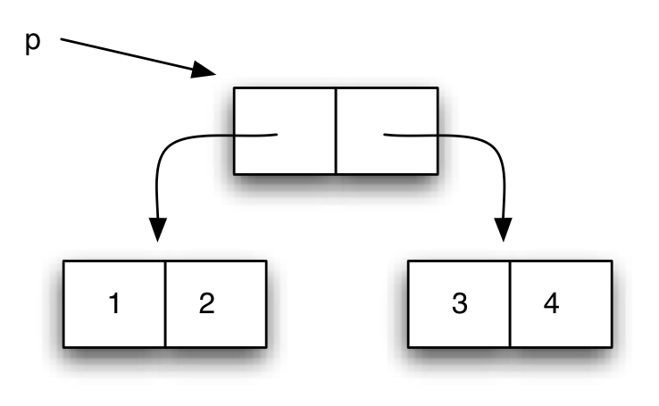

We call these diagrams *box-and-pointer* diagrams.

### 3.3. *box-and-pointer* diagrams

When writing complicated expressions with nested `cons`, it is advisable to
use the following format to improve readability:

```racket
(define p (cons (cons 1
                      (cons 3 4))
                2))
```

To understand the construction of these structures it is important to remember
that expressions are evaluated *from inside to outside*.

What figure would represent the previous structure?

Solution:

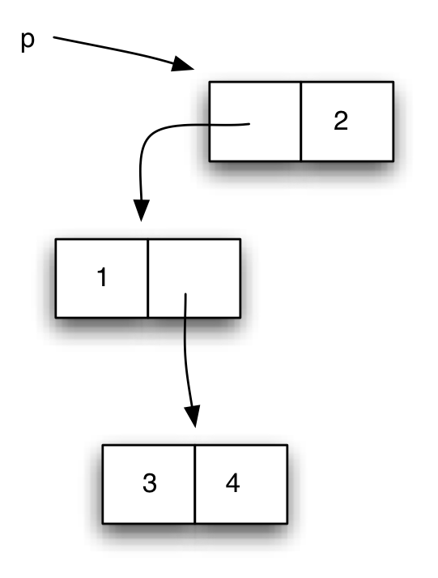

It is important to note that each box in the diagram represents a pair created
in the interpreter's memory with the `cons` instruction, and that the result
of evaluating a variable in which a pair has been stored returns the newly
created pair. For example, if the interpreter evaluates `p` after having made
the previous statement and returns the pair contained in `p`, a new pair is
not created.

For example, if after having evaluated the previous statement we evaluate the
following:

```racket
(define p2 (cons 5 (cons p 6)))
```

The resulting box-and-pointer diagram would be the following:

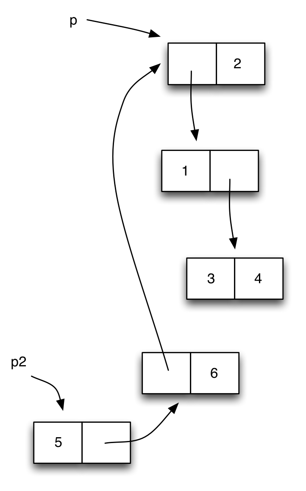

We see that in the pair created with `(cons p 6)` **the same pair that is
in `p`** is saved on the left side. We represent it with an arrow pointing to
the same pair as `p`.

!!! Note "Note"

    The way variables that contain pairs are evaluated is similar to that
    of variables that contain objects in object-oriented languages such as
    Java. When a variable containing a pair is evaluated, the pair itself
    is returned, not a copy.

    In functional programming, since the content of the pairs is
    immutable, there are no *side effects* problems due to the fact that a
    pair is shared.

It is advisable that you try to create different pair structures and draw
their box-and-pointer diagrams. And also to recover a certain
data (pair or atomic data) once the structure has been created.

The following function `print-pareja` can be useful when displaying the
elements of a pair on the screen

```racket
(define (print-pareja pareja)
    (if (pair? pareja)
        (begin 
            (display "(")
            (print-dato (car pareja))
            (display " . ")
            (print-dato (cdr pareja))
            (display ")"))
        (display "")))

(define (print-dato dato)
    (if (pair? dato)
        (print-pareja dato)
        (display dato)))
```

!!! Warning "Careful!"
    The above function contains execution steps with statements like
    `begin` and calls to `display` within the function code. These
    sentences are typical of imperative programming. **Do not do it in
    functional programming**.

#### 3.3.1. Functions c????r

When working with nested pair structures, it is very common to make calls
like:

```racket
(cdr (cdr (car p))) ; ⇒ 4
```

It is equivalent to Scheme's `cadar` function:

```racket
(cddar p) ; ⇒ 4
```

The name of the function is obtained by concatenating the letters "a" or "d"
to the letter "c", depending on whether we make a car or a cdr and ending with
the letter "r".

There are 2^4 functions of this type defined: `caaaar`, `caaadr`, …, `cddddr`.

In addition to 4-letter combinations, there are also 3, 2, and 1-letter
combinations. In total there are 30 functions of this type: 2^1 + 2^2 + 2^3 +
2^4 = 2 + 4 + 8 + 16 = 30

## 4. Lists in Scheme

### 4.1. Implementation of lists in Scheme

Let's remember that Scheme allows handling lists as a basic data type. We have
seen functions to create, add and traverse lists.

In Scheme lists are implemented using pairs, so the functions `car` and `cdr`
also work on lists.

What do they return when applied to a list? How are lists with pairs
implemented? Let's investigate it by doing some tests.

First, we're going to use the `list?` and `pair?` functions to check if
something is a list and/or a pair.

For example, a pair made up of two numbers is a pair, but it is not a list:

```racket
(define p1 (cons 1 2))
(pair? p1) ; ⇒ #t
(list? p1) ; ⇒ #f
```

If we ask if a list is a pair, we will be surprised that it is. A list is a
list (obviously) but it is also a pair:

```racket
(define lista '(1 2 3))
(list? lista); ⇒ #t
(pair? lista); ⇒ #t
```

If a list is also a pair, we can also apply the functions `car` and `cdr` with
them. What do they return? Let's see it:

```racket
(define lista '(1 2 3))
(car lista) ; ⇒  1
(cdr lista) ; ⇒  (2 3)
```

It turns out that in the pair that represents the list, the first element of
the list is stored on the left side and the rest of the list is stored on the
right side.

We can also explain then why the call to `cons` with a datum and a list builds
another list:

```racket
(define lista '(1 2 3))
(define p1 (cons 1 lista))
(list? p1) ; ⇒  #t
p1 ; ⇒ (1 1 2 3)
```

Is a pair with an empty list as the right side a list? We tried it:

```racket
(define p1 (cons 1 '()))
(pair? p1) ; ⇒  #t
(list? p1) ; ⇒  #t
```

With these examples we already have clues to deduce the relationship between
lists and pairs in Scheme (and Lisp). Let's explain it.

#### 4.1.1. Defining lists with pairs

A list is:

* A pair that contains the first element of the list on its left side and the
  rest of the list on its right side
* A special symbol `'()` denoting the empty list

It should be noted that the above definition is a recursive definition.

For example, a very simple list with a single element, `(1)`, is defined with
the following pair:

```racket
(cons 1 '())
```

The pair meets the previous conditions:

* The left side of the pair is the first element in the list (number 1)
* The right part is the rest of the list (the empty list)

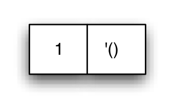

*The list (1)*

The object is both a pair and a list. The `list?` function allows you to check
if an object is a list:

```racket
(define l (cons 1 '()))
(pair? l)
(list? l)
```

For example, the list '(1 2 3) is constructed with the following sequence of
pairs:

```racket
(cons 1
      (cons 2
            (cons 3 
                  '())))
```

The first pair meets the conditions of being a list:

* Its first element is 1
* Its right side is the list '(2 3)

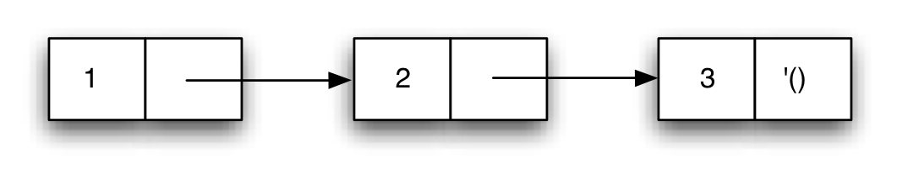

*Pairs forming a list*

By checking the implementation of lists in Scheme, we understand why the
functions `car` and `cdr` return the first element and the rest of the list.
In fact, the `first` and `rest` functions are implemented using the `car` and
`cdr` functions. When we work with lists we will always use the functions
`first` and `rest`, which are the functions of the list abstraction barrier.

#### 4.1.2. Empty list

The empty list is a list:

```racket
(list? '()) ; ⇒ #t
```

And it is not a symbol or a pair:

```racket
(symbol? '()) ; ⇒ #f
(pair? '()) ; ⇒ #f
```

To know if an object is the empty list, we can use the `null?` function:

```racket
(null? '()) ; ⇒ #t
```	

In Racket, the symbol `null` is predefined, which has the empty list as its
value:

```racket
null ; ⇒ ()
```

### 4.2. Lists with composite elements

Lists can contain any type of elements, including other pairs.

The following structure is called *association list*. They are lists whose
elements are pairs (*key*, *value*):

```racket
(list (cons 'a 1)
      (cons 'b 2)
      (cons 'c 3)) ; ⇒ ((a . 1) (b . 2) (c . 2))
```


What would be the *box-and-pointer* diagram of the above structure?

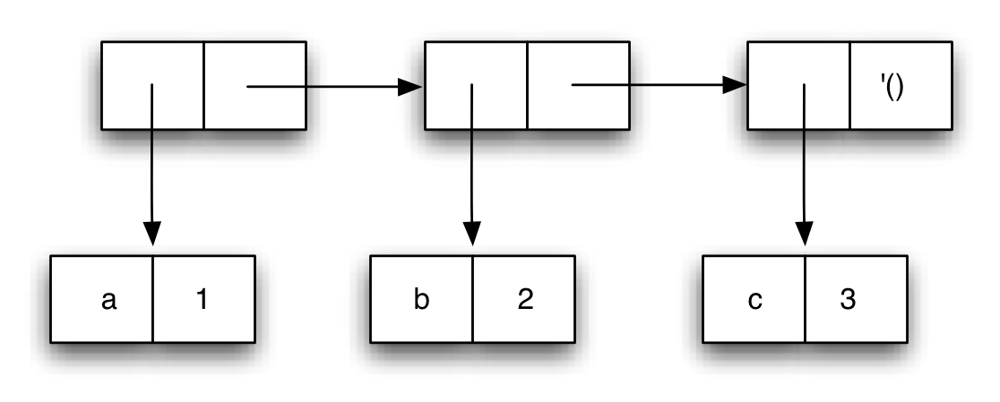

The equivalent expression using conses is:

```racket
(cons (cons 'a 1)
      (cons (cons 'b 2)
            (cons (cons 'c 3)
                  '())))
```

#### 4.2.1. Lists of lists

We have seen that we can construct lists that contain other lists:

```racket
(define lista (list 1 (list 1 2 3) 3))
```

The above list can also be defined with quote:

```racket
(define lista '(1 (1 2 3) 3))
```

The resulting list contains three elements: the first and last are atomic
elements (numbers) and the second is another list.

If we ask about the length of the list Scheme will tell us that it is a list
of 3 elements:

```racket
(length lista) ; ⇒ 3
```

And the second element of the list is another list:

```racket
(second lista) ; ⇒ (1 2 3)
```

!!! Note "Second, third, ..., tenth functions"
    In Racket there are functions that return the second, third, ... and
    so on up to the tenth element of a list. They are the functions
    `second`, `third`, ..., `tenth`. They can be consulted in the
    [language reference
    manual](https://docs.racket-lang.org/reference/pairs.html#%28part._.Additional_.List_.Functions_and_.Synonyms%29).

How does Scheme implement this list using pairs?

Being a list of three elements, it will have three linked pairs that end in an
empty list on the right side of the last pair. On the left sides of these
three pairs we will have the list elements themselves: a 1 and a 3 in the
first and last pair and a list in the second pair.

The *box-and-pointer* diagram:

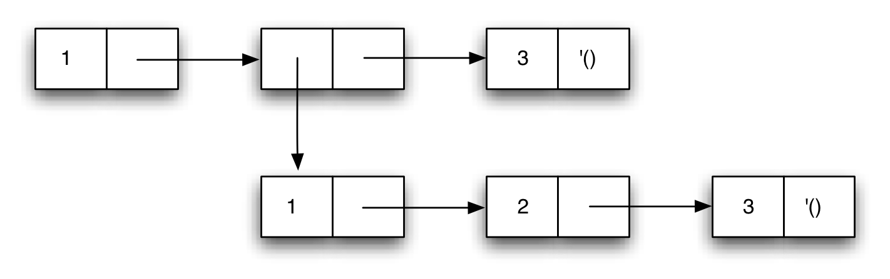

*List containing another list as second element*

#### 4.2.2. Printing of lists and pairs by the Scheme interpreter ####

The Scheme interpreter always tries to display a list when it finds a pair
whose next element is another pair.

For example, if we have the following structure:

```racket
(define p (cons 1 (cons 2 3)))
```

When `p` is evaluated, the interpreter will print the following on the screen:

```racket
(1 2 . 3)
```

Because? Because the interpreter builds the output as it runs through the `p`
pair. Since it finds a pair whose right side is another pair, it interprets it
as the beginning of a list, and that's why it writes `(1 2` instead of `(1 .
2`. But immediately afterwards you find the `3` instead of an empty list. At
that point the interpreter "realizes" that we don't have a list and ends the
expression by writing the `. 3` and the final parenthesis.

If we want to check the structure of pairs we can use the function
`print-pareja` defined above, which would print the following:

```racket
(print-pareja p) ; ⇒ (1 . (2 . 3))
```

#### 4.2.3. High-level functions on lists

It is important to know how lists are implemented using pairs and their
representation with box-and-pointer diagrams to define higher-order functions.

Once the implementation details are known, we can return to using functions
that have a higher level of abstraction such as `first` and `rest`. They are
functions that have an understandable name and that perfectly communicate what
they do (return the first element and the rest).

```racket
(first '(a b c d)) ; ⇒ a
(rest '(a b c d)) ; ⇒ (b c d)
```

There are other higher-order functions that work on lists. Some we already
know, but others we don't:

```racket
(append '(a (b) c) '((d) e f)) ; ⇒ (a (b) c (d) e f)
(list-ref '(a (b) c d) 2) ; ⇒ c
(length '(a (b (c))) ; ⇒ 2
(reverse '(a b c))  ; ⇒ (c b a)
(list-tail '(a b c d) 2) ; ⇒ (c d)
```
In the following sections we will see how they are implemented.

### 4.3. Recursive functions that build lists

To finish the section on lists in Scheme we are going to see additional
examples of recursive functions that work with lists. We'll look at some
function that receives a list and, as before, uses recursion to loop through
it. But we will also see functions that use recursion to **build new lists**.

Some of the functions we present are implementations of those already existing
in Scheme. In order not to overlap with the Scheme definitions, we will put
the prefix `mi-` in all of them.

Let's see the following functions:

- `mi-list-ref`: implementation of `list-ref` function
- `mi-list-tail`: implementation of `list-tail` function
- `mi-append`: implementation of the `append` function
- `mi-reverse`: implementation of `reverse` function
- `cuadrados-hasta`: returns the list of squares up to a given one
- `filtra-pares`: returns the list of even numbers in the list that is
  received
- `primo?`: checks whether a number is prime or not


#### 4.3.1. `mi-list-ref` function

The `(mi-list-ref n lista)` function returns the element `n` from a list
(starting at 0):

```racket
(define lista '(a b c d e f g))
(mi-list-ref lista 2) ; ⇒ c
```

Let's see with the previous example how to do the recursive formulation.

We have seen that, in general, when we want to solve a problem recursively we
have to make a recursive call to a simpler problem, **trust that the call
returns the correct result** and use that result to solve the original
problem.

In this case our problem is to obtain the number that is in position 2 of the
`(a b c d e f g)` list. We assume that we have already implemented the
function that returns a position in the list and that the recursive call will
return the correct result. How can we simplify the original problem? Let's see
the solution for this specific case:

```text
To return element 2 of the list (a b c d e f g):
   We get the rest of the list (b c d e f g)
   and return its element 1. It will be the value c (we start
   counting from 0).
```


We generalize the previous example, for any `n` and any list:


```text
To return the element at position `n` in a list,
return element n-1 of its rest.
```

And finally, we formulate the base case of recursion, the simplest problem
that can be solved directly, without making a recursive call:

```text
To return the element at position 0 in a list,
return the `first` of the list.
```

The implementation of all this in Scheme would be the following:

```racket
(define (mi-list-ref lista n)
   (if (= n 0) 
      (first lista)
      (mi-list-ref (rest lista) (- n 1))))
```

#### 4.3.2. `mi-list-tail` function

The `(mi-list-tail lista n)` function returns the list resulting from removing
n elements from the head of the original list:

```racket
(mi-list-tail '(1 2 3 4 5 6 7) 2) ; ⇒ (3 4 5 6 7)
```

Think about how it would be implemented recursively. This time we are going to
show the implementation directly, without giving explanations of how it was
arrived at:

```racket
(define (mi-list-tail lista n)
   (if (= n 0) 
       lista
       (mi-list-tail (rest lista) (- n 1))))
```

#### 4.3.3. `mi-append` function

Let's now see how we could recursively implement the `append` function that
joins two lists. We will call it `(mi-append lista1 lista2)`.

For example:

```racket
(mi-append '(a b c) '(d e f)) ; ⇒ (a b c d e f)
```

To solve the problem recursively, we must take the recursive leap of faith with a simpler
problem and then finish assembling the result returned by the recursion.

In this case, we can give recursion a simpler problem by removing the first
element from the first list (using the `rest` function) and calling recursion
to concatenate this smaller list to the second. We take the recursive leap of faith and assume that the recursive call
works correctly and returns the concatenation of both lists.

```text
(mi-append (rest '(a b c)) '(d e f)) => (b c d e f)
```

And we will add the first element to the resulting list using a `cons`:

```text
(mi-append '(a b c) '(d e f)) = 
(cons 'a (mi-append '(b c)) '(d e f)) =
(cons 'a '(b c d e f)) = 
(a b c d e f)
```

In general:

```racket
(define (mi-append lista1 lista2) 
   (cons (first lista1) (mi-append (rest lista1) lista2)))
```

The base case, the case in which the function can return a value directly
without calling recursion, is one in which `lista1` is `null?`. In that case
we return `lista2`:

```text
(mi-append '() '(a b c)) => '(a b c)
```

The complete recursive formulation is as follows:

```racket
(define (mi-append l1 l2)
    (if (null? l1)
        l2
        (cons (first l1)
              (mi-append (rest l1) l2))))
```

#### 4.3.4. `mi-reverse` function

Let's see how to recursively implement the `mi-reverse` function that reverses
a list

```racket
(mi-reverse '(1 2 3 4 5 6)) ; ⇒ (6 5 4 3 2 1)
```

The idea is simple: we call the recursion to do the inverse of the `rest` of
the list and we add the first element to the resulting list that the recursive
call returns already inverted.

We can define a helper function `(añade-al-final dato lista)` that adds data
to the end of a list using `append`:

Let's look directly at its implementation, using `mi-append` to add an element
to the end of the list:

```racket
(define (añade-al-final dato lista)
    (append lista (list dato)))
```

The function `mi-reverse` would then be as follows:

```racket
(define (mi-reverse lista)
    (if (null? lista) '()
        (añade-al-final (first lista) (mi-reverse (rest lista)))))
```

#### 4.3.5. `cuadrados-hasta` function

The `(cuadrados-hasta x)` function returns a list with the squares of the
numbers up to `x`:

```text
To build a list of the squares up to x:
   build the list of squares up to x-1 and add the square of x
```

The base case of recursion is the case where `x` is 1, so we return a list
consisting of 1.

In Scheme:

```racket
(define (cuadrados-hasta x)
   (if (= x 1)
      '(1)
      (cons (cuadrado x)
            (cuadrados-hasta (- x 1)))))
```

Example:

```racket
(cuadrados-hasta 10) ; ⇒ (100 81 64 49 36 25 16 9 4 1)
```

#### 4.3.6. `filtra-pares` function

It is very common to go through a list and check the conditions of its
elements, building a list with those that meet a certain condition.

For example, the following function `filtra-pares` constructs a list with the
even numbers of the list that we pass as a parameter:

```racket
(define (filtra-pares lista)
   (cond
      ((null? lista) '())
	  ((even? (first lista)) 
       (cons (first lista)
          (filtra-pares (rest lista))))
      (else (filtra-pares (rest lista)))))
```

In the general case, we recursively call the function to filter the `rest`
from the list. And we add the first element if it is even.

Each time we will call the recursion with a smaller list, so in the base case
we will have to check the list we receive. In that case we return the empty
list.

Example:

```racket
(filtra-pares '(1 2 3 4 5 6)) ; ⇒ (2 4 6)
```

#### 4.3.7. `primo?` function

The use of lists is one of the fundamental elements of functional programming.

As an example, let's see how to work with lists to build a function that
calculates whether a number is prime. The way to do this will be to calculate
the list of divisors of the number and check if its length is two. In that
case it will be prime.

For example:

```racket
(divisores 8) ; ⇒ (1 2 4 8) length = 4, not prime
(divisores 9) ; ⇒ (1 3 9) length = 3, not prime
(divisores 11) ; ⇒ (1 11) length = 2, prime
```

We can then define the function `(primo? x)` in the following way:

```racket
(define (primo? x)
   (=  2 
      (length (divisores x))))
```

How do we implement the function `(divisores x)` that returns the list of
divisors of a number `x`. We are going to build it in the following way:

1. We create a list of all the numbers from 1 to x
2. We filter the list to leave the divisors of x

The `(lista-desde x)` function returns a list of numbers x..1:

```racket
(define (lista-desde x)
   (if (= x 0)
      '()
      (cons x (lista-desde (- x 1)))))
```

Examples:

```racket
(lista-desde 2) ; ⇒ (2 1)
(lista-desde 10) ; ⇒ (10 9 8 7 6 5 4 3 2 1)
```

We define the function `(divisor? x y)` that tells us if x is a divisor of y:

```racket
(define (divisor? x y)
      (= 0 (remainder y x)))
```

Examples:

```racket
(divisor 2 10) ; ⇒ #t
(divisor 3 10) ; ⇒ #f
```

Once we have defined the function `divisor?` we can use it to define the
recursive function `(filtra-divisores lista x)` that returns a list with the
numbers of `lista` that are divisors of `x`:

```racket
(define (filtra-divisores lista x)
   (cond
      ((null? lista) '())
      ((divisor? (first lista) x) 
       (cons (first lista)
             (filtra-divisores (rest lista) x)))
      (else (filtra-divisores (rest lista) x))))
```

We can now implement the function that returns the divisors of a number `x` by
generating the numbers up to `x` and filtering the divisors of that number.
For example, to calculate the divisors of 10:

```racket
(filtra-divisores (1 2 3 4 5 6 7 8 9 10) 10) ; ⇒ (1 2 5 10)
```

It can be implemented in a very simple way:

```racket
(define (divisores x)
   (filtra-divisores (lista-desde x) x))
```

And once this function is defined, the `primo?` function can now work
correctly.


### 4.4. Functions with variable number of arguments

We have seen some primitive Scheme functions, such as `+` or `max` that
support a variable number of arguments. Can we also do it in functions defined
by us?

The answer is yes, using what is called *dotted-tail* notation to define the
parameters of the function. In this notation a period is placed before the
last parameter. The parameters before the period (if they exist) will have as
values the arguments used in the call and the rest of the arguments will be
passed in list form in the last parameter.

For example, if we have the definition

```racket
(define (funcion-dos-o-mas-args x y . lista-args) 
    <cuerpo>)
```

we can call the previous function with two or more arguments:

```racket
(funcion-dos-o-mas-args 1 2 3 4 5 6)
```

In the call, the parameters `x` and `y` will take the values 1 and 2. The
parameter `lista-args` will take as its value a list with the remaining
arguments `(3 4 5 6)`.

It is also possible to allow all arguments to be optional by not putting any
arguments before the dot:

```racket
(define (funcion-cualquier-numero-args . lista-args) 
    <cuerpo>)
```

If we make the call

```racket
(funcion-cualquier-numero-args 1 2 3 4 5 6)
```

the `lista-args` parameter will take the `(1 2 3 4 5 6)` list as its value.

Let's look at a simple example.

We can implement a function `mi-suma` that takes at least two arguments and
then a variable number of arguments and returns the sum of all of them. It's
very simple: we collect all the arguments in the variable argument list and
call the function `suma-lista` which adds a list of numbers:

```racket
(define (mi-suma x y . lista-nums)
    (if (null? lista-nums)
        (+ x y)
        (+ x (+ y (suma-lista lista-nums)))))
```

## 5. Functions as First-Class Data Types

We have seen that the fundamental characteristic of functional programming is
the definition of functions. We have also seen that they do not produce side
effects and have no state. A function takes some data as input and produces a
result as output.

One of the fundamental characteristics of functional programming is to
consider functions as *first-class objects*. Let us remember that a first-class
type is one who:

1. Can be assigned to a variable
2. Can be passed as an argument to a function
3. Can be returned as a result of a function invocation
4. May be part of a larger type

We are going to see that functions are examples of all the previous cases: we
are going to be able to create unnamed functions and assign them to variables,
pass them as a parameter to other functions, return them as a result of
invoking another function and save them in composite data types such as lists.

The ability to use functions as first-class objects is a fundamental feature
of functional languages. It is a feature of many multi-paradigm languages with
functional features such as
[JavaScript](http://helephant.com/2008/08/19/functions-are-first-class-objects-in-javascript/),
[Python](https://thenewcircle.com/static/bookshelf/python_fundamentals_tutorial/functional_programming.html),
[Swift](https://developer.apple.com/library/ios/documentation/Swift/Conceptual/Swift_Programming_Language/Closures.html)
or as of Java version 8, [Java
8](http://docs.oracle.com/javase/tutorial/java/javaOO/lambdaexpressions.html),
(where they are called *lambda expressions*).

### 5.1. Special form `lambda`

Let's start by explaining the `lambda` special form of Scheme, which allows us
to create anonymous functions at runtime.

In the same way that we can use strings or integers without giving them a
name, in Scheme it is possible to use a function without giving it a name
using this special way.

#### 5.1.1. Syntax of the special form `lambda`

The syntax of the special form `lambda` is:

```text
(lambda (<arg1> ... <argn>) 
    <cuerpo>)
```

The body of the lambda defines a *block of code* and its arguments are the
parameters necessary to execute that block of code. We call the resulting
function an *anonymous function*.

Some examples:

An anonymous function that adds two pairs:

```racket
(lambda (p1 p2)
    (cons (+ (car p1) (car p2))
          (+ (cdr p1) (cdr p2))))
```

An anonymous function that returns the greater of two numbers:

```racket
(lambda (a b)
    (if (> a b)
        a
        b))
```

#### 5.1.2. Semantics of the special form `lambda`

Invoking the special form `lambda` constructs an anonymous function at run
time.

For example, if we execute a lambda expression in the interpreter we will see
that it returns a procedure:

```racket
(lambda (x) (* x x)) ; ⇒ #<procedure>
```

The constructed procedure is a block of code that returns the square of a
number.

What can we do with this procedure?

We can assign it to an identifier. For example, in the following expression,
the *lambda expression* is evaluated first and the resulting procedure is
associated with the identifier `f`.

```racket
(define f (lambda (x) (* x x)))
```

The previous example works identically to the following:

```racket
(define x (+ 2 3))
```

In both cases the right expression is evaluated and the result is saved in an
identifier. In the first case the expression being evaluated returns a
procedure, which is saved in the variable `f` and in the second a number,
which is saved in the variable `x`.

If we write the identifiers `f` and `x` in the Scheme interpreter, it
evaluates them and displays the saved values:

```racket
f ; ⇒ #<procedure:f>
x ; ⇒ 5
```

In the first case a procedure is returned and in the second a number. Note
that Scheme treats procedures and numbers the same way; These are what are
called first-class data.

Once a procedure is assigned to an identifier, we can use it in the same way
that we usually invoke a function:

```racket
(f 3) ; ⇒ 9
```

An identifier is not necessary to invoke a function; We can create the
function with a lambda expression and call the newly created anonymous
function:

```racket
((lambda (x) (* x x)) 3) ; ⇒ 9
```

The call to `lambda` creates a procedure and the parenthesis to its left
invokes it with parameter 3:

```racket
((lambda (x) (* x x)) 3) ; ⇒ (#<procedure> 3) ⇒ 9
```

It is important to note that with `lambda` we are creating a function at
*runtime*. It is code that we create for later invocation.

Each programming language has its own syntax of lambda expressions. For
example, the following expressions create a function that returns the square
of a number:

**Java 8**

```java
Integer x -> {x*x}
```

**Scala**

```scala
(x:Int) => {x*x}
```

**Objective C**

```objective-c
^int (int x)
{
   x*x
};
```

**Swift**

```swift
{ (x: Int) -> Int in return x*x }
```

#### 5.1.3. Identifiers and functions

After knowing `lambda` we can now explain why when we write the name of any
function in the Scheme interpreter, it is evaluated to a *procedure*:

```racket
+ ; ⇒ <procedure:+>
append ; ⇒ #<procedure:append>
```

The identifier is evaluated and returns the *function object* to which it is
bound. In Scheme the names of functions are actually symbols to which *objects
of type function* are linked.

We can also verify in this way that `and` and `or` are not functions. If we
type `and` or `or` and try to evaluate either symbol, we will see Scheme
return an error:

```racket
and
; and: bad syntax in: and
or 
; or: bad syntax in: or
```

We can map existing functions to new identifiers using `define`, as in the
following example:

```racket
+ ; ⇒ <procedure:+>
(define suma +)
(suma 1 2 3 4) ; ⇒ 10
```

It is very important to realize that the expression `(define suma +)`
evaluates identically to `(define y x)`. The identifier `+` is evaluated
first, which returns the *function object* sum, which is assigned to the
variable `suma`. The end result is that both `+` and `suma` have the same
procedure as their value:

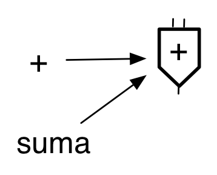

The `define` special way to define a function is nothing more than *syntactic
sugar*.

```text
(define (<nombre> <args>)
    <cuerpo>)
```

always converted internally to:

```text
(define <nombre> 
    (lambda (<args>)
        <cuerpo>))
```

For example

```racket
(define (cuadrado x)
    (* x x))
```

is equivalent to:

```racket
(define cuadrado 
    (lambda (x) (* x x)))
```

#### 5.1.4. Predicate `procedure?`

We can check if something is a function using the Scheme predicate
`procedure?`.

For example:

```racket
(procedure? (lambda (x) (* x x))) ; ⇒ #t
(define suma +)
(procedure? suma) ; ⇒ #t
(procedure? '+) ; ⇒ #f
```

We have seen that functions can be assigned to variables. They also meet the
other conditions necessary to be considered first-class objects.

### 5.2. Functions arguments of other functions

We have already seen an example of how to pass a function as a parameter to
another. Let's look at another example.

For example, we can define the function `aplica` that receives a function in
the parameter `func` and two values in the parameters `x` and `y` and returns
the result of invoking the function that we passed as a parameter with `x` and
`y`. The function passed as a parameter must have two arguments.

To invoke the function passed as a parameter, simply use `func` as its name.
The function has been bound to the name `func` at the time of invocation to
`aplica`, in the same way that the arguments are bound to the parameters `x`
and `y`:

```racket
(define (aplica f x y)
   (f x y))
```

Some invocation examples, using primitive functions, defined functions and
lambda expressions:

```racket
(aplica + 2 3) ; ⇒ 5
(aplica * 4 5) ; ⇒ 10
(aplica string-append "hola" "adios") ; ⇒ "holaadios"

(define (string-append-con-guion s1 s2)
    (string-append s1 "-" s2))

(aplica string-append-con-guion "hola" "adios") ; ⇒ "hola-adios"

(aplica (lambda (x y) (sqrt (+ (* x x) (* y y)))) 3 4) ; ⇒ 5
```

Another example, the function `aplica-2` which takes two functions `f` and `g`
and one argument `x` and returns the result of applying `f` to what is
returned by invoking `g` with `x`:

```racket
(define (aplica-2 f g x)
   (f (g x)))

(define (suma-5 x)
   (+ x 5))
(define (doble x)
   (+ x x))
(aplica-2 suma-5 doble 3) ; ⇒ 11
```

### 5.3. Function `apply` ###

The Scheme function `(apply function list)` allows you to apply an `n`-arity
function to a list of `n` data items, causing each of the data to be passed
to the function in order as parameters.

The `apply` function receives a function and a list and returns the result of
applying the function to the data in the list, taking them as parameters.

For example, we can apply the sum function to a list of numbers:

```racket
(apply + '(1 2 3 4)) ; ⇒ 10
```

We can pass `apply` a lambda expression:

```racket
(apply (lambda (x y) (+ x (* 2 y))) '(2 5)) ; ⇒ 12
```

The list that we pass as an argument to `apply` must have as many elements as
the function we apply has parameters. Otherwise, an error occurs:

```racket
(apply cons '(a b c)) ; ⇒ error
cons: arity mismatch;
 the expected number of arguments does not match the given number
  expected: 2
  given: 3
  arguments...:
```

The correct way to do it:

```racket
(apply cons '(a b)) ; ⇒ (a . b)
```

#### 5.3.1. `apply` function and recursive functions ####

Using `apply` we can define recursive functions with variable number of
arguments.

##### Example `suma-nums` #####

For example, suppose we want to define the function `suma-nums` that adds a
variable number of arguments:

```racket
(suma-nums 2 5 10 1) ; ⇒ 18
```

Could we define `suma-nums` recursively? It should have the following form:

```racket
(define (suma-nums . args)
   (if (null? args)
       0
       (+ (first args) (suma-nums ....))))
```

The question is how to make the recursive call. Suppose we call the main
function with the above example. Since `suma-nums` is a function with a
variable number of arguments, the recursive call would have to be made with
the numbers 5, 10, 1 as arguments.

```
(suma-nums 2 5 10 1) =>
(+ 2 (suma-nums 5 10 1))
```

And yet, what we have in `args` is a list of numbers. We cannot make the
recursive call with `(rest args)` because `suma-nums` does not receive a list
as an argument, but rather a variable number of arguments.

We need to get the numbers from the `(5 10 1)` list "unpacked" to call the
recursion by putting them as arguments to `suma-nums`: `(suma-nums 5 10 1)`.

The solution is to use `apply`:

```racket
(define (suma-nums . args)
   (if (null? args)
       0
       (+ (first args) (apply suma-nums (rest args)))))
```

Using `apply` makes the call recursive by placing all the elements of the rest
of the original list as arguments of `suma-nums`.


##### Example `suma-parejas` #####

As another similar example, suppose we want to define the function `suma-parejas`
that adds a variable number of pairs:

```racket
(suma-parejas '(1 . 2) '(3 . 4) '(5 . 6)) ; ⇒ '(9 . 12)
```

Let's remember the definition of the function that adds two pairs:

```racket
(define (suma-pareja p1 p2)
  (cons (+ (car p1) (car p2))
        (+ (cdr p1) (cdr p2))))
```

We can then build the function `suma-parejas` that receives a list of pairs
(variable number of arguments) by calling `apply` to add all the pairs from
the rest of the list. And add the resulting pair with the first pair on the
list:

```racket
(define (suma-parejas . parejas)
  (if (null? parejas)
      '(0 . 0)
      (suma-pareja (first parejas) (apply suma-parejas (rest parejas)))))
```

As before, this is an indirect recursive call, because the function
`suma-parejas` itself is called not directly, but through `apply`. And `apply`
manages to "unpack" the pairs from the rest of the pairs and pass them as
arguments to `suma-parejas`.

The following image shows a graphical representation of how this recursion
works:

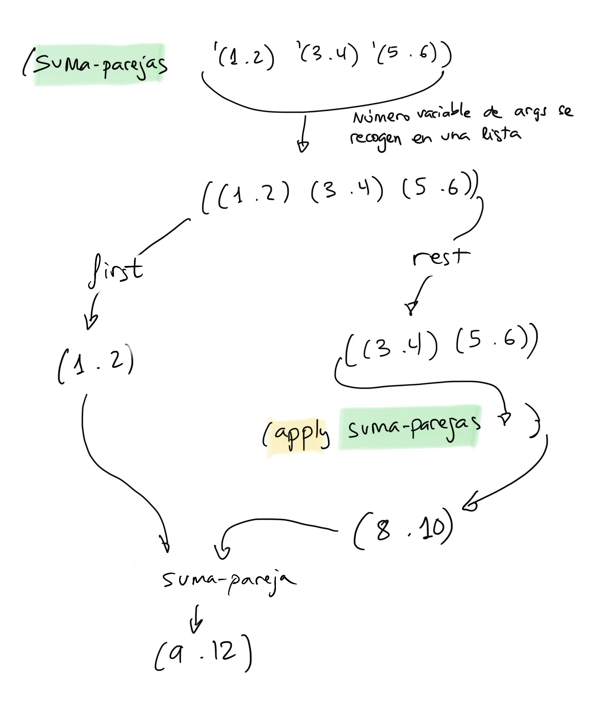


### 5.4. Generalization ###

The ability to pass functions as parameters of others is a powerful
abstraction tool. It will allow us to design more generic functions.

Let's look at an example. Suppose we want to calculate the sum of `a` to `b`:

```racket
(define (sum-x a b)
    (if (> a b)
        0
        (+ a (sum-x (+ a 1) b))))

(sum-x 1 10) ; ⇒ 55
```

Now suppose that we want to calculate the sum of `a` to `b` by adding the
squared numbers:

```racket
(define (sum-cuadrado-x a b)
    (if (> a b)
        0
        (+ (* a a) (sum-cuadrado-x (+ a 1) b))))

(sum-cuadrado-x 1 10) ; ⇒ 385
```

And the sum of `a` to `b` adding the cubes:

```racket
(define (sum-cubo-x a b)
    (if (> a b)
        0
        (+ (* a a a) (sum-cubo-x (+ a 1) b))))

(sum-cubo-x 1 10) ; ⇒ 3025
```

We see that the code of the three previous functions is very similar, each
function can be obtained by *copy-paste* another previous one. The only thing
that changes is the function to apply to each number in the series.

Whenever we do *copy-paste* when programming we have to start suspecting that
we are not generalizing the code enough. A *copy-paste* also drags *bugs* and
forces us to make multiple modifications to the code when we have to change
things in the future.

The possibility of passing a function as a parameter comes to our aid to
generalize the above code. In this case, the only thing that changes in the
previous three functions is the function to be applied to the numbers in the
series. In the first case nothing is done, in the second it is squared and in
the third case it is cubed.

We can take that function as an additional parameter and define a generic
function `sum-f-x` that generalizes the previous three functions. We would
have the sum from `a` to `b` of `f(x)`:

```racket
(define (sum-f-x f a b)
    (if (> a b)
        0
        (+ (f a) (sum-f-x f (+ a 1) b))))
```

The previous functions are particular cases of this function that generalizes
them. For example, to calculate the sum from 1 to 10 of `x` cubed:

```racket
(define (cubo x)
    (* x x x))

(sum-f-x cubo 1 10) ; ⇒ 3025
```


We can also use a lambda expression in the invocation of `sum-f` that
constructs the function that we want to apply to each number. For example, we
can add the expression (n/(n-1)) for all numbers from 2 to 100:

```racket
(sum-f-x (lambda (n) (/ n (- n 1))) 2 100)
```

We will see many more examples of functions passed as parameters and the
generality that this pattern allows later when we study higher-order
functions.

### 5.5. Functions that return functions

Any first-class object can be returned by a function; integers, booleans,
pairs, etc. They are primitive objects and we can define functions that return
them.

In the functional paradigm the same thing happens with functions. We can
define a function that when called constructs another function and returns it
as a result.

This is one of the most important characteristics that differentiates
functional programming languages from others that are not. In languages like
C, C++ or Java (before Java 8) it is not possible to do this.

To return a function in Scheme we must use the special form `lambda` in the
body of a function. Thus, when this function is called, `lambda` is evaluated
and the resulting function is returned. It is a function that we create at
runtime, during the evaluation of the main function.

The function that is returned is called **closure**
([Wikipedia](https://en.wikipedia.org/wiki/Closure_(computer_programming))). And we
say that the function that has constructed the closure is a **constructor
function**.


#### 5.5.1. `construye-sumador` function

Let's start with a very simple example. We define a constructor function that
creates a function that adds `k` to a number when executed:

```racket
(define (construye-sumador k)
   (lambda (x)
       (+ x k)))
```

The body of the `(construye-sumador k)` function is made up of a lambda
expression. When `construye-sumador` is called, this lambda expression is
evaluated and the created procedure is returned.

In this case, another function with 1 argument is constructed that adds `k` to
the argument.

For example, we can call `construye-sumador` by passing 10 as a parameter:

```racket
(construye-sumador 10) ; ⇒ #<procedure>
```

As we have said, a procedure, a function, is returned. This returned function
must be called with one argument and will return the result of adding 10 to
that argument:

```racket
(define f (construye-sumador 10))
(f 3) ; ⇒ 13
```

We can also directly invoke the function that returns the constructor
function, without saving it in a variable:

```racket
((construye-sumador 10) 3) ; ⇒ 13
```

Depending on the parameter that we pass to the constructor function, we will
obtain an adder function that adds one number or another. For example to
obtain an adder function that adds 100:

```racket
(define g (construye-sumador 100))
(g 3) ; ⇒ 103
```

How does closure work? Why does calling `(g 3)` return 103?

Here we must depart quite a bit from the substitution evaluation model that we
have seen and use a new model in which the scopes of the variables are taken
into account.

We are not going to explain this model in detail, but we will give a few brief
touches.

Let's remember the definition of `construye-sumador`:

```racket
(define (construye-sumador k)
   (lambda (x)
       (+ x k)))
```

And suppose we make the following invocations:

```racket
(define g (construye-sumador 100))
(g 3) ; ⇒ 103
(define f (construye-sumador 50))
(f 3) ; ⇒ 53
```

We can explain what happens in the evaluation of these functions in the
following way:

- When we call `construye-sumador` with a specific value for `k` (for example
  100), the value of 100 is bound to the `k` parameter in the local scope of
  the function.
- In this local scope the lambda expression creates a function. This function
  created in the local scope **captures** this local scope, with its variables
  and their values (in this case the variable `k` and its value 100).
- When the function is called from outside (when we called `g` in the example)
  the body of the function `(+ x k)` is executed with `x` being the parameter
  (3) and the value of `k` is obtained from the captured scope (100).
- In the case of the second invocation to `construye-sumador`, the value of
  the parameter is 50 and another local scope is created in which `k` is worth
  50. That value is captured by the new closure that creates the lambda
  expression, which is returned by the function and saved in the variable `f`.

The following image graphically shows the above explanation. You can see on
the left the execution of the code and on the right the effect that this
execution has on memory, including the values associated with the variables
and the local scopes created in the different invocations of the functions.

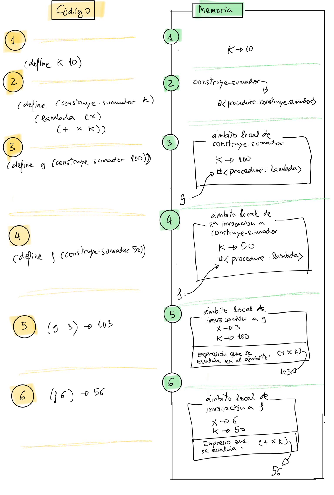

The fact that a function created at the local scope captures this scope is
what makes it called a **closure**. The function _closes_ on the captured
scope and can use its variables.


#### 5.5.2. `construye-composicion` function

Another example of a function that returns another function is the following
function `(construye-composicion f g)` that receives two functions of one
argument and returns another function that performs the composition of both:

```racket
(define (construye-composicion f g)
    (lambda (x)
	    (f (g x))))
```

The returned function first calls `g` and passes the result to `f`. Let's look
at an example. Suppose we have defined the function `cuadrado` and `doble`
that calculate the square and double of a number respectively. We can then
call `construye-composicion` with those two functions to build another
function that first calculates the square of a number and then doubles it:

```racket
(define h (construye-composicion doble cuadrado))
```

The variable `h` contains the function returned by `construye-composicion`. A
one-argument function that returns twice the square of a number:

```racket
(h 4) ; ⇒ 32
```


#### 5.5.3. `construye-segura` function

Let's see a last example in which we define a constructor function that
extends already existing functions.

Let's remember the function `lista-desde`:

```racket
(define (lista-desde x)
   (if (= x 0)
      '()
      (cons x (lista-desde (- x 1)))))
```

A problem with the previous function is that if we pass it a negative number
it goes into an infinite loop.

We define the function `(construye-segura condicion f)` that receives two
functions: a predicate and another function, both with one argument. It returns
another function in which `f` will only be called if the argument satisfies
`condicion`.

```racket
(define (construye-segura condicion f)
  (lambda (x)
    (if (condicion x)
        (f x)
        'error)))
```

The function constructs an anonymous function from an argument `x` (same as
`f`) in whose body it checks whether the argument satisfies the condition and
only in that case `f` is called.

We can then construct a safe function from the `lista-desde` function in which
`error` is returned if the argument is a negative number:

```racket
(define lista-desde-segura
   (construye-segura (lambda (x) (>= x 0)) lista-desde))
(lista-desde-segura 8) ; ⇒ (8 7 6 5 4 3 2 1)
(lista-desde-segura -1) ; ⇒ error
```

We could use `construye-segura` with any 1-argument function that we want to
make safe. For example, the function `sqrt`:

```racket
(define sqrt-segura (construye-segura (lambda (x) (>= x 0)) sqrt))
(sqrt-segura 100) ; ⇒ 10
(sqrt-segura -100) ; ⇒ error
```

The power of constructor functions comes from the fact that it is possible to
create new functions at runtime. It is not necessary to know the conditions
and characteristics of these new functions a priori, when we are compiling our
program. Instead, they may depend on data obtained from the user or from other
program modules at run time.

For example, the `construye-segura` condition could contain values obtained at
run time, so that the function we want to make safe would only be called if
the number is in a range defined by those values:

```racket
(construye-segura (lambda (x) (and (>= x limite-inf)
                                   (<= x limite-sup))) f))
```


### 5.6. Functions in data structures

The last characteristic of first-class types is that they can be part of
composite data types, such as lists.

To build a list of functions we must call `list` with the functions:

```racket
(define (cuadrado x) (* x x))
(define (suma-1 x) (+ x 1))
(define (doble x) (* x 2))

(define lista (list cuadrado suma-1 doble))
lista 
; ⇒ (#<procedure:cuadrado>  #<procedure:suma-1>  #<procedure:doble>)
```

We can also define functions with lambda expressions. For example, we can add
a function that adds 5 to a number to the list:


```racket
(define lista2 (cons (lambda (x) (+ x 5)) lista))
lista2 
; ⇒ (#<procedure> #<procedure:cuadrado> #<procedure:suma-1> #<procedure:doble>)
```

Once a list with functions has been created, how can we invoke any of them? We
must treat them in the same way as we treat any other data saved in the list,
we retrieve them with the `first` or `list-ref` functions and invoke them.

For example, to call the first function of `lista2`:

```racket
((first lista2) 10) ; ⇒ 15
```

Or the third:

```racket
((list-ref lista2 2) 10) ; ⇒ 11
```

#### 5.6.1. Functions that work with function lists

Let's look at an example of a function `(aplica-funcs lista-funcs x)` that
receives a list of functions in the `lista-funcs` parameter and applies them
all **from right to left** to the number we pass in the `x` parameter.

For example, suppose the list above contains the functions `cuadrado`, `cubo`,
and `suma-1`:

```racket
(define lista (list cuadrado cubo suma-1))
```

The call to `(aplica-funcs lista 5)` should return the result of first
applying `suma-1` to 5, then `cubo` to the result, and then `cuadrado`:

```racket
(cuadrado (cubo (suma-1 5)) ; ⇒ 46656
```

To implement `aplica-funcs` we have to use a recursion. If we see the example,
we can see that it is easy to define the general case:

```text
(aplica-funcs (cuadrado cubo suma-1) 5) = 
(cuadrado (aplica-funcs (cubo suma-1) 5)) =
(cuadrado 216) = 46656
```

The general case of recursion of the `aplica-funcs` function is then defined
as:

```racket
(define (aplica-funcs lista-funcs x)
    ; falta el caso base
    ((first lista-funcs) (aplica-funcs (rest lista-funcs) x)))
```

The base case would be where the function list is empty, in which case the
number itself is returned:

```racket
(if (null? lista-funcs) ; la lista de funciones está vacía
    x ; devolvemos el propio número
    ...
```

The complete implementation is:

```racket
(define (aplica-funcs lista-funcs x)
    (if (null? lista-funcs)
        x
        ((first lista-funcs)
            (aplica-funcs (rest lista-funcs) x))))
```

An example of use:

```racket
(define lista-funcs (list (lambda (x) (* x x))
                          (lambda (x) (* x x x))
                          (lambda (x) (+ x 1))))
(aplica-funcs lista-funcs 5) ; ⇒ 46656
```


### 5.7. Higher-order functions

We call functions that take other functions as parameters or return another
function **higher-order functions**. They allow
solutions to be generalized with a high degree of abstraction.

We have already seen some higher-order functions, some built by us and others
from Scheme, such as `apply`.

In addition to `apply`, functional programming languages such as Scheme, Scala
or Java 8 already have some other higher-order functions predefined that work
with lists. These functions allow you to define operations on lists in a very
concise and compact way. They are widely used, because they can also be used
on _streams_ of data obtained in input/output operations (for example, JSON
data resulting from an HTTP request).

Let's see the most important functions, their use and implementation.

- `map`
- `filter`
- `exists?`
- `for-all?`
- `foldr` and `foldl`

After explaining these functions, we will finish with an example of their
application in which we will see how the use of higher-order functions is an
excellent functional programming tool that allows us to make very concise and
expressive code.

Combining higher-order functions with lists is one of the most powerful
features of functional programming.

#### 5.7.1. `map` function

We start with the function `map`. The word `map` comes from the English
`mapping` or transformation. This is a function that **transforms** a list by
applying a transformation function that is passed as a parameter to all its
elements.

Specifically, the function receives another function and a list:

```text
(map transform list) -> list
```

And returns the list resulting from applying the function to all the elements
in the list.

The transformation function receives list elements as arguments and returns the
result of transforming that element.

```text
(transform element) -> element
```


For example:

```racket
(map cuadrado '(1 2 3 4 5)) ; ⇒ (1 4 9 16 25)
```

The resulting list is the result of constructing a new list by applying the
`cuadrado` function to all elements of the original list.

The transformation function must be compatible with the elements in the original
list. For example, if the list is a list of pairs, the transform function must
receive a pair. Let's see an example of this case, in which from a list of
pairs we obtain a list with the sums of each pair:

```racket
(define (suma-pareja pareja)
    (+ (car pareja) (cdr pareja)))

(map suma-pareja '((2 . 4) (3 . 6) (5 . 3))) ; ⇒ (6 9 8)
```

We could also do it with a lambda expression:

```racket
(map (lambda (pareja)
         (+ (car pareja) (cdr pareja))) '((2 . 4) (3 . 6) (5 . 3))) 
; ⇒ (6 9 8)
```


One last example, where we use `map` to transform a list of symbols into a
list with their lengths:

```racket
(map (lambda (s) 
        (string-length (symbol->string s))) '(Esta es una lista de símbolos))
; ⇒ (4 2 3 5 2 8)
```

##### 5.7.1.1. `map` implementation

How could `map` be implemented recursively? We define the function `mi-map`.
The implementation is as follows:

```racket
(define (mi-map f lista)
    (if (null? lista)
        '()
        (cons (f (first lista))
              (mi-map f (rest lista)))))
```


##### 5.7.1.2. `map` function with more than one list


The `map` function can receive a variable number of lists, all of the same
length:

```text
(map transform list_1 ... list_n) -> list
```

In this case the transform function must receive as many arguments as lists
`map` receives:

```text
(transform data_1 ... data_n) -> data
```

The function `map` applies `transform` to the elements taken from the n lists
and thus builds the resulting list.

Examples:

```racket

(map + '(1 2 3) '(10 20 30)) ; ⇒ (11 22 33)
(map cons '(1 2 3) '(10 20 30)) ; ⇒ ((1 . 10) (2 . 20) (3 . 30))
(map > '(12 3 40) '(20 0 10)) ; ⇒ (#f #t #t)

(define (mayor a b) (if (> a b) a b))
(define (mayor-de-tres a b c)
    (mayor a (mayor b c)))

(map mayor-de-tres '(10 2 20 -1 34) 
                   '(2 3 12 89 0) 
                   '(100 -10 23 45 8))
; ⇒ (100 3 23 89 34)
```

!!! Tip "Advice"
    The `map` function receives a list of *n* elements and returns a list
    of *n* transformed elements.


#### 5.7.2. `filter` function

Let's look at another higher-order function that works on lists.

The function `(filter predicate list)` takes as parameters a predicate and a
list and returns as a result the elements of the list that satisfy the
predicate.

```text
(filter predicate list) -> list
```

The `(predicate elem)` function that uses `filter` receives elements from the
list and returns `#t` or `#f`.

```text
(predicate elem) -> boolean
```

An example of use:

```racket
(filter even? '(1 2 3 4 5 6 7 8)) ; ⇒ (2 4 6 8)
```

Another example: suppose we want to filter a list of pairs of numbers,
returning those pairs whose left side is greater than or equal to the right
side. We could do it with the following expression:

```racket
(filter (lambda (pareja)
            (>= (car pareja) (cdr pareja))) 
        '((10 . 4) (2 . 4) (8 . 8) (10 . 20)))
; ⇒ ((10 . 4) (8 . 8))
```

And one last example: we filter all symbols with length less than 4.

```racket
(filter (lambda (s) 
           (>= (string-length (symbol->string s)) 4))
           '(Esta es una lista de símbolos))
; ⇒ (Esta lista símbolos)
```


!!! Tip "Advice"
    The `filter` function receives a list of *n* elements and returns a
    list with *n* or fewer original elements filtered by a condition.


##### 5.7.2.1. `filter` implementation

We can implement the `filter` function recursively:

```racket
(define (mi-filter pred lista)
  (cond
    ((null? lista) '())
    ((pred (first lista)) (cons (first lista)
                              (mi-filter pred (rest lista))))
    (else (mi-filter pred (rest lista)))))
```

#### 5.7.3. `exists?` function

The higher-order function `exists?` receives a predicate and a list and checks
whether any element in the list satisfies that predicate.

```text
(exists? predicate list) -> boolean
```

As with `filter`, the `predicate` receives elements from the list and returns
`#t` or `#f`.

```text
(predicate elem) -> boolean
```

The function `exists?` is not defined with this name in Racket, although it is
in Scheme. In Racket it is called `ormap`. We incorporate its definition into
[file
`lpp.rkt`](https://raw.githubusercontent.com/domingogallardo/apuntes-lpp/master/src/lpp.rkt)
so we can use it in lab sessions.

Example of use:

```racket
(exists? even? '(1 2 3 4 5 6)) ; ⇒ #t
(exists? (lambda (x)
             (> x 10)) '(1 3 5 8)) ; ⇒ #f
```

The recursive implementation of `exists?` is as follows:

```racket
(define (exists? predicado lista)
  (if (null? lista)
      #f
      (or (predicado (first lista))
          (exists? predicado (rest lista)))))
```

#### 5.7.4. `for-all?` function

The higher-order function `for-all?` receives a predicate and a list and
checks that all elements in the list satisfy that predicate.

The function is not defined with this name in Racket either, although it is in
Scheme. Like `exists?`, we include its definition in [file
`lpp.rkt`](https://raw.githubusercontent.com/domingogallardo/apuntes-lpp/master/src/lpp.rkt).

In Racket there is an equivalent function called `andmap`.

Example of use:

```racket
(for-all? even? '(2 4 6)) ; ⇒ #t
(for-all? (lambda (x)
             (> x 10)) '(12 30 50 80)) ; ⇒ #t
```

The recursive implementation of `for-all?` is as follows:

```racket
(define (for-all? predicado lista)
  (or (null? lista)
      (and (predicado (first lista))
           (for-all? predicado (rest lista)))))
```

The recursive call checks that all elements in the rest of the list satisfy
the predicate and the first element must also satisfy. An empty list always returns `#t` (by having no elements, we can say that all its elements
satisfy the predicate).


#### 5.7.5. `foldr` function

Let's now look at the `(foldr combine base list)` function that allows you to
traverse a list by applying a binary function cumulatively to its elements and
returning a single value as a result.

```text
(foldr combine base list) -> value
```

The name `fold` means *folded*, indicating that the list to which it is
applied is "folded" and at the end a single result is returned. The folding is
carried out by the **folding function** `(combine datum result)`, which
receives a piece of data from the list and accumulates it with the other
parameter `result` (which we must give an initial value and is the
parameter `base` of the function `foldr`).

```text
(combine datum result) -> result
```

The `combine` function is applied to the elements of the list **from right to
left**, starting with the last element of the list and the initial value
`base` and successively applying it to the results that are obtained.

Let's look at an example. Suppose that the folding function is a function that
adds the data that comes from the list with the accumulated value:


```racket
(define (suma dato resultado)
    (+ dato resultado))
```

We call the parameters `datum` and `result` to emphasize that the first
parameter is going to be taken from the list and the second from the
calculated result.

Let's see what happens when we make a `foldr` with this sum function and the
list '(1 2 3) and with the number 0 as a base:

```racket
(foldr suma 0 '(1 2 3)) ; ⇒ 6
```

The `suma` function will be applied to all the elements of the list from
**right to left**, starting with the base value (0) and the last element of
the list (3) and taking the result obtained and using it as the new parameter
`result` in the next call.

Specifically, the sequence of calls to the `suma` function will be as follows:

```racket
(suma 3 0) ; ⇒ 3
(suma 2 3) ; ⇒ 5
(suma 1 5) ; ⇒ 6
```

Another example of use:

```racket
(foldr string-append "****" '("hola" "que" "tal")) ; ⇒ "holaquetal****"
```

In this case, the sequence of calls to `string-append` that will occur are:

```racket
(string-append "tal" "****") ; ⇒ "tal****"
(string-append "que" "tal****") ; ⇒ "quetal****"
(string-append "hola" "quetal****") ; ⇒ "holaquetal****"
```

Other examples:

```racket
(foldr (lambda (x y) (* x y)) 1 '(1 2 3 4 5 6 7 8)) ; ⇒ 40320
(foldr cons '() '(1 2 3 4)) ; ⇒ (1 2 3 4)
```

One last example:

```racket
(define (suma-parejas lista-parejas)
    (foldr (lambda (pareja resultado)
                   (+ (car pareja) (cdr pareja) resultado)) 0 lista-parejas))

(suma-parejas (list (cons 3 6) (cons 2 9) (cons -1 8) (cons 9 3))) ; ⇒ 39
```


##### 5.7.5.1. `foldr` implementation

We can recursively implement the `foldr` function:

```racket
(define (mi-foldr func base lista)
  (if (null? lista)
      base
      (func (first lista) (mi-foldr func base (rest lista)))))
```


#### 5.7.6. Function `foldl` ####

The `(foldl combine base list)` (_fold left_) function is similar to `foldr`
with the difference that the sequence of applications of the fold function is
**left to right** instead of right to left.

The folding function profile is the same as in `foldr`:

```text
(func datum result) -> result
```

For example, if the join function is `string-append`:

```racket
(foldl string-append "****" '("hola" "que" "tal")) 
; ⇒ "talquehola****"
```

The sequence of calls to `string-append` is:

```racket
(string-append "hola" "****") ; ⇒ "hola****"
(string-append "que" "hola****") ; ⇒ "quehola****"
(string-append "tal" "quehola****") ; ⇒ "talquehola****"
```

Another example:

```racket
(foldl cons '() '(1 2 3 4)) ; ⇒ (4 3 2 1)
```

We will see the implementation of `foldl` when we talk about tail recursion in
the next topic.


!!! Tip "Advice"
    The `foldr` or `foldl` functions receive a list of data and return a
    single result.


#### 5.7.7. Using `and` and `or` with HOFs ####

We have seen that the primitives `and` and `or` are not functions, but special
forms. Because of this, we cannot use them as functions that are passed to
another higher-order function.

For example, the following expression is incorrect:

```racket
(foldr and #t '(#t #f #f))
; and: bad syntax in: and
```

To check boolean expressions in a list we can use `foldr` with a lambda
expression:

```racket
(foldr (lambda (dato result)
           (and dato result)) #t '(#t #f #f))
; ⇒ #f
```

Or, better yet, it is possible to use `for-all?` or `exists?` (or the
equivalent Racket functions `andmap` or `ormap`).

For example, to check if any boolean in a list is `#t` we could do:

```racket
(exists? (lambda (x) x) '(#f #f #t #f)) ; ⇒ #t
(ormap (lambda (x) x) '(#f #f #t #f)) ; ⇒ #t
```


#### 5.7.8. Functions with HOFs and lambda expressions

The use of higher-order functions (HOFs) and lambda expressions provides a lot
of expressiveness in a programming language. It is possible to write very
concise code and build iterative functions that loop through lists and operate
on their elements without using recursion.

##### 5.7.8.1. `(suma-n n lista)` function

Suppose we want to define a function `(suma-n n lista)` that returns the
list resulting from adding a number `n` to all the elements of a list.

We can do it recursively:

```racket
(define (suma-n n lista)
    (if (null? lista)
        '()
        (cons (+ (first lista) n)
              (suma-n n (rest lista)))))
```

It works as follows:

```racket
(suma-n 10 '(1 2 3 4)) ; ⇒ (11 12 13 14)
```

**Implementation with `map`**

But if we use higher-order functions, we can implement the same function in a
much more concise and expressive way.

We can do this using the higher-order function `map` and a lambda expression
that adds the number `n` to the elements in the list:

```racket
(define (suma-n n lista)
    (map (lambda (x) (+ x n)) lista))
```

We see that we use the parameter `n` in the body of the lambda expression. In
this way the function that is applied to the elements of the list is a
function that adds this number to each element. The variable `x` in the
parameter of the lambda expression is the one that takes the value of the
elements in the list.

```text
(suma-n 10 '(1 2 3 4) 10) => 
(map #<procedure-that-adds-10-to-x> (1 2 3 4)) =  (11 12 13 14)
```

##### 5.7.8.2. Composition of higher-order functions

Since many of the above higher-order functions return lists, it is very common
to compose the calls so that the output of one function is used as the input
of another function.

For example, we can implement a function that adds a number `n` to all the
elements of a list (same as above) and then adds all the resulting elements.

We could do it by reusing the code from the previous example, and adding a
call to `foldr` to do the sum:

```racket
(define (suma-n-total n lista)
   (foldr + 0
       (map (lambda (x) (+ x n)) lista)))
```

It would work like this:

```racket
(suma-n-total 100 '(1 2 3 4)) ; ⇒ 410
```

Another example. Suppose we have a list of pairs of numbers and we want to
count those pairs whose sum of both numbers is greater than a threshold (for
example, 10).

```racket
(define lista-parejas (list (cons 1 2) 
                            (cons 3 8) 
                            (cons 2 3) 
                            (cons 9 6)))
(cuenta-mayores-que 10 lista-parejas) ; ⇒ 2
```

It could be implemented in a very concise way by composing a call to `map` to
perform the sum of each pair together with a call to `filter` that checks that
the result is greater than `n`. And at the end we call `length` to count the
length of the resulting list:

```racket
(define (cuenta-mayores-que n lista-parejas)
  (length
   (filter (lambda (x)
             (> x n)) (map (lambda (pareja)
                             (+ (car pareja) (cdr pareja))) lista-parejas))))
```								 


##### 5.7.8.3. `(contienen-letra caracter lista-pal)` function

Let's look at another example. Suppose we want to define the function
`(contienen-letra caracter lista-pal)` that returns the words in a list that
contain a certain character.

For example:

```racket
(contienen-letra #\a '("En" "un" "lugar" "de" "la" "Mancha"))
; ⇒ ("lugar" "la" "Mancha")
```

We can implement `contienen-letra` using the higher-order function `filter`,
with a lambda expression that will be applied to each of the words in the list
to check if the word contains the character:

```racket
(define (contienen-letra caracter lista-pal)
   (filter (lambda (pal)
              (letra-en-pal? caracter pal)) lista-pal))
```

The `pal` parameter of the lambda expression will take the value of all the
words in `lista-pal` and the `(letra-en-pal? caracter pal)` function will
check if the string contains the character.

The `(letra-en-pal? caracter pal)` function is a helper function that we have
to implement.

For example:

```racket
(letra-en-pal? #\a "Hola") ; ⇒ #t
(letra-en-pal? #\a "Pepe") ; ⇒ #f
```

We can implement it in a very elegant way by obtaining a list of characters
from the string and using the higher-order function `exists?`:

```racket
(define (letra-en-pal? caracter palabra)
  (exists? (lambda (c)
            (equal? c caracter)) (string->list palabra)))
```


##### 5.7.8.4. Divisors Function #####

One last example where we implement the `(divisores n)` function using a
higher-order function.

We assume that we have defined the functions `(numeros-hasta n)` and
`(divisor? x n)`:

```racket
(define (numeros-hasta n)
  (if (= 0 n)
      '()
      (cons n (numeros-hasta (- n 1)))))

(define (divisor? x n)
  (= 0 (mod n x)))
```

Then the `(divisores n)` function would be implemented as follows:


```racket
(define (divisores n)
  (filter (lambda (x)
            (divisor? x n)) (numeros-hasta n)))
```

## 6. Bibliography

Chapters of the book *Structure and Interpretation of Computer Programs*:

- [1.1 The Elements of
  Programming](https://mitpress.mit.edu/sites/default/files/sicp/full-text/book/book-Z-H-10.html#%_sec_1.1)
- [1.3 Formulating Abstractions with Higher-Order
  Procedures](https://mitpress.mit.edu/sites/default/files/sicp/full-text/book/book-Z-H-12.html#%_sec_1.3)
- [2.2.1 Representing
  Sequences](https://mitpress.mit.edu/sites/default/files/sicp/full-text/book/book-Z-H-15.html#%_sec_2.2.1)

----

Programming Languages and Paradigms, academic year 2025-26 © Department of
Computer Science and Artificial Intelligence, University of Alicante Domingo
Gallardo, Cristina Pomares, Antonio Botía, Francisco Martínez
