# Topic 3: Recursive Procedures

We have already seen many examples of recursive functions. A function is
recursive when it calls itself. Once you get used to using it, recursion turns
out to be a much more natural way than iteration to express a large number of
functions and procedures.

The mathematical formulation of recursion is easy to understand, but its
implementation in a programming language is not quite as simple. The first
programming language that allowed recursive expressions was Lisp. At the time
Lisp was created, Fortran already existed, but it did not allow a function to
call itself.

We have already seen the usefulness of recursion in many examples: traversing
lists, filtering them, and so on. In this topic we will look at some negative
aspects of recursion: its space and time cost. We will see that there are
solutions to these problems, either by changing the style of recursion and
generating *iterative processes*, or by using an automatic approach called
*memoization*, where the results of each recursive call are stored. Finally, we
will look at one last curious and interesting example of recursion to create
fractal figures with Racket's graphics library.

## 1. The Cost of Recursion

So far we have studied how to design recursive functions. We are now going to
address their cost for the first time. We will see that there are cases where
using recursion as we have seen it so far is prohibitive. We will also see that
there are solutions for those cases.

### 1.1. The Recursion Stack

Let's study the behavior of the evaluation of a call to a recursive function.
Suppose we have the `mi-length` function:

```racket
(define (mi-length items)
   (if (null? items)
      0
      (+ 1 (mi-length (rest items)))))
```

We examine how the recursive calls are evaluated:

```text
(mi-length '(a b c d))
(+ 1 (mi-length '(b c d)))
(+ 1 (+ 1 (mi-length '(c d))))
(+ 1 (+ 1 (+ 1 (mi-length '(d)))))
(+ 1 (+ 1 (+ 1 (+ 1 (mi-length '())))))
(+ 1 (+ 1 (+ 1 (+ 1 0))))
(+ 1 (+ 1 (+ 1 1)))
(+ 1 (+ 1 2))
(+ 1 3)
4
```

Each recursive call leaves a function **waiting to be evaluated** when the
recursion returns a value (in the previous case, the addition functions). These
waiting calls, together with their arguments, are stored on the *recursion
stack*.

When the recursion returns a value, the values are recovered from the stack,
the call is performed, and the value is returned to the previous waiting call.

If recursion is badly implemented and never terminates, a *stack overflow* is
generated because the memory stored on the stack exceeds the memory reserved
for the DrRacket interpreter.

### 1.2. Space Cost of Recursion

The space cost of a program is a function that relates the memory consumed by a
call to solve a problem with some variable that determines the size of the
problem to be solved.

In the case of the `mi-length` function, the size of the problem is given by
the length of the list. The space cost of `mi-length` is *O(n)*, where *n* is
the length of the list.

### 1.3. The Cost Depends on the Number of Recursive Calls

Let's use an example to see that the cost of recursive calls can explode.
Suppose we have the famous [Fibonacci sequence]: 0, 1, 1, 2, 3, 5, 8, 13, ...

[Fibonacci sequence]: http://en.wikipedia.org/wiki/Fibonacci_number

Mathematical formulation of the Fibonacci sequence:

```text
Fibonacci(n) = Fibonacci(n-1) + Fibonacci(n-2)
Fibonacci(0) = 0
Fibonacci(1) = 1
```

Recursive formulation in Scheme:

```racket
(define (fib n)
   (cond ((= n 0) 0)
      ((= n 1) 1)
      (else (+ (fib (- n 1))
               (fib (- n 2))))))
```

Evaluation of a call to Fibonacci:

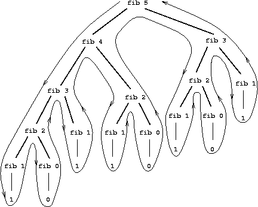

Each recursive call produces two more calls, so the final number of calls is
2^n, where n is the number passed to the function.

The space and time cost is exponential, O(2^n). This makes it unfeasible to use
this implementation to compute the function. You can check this by trying to
evaluate `(fib 35)` in the interpreter.

## 2. Solutions to the Cost of Recursion: Iterative Processes

We distinguish between procedures and processes: a **procedure** is an
algorithm, and a **process** is the execution of that algorithm.

It is possible to define _recursive procedures_ that generate _iterative
processes_ (like loops in imperative programming) in which **no recursive calls
are left waiting and the recursion stack does not grow**. To do this, we build
the recursion so that each call performs a partial computation and the base
case can directly return the result obtained.

This style of recursion is called *tail recursion*
([tail recursion](http://en.wikipedia.org/wiki/Tail_call)).

An efficient implementation of the process execution can be carried out by
eliminating the recursion stack.

### 2.1. Iterative Factorial

We start explaining tail recursion with a very simple example: the iterative
version of the typical `factorial` function. We will name the function
`factorial-iter`:

```racket
(define (factorial n)
   (fact-iter n n))

(define (fact-iter n result)
   (if (= n 1)
      result
      (fact-iter (- n 1) (* result (- n 1))  )))
```

The `(fact-iter n result)` function is the one that defines the iterative
process. Its argument `n` is the value whose factorial must be calculated, and
the `result` argument is an additional parameter where the intermediate results
are stored.

At each recursive call, `n` becomes smaller and smaller, and the factorial
calculation is accumulated in `result`. At the end of the recursion, the
factorial must already be computed in `result`, and it is returned.

Let's see the sequence of calls:

```text
(factorial 4)
(factorial-iter 4 4)
(factorial-iter 3 4*3=12)
(factorial-iter 2 12*2=24)
(factorial-iter 1 24*1=24)
24
```

Before each recursive call, the partial result is computed and stored in the
`result` parameter. Then the call is made with the newly computed values of `n`
and `result`.

Finally, when `n` is `1`, the computed value of `result` is returned. This
value is the complete result of the recursion, since no further operation has
to be performed on it. Unlike recursive processes, where calls are left waiting
on the recursion stack, in iterative processes there are no waiting calls. The
result returned by the base case is directly the solution of the recursion;
there is nothing left to do with this result.

The initial value of `result` is important. The `factorial` function is
responsible for initializing this parameter. In this case it is the same value
as the number `n` whose factorial is to be calculated.

The sequence of recursive calls accumulates the factorial value in the
`result` variable:

```text
4 * 3 * 2 * 1 = 24
```

### 2.2. Iterative Version of `mi-length`

Let's look at a second example. What would the iterative version of
`mi-length`, the function that calculates the length of a list, look like?

We need to add an additional parameter in which we will accumulate the partial
result. In this case, every time we call the recursion after removing an
element from the list, we will increment the result value by 1. For this
approach to work well, we must initialize this result to 0.

The solution is the following:

```racket
(define (mi-length lista)
   (mi-length-iter lista 0))

(define (mi-length-iter lista result)
   (if (null? lista)
      result
      (mi-length-iter (rest lista) (+ result 1))))
```

Notice that, just as in the iterative version of factorial, there is no call
to any function that receives the result of the recursive call and does
something with it. The result of the recursive call is directly the final
result of the recursion.

### 2.3. The `suma-lista` Function Using Tail Recursion

Let's look at another example. Suppose we want to compute, using tail
recursion, the sum of the numbers in a list.

We should add an additional parameter in which we accumulate that sum. We will
initialize that parameter to 0 and, at each recursive call, accumulate the
first element of the list:

```racket
(define (suma-lista lista)
   (suma-lista-iter lista 0))

(define (suma-lista-iter lista result)
   (if (null? lista)
      result
      (suma-lista-iter (rest lista) (+ result (first lista)))))
```

### 2.4. Characteristics of Iterative Processes

A summary of the characteristics of the iterative processes resulting from tail
recursion:

- The resulting recursion is less elegant.
- An additional parameter is needed to accumulate partial results.
- The last recursive call returns the accumulated value.
- The process resulting from the recursion is iterative in the sense that it
  leaves no waiting calls and incurs no space cost.

### 2.5. Iterative Fibonacci

Any recursive program can be transformed into another one that generates an
iterative process.

In general, iterative versions are less intuitive and more difficult to
understand and debug.

Let's look, for example, at the iterative formulation of Fibonacci:

```racket
(define (fib n)
   (fib-iter 1 0 n))

(define (fib-iter a b count)
   (if (= count 0)
      b
      (fib-iter (+ a b) a (- count 1))))
```

The sequence of recursive calls would be the following:

```text
(fib 6)
(fib-iter 1 0 6)
(fib-iter 1+0=1 1 5)
(fib-iter 1+1=2 1 4)
(fib-iter 2+1=3 2 3)
(fib-iter 3+2=5 3 2)
(fib-iter 5+3=8 5 1)
(fib-iter 8+5=13 8 0)
8
```

In recursive call `n`, parameter `a` stores the value of Fibonacci `n+1` and
parameter `b` stores the value of Fibonacci `n`, which is the one returned. We
obtain `n` calls by initializing `count` to n and decrementing the parameter by
1 each time.

### 2.6. Pascal's Triangle

[Pascal's triangle](https://en.wikipedia.org/wiki/Pascal's_triangle) is the
following triangle of numbers.

```text
1
1   1
1   2   1
1   3   3   1
1   4   6   4   1
1   5  10   10  5   1
1   6  15  20   15  6   1
1   7  21  35   35  21  7   1
          ...
```

If we number rows and columns starting from 0, the general expression for the
value in a given row and column can be obtained with the following recursive
definition:

```text
Pascal (n, 0) = 1
Pascal (n, n) = 1
Pascal (row, column) =
    Pascal (row-1, column-1) + Pascal (row-1, column)
```

The function is only defined for values of `column` less than or equal to
`row`.

In Scheme it is easy to write a recursive function that implements the previous
definition:

```racket
(define (pascal fila col)
   (cond ((= col 0) 1)
         ((= col fila) 1)
         (else (+ (pascal (- fila 1) (- col 1))
                  (pascal (- fila 1) col) ))))
(pascal 4 2)
; ⇒ 6
(pascal 8 4)
; ⇒ 70
(pascal 27 13)
; ⇒ 20058300
```

The function must be called with a value of `col` less than or equal to `fila`.
If a `col` value greater than `fila` is passed, the recursion does not
terminate and enters an infinite loop.

The function has a simple formulation and works correctly. However, the cost of
this recursion is also exponential, just as in the case of the Fibonacci
sequence. For example, the last expression `(pascal 27 13)` takes quite a
while to return the result. It would be impossible to compute the value of
slightly larger Pascal numbers, such as `(pascal 40 20)`.

Let's see how we can obtain an iterative version.

The idea is to define an iterative function `pascal-fila` to which we pass the
row number `n`, and which returns the list of `n+1` numbers that make up row
`n` of Pascal's triangle:

```text
row 0 = (1)
row 1 = (1 1)
row 2 = (1 2 1)
row 3 = (1 3 3 1)
row 4 = (1 4 6 4 1)
...
```

This function will need an additional parameter (`lista-fila`) that is
initialized with the list `(1)` and in which each successive row is stored.
This row grows until we reach the row that we have to return. The iteration
must be performed `n` times, so we decrement parameter `n` until it reaches 0.

To implement this function we use another call, `(pascal-sig-fila lista-fila)`,
which receives a row of the triangle and returns the next one.

For example:

```racket
(pascal-sig-fila '(1 3 3 1))
; ⇒ (1 4 6 4 1)
```

We implement this function with an auxiliary recursive function (this one is
purely recursive) called `(pascal-suma-dos-a-dos lista-fila)`, which is
responsible for computing the new row. It is not necessary to convert this
function to an iterative one because it does not generate exponential cost.

The complete code is the following:

```racket
(define (pascal fila col)
   (list-ref (pascal-fila '(1) fila) col))

(define (pascal-fila lista-fila n)
   (if (= 0 n)
      lista-fila
      (pascal-fila (pascal-sig-fila lista-fila) (- n 1))))
	  
(define (pascal-sig-fila lista-fila)
   (append '(1)
           (pascal-suma-dos-a-dos lista-fila)
           '(1)))

(define (pascal-suma-dos-a-dos lista-fila)
   (if (null? (rest lista-fila))
      '()
      (cons (+ (first lista-fila) (second lista-fila))
            (pascal-suma-dos-a-dos (rest lista-fila)))))
			
```

With this implementation, there is no longer an exponential cost and values
such as Pascal(40, 20) can be computed:

```racket
(pascal 40 20)
; ⇒ 137846528820
```

## 3. Solutions to the Cost of Recursion: Memoization

An alternative that keeps the elegance of recursive processes and the
efficiency of iterative ones is
[memoization](http://en.wikipedia.org/wiki/Memoization). If we look at the
trace of `(fib 4)`, we can see that the cost is produced by repeated calls;
for example, `(fib 3)` is evaluated 2 times.

In functional programming, the call to `(fib 3)` will always return the same
value.

The idea of _memoization_ is to store the value returned by each call in some
structure (for example, an association list) and not make the recursive call
again the next times.

### 3.1. Fibonacci with Memoization

To implement _memoization_ we need to use a dictionary with the `put` and `get`
methods, which update its information through mutation.

- The `(make-dic)` function returns an empty dictionary.
- The `(put key value dic)` function associates a value with a key, stores it
  in the dictionary (with mutation), and returns the value.
- The `(get key dic)` function returns the dictionary value associated with a
  key (if it does not exist, it returns `#f`).
- The `(key-exists? key dic)` predicate returns `#f` if the key does not exist
  and `#t` if it exists.

Examples:

```racket
(define mi-dic (make-dic))
(put 1 10 mi-dic) ; ⇒ 10
(get 1 mi-dic) ; ⇒ 10
(key-exists? 2 dic) ; ⇒ #f
```

These methods are imperative because they modify (mutate) the data structure
that we pass as a parameter (they do not belong to the functional paradigm).
The implementation of these functions is included in the
[`lpp.rkt` file](https://raw.githubusercontent.com/domingogallardo/apuntes-lpp/master/src/lpp.rkt).

The `fib-memo` function computes the Fibonacci series using exactly the same
original recursive definition, but adding the _memoization_ technique: the
first thing we do to compute Fibonacci number `n`, before calling recursion, is
to check whether it is already stored in the association list. If it is, we
return it. Only when the number has not been computed do we call the recursion
to compute it.

The implementation is shown below. We see that, to return Fibonacci number
`n`, it checks whether it is already stored in the list. Only if it is not
stored does it call recursion to compute it and store it. The `put` function
that stores the new computed value also returns it.

```racket
(define (fib-memo n dic)
  (cond ((= n 0) 0)
        ((= n 1) 1)
        ((key-exists? n dic) (get n dic))
        (else (put n (+ (fib-memo (- n 1) dic)
                        (fib-memo (- n 2) dic)) dic))))
```

We can check the difference in execution times between this version and the
previous one. The cost of the *memoized* function is O(n), compared with the
O(2^n) cost of the initial version, which made it impossible to use.

```racket
(fib-memo 200 lista)
⇒ 280571172992510140037611932413038677189525
```

## 4. Recursive Figures

We are going to finish the section on recursive procedures with one last
example that is somewhat different from the ones seen so far. We will use
recursion to draw fractal figures using Racket's
[`2htdp/image` image library](https://docs.racket-lang.org/teachpack/2htdpimage.html).

### 4.1. Racket Image Library

Racket includes an image library that provides functions for constructing
images. With this library we can create simple images such as lines, circles,
triangles, or other geometric figures. We can also modify the images we have
created, rotating or scaling them, and form other images by combining basic
images.

#### Constructing Basic Images ####

Let's look at some examples of the library primitives for constructing basic
images.

We can obtain a circle, a square, a rectangle, and an equilateral triangle as
follows:

```racket
#lang racket
(require 2htdp/image)

(circle 30 "solid" "blue")
(square 30 "outline" "black")
(rectangle 80 40 "solid" "gray")
(triangle 40 "solid" "red")
```

Each instruction constructs the corresponding image. If we run it in the
interpreter, we will obtain the following:

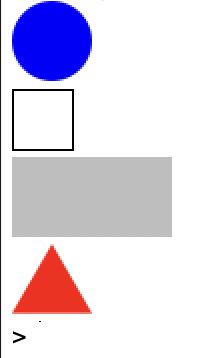

Images are bitmaps and their size is expressed in pixels. In the case of the
circle, it is the radius; for the square, we indicate its side; for the
rectangle, the base and height; and for the equilateral triangle, its side.

We must also indicate whether we want the image to be filled solidly or only
its outline to be drawn. We must also indicate its color, using a string chosen
from a [list of allowed colors](https://docs.racket-lang.org/draw/color-database___.html).

We can also construct an isosceles triangle by indicating the length of its
equal sides and the angle between them:

```racket
 (isosceles-triangle 60 30 "outline" "black") 
```

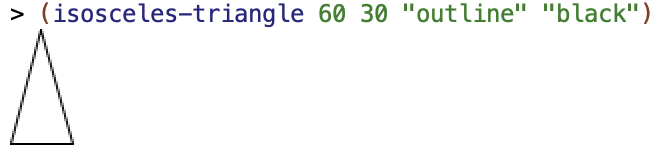

Finally, another primitive that we will use later is a line segment:

```racket
(line 30 30 "black")
```

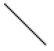

This function constructs an image with a line up to position (30,30) (the _x_
coordinate grows to the right and the _y_ coordinate grows downward).

Try constructing some images using the previous commands and changing their
parameters.

#### Image Operations and Combinations ####

The image library also defines functions that make it possible to transform and
combine images. Let's look at some of them.

We can rotate an image by an angle, expressed in degrees, counterclockwise.

For example, we can rotate the previous isosceles triangle:

```racket
(define triangulo (isosceles-triangle 60 30 "outline" "black"))
(rotate 90 triangulo) 
; ⇒ imagen rotada 90 grados en sentido contrario a las agujas del reloj
(rotate -90 triangulo)
; ⇒ imagen rotada 90 grados en sentido de las agujas del reloj
```

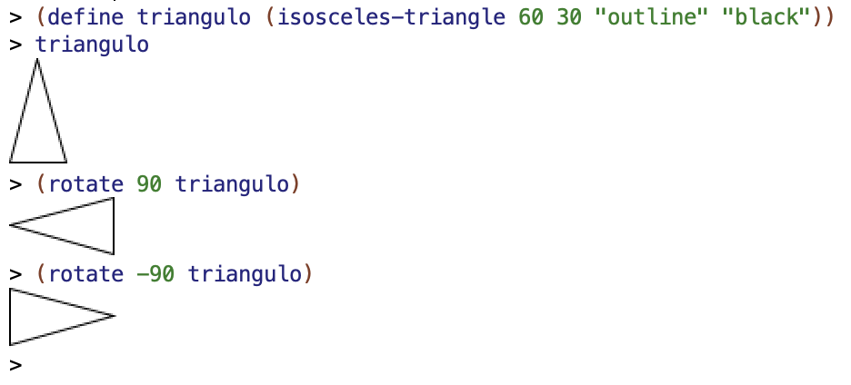

We can also combine images by grouping them with the `above` and `beside`
functions. Both functions receive a variable number of arguments and return a
new image in which the images have been placed one above another or side by
side.

For example:

```racket
(above (ellipse 70 20 "solid" "gray")
       (ellipse 50 20 "solid" "darkgray")
       (ellipse 30 20 "solid" "dimgray")
       (ellipse 10 20 "solid" "black"))
```

The previous call returns the following image:

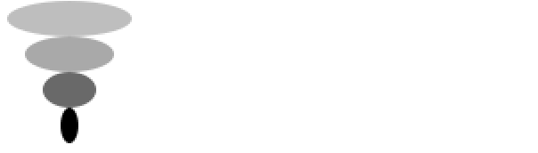

Another example:

```racket
(beside (ellipse 20 70 "solid" "gray")
        (ellipse 20 50 "solid" "darkgray")
        (ellipse 20 30 "solid" "dimgray")
        (ellipse 20 10 "solid" "black"))
```

Which produces:

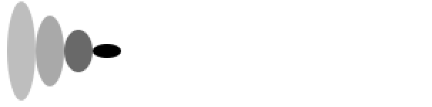

In the two previous examples, the grouped images are aligned in the center. If
we want another alignment, we can specify it using the `above/align` and
`beside/align` functions.

In the case of `above`, which stacks images one above another, we can specify
whether we want to align them to the left or to the right:

```racket
(above/align "left"
               (ellipse 70 20 "solid" "yellowgreen")
               (ellipse 50 20 "solid" "olivedrab")
               (ellipse 30 20 "solid" "darkolivegreen")
               (ellipse 10 20 "solid" "darkgreen"))
```

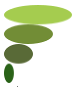

```racket
(above/align "right"
               (ellipse 70 20 "solid" "gold")
               (ellipse 50 20 "solid" "goldenrod")
               (ellipse 30 20 "solid" "darkgoldenrod")
               (ellipse 10 20 "solid" "sienna"))
```

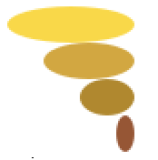

In the case of `beside`, which stacks images next to one another, we can
specify whether we want to align them at the top or at the bottom:

```racket
(beside/align "top"
                (ellipse 20 70 "solid" "mediumorchid")
                (ellipse 20 50 "solid" "darkorchid")
                (ellipse 20 30 "solid" "purple")
                (ellipse 20 10 "solid" "indigo"))
```

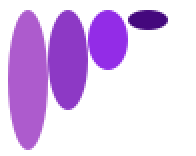

```racket
(beside/align "bottom"
                (ellipse 20 70 "solid" "lightsteelblue")
                (ellipse 20 50 "solid" "mediumslateblue")
                (ellipse 20 30 "solid" "slateblue")
                (ellipse 20 10 "solid" "navy"))
```

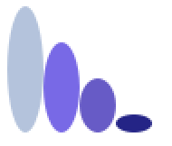

We can combine all the previous functions to construct complex figures. For
example:

```racket
(rotate 45
        (above (triangle 40 "solid" "orange")
               (beside (rectangle 40 30 "solid" "black")
                       (rectangle 40 30 "solid" "olivedrab"))))
```


Try making some figures by combining basic figures with the previous functions.

### 4.2. Sierpinski Triangle

We are going to use the previous image-construction functions to build a
fractal figure, the so-called Sierpinski triangle, using recursion.

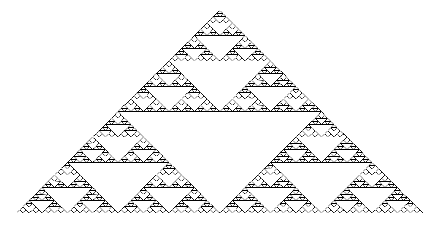

*Sierpinski triangle*

- Do you see any recursion in the figure?
- What could be the parameter of the function that draws it?
- Can you think of a recursive algorithm that draws it, using the image
  combination functions we have seen?

The figure is *self-similar* (a characteristic of fractal figures). A part of
the figure is identical to the whole figure, but scaled down. This gives us a
hint that it is possible to draw the figure with a recursive algorithm.

To try to find a way to approach the problem, let's think about it as follows:
suppose we have three Sierpinski triangles of width _x_. How could we construct
the Sierpinski triangle of width _2*x_?

We could do it by combining the three images as follows:

1. Put 2 triangles side by side.
2. Place the remaining triangle above the resulting figure, aligned in the
   center.

The following figure shows the scheme of this combination. Each rectangle
represents the Sierpinski image of width _x_, and the combination represents
the image of width _2*x_.

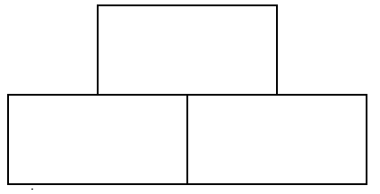

The recursive algorithm is based on the same idea, but **backwards**. We draw a
triangle of width _x_ based on 3 recursive calls to smaller triangles (of width
_x/2_).

In the base case, when _x_ is less than a threshold _h_, we will draw an
elementary triangle of base _h_.

Let's see how to do it with Racket's image library.

#### 4.2.1. Base Case of Recursion ####

To construct the elementary image of the Sierpinski triangle, we need an
isosceles triangle with angle 90 and base _h_.

As shown in the following figure, we can divide this triangle into two halves.
If the top angle is 90 degrees, its half will be 45 degrees, so the two
subtriangles will be right triangles whose legs measure _h/2_. The hypotenuse
of those triangles are the sides of the original isosceles triangle. The height
of the original isosceles triangle will also be _h/2_. 

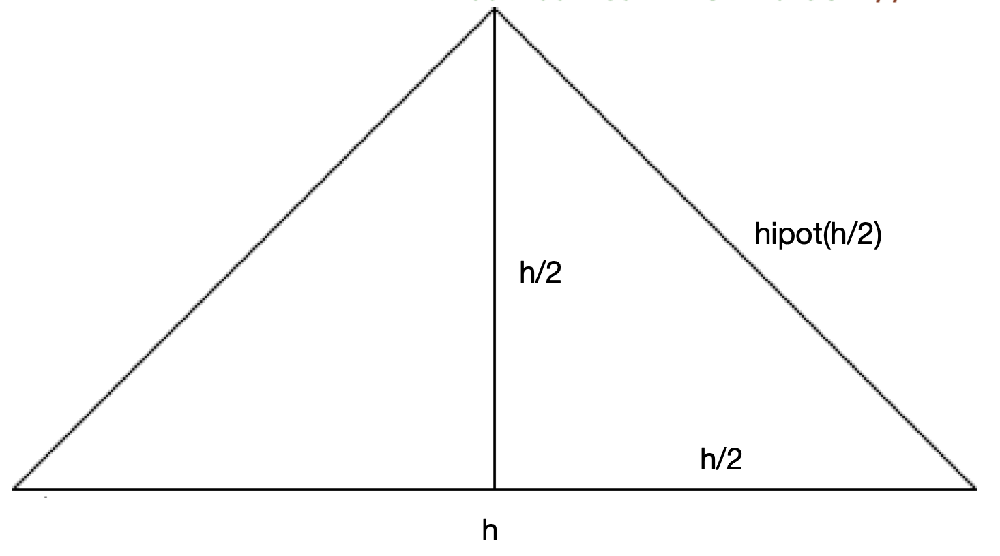

The hypotenuse of a right triangle with two legs of length _x_ is calculated
with the following expression:

$$hipot(x) = \sqrt{x^2+x^2} = x \sqrt{2}$$

We can express it in Racket:

```racket
(define (hipotenusa x)
  (* x (sqrt 2)))
```

Once the `hipotenusa` function is defined, we can draw the elementary
Sierpinski triangle with base `h`. It will be an isosceles triangle with angle
90 degrees and side length `hipotenusa(h/2)`:

```racket
(define (sierpinski-elem base)
  (isosceles-triangle (hipotenusa (/ base 2)) 90 "outline" "black"))
```

For example, the call to

```racket
(sierpinski-elem 40)
```

produces the following image:

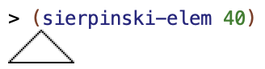

#### 4.2.2. General Case of Recursion ####

The general case of recursion for drawing the Sierpinski triangle of width _x_
is constructed by calling recursion so it builds the triangle of width _x/2_
and composing the resulting image with the pattern seen above.

The code of the complete function is the following:

```racket
(define (sierpinski ancho)
  (if (< ancho 10)
      (sierpinski-elem ancho)
      (above (sierpinski (/ ancho 2))
             (beside (sierpinski (/ ancho 2))
                     (sierpinski (/ ancho 2))))))
```

- If the width is less than a threshold (10), the elementary triangle is drawn.
- If the width is greater than or equal to 10, three recursive calls are made
  to `sierpienski` with _width / 2_. Each recursive call will return the image
  with the smaller Sierpinski triangle.
- The call to `beside` will put the two lower images together.
- The call to `above` will place the third triangle above the previous
  composition, centered in the middle.

An example of the execution:

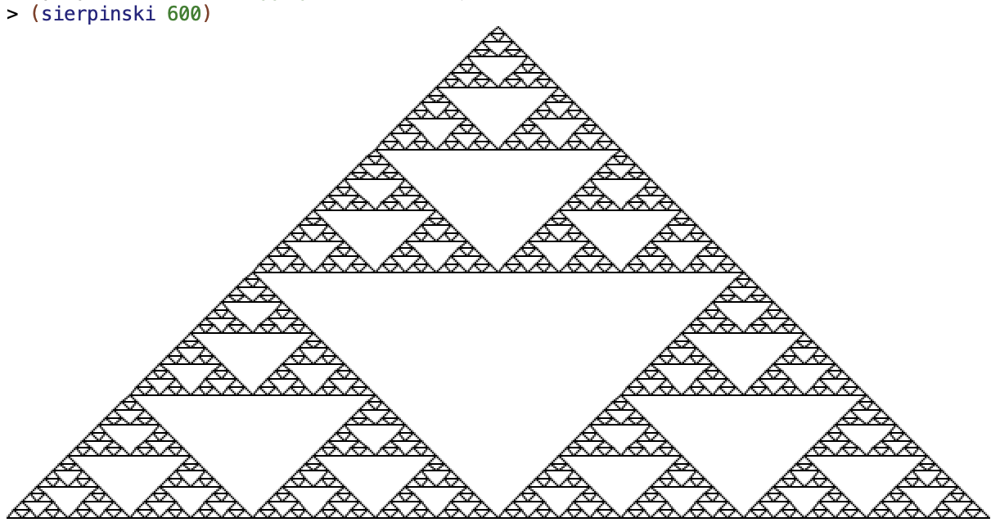

The previous code is not efficient at all because each recursive call, in turn,
generates 3 more calls, causing an exponential cost like the one we saw at the
beginning of the topic.

In this case it is very easy to eliminate the three calls because the three are
repeated calls that will return exactly the same figure. We can then use the
technique we have already used other times: call a helper function with the
result of the recursion. This helper function will receive, in its parameter,
the value returned by the recursion and will perform the necessary operations
with that value.

In this case, the value obtained by the recursion is the smaller Sierpinski
figure. The helper function will therefore receive that figure and must combine
it three times to form the larger Sierpinski figure.

The resulting code is the following:

```racket
(define (componer-sierpinski figura)
    (above figura
           (beside figura figura)))

(define (sierpinski ancho)
  (if (< ancho 10)
      (sierpinski-elem ancho)
      (componer-sierpinski (sierpinski (/ ancho 2)))))
```

### 4.3. Hilbert Curve ###

The Hilbert curve is a fractal curve that has the property of completely
filling the plane.

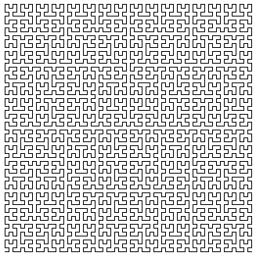

Its drawing has a recursive formulation:

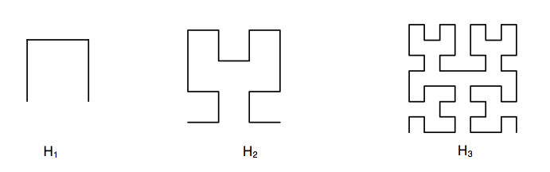

Image H2 can be composed from four H1 images following a pattern. It is the
same pattern with which image H3 can be composed from four H2 images.

The pattern is shown in the following function `(componer-hilbert imagen)`:

```racket

(define (trazo-horizontal long)
  (line long 0 "black"))

(define (trazo-vertical long)
  (rotate 90 (trazo-horizontal long)))

(define (componer-hilbert imagen long-trazo)
  (beside (above/align "left"
                       (beside/align "bottom" imagen (trazo-horizontal long-trazo))
                       (trazo-vertical long-trazo)
                       (rotate -90 imagen))
          (above/align "right"
                       imagen
                       (trazo-vertical long-trazo)
                       (rotate 90 imagen))))
```

- The first call to `above/align` composes an image by joining the original
  image with a horizontal line segment, and stacking (with left alignment) this
  image above a vertical line segment and above the original image rotated 90
  degrees clockwise.
- The second call to `above/align` builds another image by stacking (with right
  alignment) the original image, a vertical line segment, and the image rotated
  90 degrees counterclockwise.
- Finally, the call to `beside` joins the two previous images.

We can see an example of how this composition works by using a base image made
up of a square with a triangle inside.

```racket
(overlay (triangle 20 "solid" "green")
         (rectangle 20 20 "solid" "black")))
```

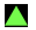

If we call `componer-hilbert` with the previous image, using a line-segment
length of 16 pixels, we can see that the basic pattern of the Hilbert curve is
constructed, the one that constructs image H2 from H1.

```racket
(define imagen (overlay (triangle 20 "solid" "green")
                        (rectangle 20 20 "solid" "black")))
imagen 
(componer-hilbert imagen 16)
```

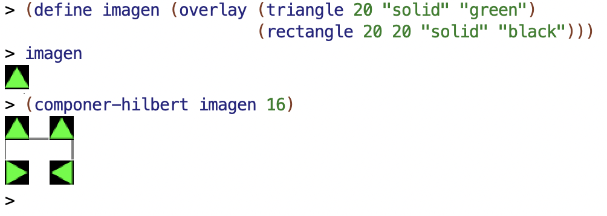

Once this composition pattern is understood, we can now formulate the recursive
algorithm:

```racket
(define (hilbert nivel long-trazo)
  (if (= 1 nivel)
      (beside/align "top"
                    (trazo-vertical long-trazo)
                    (trazo-horizontal long-trazo)
                    (trazo-vertical long-trazo))
      (componer-hilbert (hilbert (- nivel 1) long-trazo) long-trazo)))
```

- The base case is level 1, where the basic line segment of the Hilbert curve
  is constructed with the line-segment length passed as a parameter.
- For any level _n_ greater than 1, recursion is called to form the Hilbert
  curve of level _n-1_ and, with the resulting image, the `componer-hilbert`
  function is called.

The following image shows different calls to the `hilbert` function:

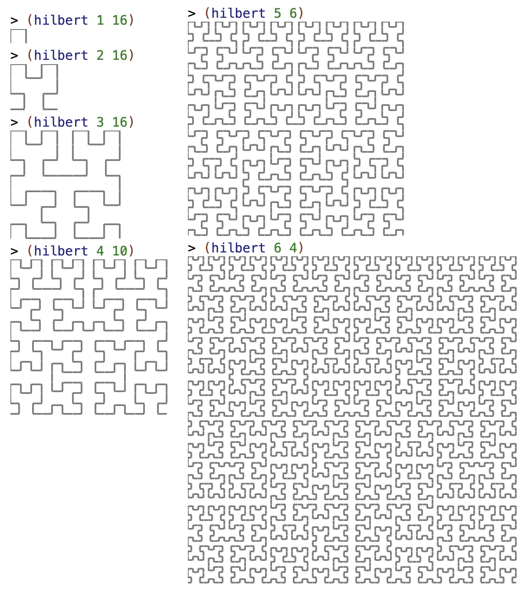

## 5. Bibliography

Chapters from the book *Structure and Interpretation of Computer Programs*:

- [1.2 - Procedures and the Processes They Generate](https://mitpress.mit.edu/sites/default/files/sicp/full-text/book/book-Z-H-11.html#%_sec_1.2)
- [1.2.1 - Linear Recursion and Iteration](https://mitpress.mit.edu/sites/default/files/sicp/full-text/book/book-Z-H-11.html#%_sec_1.2.1)
- [1.2.2 - Tree Recursion](https://mitpress.mit.edu/sites/default/files/sicp/full-text/book/book-Z-H-11.html#%_sec_1.2.2)

Racket manual:

- [`image.rkt` library](https://docs.racket-lang.org/teachpack/2htdpimage.html)
- [Image Guide](https://docs.racket-lang.org/teachpack/2htdpimage-guide.html)

----

Programming Languages and Paradigms, academic year 2025-26  
© Department of Computer Science and Artificial Intelligence, University of Alicante  
Domingo Gallardo, Cristina Pomares, Antonio Botía, Francisco Martínez
