# Topic 4: Recursive Data Structures

## 1. Structured Lists

We have seen that lists in Scheme are implemented as a recursive data
structure, made up of a pair whose right part links to the rest of the list and
which ends with a right part containing an empty list.

In this section we will study lists again from a high level of abstraction,
using the functions:

- `(first lista)` to obtain the first element of a list
- `(rest lista)` to obtain the rest of the list
- `(cons dato lista)` to construct a new list with `dato` as its first element

In most of the functions and examples we have seen so far, lists are made up of
data and traversing the list is a linear traversal, iterating over its elements.

In this section we will extend this concept and study how to work with *lists
that contain other lists*.

We will see that this fundamentally changes the structure of lists and of the
functions that operate on them. The fundamental change is that the function
`first lista` can return two types of elements:

- An element of the list (of the type of elements contained in the list)
- Another list (made up of the type of elements contained in the list)

### 1.1. Definition and Examples

Lists in Scheme can contain elements of any type, including other lists.

We will call a list that contains other sublists a **structured list**. The
opposite of a structured list is a **flat list**, a list made up of elements
that are not lists. We will call the elements of a list that are not sublists
**leaves**.

In the context of functional programming, structured lists whose leaves are
symbols are called _S-expressions_
([S-expression](http://en.wikipedia.org/wiki/S-expression)).

For example, the structured list:

```
(a b (c d e) (f (g h)))
```

is a structured list with 4 elements:

- The element `'a`, a leaf
- The element `'b`, another leaf
- The flat list `(c d e)`
- The structured list `(f (g h))`

It can be constructed with any of the following expressions:

```racket
(define lista (list 'a 'b (list 'c 'd 'e) (list 'f (list 'g 'h))))
(define lista '(a b (c d e) (f (g h))))
```

We will consider a list made up of pairs to be a flat list, since it does not
contain any sublist. For example, the list

```racket
((a . 3) (b . 5) (c . 12))
```

is a flat list of three elements (leaves) that are pairs.

#### 1.1.1. Definitions in Scheme

We are going to write the previous definitions of `hoja`, `plana`, and
`estructurada` using Scheme code.

##### 1.1.1.1. Function `(hoja? dato)`

We define a leaf as those elements of a structured list that are not lists:

```racket
(define (hoja? elem)
   (not (list? elem)))
```

We will use this function to check whether a given element of a list is a leaf
or not. For example, suppose we have the following list:

```racket
((1 2) 3 4 (5 6))
```

It is a list of 4 elements, where the first and the last are other sublists and
the second and third are leaves. We can check whether its elements are leaves
or not:

```racket
(define lista '((1 2) 3 4 (5 6)))
(hoja? (first lista)) ; ⇒ #f
(hoja? (second lista)) ; ⇒ #t
(hoja? (third lista)) ; ⇒ #t
(hoja? (fourth lista)) ; ⇒ #f
```

The empty list is not a leaf:

```racket
(hoja? '()) ; ⇒ #f
```

##### 1.1.1.2. Function `(plana? lista)`

As we said before, a list is flat when all its elements are leaves. We want to
implement the function `(plana? lista)` that checks this.

For example:

```racket
(plana? '(a b c d e f)) ; ⇒ #t
(plana? (list (cons 'a 1) "Hola" #f)) ; ⇒ #t
(plana? '(a (b c) d)) ; ⇒ #f
(plana? '(a () b)) ; ⇒ #f
```

A recursive definition of a flat list:

> A list is flat if and only if its first element is a leaf and the rest is
> flat.

And the base case:

> An empty list is flat.

Using this recursive definition, we can implement in Scheme the function
`(plana? lista)`, which checks whether a list is flat:

```racket
(define (plana? lista)
   (or (null? lista)
       (and (hoja? (first lista))
            (plana? (rest lista)))))
```

The `plana?` function could also be implemented using the higher-order function
`for-all?`, which checks that all elements of a list satisfy a property. In
this case, being a leaf.

```racket
(define (plana-fos? lista)
  (for-all? hoja? lista))
```

!!! Note "Function `for-all?`"
    Remember that the function `(for-all? predicado lista)` is implemented as
    follows:

    ```racket
    (define (for-all? predicado lista)
      (or (null? lista)
          (and (predicado (first lista))
               (for-all? predicado (rest lista)))))
    ```

##### 1.1.1.3. Function `(estructurada? lista)`

A list is structured when one of its elements is another list. As a base case,
an empty list is not structured.

We want to implement the function `(estructurada? lista)` that checks whether a
list is structured.

```racket
(estructurada? '(1 2 3 4)) ; ⇒ #f
(estructurada? (list (cons 'a 1) (cons 'b 2) (cons 'c 3))) ; ⇒ #f
(estructurada? '(a () b)) ; ⇒ #t
(estructurada? '(a (b c) d)) ; ⇒ #t
```

```racket
(define (estructurada? lista)
   (and (not (null? lista))
        (or (list? (first lista))
            (estructurada? (rest lista)))))
```

It could also be implemented using the higher-order function `exists?` to check
whether some element of the list is also another list.

```racket
(define (estructurada-fos? lista)
  (exists? list? lista))
```

!!! Note "Function `exists?`"
    Remember that the function `(exists? predicado lista)` is implemented as
    follows:

    ```racket
    (define (exists? predicado lista)
      (if (null? lista)
          #f
          (or (predicado (first lista))
              (exists? predicado (rest lista)))))
    ```

It would actually have been enough to define one of the two functions and write
the other one as the negation of the first:

```racket
(define (estructurada? lista)
   (not (plana? lista)))
```

#### 1.1.2. Examples of Structured Lists

Structured lists are very useful for representing hierarchical information,
where we want to represent elements that contain other elements.

For example, Scheme expressions are structured lists:

```racket
(= 4 (+ 2 2))
(if (= x y) (* x y) (+ (/ x y) 45))
(define (factorial x) (if (= x 0) 1 (* x (factorial (- x 1)))))
```

The syntactic analysis of a sentence can generate a structured list of symbols,
where the different elements of the sentence are grouped:

```racket
((Juan) (compró) (la entrada (de la película)) (el viernes por la tarde))
```

An HTML page, with its different elements, some inside others, can also be
represented with a structured list:

```racket
((<h1> Mi lista de la compra </h1>)
 (<ul> (<li> naranjas </li>)
       (<li> tomates </li>)
       (<li> huevos </li>) </ul>))
```

#### 1.1.3. Level-Based *Pseudo Trees*

Structured lists define a level structure, where the initial list represents
the first level and each sublist represents a lower level. The data in the
lists represent the leaves.

For example, the level-based representation of the list `((a b c) d e)` is the
following:

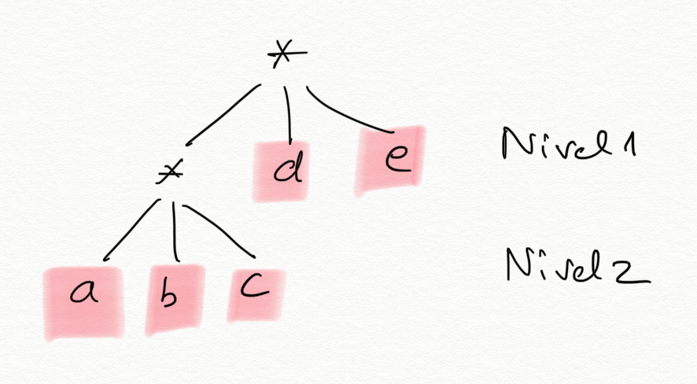

Each asterisk `*` represents a list. The branches that come out of the asterisk
represent the elements of the list. In the example, at the first level we have
a list with 3 elements: the list `(a b c)`, `d`, and `e`. At the second level
we find the list `(a b c)`, whose 3 elements are leaves.

The leaves `d` and `e` are at level 1 and in positions 2 and 3 of the list, and
the leaves `a`, `b`, and `c` are at level 2.

!!! Warning "A structured list is not a tree"
    A structured list is not a tree in the strict sense, because a tree has data
    in all nodes, whereas in a structured list the data are only in the leaves.

Structured lists are used to group a set of data hierarchically at different
levels.

Although they are different from trees, both are hierarchical data structures
(with levels) that can be defined recursively and on which recursive algorithms
can be defined. Later we will see how to define and work with trees in Scheme.

Another example. What would be the level-based representation of the following
structured list?

```racket
(map (lambda (x) (+ x 10)) (quote (1 2 3 4)))
```

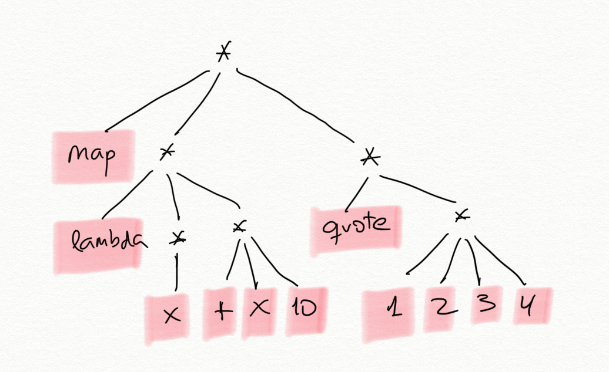

### 1.2. Recursive Functions on Structured Lists

#### 1.2.1. Number of Leaves

As a first example, let's look at the function `(num-hojas lista)`, which
counts the number of leaves in a structured list.

For example:

```racket
(num-hojas '((1 2) (3 4 (5) 6) (7))) ; ⇒ 7
```

As we mentioned before, a key issue in the functions we are going to build on
structured lists is that the `first` of a structured list may itself be another
list.

To calculate the number of leaves in a list, we can obtain the first element
and the rest of the list, and recursively count the number of leaves in the
first element and in the rest. Since it is a structured list, the first element
may itself be another list, so we call recursion to count its leaves.

The definition of this general case using _pseudocode_ is:

> The number of leaves in a structured list is the sum of the number of leaves
> in its first element (which may be another list) and the number of leaves in
> the rest.

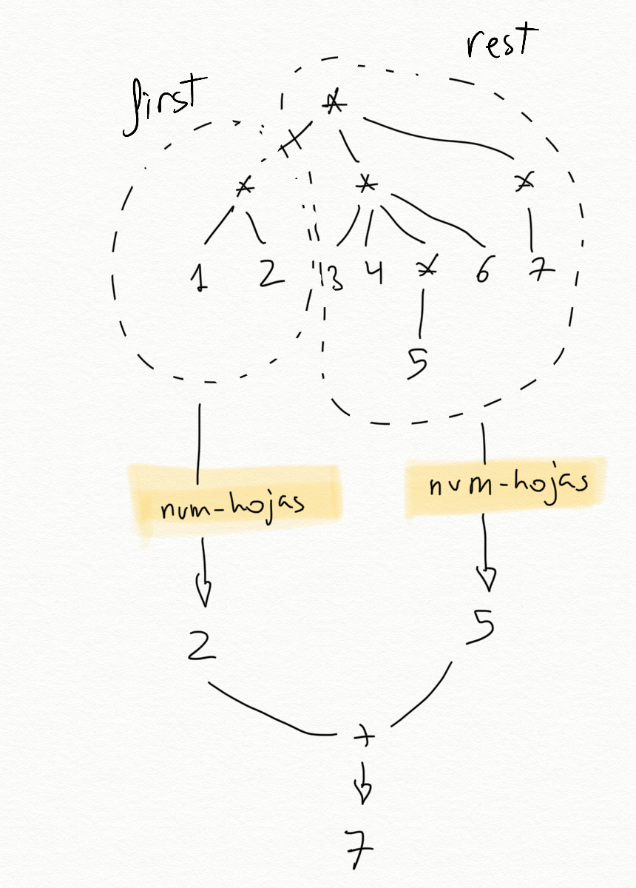

The recursion has two recursive calls. One receives the head element of the
list, and the other receives the rest of the list.

```racket
;Caso general num-hojas
(define (num-hojas lisdat)
  ; Falta caso base
  (+ (num-hojas (first lisdat))
     (num-hojas (rest lisdat))))
```

!!! Warning "No exponential cost"
    Although there are two recursive calls, this is not the same as in
    Fibonacci or Pascal, because recursive calls with the same data are not
    repeated. The recursion traverses the structured list and its cost will be
    the number of elements in the list.

To consider the **base case**, let's see how the recursive calls receive a
smaller problem each time.

The recursive call on the rest of the list receives a list with 1 fewer element
each time. At the end, the function will be called with an empty list. That
will be one base case. The number of elements in an empty list is 0.

The recursive call on the head of the list is somewhat different. It receives a
list in which we have gone down one level and which therefore has one fewer
level. At the end, the function will be called with a leaf (a datum). That will
be the other base case, and we will have to return 1.

The complete definition of the function is as follows:

```racket
(define (num-hojas lisdat)
   (cond
      ((null? lisdat) 0)
      ((hoja? lisdat) 1)
      (else (+ (num-hojas (first lisdat))
               (num-hojas (rest lisdat))))))
```

!!! Warning "Important"
    It should be noted that the parameter `lisdat` can be either a list or an
    atomic datum. In that case, the function `(hoja? lisdat)` returns `#t`.
    
    In strongly typed programming languages this would not be possible, because
    the list and the datum would have different types. In that case, the code
    should be a little longer and, before calling recursion, we would have to
    check whether the element is a datum or another list. In Scheme, we can take
    advantage of its characteristic of being weakly typed and make the code more
    concise, always calling recursion with the `first` of the list, regardless
    of whether it is a datum or another list.
    
    The code for the version in which we check whether the element is a list
    before calling recursion would be the following:
    
    ```racket
    (define (num-hojas lista)
        (cond
            ((null? lista) 0)
            ((hoja? (first lista))
                (+ 1 (num-hojas (rest lista))))
            (else (+ (num-hojas (first lista))
                     (num-hojas (rest lista))))))
    ```

##### 1.2.1.1. Version with Higher-Order Functions

We can also use the higher-order functions `map` and `foldr` to obtain a more
concise version.

A structured list has, as first-level elements, leaves or other sublists. We
can therefore map a lambda expression that is applied to each of those
elements. In the lambda expression, we check whether the element (the parameter
`sublista` of the lambda expression) is a leaf or a list. In the first case, we
return 1. In the second case, we apply _the very function we are defining_ to
the sublist, which returns the number of leaves in that sublist.

The result of `map` will be a list of numbers (the number of leaves in each
component), which we can add using a `foldr` with the function `+`:

```racket
(define (num-hojas-fos ld)
    (if (hoja? ld)
        1
        (foldr + 0 (map num-hojas-fos ld))))
```

A graphical explanation of how the function works on the list `(1 (2 3) (4) (5
(6 7) 8))`:

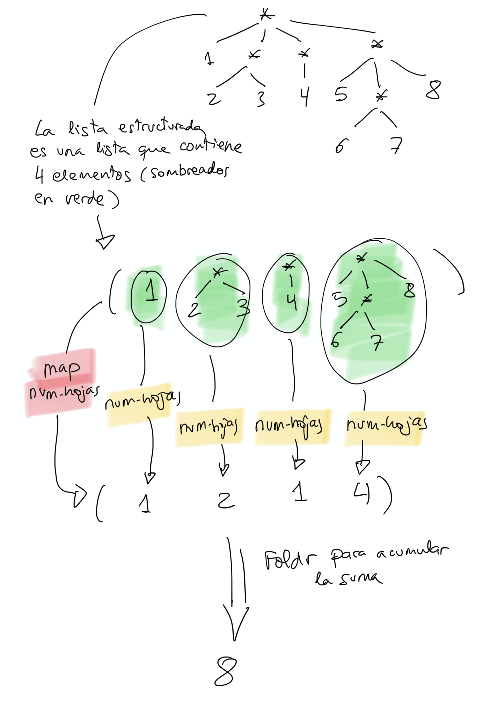

It would be equivalent to apply the sum with `apply` in order to add the
numbers in the list returned by `map`:

```racket
(define (num-hojas-fos ld)
    (if (hoja? ld)
        1
        (apply + (map num-hojas-fos ld))))
```

!!! Note "Note"
    It is useful to know both expressions (the `foldr` one and the `apply` one)
    because there are programming languages in which the `apply` function is not
    defined. For example, Swift.

#### 1.2.2. Flattening a List ####

Let's look at another example. The function `(aplana lista)` returns a flat
list with all the leaves of the list.

For example:

```racket
(aplana '(1 2 (3 (4 (5))) (((6)))))
; ⇒ (1 2 3 4 5 6)
```

The recursive solution is:

```racket
(define (aplana ld)
  (cond
    ((null? ld) '())
    ((hoja? ld) (list ld))
    (else 
     (append (aplana (first ld))
             (aplana (rest ld))))))
```

With higher-order functions:

```racket
(define (aplana-fos ld)
  (if (hoja? ld)
    (list ld)
    (foldr append '() (map aplana-fos ld))))

```

Using `apply`:

```racket
(define (aplana-fos ld)
  (if (hoja? ld)
    (list ld)
    (apply append (map aplana-fos ld))))

```

#### 1.2.3. Other Recursive Functions

We are going to design other recursive functions that work with the
hierarchical structure of structured lists.

- `(pertenece-estruct? dato lista)`: searches for a leaf in a structured list.
- `(cuadrado-estruct lista)`: squares all the leaves (we assume the structured
  list contains numbers).
- `(map-estruct f lista)`: similar to `map`, applies a function to all the
  leaves of the structured list and returns the result (another structured
  list).
- `(altura lista)`: returns the number of levels of a structured list.
- `(nivel-hoja dato lista)`: returns the level at which a datum is found in a
  list.

##### 1.2.3.1. `(pertenece-estruct? dato lista)`

Checks whether `dato` appears in the structured list.

```racket
(pertenece-estruct? 'a '(b c (d (a)))) ; ⇒ #t
(pertenece-estruct? 'a '(b c (d e (f)) g)) ; ⇒ #f
```

Recursive solution:

```racket
(define (pertenece-estruct? dato ld)
  (cond 
    ((null? ld) #f)
    ((hoja? ld) (equal? dato ld))
    (else (or (pertenece-estruct? dato (first ld))
              (pertenece-estruct? dato (rest ld))))))
```

With higher-order functions:

```racket
(define (pertenece-fos? dato ld)
  (if (hoja? ld)
    (equal? dato ld)
    (exists? (lambda (elem)
               (pertenece-fos? dato elem)) ld)))
```

##### 1.2.3.2. `(cuadrado-estruct lista)` #####

Now we are going to look at a different kind of function. One that constructs a
structured list and returns it.

We want to implement the function `(cuadrado-estruct lista)`, which receives a
structured list and returns another structured list with the same structure and
its numbers squared.

For example:

```racket
(cuadrado-estruct '(2 3 (4 (5)))) ; ⇒ (4 9 (16 (25))
```

The recursive solution is:

```racket
(define (cuadrado-estruct ld)
  (cond ((null? ld) '())
        ((hoja? ld) (* ld ld ))
        (else (cons (cuadrado-estruct (first ld))
                    (cuadrado-estruct (rest ld))))))
```

Recursion is called with the `first` and with the `rest` of the original list.
The result of both calls will be the corresponding structured lists with their
elements squared. The returned list is the result of inserting the list
returned by the recursive call with the `first` in the first position of the
list returned by the recursive call with the `rest`.

The version of this function with higher-order functions is very interesting:

```racket
(define (cuadrado-estruct-fos ld)
  (if (hoja? ld)
      (* ld ld)
      (map cuadrado-estruct-fos ld)))
```

Since a structured list is composed of data or other sublists, we can apply
`map` so that it returns the list resulting from transforming the original list
with the function passed as a parameter.

##### 1.2.3.3. `(map-estruct f lista)` #####

We can generalize the previous function and define the higher-order function on
structured lists `(map-estructurada f lista)`, which returns a structured list
equal to the original with the result of applying function `f` to each of its
leaves.

For example:

```racket
(map-estruct (lambda (x) (* x x)) '(2 3 (4 (5)))) ; ⇒ (4 9 (16 (25))
```

The recursive solution is a generalization of the previous function, using
parameter `f`:

```racket
(define (map-estruct f ld)
  (cond ((null? ld) '())
        ((hoja? ld) (f ld))
        (else (cons (map-estruct f (first ld))
                    (map-estruct f (rest ld))))))
```
	
Solution with `map`:

```racket
(define (map-estruct-fos f ld)
  (if (hoja? ld)
      (f ld)
      (map (lambda (elem)
             (map-estruct-fos f elem)) ld)))
```

##### 1.2.3.4. `(altura lista)` #####

The *height* of a structured list is given by its number of levels: a flat list
has height 1, and the list `((1 2 3) 4 5)` has height 2.

To calculate the height of a structured list, we have to obtain (recursively)
the height of its first element and the height of the rest of the list, add 1
to the height of the first element, and return the maximum of the two numbers.

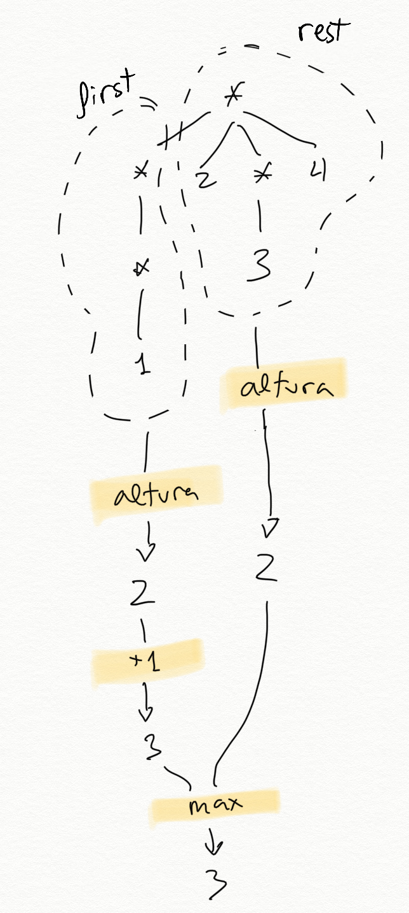

As base cases, the height of an empty list or of a leaf (datum) is 0.

In Scheme:

```racket
(define (altura ld)
   (cond 
      ((null? ld) 0)
      ((hoja? ld) 0)
      (else (max (+ 1 (altura (first ld)))
                 (altura (rest ld))))))
```
For example:

```racket
(altura '(1 (2 3) 4)) ; ⇒ 2
(altura '(1 (2 (3)) 3)) ; ⇒ 3
```

###### 1.2.3.2.1. Version with Higher-Order Functions ######

And the second version, using the higher-order function `map` to obtain the
height of its first-level elements (which may be leaves or sublists) and
`foldr` to keep the maximum of the list of values returned by `map`.

```racket
(define (altura-fos ld)
   (if (hoja? ld)
       0
       (+ 1 (foldr max 0 (map altura-fos ld)))))
```

We could also do this by replacing `foldr` with `apply`:

```racket
(define (altura-fos ld)
   (if (hoja? ld)
       0
       (+ 1 (apply max (map altura-fos ld)))))
```

##### 1.2.3.5. `(nivel-hoja dato lista)` #####

Let's look at one last function, `(nivel-hoja dato lista)`, which traverses a
structured list searching for the datum and returns the level where it is
found. If the datum is not found in the list, it will return -1. If the datum
is found in more than one place in the list, the highest level will be
returned.

Examples:

```racket
(nivel-hoja 'b '(a b (c))) ; ⇒ 1
(nivel-hoja 'b '(a (b) c)) ; ⇒ 2
(nivel-hoja 'b '(a (b) d ((b)))) ; ⇒ 3
(nivel-hoja 'b '(a c d ((e)))) ; ⇒ -1
```

Recursive solution:

```racket
(define (nivel-hoja dato ld)
  (cond
    ((null? ld) -1)
    ((hoja? ld) (if (equal? ld dato) 0 -1))
    (else (max (suma-1-si-mayor-igual-que-0 
                    (nivel-hoja dato (first ld)))
               (nivel-hoja dato (rest ld))))))
```

The helper function is defined as follows:

```racket
(define (suma-1-si-mayor-igual-que-0 x)
  (if (>= x 0)
      (+ x 1)
      x))
```

With higher-order functions:

```racket
(define (nivel-hoja-fos dato ld)
  (if (hoja? ld)
      (if (equal? ld dato) 0 -1)
      (suma-1-si-mayor-igual-que-0
       (foldr max -1 (map (lambda (elem)
                           (nivel-hoja-fos dato elem)) ld)))))
```

## 2. Trees

### 2.1. Defining Trees in Scheme

#### 2.1.1. Tree Definition

A **tree** is a data structure defined by a root value, which is the parent of
the whole structure, from which other child subtrees emerge
([Wikipedia](https://en.wikipedia.org/wiki/Tree_(data_structure))).

A **tree** can be defined recursively as follows:

- A collection of a **datum** (the value of the tree root) and a **list of
  children** that are also trees.
- A **leaf** is a tree with no children (a datum with an empty list of
  children).

An example of a tree:

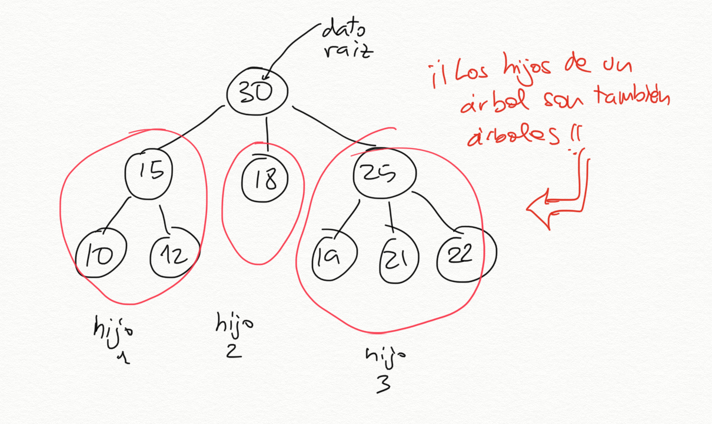

The previous tree has number 30 as its root datum and has 3 child trees:

- The first child is a tree with root 15 and two leaf children, 10 and 12.
- The second child is a leaf tree, with value 18.
- The third child is a tree with root 25 and three leaf children: 19, 21, and
  22.

#### 2.1.2. Representing Trees with Lists

In Scheme, the list is the main data structure. How can we build a tree using
lists?

We can do it in several ways, but we choose the following: use **a list of
_n+1_ elements** to represent a tree with _n_ children:

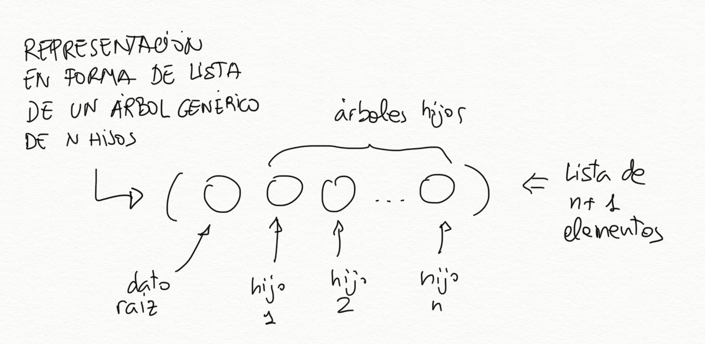

- the first element of the list will be the root datum
- the rest will be the child trees

```text
tree -> (datum child-1 child-2 ... child-n)
```

Leaf nodes (data at the end of the tree that have no children) are also trees.
Since they have no children, they are represented as lists with a single
element, the datum itself.

```text
Leaf node -> (datum)
```

The way to represent the previous tree

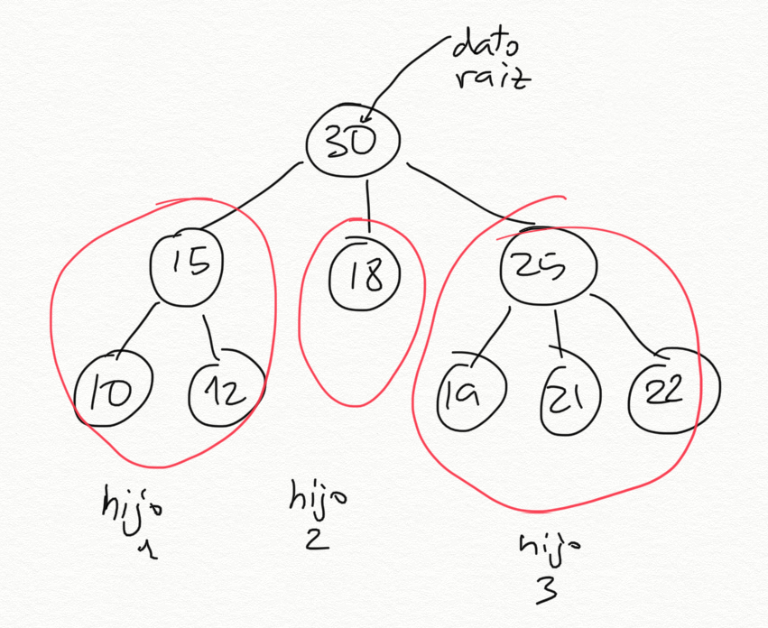

will be the following list:

```racket
(30 (15 (10) (12)) (18) (25 (19) (21) (22)))
```

The elements of this list are:

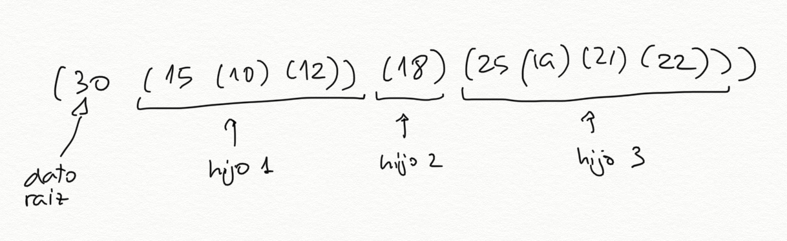

- The first element is the number `30`, the root-value datum of the tree.
- The second element is the list `(15 (10) (12))`, which represents the tree
  with datum `15` and two children.
- The third element is the list `(18)`, which represents the leaf tree made up
  of an 18.
- The fourth element is the list `(25 (19) (21) (22))`, which represents the
  tree with datum `25` and three children.

We could define the tree with the following statement:

```racket
(define arbol1 '(30 (15 (10) (12)) (18) (25 (19) (21) (22))))
```

One more example. How is the tree in the following figure implemented in
Scheme?

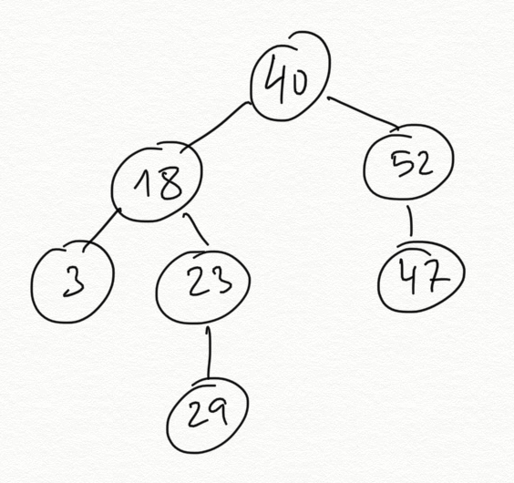

It would be done with the list in the following statement:

```racket
(define arbol2 '(40 (18 (3) (23 (29))) (52 (47))))
```

#### 2.1.3. Abstraction Barrier

Once the way to represent trees has been defined, we are going to define the
basic functions for handling them. We will see the functions for obtaining the
datum and the children, and the function for constructing a new tree. These
functions provide what is called the _abstraction barrier_ of the *tree* data
type.

In all function names in the abstraction barrier, we add the suffix `-arbol`.

We define two sets of functions: **constructors** to construct a new tree and
**selectors** to obtain the elements of the tree. We will start with the
selectors.

**Selectors**

Functions that obtain the elements of a tree:

```racket
(define (dato-arbol arbol) 
    (first arbol))

(define (hijos-arbol arbol) 
    (rest arbol))

(define (hoja-arbol? arbol) 
   (null? (hijos-arbol arbol)))
```

It is important to be clear about the types returned by the first two
functions:

- `(dato-arbol arbol)`: returns **the datum** at the root of the tree.
- `(hijos-arbol arbol)`: returns **a list of child trees**. Sometimes we will
  call a list of trees a *forest*. We will be able to traverse that list using
  the functions `first` and `rest` to obtain the child trees.

We show `arbol1` again to check these functions.


The previous functions return the following values:

```racket
(dato-arbol arbol1) ; ⇒ 30
(hijos-arbol arbol1) ; ⇒ ((15 (10) (12)) (18) (25 (19) (21) (22)))
(hoja-arbol? (first (hijos-arbol arbol1))) ; ⇒ #f
(hoja-arbol? (second (hijos-arbol arbol1))) ; ⇒ #t
```

- The call `(dato-arbol arbol1)` returns the datum at the root of the tree, the
  number `30`.
- The invocation `(hijos-arbol arbol1)` returns a list of three elements, the
  child trees:
    - The first element is the list `(15 (10) (12))`, which represents the tree
      made up of `15` at its root and the leaves `10` and `12`.
    - The second element is the leaf tree `18`, represented by the list `(18)`.
    - The third is the list `(25 (19) (21) (22))`, which represents the tree
      made up of `25` at its root and the leaves `19`, `21`, and `22`.

It is very important to consider, in each case, what type of data we are
working with and to use the appropriate abstraction barrier in each case:

- The function `hijos-arbol` always returns a **list of trees**, which we can
  traverse using `first` and `rest`.
- The `first` of a list of trees (returned by `hijos-arbol`) is always a tree,
  and we must use the functions of its abstraction barrier: `dato-arbol` and
  `hijos-arbol`.
- The function `dato-arbol` returns a **datum**, of the type we store in the
  tree. In the example tree it is a number.

For example, to obtain the number `12` in the previous tree, we would have to
do the following: access the first element of the list of children, then the
second child of that tree, and finally access its datum. Remember that
`hijos-arbol` returns the list of child trees, so we will use the functions
`first` and `rest` to traverse them and obtain the elements we are interested
in:

```racket
(dato-arbol (second (hijos-arbol (first (hijos-arbol arbol1)))))
; ⇒ 12
```

**Constructor**

We define a constructor function that abstracts the construction of a tree and
encapsulates its concrete implementation. To construct a tree we need a datum
and a list of child trees. If the list of child trees is empty, we will have a
leaf node.

```racket
(define (construye-arbol dato lista-arboles)
   (cons dato lista-arboles))
```

We will call the `construye-arbol` function by passing its datum (mandatory)
and the list of child trees. If an empty list is passed as a parameter, we are
defining a leaf node.

For example, to define a leaf node with datum 2:

```racket
(define arbol3 (construye-arbol 2 '()))
```

And to define a tree with 3 children:

```racket
(define arbol4 (construye-arbol 10 (list (construye-arbol 2 '())
                                         (construye-arbol 5 '()) 
                                         (construye-arbol 9 '())))
```

The previous tree 1 can be constructed with the following calls to the
constructor. We store the child trees in auxiliary variables to make the
expression easier to understand:

```racket
(define arbol-15 (construye-arbol 15 (list (construye-arbol 10 '())
                                           (construye-arbol 12 '()))))
(define arbol-18 (construye-arbol 18 '()))                                             
(define arbol-25 (construye-arbol 25 (list (construye-arbol 19 '())
                                           (construye-arbol 21 '())
                                           (construye-arbol 22 '()))))
(define arbol1b (construye-arbol 30 (list arbol-15 arbol-18 arbol-25)))
arbol1b ; ⇒ (30 (15 (10) (12)) (18) (25 (19) (21) (22)))
```

#### 2.1.4. Abstraction Barriers of Trees and Structured Lists

It is important to distinguish the abstraction barrier of trees from that of
structured lists. Although a tree is implemented in Scheme with a structured
list, when defining functions on trees we must work with the functions defined
above.

The following diagram summarizes the characteristics of the selectors of the
abstraction barriers for lists and trees:

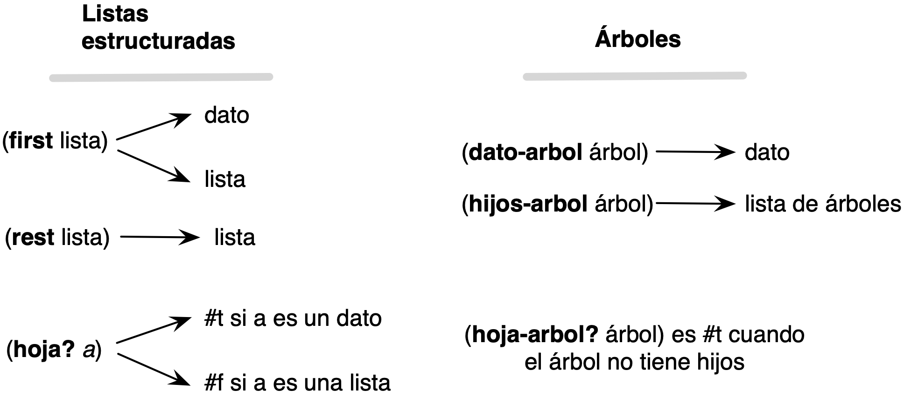

!!! Important "Important"
    We must use the abstraction barrier when working with trees because this
    separates our code from the underlying implementation of the data type. In
    this way, it is possible to change the implementation of the data type
    without affecting the functions we have defined using the barrier. The only
    thing that must be changed is the implementation of the abstraction barrier.
    
    Other advantages of using the abstraction barrier, just as important as the
    previous one, are:
    
    - The code is much more readable. Since Scheme is a weakly typed language,
    in an expression such as `(dato-arbol elem)` we know that the element we are
    working on is a tree (not a number, a string, or a boolean).
    
    - The code can be ported to any programming language. If we want to work
    with trees in JavaScript, for example, we will only have to implement the
    abstraction barrier in that language. Once this is done, all the functions
    that work with trees, such as those we will see below, will work correctly.

### 2.2. Recursive Functions on Trees

We are going to design the following recursive functions:

* `(suma-datos-arbol arbol)`: returns the sum of all nodes
* `(to-list-arbol arbol)`: returns a list with the data in the tree
* `(cuadrado-arbol arbol)`: squares all the data in a tree while preserving the
  structure of the original tree
* `(map-arbol f arbol)`: returns a tree with the structure of the original tree
  by applying function `f` to its subdata.
* `(altura-arbol arbol)`: returns the height of a tree

They all share a similar mutual-recursion pattern.

#### 2.2.1. Function `suma-datos-arbol`

We are going to implement a recursive function that sums all the data in a
tree.

A tree will always have a datum and a list of children (which may be empty),
which we obtain with the functions `dato-arbol` and `hijos-arbol`. We can
therefore pose the problem of summing the data in a tree as the sum of its root
datum and what is returned by a helper function that sums the data in its list
of children (we call a list of children a _forest_):

```racket
(define (suma-datos-arbol arbol)
    (+ (dato-arbol arbol)
       (suma-datos-bosque (hijos-arbol arbol))))
```

This function sums the data in **one** tree. We can therefore use it to build
the following function, which sums a list of trees:

```racket
(define (suma-datos-bosque bosque)
   (if (null? bosque)
       0
       (+ (suma-datos-arbol (first bosque)) (suma-datos-bosque (rest bosque)))))
```

We can visualize how `suma-datos-bosque` works in the following figure:

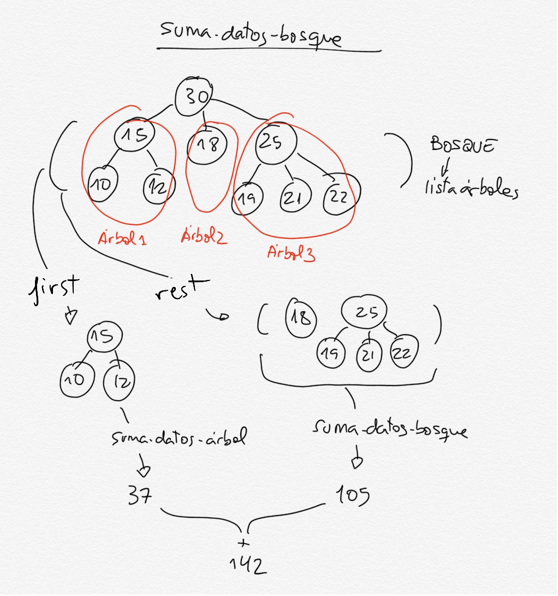

The general case of the function obtains the first tree in the list (a tree)
and calls the function `suma-datos-arbol` to obtain the sum of its data. It
also obtains the rest of the forest (another list of trees) and recursively
calls itself to sum all its trees.

We have **mutual recursion**: to sum the data in a list of trees, we call the
sum of an individual tree, which in turn calls the sum of its children, and so
on. The recursion ends when we calculate the sum of a leaf tree. Then an empty
list is passed to `suma-datos-bosque`, and it returns 0.

```racket
(suma-datos-arbol arbol1) ; ⇒ 172
```

**Alternative version with higher-order functions**

Just as we did with structured lists, it is possible to obtain a more concise
and elegant version using higher-order functions:

```racket
(define (suma-datos-arbol-fos arbol)
   (foldr + 
          (dato-arbol arbol) 
          (map suma-datos-arbol-fos (hijos-arbol arbol))))
```	

The function `map` applies the very function we are defining
(`suma-datos-arbol-fos`) to each of the child trees (obtained with the function
`(hijos-arbol arbol)`). Taking the recursive leap of faith, the function will
return, for each child tree, the sum of all its nodes. Thus, the result of
`map` will be a list with the sum of the nodes of all child trees.

The function `foldr` adds all those numbers in the list and the root number.

!!! Note "Note"
    It may look as if the previous function is missing a base case. When does
    the recursion end? The answer lies in how `map` works: when it receives an
    empty list, it also returns an empty list. To check this, you can think
    about what would happen if you passed the function a leaf tree.

An example of how it works would be the following:

```racket
(suma-datos-arbol-fos '(1 (2 (3) (4)) (5) (6 (7)))) ⇒
   (foldr + 
          1 
          (map suma-datos-arbol-fos '((2 (3) (4)) 
                                      (5)
                                      (6 (7))))) ⇒
(foldr + 1 '(9 5 13)) ⇒
28
```

- The tree we want to sum has 1 at the root and three children: `(2 (3) (4))`,
  `(5)`, and `(6 (7))`.
- Applying `map suma-datos-arbol-fos` to the list of children returns a list
  with the sum of the nodes of each child: `(9 5 13)`.
- The function `foldr` adds that list and the value of the root node (`1`).

We can graphically visualize how `map` works with the following figure:

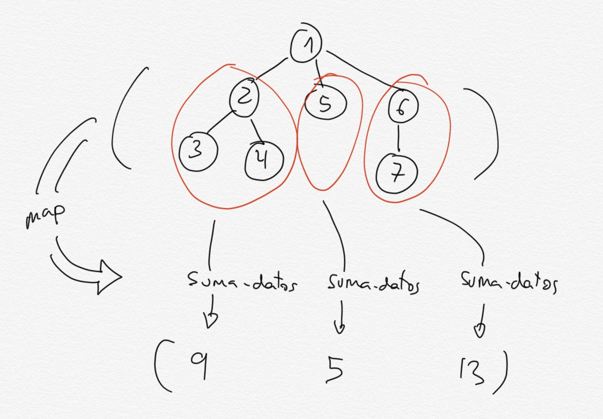

#### 2.2.2. Function `to-list-arbol`

We want to design a function `(to-list-arbol arbol)` that returns a list with
the data in the tree in a *preorder* traversal (first the root datum and then
the data of its children from left to right).

The solution, following the pattern seen in `suma-datos`, is the following.

```racket
(define (to-list-arbol arbol)
   (cons (dato-arbol arbol)
         (to-list-bosque (hijos-arbol arbol))))

(define (to-list-bosque bosque)
   (if (null? bosque)
       '()
       (append (to-list-arbol (first bosque))
               (to-list-bosque (rest bosque)))))
```

As before, the function uses *mutual recursion*: to list all the nodes, we add
the datum to the list of nodes returned by the function `to-list-bosque`. This
function takes a list of trees (a *forest*) and returns the *preorder* list of
its nodes. To do this, it concatenates the list of nodes of its first element
(the first tree) with the list of nodes of the rest of the trees (returned by
the recursive call).

Example:

```racket
(to-list-arbol '(* (+ (5) (* (2) (3)) (10)) (- (12)))) 
; ⇒ (* + 5 * 2 3 10 - 12)
```

An alternative definition using higher-order functions:

```racket
(define (to-list-arbol-fos arbol)
    (cons (dato-arbol arbol)
          (foldr append '() (map to-list-arbol-fos (hijos-arbol arbol)))))
```

This version is very elegant and concise. It uses the function `map`, which
applies a function to the elements of a list and returns the resulting list.
Since what `(hijos-arbol arbol)` returns is precisely a list of trees, we can
apply to its elements any function defined on trees. Even the very function we
are defining (take the recursive leap of faith!).

#### 2.2.3. Function `cuadrado-arbol`

Now let's look at the function `(cuadrado-arbol arbol)`, which takes a tree of
numbers and returns a tree with the same structure and its data squared:

```racket
(define (cuadrado-arbol arbol)
   (construye-arbol (cuadrado (dato-arbol arbol))
                    (cuadrado-bosque (hijos-arbol arbol))))

(define (cuadrado-bosque bosque)
   (if (null? bosque)
       '()
       (cons (cuadrado-arbol (first bosque))
               (cuadrado-bosque (rest bosque)))))
```

Example:

```racket
(cuadrado-arbol '(2 (3 (4) (5)) (6))) 
; ⇒ (4 (9 (16) (25)) (36))
```

Version 2, with the higher-order function `map`:

```racket
(define (cuadrado-arbol-fos arbol)
    (construye-arbol (cuadrado (dato-arbol arbol))
                     (map cuadrado-arbol-fos (hijos-arbol arbol))))
```

#### 2.2.4. Function `map-arbol`

The function `map-arbol` is a higher-order function that generalizes the
previous function. We define an additional parameter in which the function to
apply to the elements of the tree is passed.

```racket
(define (map-arbol f arbol)
   (construye-arbol (f (dato-arbol arbol))
                    (map-bosque f (hijos-arbol arbol))))  

(define (map-bosque f bosque)
   (if (null? bosque)
       '()
       (cons (map-arbol f (first bosque))
             (map-bosque f (rest bosque)))))
```

Examples:

```racket
(map-arbol cuadrado '(2 (3 (4) (5)) (6)))
; ⇒ (4 (9 (16) (25)) (36))
(map-arbol (lambda (x) (+ x 1)) '(2 (3 (4) (5)) (6)))
; ⇒ (3 (4 (5) (6)) (7))
```

With `map`:

```racket
(define (map-arbol-fos f arbol)
  (construye-arbol (f (dato-arbol arbol))
               (map (lambda (x)
                       (map-arbol-fos f x)) (hijos-arbol arbol))))
```

#### 2.2.5. Function `altura-arbol`

Finally, we are going to define a function that returns the height of a tree.

Remember the following definitions related to trees:

- Length of a path between two nodes: number of edges.
- Height of a node: length of the longest path from the node to a leaf.
- Depth of a node: length of the path from the root to the node.
- Depth of a tree: depth of the deepest node.
- Level of a node: number of predecessors.
- Height of a tree: height of the root.

We can implement height in a way similar to what we did with structured lists:
we calculate the height of the child trees, keep the greatest one, and add 1 to
add the edge of the path from the root to the child.

We calculate the greatest height of the children with the function
`altura-bosque`.

```racket
(define (altura-arbol arbol)
   (if (hoja-arbol? arbol)
       0
       (+ 1 (altura-bosque (hijos-arbol arbol)))))

(define (altura-bosque bosque)
    (if (null? bosque)
        0
        (max (altura-arbol (first bosque))
             (altura-bosque (rest bosque)))))
```

Examples:

```racket
(altura-arbol '(2)) ;  ⇒ 0
(altura-arbol '(4 (9 (16) (25)) (36))) ; ⇒ 2
```

The solution with higher-order functions is similar to the one we saw with
structured lists:

```racket
(define (altura-arbol-fos arbol)
  (if (hoja-arbol? arbol)
      0
      (+ 1 (foldr max 0
                  (map altura-arbol-fos (hijos-arbol arbol))))))
```
	
The function `map` maps the function itself over the child trees; that function
calculates the height of each child (one less than the height of the parent, or
0 if it is a leaf).

The function `map` therefore returns a list with the heights of the children,
from which we obtain the maximum by folding the list with the function `max`.

Finally, we add 1 to return the height of the complete tree (one level more
than the maximum level of the children).

## 3. Binary Trees

### 3.1. Defining Binary Trees in Scheme

Binary trees are trees whose nodes have 0, 1, or 2 children. For example, the
tree shown in the following figure is a binary tree.

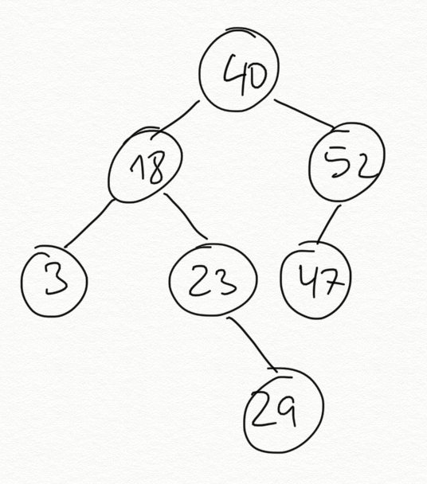

Unlike the generic trees seen above, a binary tree cannot have more than two
children.

We will represent them in Scheme using a list of three elements:

- Datum
- Left child (another binary tree)
- Right child (another binary tree)

When the left or right child (or both) does not exist, we will use an empty
list to indicate an empty node.

In this way, a leaf node with datum 10 will be represented in Scheme with the
list:

```racket
(10 () ())
```

For example, we represent the tree in the previous figure with the following
list:

```racket
(40 (18 (3 () ())
        (23 ()
            (29 () ())))
    (52 (47 () ())
        ()))
```

Visually, we can represent it as follows. The non-existence of a left child or
a right child is represented by an empty list.

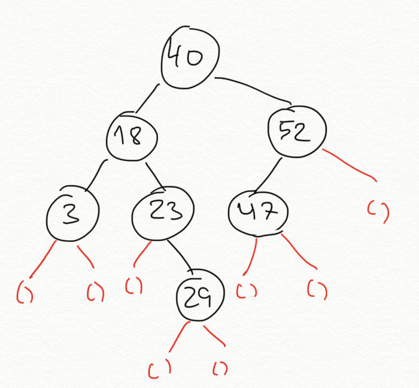

#### 3.1.1. Abstraction Barrier ####

We define the following abstraction barrier for binary trees. We end all
function names with the suffix `-arbolb` (binary tree).

**Selectors**

The selectors of the binary-tree abstraction barrier are the following.

```racket
(define (dato-arbolb arbol)
   (first arbol))
   
(define (hijo-izq-arbolb arbol)
   (second arbol))

(define (hijo-der-arbolb arbol)
   (third arbol))
   
(define arbolb-vacio '())

(define (vacio-arbolb? arbol)
   (equal? arbol arbolb-vacio))

(define (hoja-arbolb? arbol)
   (and (vacio-arbolb? (hijo-izq-arbolb arbol))
        (vacio-arbolb? (hijo-der-arbolb arbol))))
```

As part of the abstraction barrier, we define the constant `arbolb-vacio`,
which takes the value of an empty list.

**Constructor**

```racket
(define (construye-arbolb dato hijo-izq hijo-der)
    (list dato hijo-izq hijo-der))
```

For example, to construct a tree with 10 at the root, 8 as its left child, and
15 as its right child using the constructor of the abstraction barrier:

```racket
(define arbolb1
   (construye-arbolb 10 (construye-arbolb 8 arbolb-vacio arbolb-vacio)
                        (construye-arbolb 15 arbolb-vacio arbolb-vacio)))
```

Another example, the binary tree in the previous figure using the constructor
of the abstraction barrier:

```racket
(define arbolb2
   (construye-arbolb 40 
                 (construye-arbolb 18
                               (construye-arbolb 3 arbolb-vacio arbolb-vacio)
                               (construye-arbolb 23 
                                             arbolb-vacio
                                             (construye-arbolb 29 
                                                           arbolb-vacio
                                                           arbolb-vacio)))
                 (construye-arbolb 52
                               (construye-arbolb 47 arbolb-vacio arbolb-vacio)
                               arbolb-vacio)))
```

### 3.2. Recursive Functions on Binary Trees

Let's look at the following recursive functions on binary trees:

* `(suma-datos-arbolb arbol)`: returns the sum of all nodes
* `(to-list-arbolb arbol)`: returns a list with the data in the tree
* `(cuadrado-arbolb arbol)`: squares all the data in a tree while preserving
  the structure of the original tree

These functions use a mixture of the patterns used in recursion to work with
generic trees and recursion to work with structured lists. We have a datum at
the root, which we have to combine with what the recursion applied to the left
child returns and what the recursion applied to the right child returns.

**suma-datos-arbolb**

```racket
(define (suma-datos-arbolb arbol)
   (if (vacio-arbolb? arbol)
      0
      (+ (dato-arbolb arbol)
         (suma-datos-arbolb (hijo-izq-arbolb arbol))
         (suma-datos-arbolb (hijo-der-arbolb arbol)))))

(suma-datos-arbolb arbolb2) ; ⇒ 212
```

Since the left child and the right child are also binary trees, we can call
recursion with those trees. Those recursive calls will return the sum of the
data in each subtree. We then add the root datum.

To define the base case, we can see that in each recursive call we obtain the
left child and the right child. At the end, we will reach an empty tree, in
which case we return 0.

The following figure represents how the general case works.

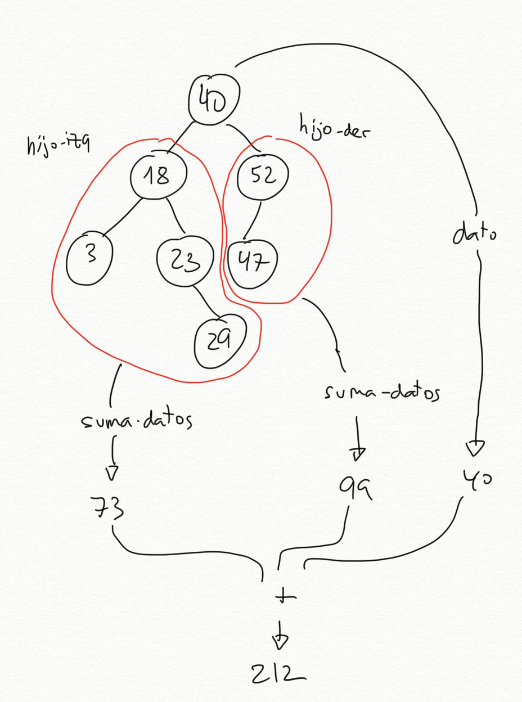

**to-list-arbolb**

The function `to-list-arbolb` is similar to the one seen with generic trees. It
receives a binary tree and returns a list with the data in preorder traversal.

```racket
(define (to-list-arbolb arbol)
   (if (vacio-arbolb? arbol)
      '()
      (cons (dato-arbolb arbol)
            (append (to-list-arbolb (hijo-izq-arbolb arbol))
                    (to-list-arbolb (hijo-der-arbolb arbol))))))

(to-list-arbolb arbolb2) ; ⇒ (40 18 3 23 29 52 47)
```

It works similarly to the sum: we call recursion on the left and on the right.
The result of the recursive calls will be two lists that we have to concatenate
with `append`. Finally, we add the root datum at the head with `cons`.

**cuadrado-arbolb**

Finally, the function `cuadrado-arbolb` constructs a new binary tree by
squaring the datum at the root, its left child, and its right child. To
construct the binary tree, we call the constructor `construye-arbolb`.

```racket
(define (cuadrado-arbolb arbol)
   (if (vacio-arbolb? arbol)
      arbolb-vacio
      (construye-arbolb (cuadrado (dato-arbolb arbol))
                        (cuadrado-arbolb (hijo-izq-arbolb arbol))
                        (cuadrado-arbolb (hijo-der-arbolb arbol)))))

(cuadrado-arbolb arbolb1) ; ⇒ (100 (64 () ()) (225 () ()))
```

## 4. Bibliography - SICP

In this topic we explain concepts from the following chapters of the book
*Structure and Interpretation of Computer Programs*:

- [2.2.2 - Hierarchical Structures](https://mitpress.mit.edu/sites/default/files/sicp/full-text/book/book-Z-H-15.html#%_sec_2.2.2)

----

Programming Languages and Paradigms, academic year 2025-26  
© Department of Computer Science and Artificial Intelligence, University of Alicante  
Domingo Gallardo, Cristina Pomares, Antonio Botía, Francisco Martínez
